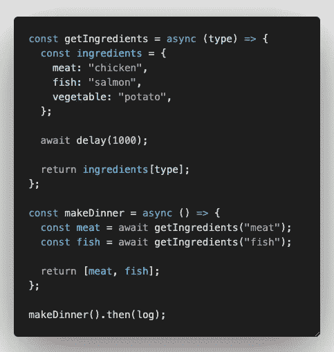

# JavaScript 缺失部分—异步/等待

> 原文：<https://javascript.plainenglish.io/javascript-missing-piece-async-await-f86bdac500bc?source=collection_archive---------8----------------------->

**JavaScript** 是一种**单线程**编程语言。所有任务按队列和顺序运行，并且任务通常一个接一个地同步执行。这促使我们作为开发人员去学习异步的 web 编程方式，这样我们就可以在处理其他任务的同时执行“非阻塞”代码。幸运的是，在 JavaScript 中，我们有 **async/await** ，这是一个“不太常见”的难题，可以增强我们的网站在处理其他任务时执行非阻塞代码。

在我们讨论 **async/await** 之前，我们需要理解事件循环、回调和承诺。

我想让你看看这个文档，它清楚地解释了 JavaScript 中的事件循环、回调和承诺。

 [## 并发模型和事件循环- JavaScript | MDN

### JavaScript 有一个基于事件循环的并发模型，它负责执行代码，收集和…

developer.mozilla.org](https://developer.mozilla.org/en-US/docs/Web/JavaScript/EventLoop#event_loop)  [## 回调函数- MDN Web 文档词汇表:Web 相关术语的定义| MDN

### 回调函数是作为参数传递给另一个函数的函数，然后在外部函数中调用它

developer.mozilla.org](https://developer.mozilla.org/en-US/docs/Glossary/Callback_function)  [## Promise - JavaScript | MDN

### Promise 对象表示异步操作的最终完成(或失败)及其结果…

developer.mozilla.org](https://developer.mozilla.org/en-US/docs/Web/JavaScript/Reference/Global_Objects/Promise) 

在你看完解释之后，我来问你关于这一大块`console.log`的问题。请问这 4 个`console.log` (s)的输出顺序是什么？

在向下滚动寻找答案之前，花些时间思考一下。

你做对了吗？事件的顺序如下。**同步** `console.log`将首先运行， **setTimeout 函数**即使有 0ms 的超时，它也将在下一个/未来的**事件循环**中运行。 **Promise** 块正在微任务队列中排队，将在下一个**事件循环**开始之前执行，因此在 **setTimeout** 代码之前执行。

 [## 通过 queueMicrotask()在 JavaScript 中使用微任务-Web API | MDN

### 微任务是一个短函数，在创建它的函数或程序退出后执行，并且只有当…

developer.mozilla.org](https://developer.mozilla.org/en-US/docs/Web/API/HTML_DOM_API/Microtask_guide) 

现在你对事件循环、回调和承诺有了更清楚的了解，我们可以更仔细地看看**基于承诺的 HTTP 调用**。

如果我们运行这个基于承诺的 HTTP 调用，`console.log`将在显示“API 调用成功”输出之前首先显示同步代码输出。正如我们前面提到的，基于承诺的调用正在微任务队列中排队。基于承诺的 HTTP 调用的美妙之处在于，它在执行 API 调用时处理数据检索和错误处理。如果抛出一个错误，它将绕过所有的**然后是**回调，直接进入 **catch** 块。

这是 JavaScript 中阻塞代码的一个经典例子。

仅当 **540ms** 后阻塞代码完成时，第二个同步代码输出才输出。

因此，您可能认为可以将 while 循环包装在一个承诺中，让它在同步代码之后运行。

这在某种程度上是正确的，但是在 while 循环完成之前，第二个同步代码仍然被阻塞。不过你能做的就是把阻塞代码包装在 **Promise.resolve()** 里面，这样你就可以确定阻塞代码只会在所有同步代码执行完之后才会执行。

现在您已经了解了**异步**代码如何在基于承诺的调用中工作，我们可以进入**异步/等待**并看看它如何帮助我们作为开发人员编写更干净、更可读的代码。

当你写一个不返回任何东西的正则函数时，它只是返回 void。

但是当你在函数参数括号前添加 **async** 关键字时，它会返回一个 **promise < void >** 。

除了使用 **async** 关键字之外，从技术上讲，你可以返回一个 **Promise** ，它会将函数调用转换成相同的返回类型。

这两个函数都返回基于承诺的结果。然而，当你结合使用 **async** 关键字和 **await** 时，威力就来了。

让我们认识到 makeDinner()和 makeLunch()都会得到我们想要的输出，也就是‘鸡肉’，‘三文鱼’。但是不同之处在于 makeDinner()使用了 **await** 关键字，使得代码可读性更好。

如果第二个函数调用独立于第一个函数调用的结果，我们技术上不需要以这种方式写 **await** 。因为这将导致事件循环在执行第二功能之前等待第一功能完成。

如果我们在 getIngredient()函数中写一个 **1000ms** 的延迟。我们可以看到，执行 getDinner()的总时间是 **2002ms** ，每个函数大约需要 **1000ms** 的延迟。

如果结果**相互独立**，我们可以通过使用 **Promise.all** 和**wait**来编写**非阻塞代码**在**并行**中执行这两个函数。

所花费的时间就是 getIngredients()函数**发生一次**的延迟。

# 使用 Async/Await 处理错误

通过在函数中使用 **try/catch** 块代码，可以轻松处理 **async/await** 的错误。

您可以完全控制如何返回数据。如果在你的 **try** 块中，你遇到一个错误，这个错误将在 **catch** 块中被捕获。如果您处理它并返回错误，您将在您的 **makeDinner()** 的**然后**块中看到错误消息。如果您选择抛出错误，您将能够在您的 **makeDinner()** 的 **catch** 块中看到错误消息。

# 最后但并不是最不重要的

当心在[]中使用**异步/等待**。**映射**或[]。 **forEach** 循环。

你可能认为它会一个接一个地运行，但实际上它是在 **promise.all** 被解决之后才被执行的。如果您仍然希望您的循环同步运行**和**，您可以使用传统的 for 循环来代替。

但是由于您使用的是 **async/await** ，我假设您希望在没有任何阻塞代码的情况下同时运行所有内容，所以在这种情况下，您可以在 for 循环中使用这个语法来同时解决所有内容。

# 奖金

你也可以在你的 **if/else** 案例中有条件地使用 **async/await** *。*

# 摘要

希望这篇文章能帮助你更好地理解 **async/await** 如何工作以及 **JavaScript** 如何处理它们。如果你有其他的[异步/等待](https://medium.com/@devjo/membership)技巧想与他人分享，请在下面留下你的评论。祝你愉快。

 [## 用我的推荐链接- DevJo 加入媒体

### 作为一个媒体会员，你的会员费的一部分会给你阅读的作家，你可以完全接触到每一个故事…

medium.com](https://medium.com/@devjo/membership) 

*更多内容看* [*说白了。报名参加我们的*](http://plainenglish.io/) [*免费每周简讯*](http://newsletter.plainenglish.io/) *。在我们的* [*社区*](https://discord.gg/GtDtUAvyhW) *获得独家写作机会和建议。*