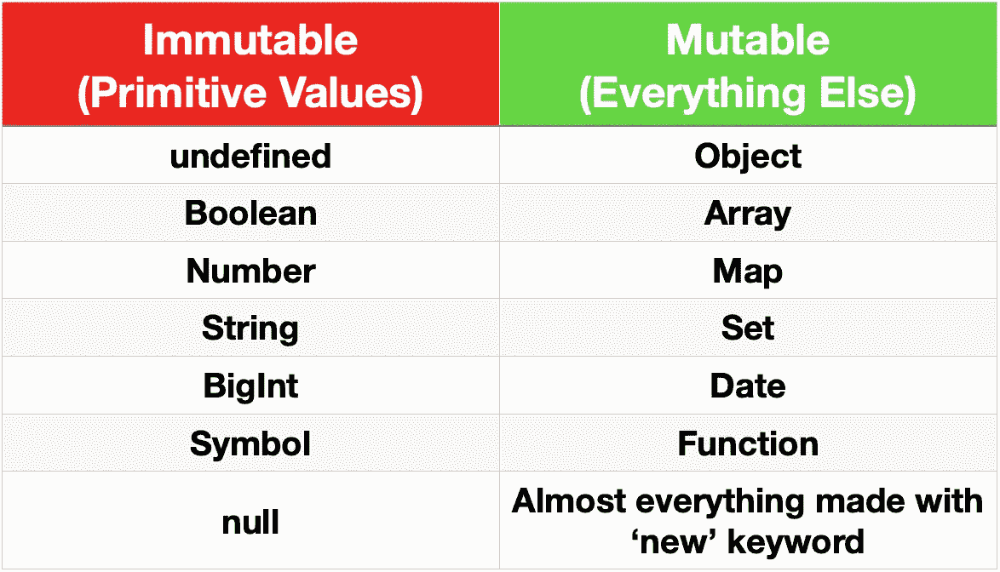
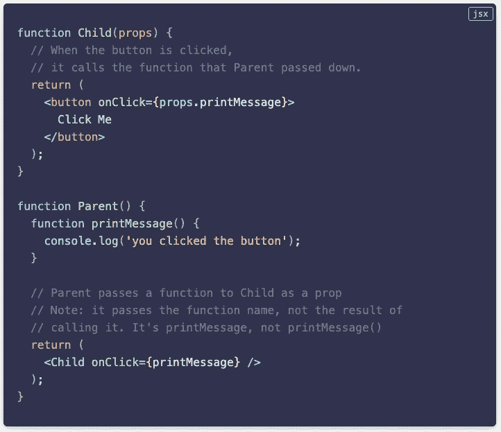

# JavaScript:可变与不可变

> 原文：<https://javascript.plainenglish.io/javascript-mutable-vs-immutable-1efb662d78c8?source=collection_archive---------10----------------------->

## 快速浏览某些数据和结构类型的可变性和不变性。


Photo by [Ross Findon](https://unsplash.com/@rossf?utm_source=medium&utm_medium=referral) on [Unsplash](https://unsplash.com?utm_source=medium&utm_medium=referral)

又是一天，又一次深入 JS 基础知识的世界。当我上周写关于[数据&结构类型](/javascript-everything-is-an-object-or-is-it-2f1092403dc3)的文章时，我偶然发现了可变数据和不可变数据。我接近文章的结尾，但意识到我离题太远了(这并不难)，所以我删除了这一部分。然而，这个概念一直困扰着我。

JavaScript 有一些棘手的问题，至今仍然困扰着我。(*我不小心先写了“……至今还在* ***git*** *我”，想不出为什么中间加了下划线*🤦🏻‍♂️)我偶尔遇到的一个问题涉及变量和值，更具体地说，变量的行为如何受到它们所引用的值是可变的还是不可变的影响。

首先，让我们定义可变和不可变。

**易变的:**易变的

不可变的:不能够或者不容易改变的



Immutable vs. Mutable data/structural types in JavaScript

很简单。现在，当谈到 JavaScript 的数据和结构类型时，它们都可以归为这两类。原始值是不可变的，其他的几乎都是可变的。

# 为什么这很重要？

这个问题问得好。可变性与不可变性并不是一个新概念，但是随着 React 的发布，它与 JS 社区的相关性呈指数级增长。

在我写 JavaScript 的最初几年，我不记得在网上看到过任何关于不可变数据的文章。然而，自从 React 在过去两年中出现以来，提到可变和不可变数据的文章似乎成倍增加，像 Immutable.js 这样的库和 Elm 这样的替代前端语言允许用户“使用不可变数据”。——[*本·麦考密克*](https://benmccormick.org/2016/06/04/what-are-mutable-and-immutable-data-structures-2)

但是，我跑题了。

让我们来看一些我之前提到的陷阱的例子，看看这是怎么回事。我写了一大堆，但是本·麦考密克的例子比我的漂亮(不，我没有嫉妒😒)，所以我们就用他的。

```
let feeling = 'bemuddle';
feeling[2] = 'f';
console.log(feeling);
```

你认为会打印到控制台上的是什么？

```
// bemuddle
```

如果你说`bemuddle`你是正确的。这是为什么呢？嗯，那是因为变量`feeling`保存的值是一个字符串。这是不可改变的。它不会改变。变量`feeling`引用的是值`‘bemuddle’`，因此要将`feeling`的值改为`‘befuddle’`，您需要输入`feeling = ‘befuddle’;`。**变量不是值；变量是对值的引用。**此外，尽管字符串具有[属性](https://developer.mozilla.org/en-US/docs/Web/JavaScript/Reference/Global_Objects/String#instance_properties)和[实例方法](https://developer.mozilla.org/en-US/docs/Web/JavaScript/Reference/Global_Objects/String#instance_methods)，使它们的行为类似于对象，如数组，但它们是原始值，不能在其上设置属性。

试试这个:

```
let character = {
    firstName: 'Captain',
    lastName: 'America'
}let avenger = character;character.lastName = 'Marvel';console.log(avenger.lastName);
```

你认为会打印到控制台上的是什么？

```
// Marvel
```

没错！是漫威。我现在可能没有必要向你解释这个，但是这是因为对象是可变的。变量`character`指的是内存中包含`{ firstName: ‘Captain’, lastName: ‘America’ }`的对象。当我们给一个新变量赋值时，`avenger`指的是同一个对象。因为对象是可变的，所以对该对象的任何引用也会改变。因此，如果您想将该对象的`firstName`属性更改为`‘Ms.’`，您可以输入`character.firstName = ‘Ms.’;`或`avenger.firstName = ‘Ms.’;`。

# 最后一条切线

我知道我说过我不会跑题，但是我发现了一个我认为很有趣的快速广告，关于为什么不变性对于 React 很重要。看看下面吧…

***反应倾向于不变性***

在 React 的例子中，重要的是不要改变状态或道具。对于这条规则来说，组件是函数还是类并不重要。如果你准备写类似 `*this.state.something = ...*` *或者* `*this.props.something = ...*` *的代码，退一步想一个更好的办法。*

*要修改状态，总是使用* `*this.setState*` *。如果你很好奇你可以阅读更多关于* [*为什么不直接修改状态*](https://daveceddia.com/why-not-modify-react-state-directly/) *。*

至于道具，它们是单向的。道具是组件的一部分。它们不是一条双行道，至少不是通过像设置一个新值的道具这样的可变操作。

*如果您需要将一些数据发送回父组件，或者触发父组件中的某个东西，您可以通过传入一个函数作为道具来实现，然后每当您需要与父组件通信时，从子组件内部调用该函数。这里有一个回调道具的简单例子:*



[Dave Ceddia — Immutability in React and Redux: The Complete Guide](https://daveceddia.com/react-redux-immutability-guide/#react-prefers-immutability)

快乐编码🤓