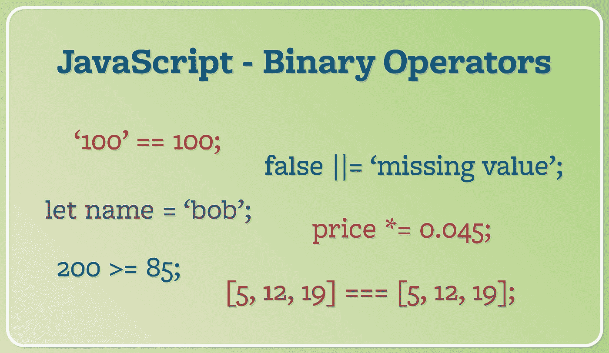

# JavaScript 运算符:不同类型的二元运算符

> 原文：<https://javascript.plainenglish.io/javascript-operators-different-types-of-binary-operators-5bb79cdeb0e7?source=collection_archive---------8----------------------->

这是 **JavaScript 操作符**系列的第二篇文章。继第一篇关于[一元运算符](/javascript-operators-unary-operators-e9d33c94db5c)的文章之后，这一次的焦点是二元运算符，它构成了 JavaScript 中使用的所有运算符的大部分。二元运算符有多种用途，包括算术运算、关系和逻辑比较以及赋值。



JavaScript Operators — Binary Operators

# 二元运算符

一元运算符只需要一个操作数来执行运算，与之相反，二元运算符需要两个操作数——顾名思义。Mozilla Web Docs (MDN)有一个关于[表达式和操作符](https://developer.mozilla.org/en-US/docs/Web/JavaScript/Reference/Operators)的详细章节，其中包括二元操作符。每种不同类型的操作员都包含一个链接，指向 MDN web Docs 文档子部分中的相关章节。

# 算术运算符

## [加法](https://developer.mozilla.org/en-US/docs/Web/JavaScript/Reference/Operators/Addition) +

加法运算符将两个数相加。当两个操作数要么不是数字，要么只有一个是数字时，所执行的运算将会不同。如果两个操作数是字符串，结果将是字符串连接。如果一个或多个操作数是布尔值，布尔值将被转换为数字，运算将被执行。还要注意，一个数字加到一个字符串形式的数字上，会将两个数字连接成一个字符串，例如。`'23' + 5; // '235'`。这同样适用于布尔值，例如。`5 + false; // 5`。在这种情况下，JavaScript 将假布尔值转换为`0`，将真布尔值转换为`1`。

```
5 + 2; // 72 + '4'; // 248 + true; // 9[5, 7, 2] + 4; // '5,7,24''hello' + ' there'; // 'hello there'
```

## [减法](https://developer.mozilla.org/en-US/docs/Web/JavaScript/Reference/Operators/Subtraction)—

减法运算符将从一个数字中减去另一个数字。但是，当一个数字和一个作为数字的字符串相减时，JavaScript 会尝试将字符串转换成数字来执行运算。两个字符串相减将产生一个`NaN`结果。布尔值将被转换为数字，就像加法运算符一样。

```
5 - 2; // 32 - '4'; // -28 - true; // 7[5, 7, 2] - 4; // NaN'hello' - ' there'; // NaN
```

## [乘法](https://developer.mozilla.org/en-US/docs/Web/JavaScript/Reference/Operators/Multiplication) *

乘法运算符将两个数相乘。对字符串值的数字执行，JavaScript 将尝试将字符串转换成数字并执行乘法。同样，用布尔值将运算前转换成数字。字符串相乘将产生一个`NaN`结果。

```
5 * 2; // 102 * '4'; // 88 * true; // 8[5, 7, 2] * 4; // NaN'hello' * ' there'; // NaN
```

## [师](https://developer.mozilla.org/en-US/docs/Web/JavaScript/Reference/Operators/Division) /

除法类似于乘法，对数字产生类似的结果。在执行运算之前，字符串形式的数字将被转换为数字。在执行运算之前，布尔值也被转换为数字。对于两个字符串或至少一个数组，产生一个`NaN`结果。

```
5 / 2; // 2.52 / '4'; // 0.58 / true; // 8[5, 7, 2] / 4; // NaN'hello' / ' there'; // NaN
```

## [模数](https://developer.mozilla.org/en-US/docs/Web/JavaScript/Reference/Operators/Remainder)(余数)%

模数运算符将返回一个数字，该数字表示涉及两个数字的除法运算的余数。例如，`17`和`5`的模运算产生的值是`2`，它是 17 除以 5 的余数。一个较小的数除以一个较大的数将得到小于 1 的结果，取模运算的结果将是第一个数。

```
5 % 2; // 12 % '4'; // 28 % true; // 0[5, 7, 2] % 4; // NaN'hello' % ' there'; // NaN
```

## [求幂运算](https://developer.mozilla.org/en-US/docs/Web/JavaScript/Reference/Operators/Exponentiation) **

取幂运算的工作方式是获取第一个操作数，然后对其进行第二个数的幂运算。

```
3 ** 3; // 272 ** '4'; // 165 ** true; // 57 ** 'two'; // NaN
```

## [增量](https://developer.mozilla.org/en-US/docs/Web/JavaScript/Reference/Operators/Increment) ++

增量运算符在技术上是一元运算符，但由于它是算术运算，所以包含在这里。增量运算符可以添加在已赋值的变量之前或之后。当递增运算符放在操作数之后时，它将返回递增运算之前操作数的值，然后将该值递增 1。当递增运算符放在操作数之前时，变量值将递增 1，这就是返回值。

```
let number = 5;number++; // 5
number; // 6let newNumber = 10;++newNumber; // 11
newNumber; // 11
```

## [减量](https://developer.mozilla.org/en-US/docs/Web/JavaScript/Reference/Operators/Decrement)--

减量运算符的工作方式类似于增量运算符，只是它将变量的值减 1。

```
let number = 5;number--; // 5
number; // 4let newNumber = 10;--newNumber; // 9
newNumber; // 9
```

# 关系运算符

下一组二元运算符是关系运算符。这些运算符根据关系运算符的类型比较两个操作数，并返回一个布尔值。这些运算符通常用于比较数值。

## [小于](https://developer.mozilla.org/en-US/docs/Web/JavaScript/Reference/Operators/Less_than) <

如果运算左侧的值小于右侧的值，小于运算符将返回 true，否则将返回 false。

```
10 < 20; // true2.7 < 2.7; // false'ball' < 'car'; // true
```

## [大于](https://developer.mozilla.org/en-US/docs/Web/JavaScript/Reference/Operators/Greater_than) >

如果运算左侧的值大于右侧的值，则大于运算符将返回 true，否则将返回 false。

```
10 > 20; // false2.7 > 2.7; // false'ball' > 'car'; // false
```

## [小于或等于](https://developer.mozilla.org/en-US/docs/Web/JavaScript/Reference/Operators/Less_than_or_equal) < =

如果运算左侧的值小于或等于右侧的值，小于或等于运算符将返回 true，否则将返回 false。

```
10 <= 20; // true2.7 <= 2.7; // true'ball' <= 'car'; // true
```

## [大于或等于](https://developer.mozilla.org/en-US/docs/Web/JavaScript/Reference/Operators/Greater_than_or_equal) > =

如果运算左侧的值大于或等于右侧的值，则大于或等于运算符将返回 true，否则将返回 false。

```
10 >= 20; // false2.7 >= 2.7; // true'ball' >= 'car'; // false
```

# 等式运算符

## [相等运算符](https://developer.mozilla.org/en-US/docs/Web/JavaScript/Reference/Operators/Equality) ==

如果两个操作数相等，equity 运算符将返回 true。JavaScript 将尝试执行类型转换，作为净值检查操作的一部分。

```
4 == 4; // true'hello' == 'hello'; // true14 == '14'; // true1 == true; // true[1, 5, 10] == [1, 5, 10]; // falselet items = ['hat', 'cat', 'map'];
items == items; // true
```

## [不等式运算符](https://developer.mozilla.org/en-US/docs/Web/JavaScript/Reference/Operators/Inequality)！=

如果两个操作数不相等，不等式运算符将返回 true。与 equity 运算符类似，JavaScript 会在不等式比较之前尝试转换类型。

```
10 != 20; // true10 != '10'; // false1 != true; // false[1, 5, 10] != [1, 5, 10]; // truelet items = ['hat', 'cat', 'map'];
items != items; // false
```

## [身份运算符](https://developer.mozilla.org/en-US/docs/Web/JavaScript/Reference/Operators/Strict_equality) ===

identity 运算符类似于 equity 运算符，但将在两个操作数之间应用更严格的比较级别。例如，两个相同但类型不同的值在与标识运算符进行比较时将返回 false。

```
'14' === 14; // false1 === true; // false120.5 === 120.5; // true[1, 5, 10] === [1, 5, 10]; // false
```

## [非同一性运算符](https://developer.mozilla.org/en-US/docs/Web/JavaScript/Reference/Operators/Strict_inequality)！==

nonidentity 运算符将在两个操作数之间执行比较，如果两个操作数在值或类型上不匹配，则返回 true。

```
10 !== 20; // true10 !== '10'; // true1 !== true; // true100 !== 100; // false
```

# 二元逻辑运算符

## [逻辑与](https://developer.mozilla.org/en-US/docs/Web/JavaScript/Reference/Operators/Logical_AND) & &

如果逻辑 AND 运算符的所有操作数都返回 true，则该运算符将返回 true。逻辑运算符将返回布尔值，除非第二个操作数是返回 true 的非布尔值。

```
true && true; // truefalse && true; // false5 > 4 && 'hello' != 'there'; // true'' && true; // ''
```

## [逻辑或](https://developer.mozilla.org/en-US/docs/Web/JavaScript/Reference/Operators/Logical_OR) ||

如果两个操作数之一返回 true，逻辑 OR 运算符将返回 true。如果左边的操作数是假值，那么右边的操作数将被返回。

```
false || true; // truefalse || false; // false'hello' || false; // 'hello'false || ''; // ''
```

## [无效合并运算符](https://developer.mozilla.org/en-US/docs/Web/JavaScript/Reference/Operators/Nullish_coalescing_operator)？？

如果左侧为空或未定义，nullish 合并运算符将返回运算的右侧。此运算符可用于在值为空或未定义的情况下返回默认值。

```
null ?? 'default value'; // 'default value'false ?? 'default value'; // false5 > 2 ?? 'default value'; // true
```

# 赋值运算符

## [赋值运算符](https://developer.mozilla.org/en-US/docs/Web/JavaScript/Reference/Operators/Assignment) =

赋值是用来给变量赋值的。

```
let name = 'bob';let value = (4 + 5) / 2;
```

## [乘法赋值](https://developer.mozilla.org/en-US/docs/Web/JavaScript/Reference/Operators/Multiplication_assignment) *=

乘法赋值将变量值乘以右边的值，并将结果值赋给变量。

```
let value = 4;
value *= 3;
value; // 12
```

## [取幂赋值](https://developer.mozilla.org/en-US/docs/Web/JavaScript/Reference/Operators/Exponentiation_assignment) **=

取幂赋值会将变量值提升到右侧值的幂，并将结果值赋给变量。

```
let value = 4;
value **= 2;
value; // 16
```

## [分工分配](https://developer.mozilla.org/en-US/docs/Web/JavaScript/Reference/Operators/Division_assignment) /=

乘法赋值将变量值乘以右边的值，并将结果值赋给变量。

```
let value = 4;
value /= 2;
value; // 2
```

## [余数赋值](https://developer.mozilla.org/en-US/docs/Web/JavaScript/Reference/Operators/Remainder_assignment) %=

余数赋值将变量值除以右边的值，并将余数赋值给变量。

```
let value = 18;
value %= 5;
value; // 3
```

## [加法赋值](https://developer.mozilla.org/en-US/docs/Web/JavaScript/Reference/Operators/Addition_assignment) +=

加法赋值将变量值与右侧的值相加，并将结果值赋给变量。

```
let value = 12;
value += 8;
value; // 20
```

## [减法赋值](https://developer.mozilla.org/en-US/docs/Web/JavaScript/Reference/Operators/Subtraction_assignment) -=

减法赋值将变量值减去右边的值，并将结果值赋给变量。

```
let value = 12;
value -= 8;
value; // 4
```

## [逻辑与赋值](https://developer.mozilla.org/en-US/docs/Web/JavaScript/Reference/Operators/Logical_AND_assignment) & & =

只有当运算右侧的值为真时，逻辑 AND 赋值运算符才会将运算右侧的值赋给值。

```
let value = 12;
value &&= 8;
value; // 8let value2 = null;
value2 &&= 10;
value2; // null
```

## [逻辑或赋值](https://developer.mozilla.org/en-US/docs/Web/JavaScript/Reference/Operators/Logical_OR_assignment) ||=

只有当运算右边的值为 falsy 时，逻辑 OR 赋值运算符才会将运算右边的值赋值给。

```
let value = '';
value ||= 'default value';
value; // 'default value'let value2 = 'some value';
value2 ||= 'default value';
value2; // 'some value'
```

## [逻辑无效赋值](https://developer.mozilla.org/en-US/docs/Web/JavaScript/Reference/Operators/Logical_nullish_assignment)？？=

只有当运算右侧的值为空或未定义时，逻辑 OR 赋值运算符才会将运算右侧的值赋给值。

```
let value = '';
value ??= 'default value';
value; // ''let value2 = null;
value2 ??= 'default value';
value2; // 'default value'
```

# 结论

运算符，尤其是二元运算符，在任何 JavaScript 程序中都被广泛使用。一些，像算术、关系和逻辑操作符，经常被使用。使用一些赋值操作符，比如逻辑 OR 赋值，对于特定的情况非常有用，比如当一个变量有一个错误的值时，就可以指定一个默认值。

熟悉二元运算符并练习它们的用法对于成为一名 JavaScript 开发专家来说非常重要。

*更多内容请看*[***plain English . io***](http://plainenglish.io/)