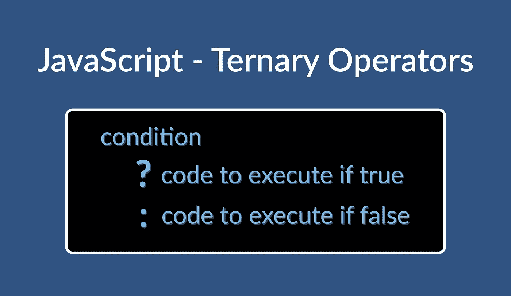

# JavaScript 运算符——什么是三元运算符，它是如何工作的？

> 原文：<https://javascript.plainenglish.io/javascript-operators-the-ternary-operator-f3755c98d2bf?source=collection_archive---------15----------------------->

JavaScript 包括一个具有三个操作数的运算符。这就是所谓的三元运算符。

这篇文章是 JavaScript 操作符系列的继续，我们之前已经讨论过了一元操作符[和二元操作符](https://robert-laws.com/blog/javascript-operators-unary)。三元运算符有时被称为条件运算符，通常用于`if...else`语句的简化版本。使用三元运算符有助于压缩代码，尽管它有时被批评为导致[比`if...else`语句更不透明](https://betterprogramming.pub/the-javascript-ternary-operator-1589238d929b)和[可读](https://jrsinclair.com/articles/2021/rethinking-the-javascript-ternary-operator/)代码。



JavaScript Operators — Ternary Operators

## 构造三元算子

[三元运算符](https://developer.mozilla.org/en-US/docs/Web/JavaScript/Reference/Operators/Conditional_Operator)顾名思义，需要三个操作数。三元运算符语句包含一个要计算的条件。条件句后面是一个问号。在评估时，如果条件的结果为真，操作符将执行冒号前的代码，如果条件的结果为假，则执行冒号后的代码。

```
condition (truthy or falsy) ? `code to execute if truthy` : `code to execute if falsy`;
```

## 三元运算符与 if 比较...else 语句

三元运算符和`else...if`语句在程序中返回的结果是等价的。主要的区别是三元运算符写起来更简洁。

```
let price = 35.75;// using the else...if statement
if (price > 25) {
  console.log('too expensive');
} else {
  console.log('affordable');
}// using the ternary operator
price > 25 ? console.log('too expensive') : console.log('affordable');// result from both statements 'too expensive'
```

尽管三元运算符通常用于简单条件的评估，但它们也可用于构建更复杂的条件语句，包括镜像复杂`if...else`语句的语句。

下面的代码示例显示了如何创建一个三元语句，该语句包括一个`if`、`elseif`和`else`组合以及作为三元运算符的等效项。

```
let name = 'bob cobb';if (name.includes('melvin')) {
  console.log('hello, melvin');
} else if (name.includes('kalvin')) {
  console.log('hello, kalvin');
} else {
  console.log('hello someone else');
}name.includes('melvin')
  ? console.log('hello, melvin')
  : name.includes('kalvin')
  ? console.log('hello, kalvin')
  : console.log('hello someone else');
```

条件语句有时也可以包含嵌套条件。在下面的代码示例中，有一个嵌套的`if...else`语句和一个三元语句的等效版本。

```
let product = { group: 'electronics', name: 'camera', price: 95 };if (product.group == 'electronics') {
  if (product.name == 'camera') {
    if (product.price > 75) {
      console.log('expensive camera');
    } else {
      console.log('affordable camera');
    }
  } else if (product.name == 'computer') {
    if (product.price > 500) {
      console.log('expensive computer');
    } else {
      console.log('affordable computer');
    }
  } else {
    console.log('other electronic product');
  }
} else {
  console.log('other product group');
}product.group == 'electronics'
  ? product.name == 'camera'
    ? product.price > 75
      ? console.log('expensive camera')
      : console.log('affordable camera')
    : product.name == 'computer'
    ? product.price > 500
      ? console.log('expensive computer')
      : console.log('affordable computer')
    : console.log('other electronic product')
  : console.log('other product group');
```

上面的代码表明，尽管三元运算符比`if...else`语句更简洁，但要理解它的作用还需要更多的努力。

三元运算符在条件语句不是特别复杂的情况下很有用，因为当三元运算符跨越多行时可能很难阅读，如上例所示。在需要复杂逻辑的情况下，`else...if`语句更有用，因为它们更容易在多行中阅读，尤其是当它们包含几个或嵌入的条件语句时。

## 变量赋值

三元运算符的一个很好的用例是根据条件分配变量。

```
let department = 'Information Technology';
const isManager = true;const role = isManager ? `${department} manager` : `${department} staff`;
```

这里，变量`role`根据`isManager`布尔值的计算方式有条件地赋值。

## 结论

三元运算符非常适合不太复杂的计算，在这种情况下，压缩代码有助于提高代码的可读性，在这种情况下，可以编写减少的代码行，而不会影响其他开发人员的可访问性。

*更多内容尽在*[***plain English . io***](http://plainenglish.io/)