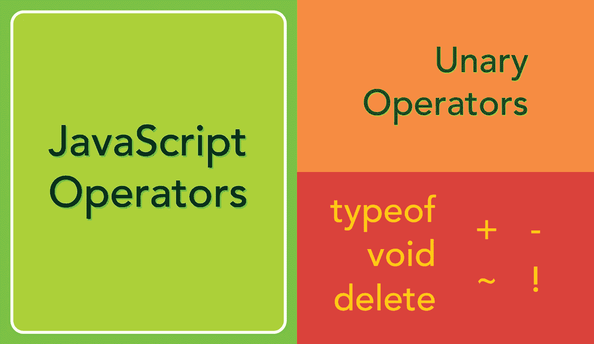

# JavaScript 运算符——什么是一元运算符？

> 原文：<https://javascript.plainenglish.io/javascript-operators-unary-operators-e9d33c94db5c?source=collection_archive---------8----------------------->

这篇文章是关于 **JavaScript 操作符**的系列文章的开始，是上一篇关于 JavaScript 中的[类型和值](/basics-of-javasscript-types-and-values-df727599a3de)的博客文章的后续。用 JavaScript 构建程序的一个核心部分是对值执行操作，这在对值执行操作时更有趣。

能够对值执行诸如算术、组合、比较、执行逻辑检查和其他操作之类的操作将它们转换成动态值。不同的类型有不同的操作。根据所涉及的类型，有些操作的行为会有所不同。操作员可以分成几组。



JavaScript Operators — Unary Operators

一元运算是只涉及一个操作数的运算。这意味着有一个运算符，后跟一个值(或操作数)，然后从运算中产生一个结果。

## 删除

删除操作符将从一个对象中删除一个属性。这包括数组。然而，对数组使用`delete`会删除值，但不会改变数组的总长度。删除可用于从对象中删除单个属性，而不会留下任何东西，如属性的未定义值。

从对象中删除属性的示例。

```
let myObj = {
  name: 'bob',
  age: 32,
  member: true,
};delete myObj.age;
myObj; // { name: 'bob', member: true }delete myObj['member'];
myObj; // { name: 'bob' }
```

从数组中删除成员的例子。

```
let items = ['hat', 'cat', 'map'];delete items[0];
items; // [<1 empty item>, 'cat', 'map']
items[0]; // undefined
```

## 空的

[void](https://developer.mozilla.org/en-US/docs/Web/JavaScript/Reference/Operators/void) 操作符将计算一个给定的表达式，然后返回一个值`undefined`。当在编码过程中需要返回一个未定义的值时，通常会用到这种方法。它经常和像`javascript:void(0)`这样的超链接一起使用，从用户点击中返回 undefined，以防止页面重载。

```
function sayHello() {
  return 'hello';
}sayHello(); // 'hello'
void sayHello(); // undefined
```

## 类型 of

[typeof](https://developer.mozilla.org/en-US/docs/Web/JavaScript/Reference/Operators/typeof) 运算符将计算并返回一个操作数值类型的字符串。这在对值执行附加操作之前检查变量所保存的值的类型时非常有用。

```
let name = 'hal';
let age = 43;
let isMember = true;typeof name; // 'string'
typeof age; // 'number'
typeof isMember; // 'boolean'
```

## 一元加号(+)

[一元加号(+)](https://developer.mozilla.org/en-US/docs/Web/JavaScript/Reference/Operators/Unary_plus) 会尝试将它旁边的值转换成数字。这适用于数字，即只包含数字的字符串(例如。`'246'`)，以及布尔值。对于布尔值，在真值前加一个`+`会把它转换成`1`，假值会转换成`0`。

```
let myValue = '326';
+myValue; // 326let isMember = true;
+isMember; // 1let name = 'bob';
+name; // NaN
```

## 一元否定(-)

[一元否定(-)](https://developer.mozilla.org/en-US/docs/Web/JavaScript/Reference/Operators/Unary_negation) 与一元加号的作用相同，首先将值转换成数字，然后对其求反。

```
let balance = '23.73';
-balance; // -23.73;+true; // 1
+false; // 0
+'53'; // 53
+null; // 0
+undefined; // NaN
+'hello'; // NaN
```

## 按位非(~)

[位非(~)](https://developer.mozilla.org/en-US/docs/Web/JavaScript/Reference/Operators/Bitwise_NOT) 将反转其操作数的位，并返回结果的整数。

## 逻辑 not(！)

[逻辑不(！)](https://developer.mozilla.org/en-US/docs/Web/JavaScript/Reference/Operators/Logical_NOT)运算符会将值计算为 the 或 falsy，并将取反后的值作为布尔值返回。当应用于非空字符串、非零数字或对象时，逻辑 not 运算符将返回 false，因为这些数据类型都被认为是 true。

```
let name = 'melvin';
!name; // falselet number = 232;
!number; // falselet person = { name: 'bob' };
!person; // false
```

当逻辑 not 应用于一个布尔值时，它将返回该布尔值的反值。

```
let isMember = true;
!isMember; // false!false; // true
```

还有其他被视为“假”的值，当对操作数应用逻辑 not 运算符时，这些值将返回 true。

```
!null; // true
!undefined; // true
!NaN; // true
!''; // true
!0; // true
```

**通过连续使用两个`!!`逻辑非运算符，双重否定**是可能的。当应用于操作数时，它将计算操作数并将其转换为布尔值，然后对该布尔值求反，以将该值返回到操作数的原始“真”或“假”值。这是一个有用的工具，当逻辑运算等计算需要布尔值时可以使用。

```
let name = 'bob';
!!name; // true!!null; // false
```

*更多内容看* [***说白了. io***](http://plainenglish.io/)