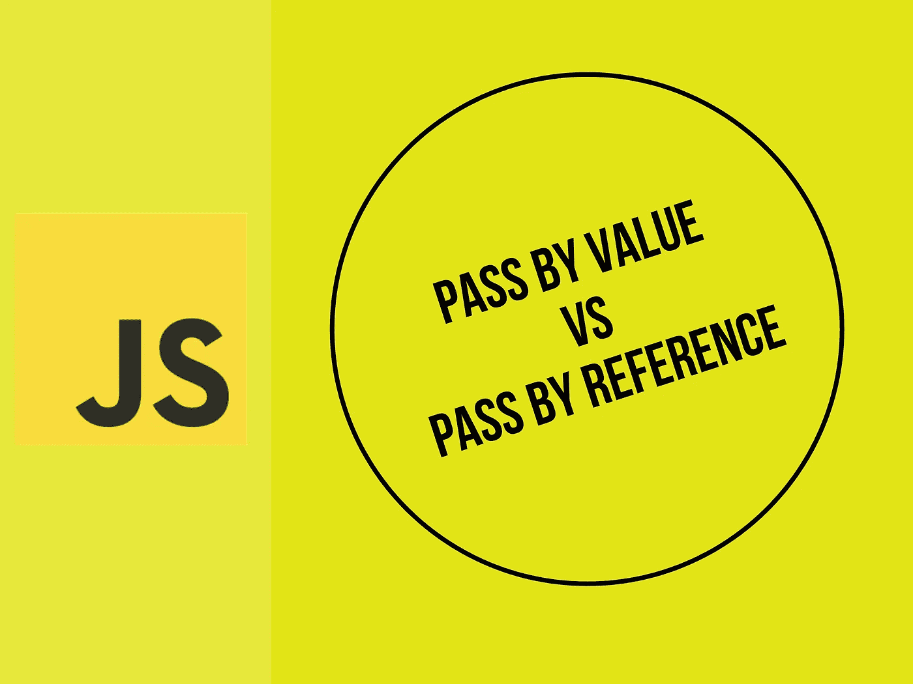
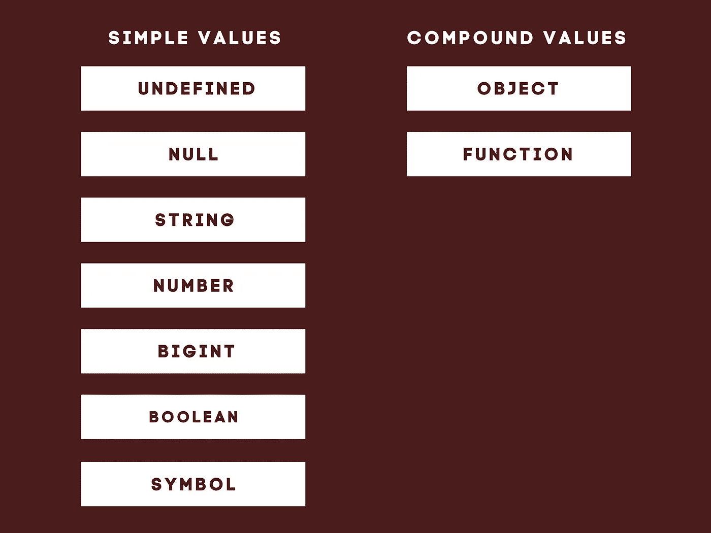
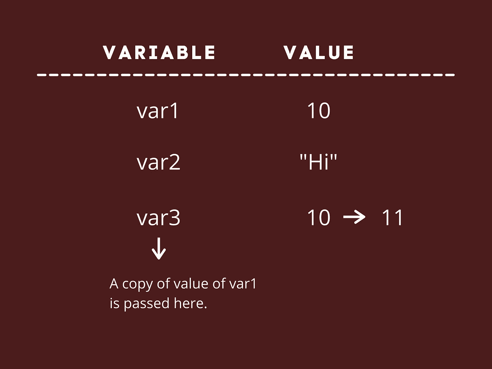
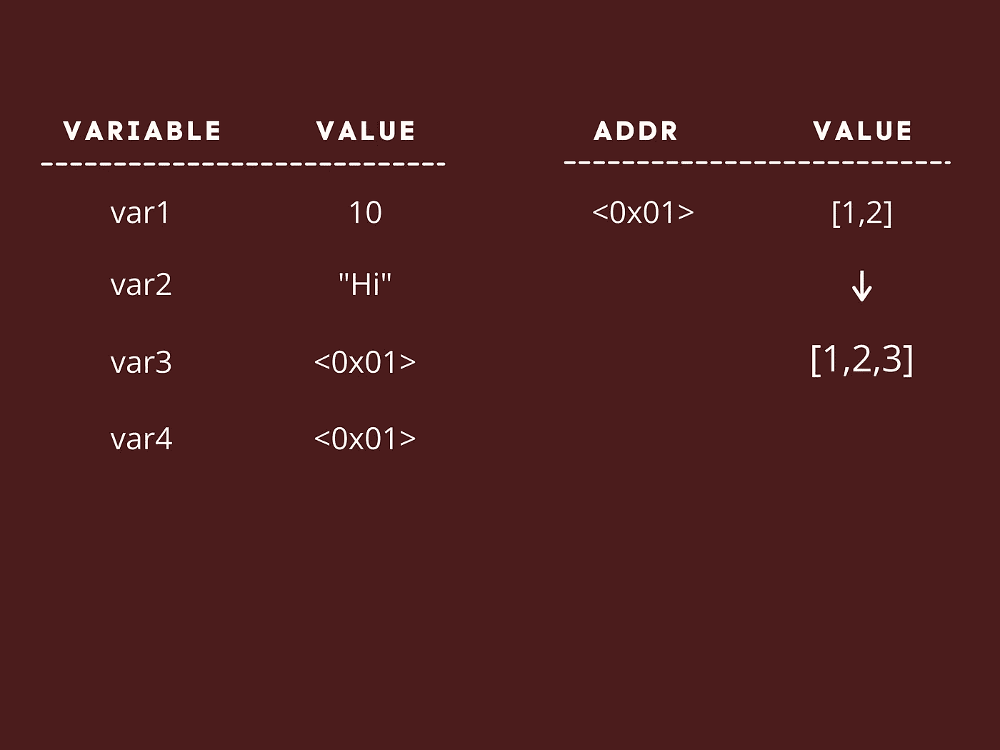

# JavaScript:按值传递与按引用传递

> 原文：<https://javascript.plainenglish.io/javascript-paas-by-value-vs-reference-b1667016e4a3?source=collection_archive---------5----------------------->



我来自 C++背景，当我第一次遇到 JavaScript 中的传值和引用时，我一直对 JavaScript 中的引用是如何工作的感到困惑。在 C++中，如果我们想把一个数传递给一个函数，我们可以把它作为`int &num`传递，它会更新它的值。但是如果我们像通过`x`一样通过它，`num`将是对`x`的引用。但是在 JavaScript 中，引用的工作方式有点不同。

所有这些困惑都可以在两条规则的帮助下得到解决。但是为了理解这两条规则，我们需要知道什么是简单值(基元)和复合值。

在 JavaScript 中，有九种内置类型:Null、Undefined、String、Number、BigInt、Boolean、Symbol、Object、Function。除了对象和函数之外的所有值都称为原始值。因此，为了便于理解，我们可以将这些值分为两部分，即:

1.  **简单值:**原语
2.  **复合值:**对象(由数组和所有装箱的对象包装器组成)和函数。



Figure 1: Type of values

现在，让我们跳到参考文献。如前所述，我们只需学习两条规则，就可以知道一个值是通过引用传递还是通过值传递。

**规则 1:** 简单值(又名原语)总是按值传递。

**规则二:**复合值(对象、函数、数组等。)是通过引用传递的。

现在，让我们举几个例子来清楚地理解这些概念。

# **例子:**

**1。按值传递**

```
let var1 = 10;
let var2 = "Hi";
let var3 = var1;
var3 = var3 + 1;
console.log(var3); // 11
console.log(var1); // 10
```

在这个例子中，我们声明了三个变量`var1, var2, and var3`。在第 3 行，我们给`var3 = var1.`赋值，因为`var1`是一个数字(它是一个原始值)，所以根据我们的规则，这属于第一个规则，即它将作为一个值传递，这意味着`var1`的值的副本被赋值给与第一个值没有关系的`var3`(两者有不同的内存地址)。现在在第四行中，当我们执行`var3 + 1`时，只有`var3`的值在内存中得到更新。



Figure 2: Pass by value

**2。参考通过**

```
let var1 = 10;
let var2 = "Hi";
let var3 = [1,2];
let var4 = var3;
var4.push(3); 
console.log(var3); // [1,2,3]
console.log(var4); // [1,2,3]
```

在这个例子中，我们有四个变量: `var1`、`var2, var3, and var4`。前两行的执行与上面的例子相同。在第三行中，这里有`var3 = [1,2].`，传递的值是一个数组(对象类型),这意味着它将作为对其值的引用(根据我们的第二个规则)被传递。

例如，假设这个引用的内存地址<0x01>指向值[1，2]。这一步之后，在第四行，我们有，`var4 = var3`。这里`var4`被赋予`var3`的值，该值是被赋予值[1，2]的存储器地址< 0x01 >。这里有一个关键的区别，在上面的例子中，两个值彼此没有关系，但是这里`var3`和`var4`的值都是对同一个值的引用，所以如果我们更新这个值，那么`var3`和`var4`也会发生变化。这就是为什么在下一步中，当我们将“3”推入 var4 时，`var4`的值(值[1，2]的内存地址)会更新为[1，2，3]，即引用的值会更新。这意味着当我们在控制台中记录`var3` 和`var4`时，我们会得到相同的结果【1，2，3】。



Figure 2: Pass by reference

## 结论

所有对象都通过引用它们的值来传递。因此，每当我们在设置为等于另一个变量或传递给一个函数后更新它们时，它们都指向同一个值，这有时会导致错误。所以，当你在处理对象类型的时候，记住上面的两条规则，剩下的将会被排序。

*更多内容请看*[*plain English . io*](http://plainenglish.io/)