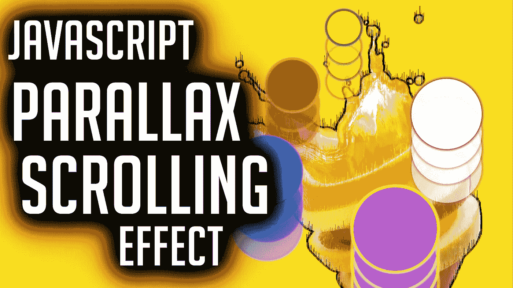
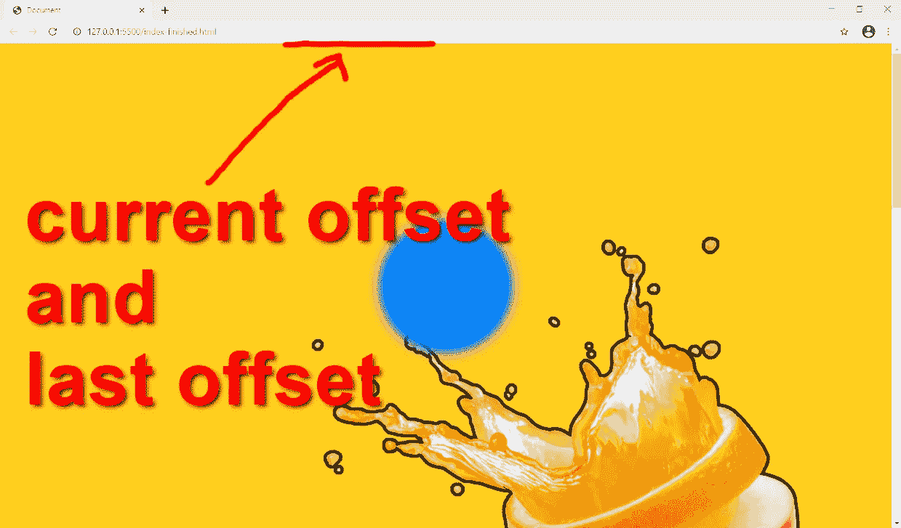
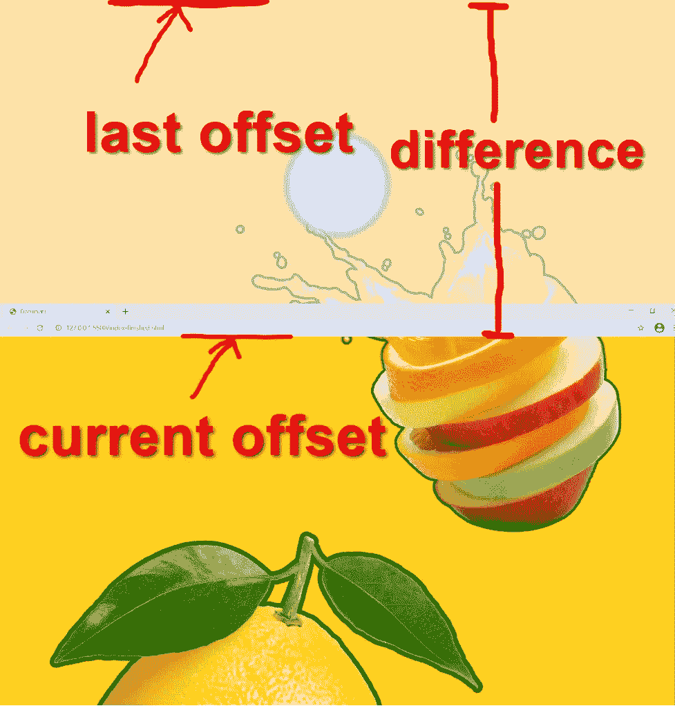

# JavaScript 视差滚动效果

> 原文：<https://javascript.plainenglish.io/javascript-parallax-scrolling-effect-c14723806655?source=collection_archive---------8----------------------->

## 视差网页设计的程序员解决方案



# **我们正在研究的一般解决方案是这个**

我们将**修复页面上的一个 HTML 元素**(*在这里是一个圆形的 DIV*)。

当我们向下**滚动页面**时，我们将手动向上**滚动 HTML 元素**。

因为我们手动向上滚动元素，所以我们可以控制它移动的快慢。

这就产生了我们的**视差效果**。

## **让我们写好 HTML 和 CSS**

**将页面规格化，使其纵向较长，这样我们就有了滚动空间。**

```
body { overflow-x: hidden; width: 100vw; height: 300vh; background-size: contain; background-image: url(‘./back.png’);}
```

**创建一个 DIV**

```
<body> <div class=”orb”></div></body>
```

**那我们就把样式改成圆形**

```
.orb { margin: 0; padding: 0; height: 200px; width: 200px; position: fixed; top: 50%; left: 50%; transform: translate(-50%, -50%); border-radius: 50%; background-color: #0083FF; box-shadow: 0px 0px 20px 10px #0083FF;}
```

# 让我们来看看 JavaScript

## 这个项目我们需要 6 个变量。

```
const orb = document.querySelector(‘.orb’),ease = 0.05,start_position = orb.offsetTop;let scroll_request = 0,total_offset = 0,animation_running = false;
```

1. **orb** —我们想要移动的 HTML 元素

2.放松——我们控制 HTML 元素相对于页面滚动的快慢

3. **start_position** —该元素相对于文档/页面顶部的起始位置( *y 位置*)

4. **scroll_request** —当我们滚动页面时，我们想告诉我们的程序滚动我们的 HTML 元素

5. **total_offset** —我们记录我们总共向上或向下滚动了多远

6. **animation_running** —我们用它来让我们的 **requestAnimationFrame()循环**开始和停止

# **让我们建立开始动画循环的逻辑**

```
function animate_scroll() { scroll_request++; if (!animation_running) { animation_running = true; animation_loop(); }}
```

**每次我们滚动页面时，我们都想滚动 HTML 元素。**

如果我们滚动滚轮 100 次，我们希望确保**也提交一个滚动 HTML 元素 100 次的请求**。

```
scroll_request++;
```

如果当前没有运行动画循环，我们将启动一个；确保将我们的**动画 _ 运行**切换到**真实**。

```
if (!animation_running) { animation_running = true; animation_loop();}
```

# **让我们创建实际的动画循环**

```
function animation_loop() { let current_offset = window.pageYOffset; let difference = current_offset — total_offset; different *= ease; if (Math.abs(difference) < 0.05) { scroll_request = 0; total_offset = current_offset; animation_running = false; return; } orb.style.top = `${start_position — total_offset}px`; total_offset += difference; requestAnimationFrame(animation_loop);}
```

## **我们在这里做 4 件主要的事情(不按这个顺序)**

1.计算我们文档的当前位置和页面/文档顶部之间的**差值**。

我们的页面从哪里开始



**我们如何计算差异:**



2.移动我们的 HTML 到那个**的差异**。(*差值乘以我们的****创建我们的视差效果* **)****

**3.为我们的动画请求另一个循环。**

**4.我们对于动画循环的**退出条款**是如果**差**小于 **0.05** 。基本上，如果 HTML 元素到达了它的目的地。**

# **我们可以对任何类型的 HTML 元素使用这个逻辑。**

## ****div、段落、跨度、图像…****

**你可以在这里得到源文件[。](https://github.com/an-object-is-a/js-parallax-scroll)**

**如果你想要更深入的指导，请查看我在 YouTube 上的完整视频教程， [**一个对象是一个**](https://www.youtube.com/c/anobjectisa) 。**

**请务必在 [**Instagram**](https://www.instagram.com/an_object_is_a/) 和 [**Twitter**](https://twitter.com/anobjectisa1) 上关注我们，以跟上我们最新的 **Web 开发教程**。**

## ****JavaScript 视差滚动效果****