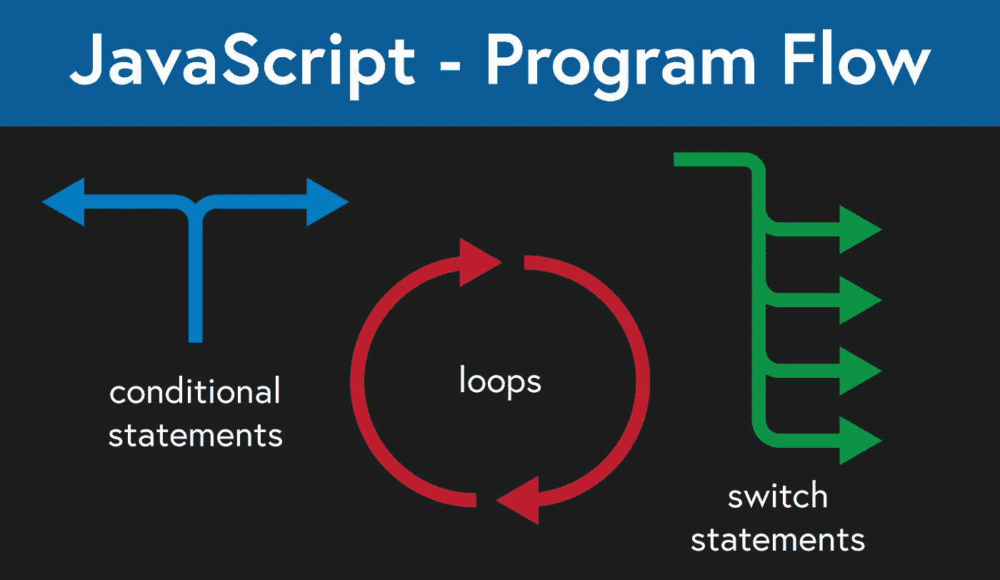

# JavaScript——如何控制程序流程

> 原文：<https://javascript.plainenglish.io/javascript-program-flow-2c39d91f9d76?source=collection_archive---------15----------------------->

JavaScript 提供了几种控制程序流程的方法。通常，JavaScript 程序将从第一行开始执行程序，并从每一行继续到程序的结尾。

有几种不同的方法来控制程序的流程，包括[条件语句](https://developer.mozilla.org/en-US/docs/Web/JavaScript/Guide/Control_flow_and_error_handling#conditional_statements)和[循环](https://developer.mozilla.org/en-US/docs/Web/JavaScript/Guide/Loops_and_iteration)。每一个都为程序员提供了一种能力，在继续沿着一条特定的路径或者重复一段代码指定的次数之前，对程序的不同方面进行评估。



JavaScript — Program Flow

## 阻碍

JavaScript 中的一个重要概念是**块语句**，它在整个程序中被广泛使用。[块语句](https://developer.mozilla.org/en-US/docs/Web/JavaScript/Guide/Control_flow_and_error_handling#block_statement)用于在逻辑容器内对语句、表达式和声明进行分组。它们在条件语句、循环和异常处理语句中特别有用。通过将代码放在左花括号和右花括号中来创建块。

```
{
  let firstName = 'bob';
  let lastName = 'cobb';
  console.log(`${firstName} ${lastName}`);
}// bob cobb
```

## 条件语句

[条件语句](https://developer.mozilla.org/en-US/docs/Web/JavaScript/Guide/Control_flow_and_error_handling#conditional_statements)赋予程序员根据不同的条件指定应该执行什么代码的权力。根据条件语句的结果，程序将沿着指定的分支继续执行程序。例如，程序可以根据用户的年龄、性别和位置等信息为用户显示不同的信息。程序可以使用该信息有条件地设置信息。

在 JavaScript 中有两种处理条件逻辑的主要方法，要么使用`if...else`语句，要么使用`switch`语句。主要区别在于，`switch`语句通常用于匹配一组固定值，而`if...else`语句可以匹配一个或多个布尔值或值范围内的值。

## 如果…否则

```
let age = 34;if (age <= 18) {
  console.log('child options');
} else if (age > 18 && age < 50) {
  console.log('adult options');
} else {
  console.log('elderly options');
}// 'adult options'
```

## 转换

switch 语句接受一个参数，它将尝试根据该参数进行大小写匹配。如果没有找到匹配，那么在这种情况下，可以使用默认选项来提供某种处理。

```
let customer = 'vip';switch (customerType) {
  case 'new customer':
    console.log('new customer menu');
    return;
  case 'returning customer':
    console.log('returning customer menu');
    return;
  case 'vip':
    console.log('vip menu');
    return;
  default:
    console.log('new customer menu');
    return;
}// 'vip menu'
```

## 环

类似于条件语句，[循环](https://developer.mozilla.org/en-US/docs/Web/JavaScript/Guide/Loops_and_iteration)提供了一种控制程序流程的方式。通过设置循环退出前应运行的次数来控制循环。有几种不同类型的循环，包括`while`、`do...while`、`for`和`for...in`循环。

## 在…期间

一个`while`循环将在条件为真时执行一段代码，在条件为假时停止循环。

```
let counter = 1;
while (counter <= 5) {
  console.log(`count number is ${counter}`);
  counter += 1;
}// count number is 1
// count number is 2
// count number is 3
// count number is 4
// count number is 5
```

## 做…的同时

类似于 while 循环，`do...while`循环将在条件为真时执行代码块，在条件为假时停止。与`while`循环的主要区别在于`do...while`循环总是至少运行一次。

```
let counter = 1;
do {
  console.log(`running loop ${counter} times`);
  counter += 1;
} while (counter < 3);// running loop 1 times
// running loop 2 times
```

## 为

`for`循环提供了一种控制循环的方法，通过控制一个初始值，一个循环应该继续或结束的条件，以及一个迭代后的操作——通常是更新初始值。

```
for (let i = 0; i < 4; i++) {
  console.log(`for loop iteration #${i + 1}`);
}// for loop iteration #1
// for loop iteration #2
// for loop iteration #3
// for loop iteration #4
```

## 为了…在

`for...in`循环可用于循环对象内的属性。这些属性既可以用作对象中值的键，也可以用作值本身。例如，在数组中，属性是数组中每个成员的索引值。对于对象，属性是对象中值的名称。

```
// Array
let numbers = [2, 4, 6, 8, 10];
for (let index in numbers) {
  console.log(`number is ${numbers[index]}`);
}// number is 2
// number is 4
// number is 6
// number is 8
// number is 10// Object
let employee = {
  name: 'Bob Cobb',
  age: 35,
  manager: true,
};
for (let key in employee) {
  console.log(employee[key]);
}// Bob Cobb
// 35
// true
```

## 结论

能够控制程序的流程对于任何程序员来说都是一项基本技能。条件语句和循环提供了关键工具来控制程序如何运行，在哪里分支，以及运行特定代码块的次数。掌握条件语句和循环是大多数编程语言中使用的一项基本技能。因此，程序员应该学习如何构造这样的语句以及它们是如何工作的，这一点很重要。

*更多内容请看*[***plain English . io***](http://plainenglish.io/)