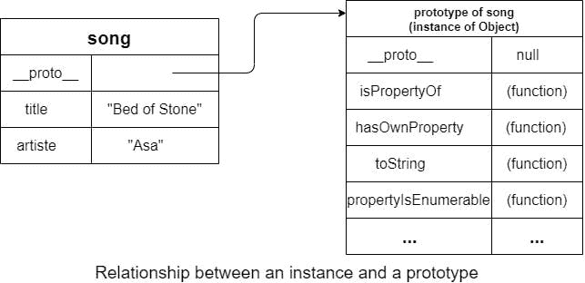
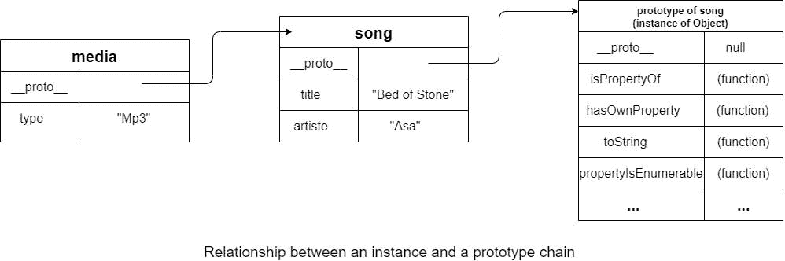
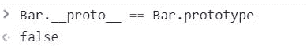
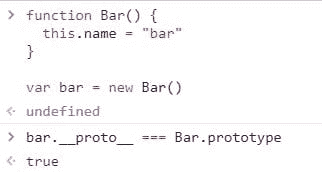
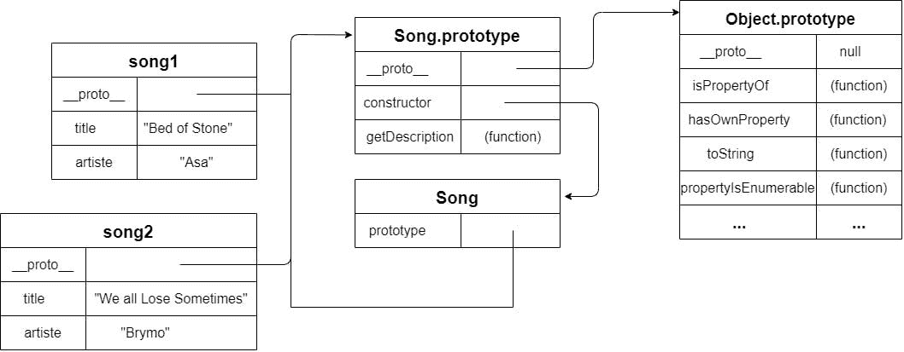
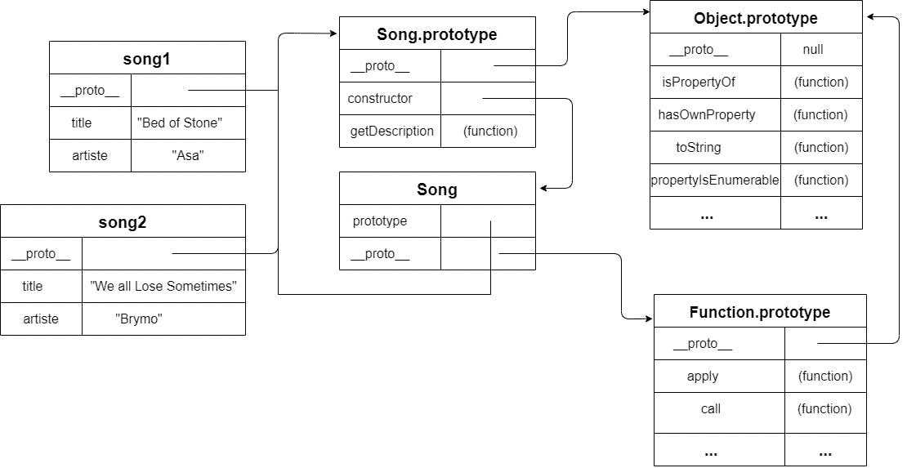

# 简单英语的 JavaScript 原型

> 原文：<https://javascript.plainenglish.io/javascript-prototypes-in-plain-english-305781fbd979?source=collection_archive---------8----------------------->


*Image by* [*Jozef Mikulcik*](https://pixabay.com/users/jozefm84-10215106/?utm_source=link-attribution&utm_medium=referral&utm_campaign=image&utm_content=5033990) *from* [*Pixabay*](https://pixabay.com/?utm_source=link-attribution&utm_medium=referral&utm_campaign=image&utm_content=5033990)

初学者很难理解的 JavaScript 概念之一是原型，尤其是对于来自基于类的编程语言的程序员来说。

你可能会问，“现代 JavaScript 没有`class`关键字吗？”

是的，确实如此，但这只是对原型的“糖衣”,理解原型是如何工作的可以在调试 JavaScript 代码时减轻你的压力。

JavaScript 很奇怪，但是在我看来理解它就不会那么奇怪了(如果你相信我的观点很重要的话:)。

# 从为什么开始

类和原型是不同的，但是它们有一个共同的想法:它们允许我们重用代码。一个类定义了一个“蓝图”,用于创建一个包含类中定义的字段的对象。

有了这个“蓝图”，我们可以根据需要创建任意多的对象。我们很快就会看到，尽管原型的工作方式不同，但它们也允许我们重用代码。

# 对象及其成员

考虑以下对象:

```
var song = {
  title: "Bed of Stones",
  artiste: "Asa",
  getDescription : () => {
    return "Best song on earth"
  }
}
```

这个对象的成员是`title`、`artiste`和`getDescription`。引用一个函数的成员被称为方法(在这个例子中是`getDescription`，而其他的被认为是对象的属性。然而，将所有成员称为属性是很常见的。

# 原型

原型是作为另一个对象的基本对象的对象。

这到底是什么意思？

请记住，对象包含成员，因此如果我们将`song.title`解释为从`song`对象请求`title`成员，那么原型就是*另一个对象*如果我们正在处理的对象没有该成员，我们可以向其请求成员。

一个对象通过一个内部属性被绑定到它的原型，大多数浏览器都将其公开为`__proto__`。

默认情况下，每次创建一个内置类型的新实例，比如`Array`或`Object`，这些实例都会自动拥有一个全局对象的实例作为它们的原型。

```
var song = {
  title: "Bed of Stones",
  artiste: "Asa"
}
console.log(typeof song.__proto__) // prints "object"
```

该原型对象也包含成员，其中一些成员如下图所示:



当我们写作时，

```
song.toString()
```

JavaScript 引擎将首先为`toString`检查`song`对象的成员，如果没有找到，它将检查 song 对象的原型。在本例中，它在那里找到了`toString`属性。

# 对象成员的类型

从上一节来看，这意味着一个对象可以有两种类型的成员:

1.  实例成员也称为自己的成员
2.  原型成员

JavaScript 提供了区分两者的方法。例如，我们可以写

```
console.log(song.hasOwnProperty("title")) //prints true console.log(song.hasOwnProperty("artiste")) //prints true console.log(song.hasOwnProperty("toString")) //prints false
```

`hasOwnProperty(fieldName)`询问 JavaScript 引擎`fieldName`是否是正在讨论的对象的实例成员。

另一方面，JavaScript 中的`in`操作符检查实例和原型成员

```
console.log("title" in song) //true console.log("artiste" in song) //true console.log("toString" in song) //true
```

**小测验** : *我们如何在* `*song*` *对象上访问* `*hasOwnProperty*` *，即使它没有在上面定义？*

# 原型链

如前所述，默认情况下，JavaScript 中的所有对象都有来自全局对象的原型。我们说它们是对象的实例。

JavaScript 提供了不同的方法来让我们自己设置对象的原型。不建议将新对象直接分配给`__proto__`属性。并不是所有的浏览器都支持它。

# Object.create()

考虑下面的代码片段:

```
var song = {
  title: "Bed of Stones",
  artiste: "Asa"
}// creates a new object which prototype is 'song'
var media = Object.create(song)
console.log(Object.getPrototypeOf(media)) // [object Object] { //artiste: "Asa", title: "Bed of Stones" }
```

`Object.create(song)`将创建一个新对象，并将其原型设置为`song`对象。除了通过`__proto__`属性读取一个对象的原型，我们还可以使用`Object.getPrototypeOf`，如示例所示。

您可以将另一个对象传递给`Object.create`来将特定的实例属性添加到正在创建的对象中。例如:

```
// creates a new object that has this structure { type: "Mp3"} and // whose prototype is the song object
var media = Object.create(song, { type: {value: "Mp3" } })console.log(media.type) // prints "Mp3"
console.log(media.title) // prints "Bed of Stones"
```



# 构造函数

使用自定义原型创建对象的另一种方法是使用构造函数。严格地说，任何函数都可以用作构造函数，但是按照惯例，构造函数的名字以大写字母开头。

要创建构造函数的实例，可以在函数调用中使用`new`关键字，例如:

```
function Bar() {}var bar = new Bar() // creates a new object
```

当使用关键字`new`时，JavaScript 将关键字`this`隐式分配给正在创建的新对象。所以我们可以使用`this`来引用正在创建的对象:

```
function Bar() {
  this.name = "bar"
}var bar = new Bar()
console.log(bar.name) // "bar"
```

# 构造函数`prototype`属性

JavaScript 中的每个函数都有特殊属性`prototype`。你可能会问，既然函数也是对象，`prototype`属性和`__proto__`属性是一样的吗？



是啊。构造函数的`prototype`属性指向的对象不是该函数的原型。那是什么呢？

还记得我提到过构造函数可以用来创建一个新对象…并设置新对象的原型吗？新对象的原型是构造函数`prototype`属性指向的对象。

让我用另一种方式重新表述。

*   每个函数都有一个`prototype`属性
*   您可以使用`new`关键字来创建该函数的一个对象(也称为实例)
*   对象的原型被设置为构造函数的`prototype`属性



让我用下面的代码片段来总结一下:

```
function Song(title, artiste) {
  this.title = title
  this.artiste = artiste
}Song.prototype.getDescription = function() {
  return this.title + " by " + this.artiste
}var song1 = new Song("Bed of Stones", "Asa")
var song2 = new Song("We all Lose Sometimes", "Brymo")console.log(song1.title) // "Bed of Stones"
console.log(song2.artiste) // "Brymo"
console.log(song2.getDescription()) // "We all Lose Sometimes by Brymo"
```



`song1`和`song2`共享同一个原型链。注意`Song.prototype`有一个属性`constructor`，它是由 JavaScript 创建的，指向构造函数，在本例中是`Song`。

上图已经简化，`Song`本身有一个`__proto__`属性，下图显示了它:



# 结论

哇哦。你已经走了这么远。尼斯尼斯:)我们已经讨论了所有我认为是必要的，为了理解和更好地调试 JavaScript 程序的原型。

如果你发现任何错误，请指出来。

快乐编码

# 奖励:实例 of vs 类型 of

假设我们有

```
function Bar() {
  this.name = "bar"
}var bar = new Bar()
```

当我们写作时

```
console.log(bar instanceof Bar) // prints true
```

`bar instanceof Bar`意味着我们在向 JavaScript 引擎提问，

> *`*Bar.prototype*`*是否存在于* `*bar*` *原型链的任何地方？**

*在这种情况下，答案是肯定的。*

*`instanceof` operator 测试构造函数的 prototype 属性是否出现在对象的原型链中。*

*你能猜到这会打印出什么吗？*

*答案还是`true`，因为`Object.prototype`存在于`bar`的原型链中*

# *运算符的类型*

*typeof 运算符返回指示操作数类型的字符串。返回的字符串可以是`"symbol"`、`"bigint"`、`"number"`、`"string"`、`"boolean"`、`"object"`、`"function"`或“未定义”中的任意一个*

*示例:*

```
*typeof 12 === 'number'; // returns true*
```

**最初发布于*[*https://sola the code . hash node . dev*](https://solathecoder.hashnode.dev/javascript-prototypes-in-plain-english-ckv2oc9300shhsss13muzachv)*。**

**更多内容请看*[***plain English . io***](http://plainenglish.io/)*