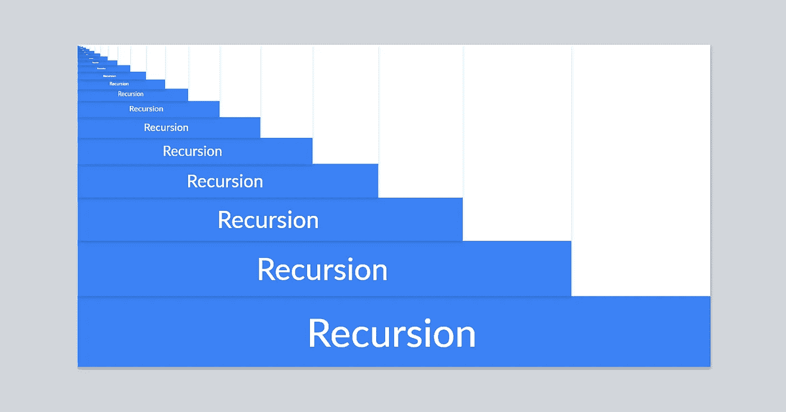
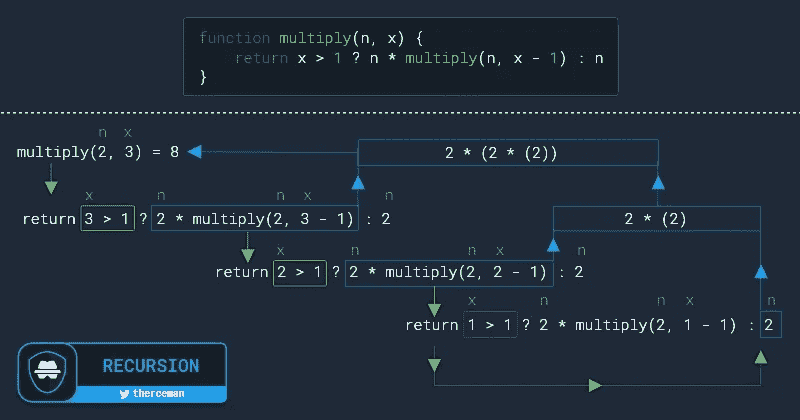

# 什么是 JavaScript 递归函数？

> 原文：<https://javascript.plainenglish.io/javascript-recursion-5f25f620e11b?source=collection_archive---------18----------------------->

## 阐明递归技术的优势



作为网站开发人员，我们每天都会遇到递归函数。

本教程将探索问题的模式，这可以使用递归来解决。

# 基本概念

```
function recurse() {
    // 2nd call to itself
    recurse();
}// 1st call
recurse();
```

每个递归函数必须有一个基本情况(也称为终止条件)，在这里它停止递归，否则它将无限期地继续调用自己。

```
function recurse() {
    if (terminate)
        return; // stop calling recurse(); // continue recurse() if there is no termination
    recurse();
}recurse();
```

# While 循环和递归比较

递归技术看起来类似于`while`循环。

想象一下，你需要将所需的数字乘以 X 倍。

比如:`2 * 2 * 2 = 8`

# While 循环

```
function multiply(n, x) {
    let i = 0;
    let res = 1;
    while (i < x) {
      res = res * n;
      i++;
    }
    return res;
}
```

> 循环是如何工作的？

```
multiply(2,3)1\. i = 0, res = (1) * 2       // 0 < 3 continue ...
2\. i = 1; res = (2) * 2       // 1 < 3 continue ...
3\. i = 2; res = (2 * 2) * 2   // 2 < 3 continue ...
4\. i = 3; res = (2 * 2 * 2)   // 3 < 3 (false) break and return 8
```

# 递归🔁

```
function multiply(n, x) {
    return x > 1 ? n * multiply(n, x - 1) : n;
}
```

> 递归是如何工作的？



# 例子

# #1(字符串 URL 编码)

假设我们需要对字符串`<html>`进行 5 次 URL 编码

输出应该是这样的:`%252525253Chtml%252525253E`

## 循环解决方案

```
function encode(str, n) {
    let i = 0;
    while (i < n) {
      str = encodeURI(str)
      i++;
    }
    return str;
}
```

## 递归解🔁

```
function encode(str, n) {
    return n ? encode(encodeURI(str), n - 1) : str;
}
```

# #2(字符串 URL 解码)

假设我们需要解码一个多次编码的 URL

例如，让我们以先前的 URL 编码字符串:`%252525253Chtml%252525253E`

输出结果将是:`<html>`

## 循环解决方案

```
function decode(str) {
    while (str !== decodeURI(str)) {
      str = decodeURI(str)
    }
    return str;
}
```

## 递归解🔁

```
function decode(str) {
    return str !== decodeURI(str) ? decode(decodeURI(str)) : str;
}
```

# #3(字符串替换)

假设您需要替换 HTML 代码中的坏标签，比如`<script>`

第一种情况:`hello<script> world<script>`

第二种情况:`hello<sc<script>ript>world`

对于第一种情况，我们可以很容易地这样做:

```
let html_code = 'hello<script> world<script>';
let output = html_code.replaceAll('<script>','');
// output: hello world
```

但是..第二种情况会失败:

```
let html_code = 'hello<sc<script>ript> world';
let output = html_code.replaceAll('<script>','');
// output: hello<script> world
```

这就是递归的用处

## 递归解🔁

```
function clean_html(html, bad_tag) {
    let cleaned_html = html.replaceAll(bad_tag, '');
    return html === cleaned_html ? html : clean_html(cleaned_html, bad_tag)
}clean_html('hello<sc<script>ript> world', '<script>');// output: hello world
```

# #4(查找嵌套元素)

在这个例子中，我们需要通过只知道 id 来找到类别的名称

```
let the_category_list = [
    {"id" : 1, "name" : "fruits", "child_list" : [
        {"id" : 2, "name" : "apple", "child_list" : [
            {"id" : 4, "name" : "red apple", "child_list" : []},
            {"id" : 5, "name" : "green apple", "child_list" : []}
        ]},
        {"id" : 3, "name" : "banana", "child_list" : []}
    ]}
]
```

## 递归解🔁

```
function find_cat_by_id(id, category_list) {
    let found_category = false; category_list.forEach(category => {
        if (category.id === id)
            found_category = category; if (found_category === false && category.child_list.length)
            found_category = find_cat_by_id(id, category.child_list)
    });    return (found_category) ? found_category : false;
}find_cat_by_id(5, the_category_list)// Output: {id: 5, name: "green apple", child_list: Array(0)}
```

# #5(使用递归的阶乘)

这个例子将向你展示如何使用递归用 javascript 编写一个阶乘程序

假设我们需要 **5:** `**1 * 2 * 3 * 4 * 5 = 120**`的阶乘

## 递归解🔁

```
function factorial(x) {
    return x ? x * factorial(x - 1) : 1; 
}
```

# #6(使用递归的斐波那契数列)

在这个例子中，你将学习如何编写一个程序来使用递归打印斐波那契数列

斐波那契数列写成:`0, 1, 1, 2, 3, 5, 8, 13, 21, …`

## 递归解🔁

```
function fibonacci(num) {
    return num < 2 ? num : fibonacci(num - 1) + fibonacci(num - 2);
}function fibonacci_printer(numberOfTerms) {
    let out = []; for(let i = 0; i < numberOfTerms; i++) {
        out.push(fibonacci(i));
    } console.log(out.join(', '));
}
```

要使用这个程序，您需要调用`fibonacci_printer(5)`，输出将是:`0, 1, 1, 2, 3`

> 感谢阅读！
> 
> 稍后将添加更多示例。
> 
> 在推特上关注我—[twitter.com/therceman](http://twitter.com/therceman)

*更多内容看*[***plain English . io***](http://plainenglish.io/)