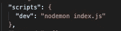

# 解释了 JavaScript Reduce 方法

> 原文：<https://javascript.plainenglish.io/javascript-reduce-method-explained-a846869472ae?source=collection_archive---------18----------------------->

大家好，在我上一篇关于 JavaScript 方法的文章中，我有意将 reduce 留在它自己的文章中。在我看来，它并不复杂，使用起来也很简单，但是我发现很多初学者经常在 reduce 上挣扎，所以我决定写一篇关于它的文章。

# 什么是 Reduce？

“`reduce()`方法将数组缩减为单个值。

`reduce()`方法为数组的每个值执行一个提供的函数(从左到右)。

函数的返回值存储在累加器中(结果/总计)。"

上面的这个定义直接来自[这里](https://www.w3schools.com/jsref/jsref_reduce.asp)，你也可以在同一个网站上查看许多其他关于 javascript 的概念。但是如果我们想把这个定义“简化”成“简单英语”,那么简化的定义应该如下；Reduce 接受一个数组，在迭代每个值后返回一个值作为输出。

我在教程中使用了 NodeJS 运行时，但是您可以使用任何支持 JavaScript 的平台，下面是安装示例。帖子的代码是[这里是](https://github.com/eren23/js-reduce-blogpost)。

# 可选 NPM 套餐

在这篇文章中，我们将使用节点时间，所以如果你喜欢跟随，你需要在你的本地。这里可以下载[。](https://nodejs.org/en/)

如果你想在你的项目中有一个热重装特性，就像我在教程中使用的那样，你可以继续从 GitHub 安装代码，只需在根目录中运行命令“npm install ”,或者如果你想在根目录中手动完成，你应该按顺序运行下面的命令:

`npm install -D nodemon`

之后，您可以在 package.json 文件中创建一个新脚本:

现在，您可以通过运行以下命令，使用热重装启动节点运行时:

# 使用

首先，我们将从一个普通的 for 循环开始，对一个对象数组的每个值求和，然后让我们记录它，看看那里有什么。

正如你在上面看到的，这种方式也很简单，结果是 517，和预期的一样。

现在让我们看看 reduce 的相同操作。

正如我们所看到的，reduce 方法在这里有两个参数，第一个是回调函数，第二个是累加器的初始值。

在我们的回调函数中，我们可以看到我们有 2 个位置参数，它总共可以再接受 2 个位置参数(它们将在新的例子中使用)。第一个参数是所谓的累加器值，在英语中；从 reduce 方法的前一次迭代中传递的值，如果我们将它设置为 0，就像在示例中一样，它从 0 开始，但可以修改。

通过回调函数中的 log 语句，我们可以观察这个过程是否真的像上面解释的那样。

正如我们可以看到的，输出行与上面的解释一致。

另外两个位置参数是索引和数组本身。让我们通过同一阵列上的一个示例来看看它们。

现在我们在回调函数中使用所有 4 个参数来计算这次的平均值，而不是简单的总数。我们正在检查元素的索引是否等于 length-1，现在我们可以返回平均值(或者像示例中那样的平均值)。如果语句不满足，我们应该继续添加值，直到数组的所有成员都迭代完。结果现在是预期的 64，625。

# 结论

是的，正如我们所见，实际上 reduce 方法并没有做什么新的事情，而且从许多角度来看，使用它没有任何意义，尤其是在涉及到性能的时候(您可以查看关于性能结果的其他资源[这里](https://kentcdodds.com/blog/array-reduce-vs-chaining-vs-for-loop)和[这里](https://codeburst.io/reduce-vs-for-loop-3c1a84e63872)

但是使用原生数组方法的一个不可测量的影响，比如 reduce 或者我之前提到的。这是代码的可读性。在我个人看来，从长远来看，使用这种广为人知的方法可能会带来一些意想不到的好处，因为在使用更大的代码库时，使用更具体但广为人知的语言而不是非常通用的用法可能会使您在性能方面落后，但也会使您在生产率方面领先。

当然，最终的选择取决于你，这些是我所知道的和我对 JavaScript 的 reduce 方法的看法，我希望你也喜欢它。再见:)。

*原载于*[*https://blog.akbuluteren.com*](https://blog.akbuluteren.com/blog/javascript-reduce-method-explained)*。*