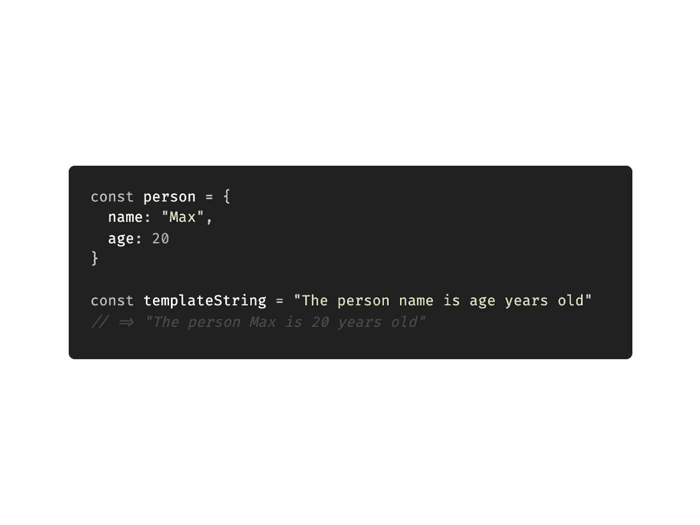

# 如何用 JavaScript 中一个对象的数据替换多个子字符串

> 原文：<https://javascript.plainenglish.io/javascript-replace-multiple-substrings-8e9e9678bca7?source=collection_archive---------9----------------------->

## 我不得不谷歌一下 JS 的东西

## 或者:水合模板串



Source: the author

*提示:在您将要学习的代码的许多用例中，* [*模板文字*](/template-literals-in-javascript-the-complete-guide-e23f64c13aa1) *是一个更简洁的选项。*

有时，我们希望在 JavaScript 中替换一个字符串中的多个字符串。当我们已经在这样做的时候，经常需要用动态数据替换字符串——比如变量的值。

这里有一个小例子。给定此字符串:

`'The person name is age years old'`

我们希望将它与来自某个对象的匹配数据相融合，该数据如下所示:

```
const person = {
  name: 'Max',
  age: 20
}
```

最后得到的字符串应该是:`The person Max is 20 years old`。

如您所见，给定字符串中的子字符串“name”和“age”与我们的对象的键完全匹配。我们的目标是用对象值来水合一个字符串模板。我们是这样做的。

诀窍是将 regex 与 string.replace 函数结合起来。

首先，我们需要构建正则表达式。在许多情况下，我们只是将一些正则表达式传递给 string.replace 函数。然而，这一次我们需要基于我们拥有的对象生成一个动态正则表达式。因此，仅仅传递 regex 是不行的，我们需要生成它。

为了用 JavaScript 生成正则表达式，我们使用了`RegExp`类。我们希望接收一个包含我们的对象键的 regex 结构。这个正则表达式可以传递给 string.replace，然后用匹配的对象值替换匹配的字符串。

尽管如此，给定对象`const person = { name: 'Max', age: 20 }`，我们可以用以下方法将它转换成必要的正则表达式:

```
Object.keys(person).join('|')
```

`Object.keys`是对象中的一个键数组(姓名和年龄)，我们用一个逻辑 OR 将它连接起来，以接收:`name|age` —精确匹配的正则表达式结构。然后，将该字符串传递给 RegExp 实例:

```
const regex = new RegExp(Object.keys(person).join('|'), 'gi')
```

最后，让我们使用 string.replace 函数将所有东西放在一起。我在代码下面解释一下:

使用 string.replace 函数生成我们想要的最终水合字符串。它接受我们的正则表达式，并用属于这个键的值替换一个子串，这个子串等于我们对象中的一个实际键。

在我们的例子中，`hyrdatedString`是“人 Max 20 岁”。

# 使它更像模板

实际上，用属于完全相同的对象键的值替换子串并不是一个有用的例子。当替换作为模板的字符串中的内容时，拥有模板语法是更干净的解决方案。我的意思是。

我们现在有了这样的结构，而不是以前的字符串:

```
"The person {{name}} is {{age}} years old"
```

为此，我们可以使用和以前几乎一样的代码。但是首先，我们需要用`{{` `}}`包装我们的对象键，这样正则表达式就可以在字符串中匹配它。我们可以用下面一行代码来包装它们:

```
const templatedKeys = Object.keys(person).map((item) => {
  return '{{' + item + '}}'
})
```

我们使用的正则表达式生成器保持不变，但是我们将模板化的键传递给它:

```
const regex = new RegExp(templatedKeys.join('|'), 'gi')
```

这就产生了像`{{name}}|{{age}}`这样的正则表达式。现在，我们的正则表达式可以匹配模板的精确出现，在字符串中包装一个对象键。

只剩下一个问题:在没有模板语法的代码中，我们只是将对象的键传递给对象，以接收匹配值:`return person[match]` —匹配过去是“name”或“age”，它们实际上是对象键。

现在，通过正则表达式匹配的是“{{name}}”或“{{age}}”。因此，我们不能传递它们，因为它们不是对象键。为了解决这个问题，我们从匹配中移除`{{`T5，以接收我们实际的对象密钥。我们可以通过剪切匹配字符串的前两个和后两个字符来实现这一点:

```
*return* person[match.slice(2, match.length -2)]
```

完整代码:

请记住，通常，模板文字是在 JavaScript 中合成模板字符串的更好的解决方案。然而，我只是在一个真实的项目中使用了上面的代码，其中模板文字(``value``语法)不起作用。

感谢您的阅读！

*更多内容请看*[***plain English . io***](http://plainenglish.io/)