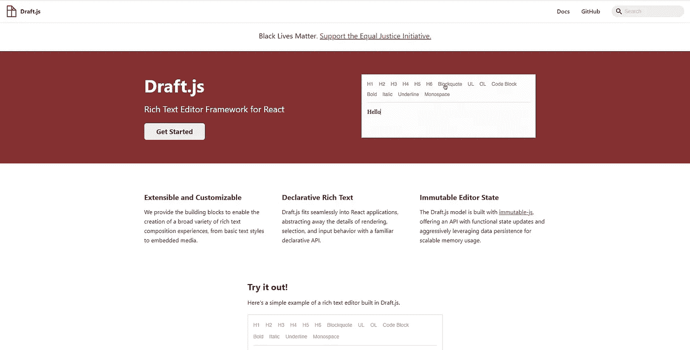
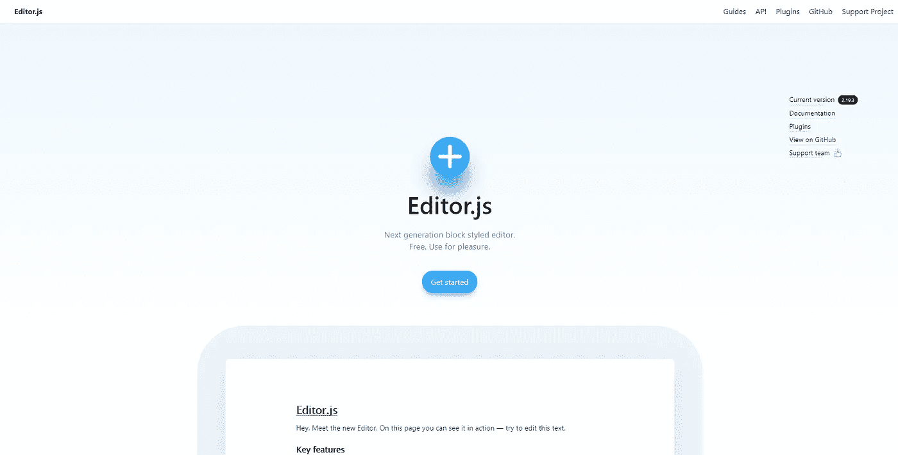
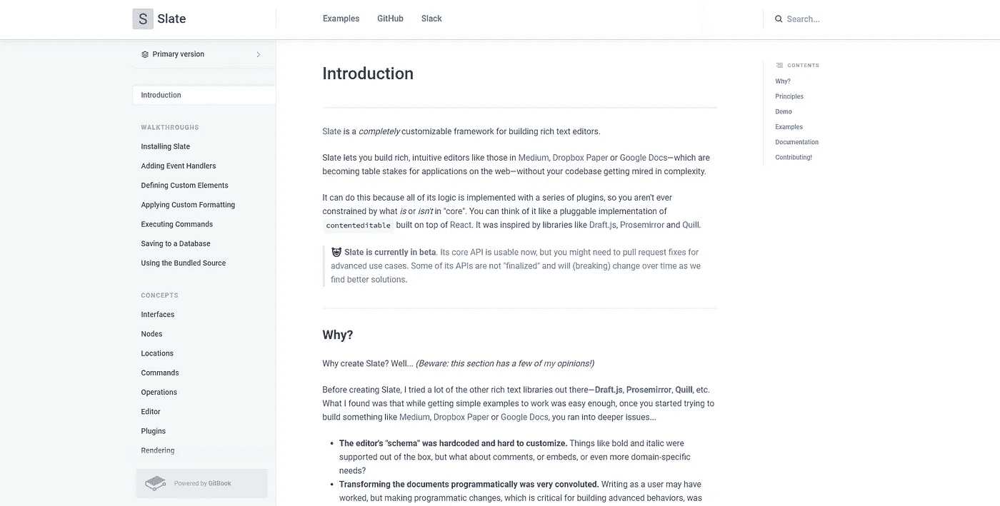
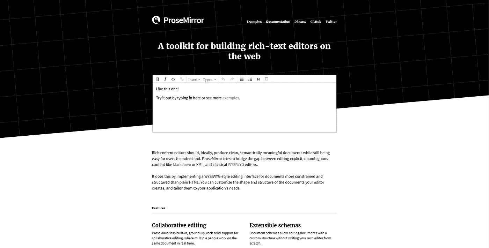
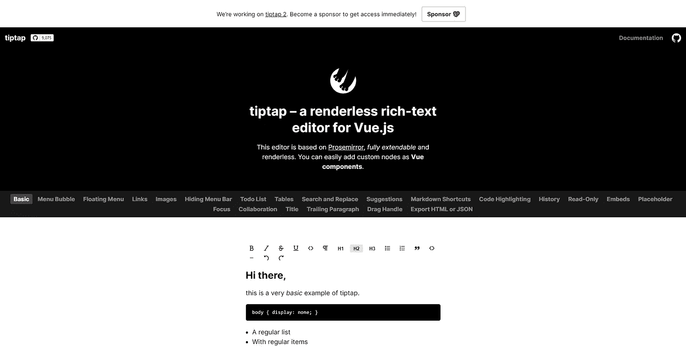

# 2021 年的 JavaScript 富文本编辑器

> 原文：<https://javascript.plainenglish.io/javascript-rich-text-editors-in-2021-58a936c2de7d?source=collection_archive---------13----------------------->

**富文本编辑器**，又称**所见即所得**(所见即所得)编辑器无处不在——评论区、论坛、网文编辑器。每当你想超越普通的`<input>`或`<textarea>`并在你的编辑器中启用可视的、交互式的格式，你必须走`contenteditable`的路，构建一个合适的富编辑器。

令人欣慰的是，有了大量的 JavaScript 框架和库，它们的唯一目的是构建丰富的基于网络的编辑体验，你将永远不必再与邪恶的 T3 打交道。

在这篇博客文章中，我将向你展示我对 2021 年最好的 JS 富文本编辑器框架的精选。

# 我们在找什么？

所以，这整个列表是基于我在开发我的第一个产品时所做的深入研究——code write，开发者的博客工具。

创建 CodeWrite 是为了尽可能提供最好的技术博客和交叉发布体验。它具有浏览器扩展+ PWA 混合的形式，为流行的博客平台提供自动填充系统和专用的富内容编辑器。

也就是说，CodeWrite 是决定我的框架需求的产品。那么，它们是什么？

## 基础知识

对于框架必须具备的基本特性，我选择了 CodeWrite 明确需要的那些。其中包括:

*   丰富的**内联内容格式**，带有定制和扩展所提供功能的选项
*   **嵌入**等区块内容支持— `<iframe>` s、列表、区块报价等。
*   能够使用和定义自定义的**键盘快捷键**和 **Markdown 输入规则**(对开发人员很重要，动态地将输入 MD 更改为格式化的内容)
*   深度 **UI 定制**和灵活性，能够创建格式工具栏、“块”侧菜单、浮动工具栏等。
*   对基本操作的“开箱即用”支持—历史记录、撤消、重做、复制、粘贴。

除了深度定制和 Markdown 输入规则之外，这些都是每个现代框架应该提供的功能。

当然，我们也寻找**维护**的质量、社区规模、**文档**，以及 **API** 的易用性。

## 细节

除了基础知识之外，我还有一些额外的需求，这些需求与我想要的代码编写非常相关。

**语法检查工具支持**

你知道这些为你提供人工智能语法检查的浏览器扩展，比如[语法](https://www.grammarly.com/)？这些在普通的编辑器中工作得很好，但是在复杂的、丰富的文本编辑器中却很困难。这是因为对`contenteditable`元素的处理不同。不同的结构使用像 Grammarly 这样的工具会更好或更差。

虽然有人可能会说这样的问题应该从语法的角度来解决，但是它们不可能解释所有可能的`contenteditable`结构，所以一些帮助是必要的。

**编辑器中的编辑器**

这是非常具体的代码。为了提供最好的技术博客体验，我想同时拥有最好的写作和编码体验。这意味着代码片段也应该得到适当的处理——像 [CodeMirror](https://codemirror.net/) 或 [Monaco Editor](https://microsoft.github.io/monaco-editor/) 这样的东西——这反过来意味着在编辑器中嵌入一个编辑器！

可编辑的嵌入不同于传统的嵌入，如`<iframe>` s，因为它们更加**互动**。它们不能通过`<iframe>`嵌入，因为多个独立的 Monaco 编辑器实例会让任何设备瘫痪。此外，您必须能够编辑这些实例中的内容，包括选择、复制、粘贴等操作。再加上内部和外部编辑器之间的同步光标，你就有了一个相当复杂的设置。

## 好东西

除了已经列出的所有要求，我还有更多要求。我称之为“有用”的功能是那些我知道不会马上使用，但将来会有用的功能。这些是:

*   **移动支持** —作为一个桌面浏览器扩展，CodeWrite 并不是为移动而设计的。除此之外，在没有物理键盘的小型触摸设备上提供适当的编辑和编码体验也是一个挑战。也就是说，我确实想过有一天为移动设备编写代码，所以希望我选择的框架能够支持它。
*   **协作编辑**——现在，最初，我希望 CodeWrite 是为个人代码博主服务的，但我一直计划支持*【live collab】*。你知道，实时光标，冲突解决，等等。？Live collab 是一个要求很高的特性，它要求框架有一个结构良好的 API，并正确地构造、处理和存储更新。

# 我们是如何做到的？

所有的特性需求都已经解决了，让我快速解释一下这个列表是如何构建的。

所有提到的特性都将汇集到一个简短的列表中，以便您能够快速浏览给定框架的特性集，每个特性都标有🎉,👎，或者😑分别表示“通过”、“未通过”和“稍微通过”。

现在，并不是这个列表中的每个框架都包含了所有的特性——即使是基础类的！尽管如此，这些确实是我所知道的最好的选择，它们都值得在这个列表中占有一席之地。

也就是说，有些人比其他人更值得拥有它，所以我将这份名单上的所有 **6 个条目**分成了 3 个类别——*【值得一提】**【亚军】**【冠军】*。这样，你不仅可以清楚地区分框架，还可以了解我的旅程，因为我正在决定我的最终选择。

希望，这是足够的介绍。我们知道我们在寻找什么，我们知道它是如何工作的，现在—在列表上！

# 值得一提

## [羽毛笔](https://quilljs.com/)

Quill landing page

Quill 从一开始看起来就是一个很好的框架。它是独立于 UI 框架的，在语法上可以使用，有容易定制的 UI，以及所有的好东西。

然而，随着你越挖越深，问题就出现了。看似简单的 API 随着您寻求可定制性而变得越来越复杂，不支持 Markdown 输入规则，并且整个项目的可维护性都是有问题的。

奇怪的是，回购似乎很活跃，然而 docs，无论多么宽泛，似乎都有点停留在过去，并且 [NPM 包](https://www.npmjs.com/package/quill)已经一年多没有更新了。

尽管如此，奎尔仍然榜上有名(尽管垫底)，这要归功于它的*“看似简单”*。如果你想要的只是一个简单但丰富的编辑器，你没有任何定制需求，不寻求深度可定制性；Quill 是一个好的、快速的、易于设置的编辑器。

*   基本操作:🎉
*   用户界面可定制性:🎉
*   内嵌格式:🎉
*   嵌入和阻止:😑(图像和视频除外，需要复杂的设置)
*   键盘快捷键:🎉
*   降价输入规则:👎(参见 https://github.com/quilljs/quill/issues/3192 的
*   良好的 API:😑(外表简单，内心复杂)
*   文档:😑(宽泛，但停留在时间上)
*   维护:😑(维护，但不是真的)
*   语法上:🎉
*   嵌套编辑器:👎(参见 https://github.com/quilljs/quill/issues/2772
*   移动支持:🎉
*   协作编辑:😑(参见[https://github.com/quilljs/quill/issues/2099](https://github.com/quilljs/quill/issues/2099))

## [Draft.js](https://draftjs.org/)

Draft.js landing page

现在， **Draft.js** 似乎是 React 的“首选”富编辑器框架。它直接来自脸书团队，有一个深度的“反应式”API，并支持 Facebook Messenger 或 Twitter。

如果您以前喜欢使用 React，您会喜欢 Draft.js API。除了为 React 量身定制之外，它非常干净、简单，并且有良好的文档记录。

然而，这种简单性不仅影响了 API，还影响了框架的整体设计。框架本身只是一个核心，功能有限，但却是一个**健壮的插件系统**。这意味着你必须做更多的研究并找到好的插件(这里有一个好的收藏)或者自己构建所需的插件。

*   基本操作:🎉
*   用户界面可定制性:🎉
*   内嵌格式:🎉
*   嵌入和阻止:🎉
*   键盘快捷键:🎉
*   降价输入规则:😑(可能通过[插件](https://github.com/ngs/draft-js-markdown-shortcuts-plugin))
*   良好的 API:🎉
*   文档:🎉
*   维护:🎉
*   语法上:🎉
*   嵌套编辑器:😑(有可能，尽管没有这方面的资源)
*   移动支持:🎉
*   协作编辑:👎(参见[https://github.com/facebook/draft-js/issues/93](https://github.com/facebook/draft-js/issues/93)

## [Editor.js](https://editorjs.io/)

Editor.js landing page

**Editor.js** 无疑是这个列表中所有框架中最好的 API。它简单、独立于框架、易于使用，并且有清晰可读的 JSON 输出。

然而，这么好的 API 是有代价的。该框架缺乏对协作编辑和降价输入规则的支持。语法支持也是断断续续的，因为 Editor.js 是一个**块样式的编辑器**(每段内容都是它自己的`contenteditable`)。最重要的是，移动支持虽然存在，但也有一些小问题。

至于可定制性——有一个插件架构来支持它，尽管它相当有限。插件允许你添加额外的特性，比如块或者内嵌格式，但是 UI 定制不像其他框架那样广泛。

也就是说，我全心全意地推荐 Editor.js 给那些正在寻找一个现成的、易于使用的、具有令人惊叹的 UI 的编辑器的人。类似羽毛笔的东西，实际上还在维护，甚至可以说更好！

*   基本操作:🎉
*   用户界面可定制性:😑(可能，但与其他框架相比有限)
*   内嵌格式:🎉
*   嵌入和阻止:🎉
*   键盘快捷键:🎉
*   降价输入规则:👎(参见[https://github.com/codex-team/editor.js/issues/709](https://github.com/codex-team/editor.js/issues/709))
*   良好的 API:🎉
*   文档:🎉
*   维护:🎉
*   语法上:😑(有效，但仅限于“每段”)
*   嵌套编辑器:😑(可能，“概念验证”插件可用)
*   移动支持:😑(可以工作，但是有问题)
*   协作编辑:👎(参见[https://github.com/codex-team/editor.js/issues/819](https://github.com/codex-team/editor.js/issues/819))

# 亚军

## [石板](https://docs.slatejs.org/)

Slate documentation

随着 **Slate** 的推出，我们正在加速游戏的进程！似乎永远在测试版中，Slate 是一个可深度定制的丰富编辑器框架，专用于 React。

与 Draft.js 类似，它拥有良好的 API、健壮的插件基础设施以及与 React 的深厚联系。然而，它确实有一些额外的优势，通常更加**可定制**。此外，插件生态系统比 Draft.js '小一点，但可以说，平均而言，插件质量更好。举个例子，这里有一个[好的插件集合](https://slate-plugins-next.netlify.app/)。

Slate 是这个列表中第一个检查所有框的框架。尽管 Slate 目前缺乏关于协作编辑和嵌套编辑器的文档，但 API 确实支持这样的功能。这使得缺乏 Android 支持成为最大的缺点。

*   基本操作:🎉
*   用户界面可定制性:🎉
*   内嵌格式:🎉
*   嵌入和阻止:🎉
*   键盘快捷键:🎉
*   降价输入规则:🎉
*   良好的 API:🎉
*   文档:🎉
*   维护:🎉
*   语法上:🎉
*   嵌套编辑器:😑(可能，“概念验证”[可用](https://codesandbox.io/s/ck0pq))
*   移动支持:😑(安卓[不支持](https://github.com/ianstormtaylor/slate/issues/3786)，iOS 大部分能用)
*   协作编辑:😑(有可能，但是[几乎没有记录](https://github.com/ianstormtaylor/slate/issues/3715))

## [ProseMirror](https://prosemirror.net/)

Prosemirror landing page

随着 **ProseMirror** 的出现，我们正在到达顶峰！到目前为止，它是这个列表中功能最全的框架。

我们正在寻找的所有特性都存在于 ProseMirror 中。基础—已选中，可定制性—已选中，移动和语法支持—已选中！甚至协作编辑和嵌套代码编辑器也可以通过——对于[和](https://prosemirror.net/examples/collab/#edit-Example)[这两种](https://prosemirror.net/examples/codemirror/)边缘情况都有专门的例子！ProseMirror 唯一的缺点是它的复杂性。

预计一个功能如此丰富的框架会有一个复杂的 API。这是很自然的，但仍然需要指出的是，作为框架的新来者，也就是绝大多数，可能会在开始时遇到困难。再加上工具包的极简主义(它只包括核心的“构建模块”供你组装)，你将面临相当大的挑战。

也就是说，在 2021 年创建富文本编辑器，没有比 ProseMirror 更好的框架了。然而，这留下了一个问题——为什么 ProseMirror 不是赢家？

*   基本操作:🎉
*   用户界面可定制性:🎉
*   内嵌格式:🎉
*   嵌入和阻止:🎉
*   键盘快捷键:🎉
*   降价输入规则:🎉
*   良好的 API:😑(相当复杂)
*   文档:🎉
*   维护:🎉
*   语法上:🎉
*   嵌套编辑器:🎉
*   移动支持:🎉
*   协作编辑:🎉

# 获胜者

## [Tiptap](https://tiptap.dev/) (v2)

Tiptap v1 landing page

所以，“赢家”，以及 2021 年的最佳富编辑器框架，是 **Tiptap** ！它建立在 ProseMirror 之上的**(所以我关于它是最好的观点仍然成立)但是提供了一个更加友好的 API，允许你更快地创建伟大的编辑体验！**

不过，有一点需要注意。你看，当我把 TipTap 放在讲台上时，我实际上指的是 **Tiptap v2** 。

Tiptap v1 已经是围绕 ProseMirror 的一个很好的、有用的包装器，但是它缺乏好的文档、类型脚本类型，并且只与 Vue 2 兼容。

Tiptap v2 通过改进的、独立于框架的 API、类型脚本重写和优秀的文档解决了所有这些问题。不过是在 beta — **封闭 beta** 。要访问这个框架，你必须[在 GitHub 上赞助它的开发者](https://github.com/sponsors/ueberdosis)。一个崇高的事业，但仍然是一个进入的障碍。

他们[公开声明](https://blog.ueber.io/post/tiptap-2-0-beta/)一旦达到 GitHub 赞助商提供的**5000 美元/月**的目标，该框架将会公开发布。

现在，随便你怎么想，但就我个人而言，我重视好的产品，Tiptap 就是其中之一。因此，作为 GitHub 赞助商，我获得了 Tiptap v2，我必须承认——这是这项工作的最佳工具。我不能说它是最好的富内容编辑器框架，因为这是 ProseMirror 的角色，但它是对。

有了这两种工具的组合 API 和文档，您将能够创建您能想到的任何富编辑器，就像我能够创建 CodeWrite 一样。您仍然需要学习 ProseMirror API 来实现更高级的特性，尽管这将是一个循序渐进的过程，而且由于 Tiptap wrappers 的存在，这将变得更加容易。

所以，那就是我的**1 号**。你可以等待它公开(它真的很近)，或者赞助 Tiptap 背后的优秀团队，现在就获得访问权！

*   基本操作:🎉
*   用户界面可定制性:🎉
*   内嵌格式:🎉
*   嵌入和阻止:🎉
*   键盘快捷键:🎉
*   降价输入规则:🎉
*   良好的 API:🎉
*   文档:🎉
*   维护:🎉
*   语法上:🎉
*   嵌套编辑器:🎉
*   移动支持:🎉
*   协作编辑:🎉

# 结论

这份名单到此为止。希望对你有帮助。毕竟，你在几分钟内就知道了我花了几天的时间！我迫不及待地想看看你用这些奇妙的工具创造了多么棒的编辑体验！欢迎在下面的评论中分享他们，你的想法，以及任何与主题相关的东西！

至于代码编写，你现在知道了。它由 **Tiptap v2** 驱动，旁边还有 [Vue 3 和 TSX](https://areknawo.com/vue-with-tsx-the-perfect-duo/) combo。如果你像我一样是一个技术博主，请随意[查看](https://codewrite.io)！

无论如何，要了解更多的网络开发内容，请关注我的 [Twitter](https://twitter.com/areknawo) 、[脸书](https://www.facebook.com/areknawoblog)，或者通过[我的简讯](#newsletter)。

*更多内容请看*[***plain English . io***](https://plainenglish.io/)