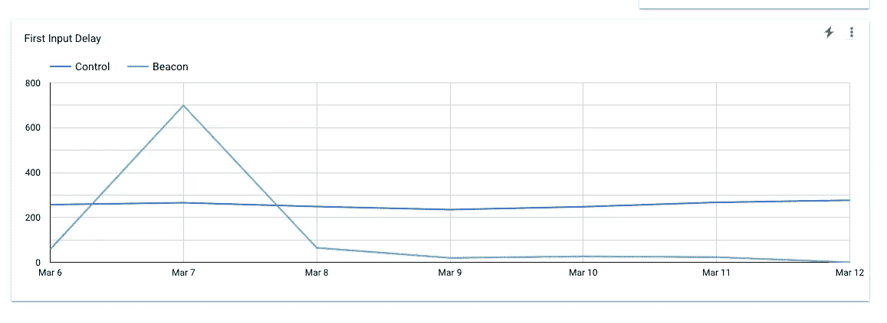

# 我们将 JavaScript SDK 的加载时间从 200 毫秒减少到了 20 毫秒

> 原文：<https://javascript.plainenglish.io/javascript-sdk-from-200ms-to-20ms-5886e0b356d2?source=collection_archive---------22----------------------->

回到 2018 年[，谷歌宣布](https://developers.google.com/web/updates/2018/07/search-ads-speed)加载速度将是谷歌搜索和谷歌广告的一个因素。这在市场人士中引发了一场关于业绩的大讨论。性能一直很重要，尤其是在电子商务环境下，但当谷歌加大赌注时，它成了一个紧迫的问题。

随着谷歌和脸书等公司为即时、无摩擦的应用和网站性能设定了标准，加载速度已成为任何互联网体验的最重要因素之一。如果你的加载时间超过 2 秒，用户就不会在你的页面上停留足够长的时间。

网站性能可能会因为各种原因而受到影响，但这些问题通常与营销团队想要在网站上运行的 JavaScript 有关。从广告像素到跟踪器到 CRM 嵌入，每一个未优化的 JavaScript SDK 都被营销用来获取更多数据。

值得庆幸的是，顶级公司越来越将网站速度视为一个工程问题，尤其是当加载时间直接转化为收入时。

虽然工程团队可能不会回避 SDK 营销部门需要的每一种产品，但是有一些现代工具允许工程部门在不牺牲性能的情况下为营销部门提供他们需要的数据。

这篇文章讨论了 RudderStack 如何与我们的客户 Loveholidays 合作开发高性能 [JavaScript SDK](https://docs.rudderstack.com/rudderstack-sdk-integration-guides/rudderstack-javascript-sdk) ，将执行时间从 200–300 毫秒减少到 20–60 毫秒。如果你更愿意观看我们关于这个主题的点播网上研讨会，你可以[点击这里](https://rudderstack.com/video-library/real-time-ecommerce-analytics-with-big-query-and-rudderstack/)观看。

# 问题是

影响网页性能的主要因素之一是所使用的第三方库。这些库有两种方法来减缓加载时间:

*   必须将库加载到浏览器中。如果图书馆有相当大的规模，我们将不得不等待。
*   库执行任务。在许多情况下，他们必须通过网络通信来执行这些任务，这增加了延迟。

还有其他因素。例如，库可能有缺陷或缺乏优化的实现，这是任何软件产品生命周期中的常见问题。虽然可以理解，但如果一个网站加载太慢，漏洞和缓慢的代码确实会影响收入。

# 站点速度和方向舵堆栈 JavaScript SDK

对于 RudderStack 这样的产品，事情就更复杂了。以下是与性能相关的两个主要复杂性:

# 目标集成影响库大小

RudderStack JavaScript SDK 就像我们客户的网站和他们发送数据的许多不同目的地之间的中间件。目标需求因客户而异，因此库的最终大小可能会有很大变化。

# 用户定义的 JSON 有效负载的变化

额外性能复杂性的另一个原因是 RudderStack Javascript SDK 必须提供的有效负载。

具体来说，当检测到 DOM 发生特定变化时，RudderStack 用户定义通过网络发送的任意 JSON 文档。由于 DOM 受到用户操作的影响，一些元数据被捕获并包含在有效载荷中。然后，该库确保 JSON 文档以正确的顺序交付给服务器。

# 走向解决

由于以上两个条件，在 SDK 部署到生产环境之前，很难在所有库使用中提供一致的体验或关于性能的理由。

一段时间以来，我们一直致力于提高 JavaScript SDK 的性能，特别是因为我们为多家企业电子商务公司提供服务，但我们有幸在 Loveholidays 与 David Annez 一起完成并测试了高性能库。

我们是这样做的。

# 提高 JavaScript SDK 的性能

我们前面提到的两个问题需要不同的策略来提高速度。我们将首先解释我们是如何处理任意大小的已用库的。

# 缩小图书馆的规模

就其本身而言，JavaScript SDK 的初始大小很小。当需要支持本地目的地时，问题就出现了。

本地目的地是数据被直接推入其中的任何目的地，而不是将数据发送到方向舵堆栈数据平面并将其路由到应用。例如，我们的许多客户通过 RudderStack JavaScript SDK 原生运行 Google Analytics、Hotjar 和 Firebase SDKs。其中一个主要原因是性能，但也有目的地不提供公开可用的 API 的情况。无论如何，这是必须的。

获取本地库不可避免地增加了延迟；然而，主要的问题是，随着我们支持更多的库，更多的工具被添加到 RudderStack JavaScript SDK 中，并且它的大小也增加了。

# 解决方案:仅加载您需要的内容

这里的高级解决方案非常简单，这在很大程度上要归功于 David 和他的团队的一些好想法。

在基本层面上，高性能 JavaScript SDK 没有将终端目的地的插装代码捆绑在核心 SDK 中。相反，SDK 只从 RudderStack 仪表板获取目的地配置设置(如 track ID、API key、secret 等。)使用`requireIntegration_`方法。

让我们看一个简单的例子，看看这在实践中是如何工作的。

一旦 JavaScript SDK 接收到类似于`rudderanalytics.requireIntegration("GA")`的调用，它就会自动获取 Google Analytics instrumentation 代码(例如 GAPlugin.js ),该代码处理 RudderStack 事件有效负载的转换和映射逻辑。这包括调用类型和 API 调用。

核心 SDK 为所有调用维护一个队列。当一个`requireIntegration`调用发生时，任何相关的调用被排队，SDK 开始获取必要的库。完成后，队列将开始执行入队的调用。

通过这种策略实现了以下目标:

*   只有在需要时(或者换句话说，只有在发生需要库的调用时)，才会将任何本地库提取到客户端。
*   同时，任何后续的调用都被排队，所以在客户机上没有阻塞，因此没有额外的性能损失。
*   这种策略允许 JavaScript 库保持最小的大小，并确保页面首次加载的速度损失尽可能小。

通过实现上述内容并删除不必要的集成片段，Loveholidays 的加载时间比之前的解决方案(Segment 的 analytics.js)减少了近 10 倍。

受控测试记录的加载时间在 20-60 毫秒之间，低于 200-300 毫秒。

# XHR 与发送信标或同步与异步

为了进一步提高我们的 SDK 的性能，我们决定用 sendBeacon 进行实验。

[信标 API](https://developer.mozilla.org/en-US/docs/Web/API/Navigator/sendBeacon) 用于向 web 服务器异步发送少量数据。引入它的主要原因是为了分析用例，这非常适合我们许多注重性能的电子商务客户。

然而，最重要的方面是 Beacon 的异步特性。我们假设通过使用 sendBeacon，我们可以进一步减少输入延迟。

# 细节:灯塔对 XHR

运行同步 XHR 调用进行跟踪可能会影响页面的第一个输入延迟(FID ),从而降低用灯塔之类的工具测量时的响应速度。

我们与大卫和 Loveholidays 团队合作，对方向舵堆栈 SDK 的 Beacon vs. XHR 进行了 A/B 测试。剧透:成功了。我们看到使用 Beacon 时，平均 FID 从 200 ms 下降到 20ms。对此的大部分理由是卸载到新 RudderStack SDK 支持的 batch + async 调用。

这是来自爱情假期测试的真实图表:

**Actual Chart from the Loveholidays Test**

虽然通过 Beacon 异步发送数据可能不适合每家公司，但它可以推动高性能敏感用例的实质性改进。

# 结论

在 RudderStack，我们的使命是尽可能构建性能最佳的客户数据管道。我们知道，无论我们对 SDK 做什么，都会影响最终用户的体验，因此，我们非常重视性能。

我们在 Javascript SDK 上执行的上述更改使我们能够将 SDK 的执行时间从 200 多毫秒减少到 20-60 毫秒，与该领域的其他供应商相比，这不仅是一个巨大的改进，而且是一个标准设定。

当然，作为工程师，我们仍在探索许多事情来进一步提高性能。我们的下一个实验将是实现 Beacon API 和一个队列。

性能是迷人的，也越来越重要，所以请关注工程团队关于我们如何确保我们的 SDK 尽可能优化的更新。

# 免费注册并开始发送数据

测试我们的事件流、ELT 和反向 ETL 管道。使用我们的 HTTP 源在不到 5 分钟的时间内发送数据，或者在您的网站或应用程序中安装我们 12 个 SDK 中的一个。[入门](https://app.rudderlabs.com/signup?type=freetrial)。

*本博客最初发表于:* [*https://rudder stack . com/blog/JavaScript-SDK-from-200 ms-to-20 ms*](https://rudderstack.com/blog/javascript-sdk-from-200ms-to-20ms)

*更多内容请看*[***plain English . io***](http://plainenglish.io)