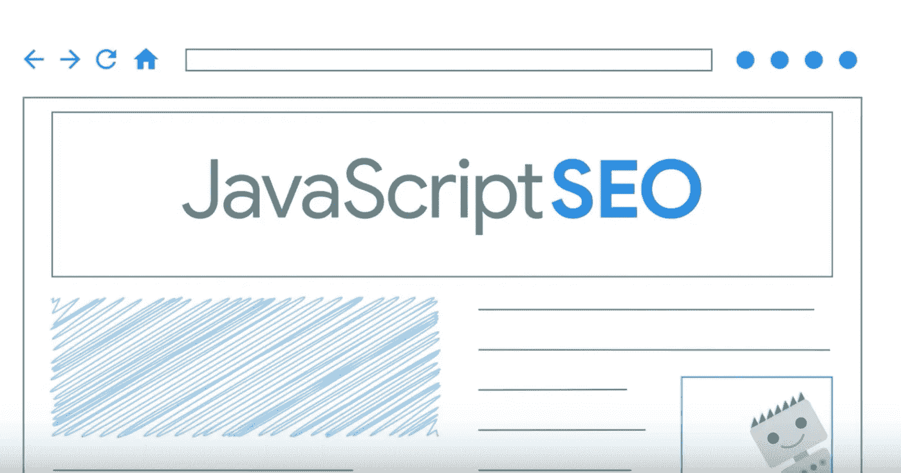
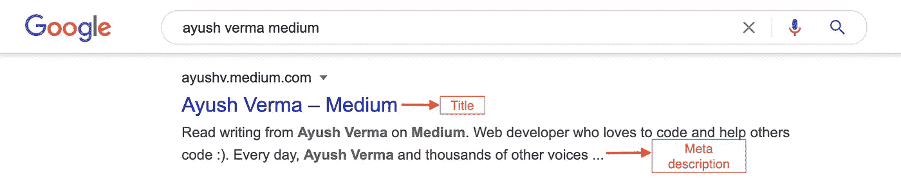
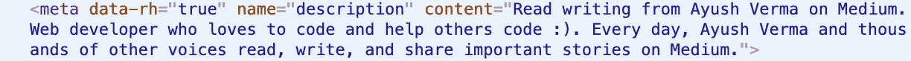
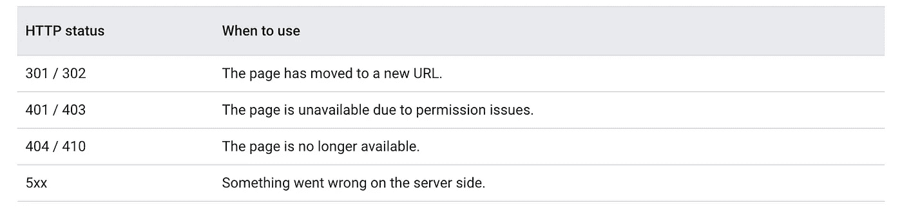
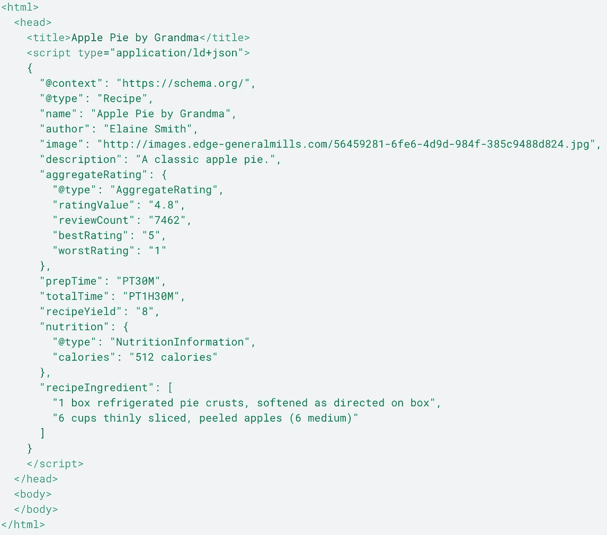
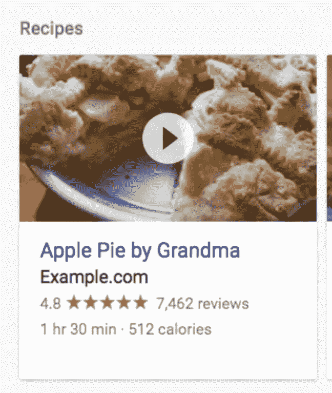
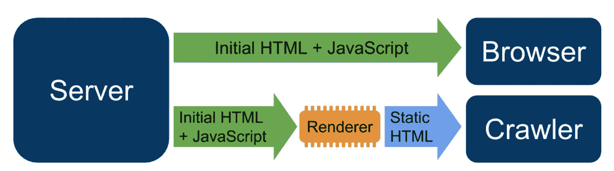
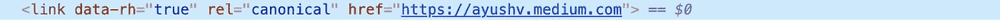

# JavaScript SEO 权威指南

> 原文：<https://javascript.plainenglish.io/javascript-seo-6b69f673ef8b?source=collection_archive---------10----------------------->

## 使您的内容在 Google 搜索中可被发现



JavaScript SEO 是技术性 SEO(搜索引擎优化)的一部分，旨在使大量使用 JavaScript 的网站易于抓取和索引，并且易于搜索。如果你正在使用 JavaScript 构建一个网站或 web 应用程序，你应该采取一些基本步骤来确保你的内容能被搜索引擎发现。

让我们来看几个 SEO 技巧，帮助用户找到你的内容。

## 1)用独特的标题和片段描述你的页面

**标题部分独特的描述性标题**和**有用的元描述**帮助用户快速找到他们目标的最佳结果。



## **2)使用历史 API 代替片段**

当 Googlebot 在你的页面中寻找链接时，它只考虑 HTML 链接的`**href**` **属性中的 URL(**`**<a>**`**标签)**。

对于具有客户端路由的单页应用程序，使用历史 API 来实现 web 应用程序的不同视图之间的路由，而不是基于哈希的路由技术。

## 3) **使用** **有意义的 HTTP 状态码**

Googlebot 使用 HTTP 状态代码来确定在抓取页面时是否出错。使用有意义的状态代码告诉 Googlebot 某个页面是否不应该被抓取或索引。下面列出了 HTTP 状态代码以及何时使用它们:



## 4) **避免单页应用中的软 404 错误**

在客户端呈现的单页应用程序中，路由通常被实现为客户端路由。在这种情况下，使用有意义的 HTTP 状态代码可能是不可能或不切实际的。要避免在使用客户端渲染和路由时出现软 404 错误，请使用以下策略之一:

*   使用 JavaScript 重定向到服务器用 404 HTTP 状态码响应的 URL(例如`/not-found`)。
*   使用 JavaScript 向错误页面添加一个`<meta name="robots" content="noindex">`。

## 5) **小心使用 meta robots 标签**

你可以通过 meta robots 标签阻止 Googlebot 索引页面或跟踪链接。例如，将以下 meta 标记添加到页面顶部会阻止 Googlebot 对页面进行索引:

```
<!- Googlebot won't index this page or follow links on this page ->
<meta name="robots" content="noindex, nofollow">
```

## 6) **无障碍设计**

为用户创建页面，而不仅仅是搜索引擎。当你设计你的站点时，考虑你的用户的需求，包括那些可能没有使用支持 JavaScript 的浏览器的人(例如，使用屏幕阅读器或不太先进的移动设备的人)。

编写语义 HTML——使用**标题**、**章节**和**段落**。HTML 图像和视频标签，带有标题和替代文本以增加视觉效果。

## 7) **使用结构化数据**

结构化标记或结构化数据是一组数据属性，有助于组织和定义内容，以便搜索引擎可以轻松理解您的站点和页面内容。本质上，结构化标记充当一组注释或一个页面的综合摘要。Schema 还支持在有机搜索列表中显示丰富的片段，如评论评级、内部链接和定价数据。

在页面上使用结构化数据时，可以使用 JavaScript 生成所需的 JSON-LD，并将其注入到页面中。



Structured Data and Search appearance

## 8) **实现动态渲染**

目前，很难处理 JavaScript，并且不是所有的搜索引擎爬虫都能够成功或立即处理它。

动态渲染是解决此问题的一种变通方法。这意味着为特定用户代理在客户端呈现和预呈现内容之间切换。



一些常见的动态渲染器有[木偶师](https://developers.google.com/web/tools/puppeteer/get-started)、[渲染器](https://github.com/GoogleChrome/rendertron#installing--deploying)和[预渲染器](https://prerender.io/)

## 9) **实现规范标签**

它们是一种告诉搜索引擎某个特定的 URL 代表了某个页面的主页面或首选页面的方式。规范标签的使用防止了由于相同或重复的内容出现在多个页面上而导致的问题。



The *rel=”canonical” tag in action*

这里，它表示出现该标签的页面应该被视为指定 URL 的副本。

## 10) **遵循 web 组件的最佳实践**

Googlebot 支持 web 组件。当 Googlebot 渲染页面时，它会展平阴影 DOM 和浅色 DOM 内容。这意味着 Googlebot 只能看到呈现的 HTML 中可见的内容。

为了确保谷歌机器人在你的内容呈现后仍能看到它，使用[移动友好测试](https://g.co/mobilefriendly)或 [URL 检查工具](https://support.google.com/webmasters/answer/9012289)并查看呈现的 HTML。如果内容在呈现的 HTML 中不可见，Googlebot 将无法索引它。

# 调试 JavaScript 站点

[**灯塔**](https://github.com/GoogleChrome/lighthouse) —这是一个开源的自动化工具，用于提高网页质量。它有对**性能**、**可访问性**、**渐进式网络应用**、 **SEO** 等等的审计。确保内容可被爬网程序发现的工具:

## 经过验证的网站所有者工具

**谷歌搜索控制台:**

这要求您是该页面的已验证站点用户，以便在该页面或站点上使用此工具。这是因为搜索控制台提供了机密的站点数据，只有经过验证的站点用户才能访问这些数据。

前谷歌网站管理员，它是在这里帮助适当的人查看您的内容与资源，使您的网站发现谷歌搜索。 **URL 检查**功能:获取 URL 的状态、最新的索引数据等。

## 匿名工具

这些工具可以在任何 URL 上使用，而不需要网站上的搜索控制台权限。

1.  **手机友好测试:**实时测试特定 URL 的手机友好性。
2.  **丰富结果测试:**实时测试结构化数据块的有效性。

你听说过程序化 SEO 吗？在 https://launchman.io/了解更多信息