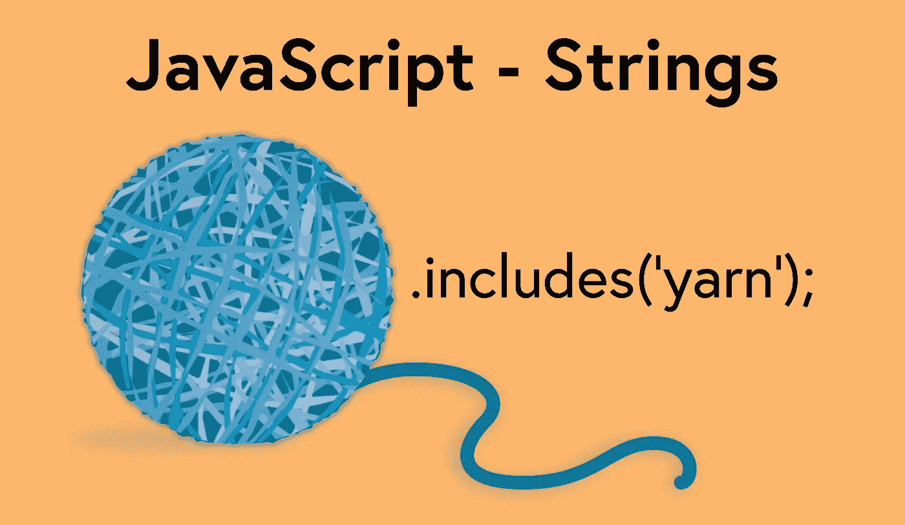

# 如何充分利用 JavaScript 字符串方法

> 原文：<https://javascript.plainenglish.io/javascript-strings-make-the-most-of-string-methods-cbb37b72e7bb?source=collection_archive---------13----------------------->

字符串是 JavaScript 中文本数据的表示，是语言的基础。为用户交互设计的程序几乎总是使用字符串作为关键组件。在 JavaScript 中，[字符串数据类型](https://developer.mozilla.org/en-US/docs/Web/JavaScript/Reference/Global_Objects/String)由 string 对象包装，该对象提供对大量可用于字符串操作的有用方法的访问。



**JavaScript — Strings**

## 创建字符串

创建字符串最常见的方式是使用字符串文字，字符串文字就是用引号、双引号或反勾号括起来的字符串值。还可以使用 string 对象创建一个字符串来包装原始数据。

**字符串文字**

括住的引号或反勾号不能在字符串文字的开头和结尾互换，它们必须相同。

```
'mr. jones';
'hamburger and fries';
`sunday evening newspaper`;
```

**字符串对象**

```
let name = new String('hal hope');
```

以任何一种方式创建的字符串都有许多可用的属性，包括一个`length`属性，字符串的字符可以作为数组的值来访问。

```
let myPlace = 'recording studio';
myPlace.length; // 16
myPlace[5]; // dfor (let i = 0; i < myPlace.length; i++) {
  if (myPlace[i] == 'd') {
    console.log('found letter d');
  }
}
// found letter d
// found letter d
```

## 模板文字

[模板文字](https://developer.mozilla.org/en-US/docs/Web/JavaScript/Reference/Template_literals)是 JavaScript(作为 ES2015 的一部分发布)的一个相当新的特性，允许在字符串中嵌入表达式。要在模板文字中使用表达式，字符串必须用反勾号括起来，并且表达式必须使用下面的语法—`${expression}`—由程序解释。

```
let firstScore = 95;
let secondScore = 87;
let finalResult = `your final grade average is ${
  (firstScore + secondScore) / 2
}.`;
finalResult; // 'your final grade average is 91.'
```

还可以用模板文字创建多行字符串，而不需要显式使用特殊的换行符。

```
let myLocation = `123 Main St.
Washington D.C.
USA`;myLocation; // '123 Main St.\nWashington D.C.\nUSA'
```

## 字符串方法

许多不同的[实例方法](https://developer.mozilla.org/en-US/docs/Web/JavaScript/Reference/Global_Objects/String#instance_methods)可用于 String 对象，并在处理 String 时增加了许多通用性和功能。下面是许多最有用的方法的列表，尽管除此之外还有其他几种方法。

*   [**startsWith**](https://developer.mozilla.org/en-US/docs/Web/JavaScript/Reference/Global_Objects/String/startsWith) —如果字符串以作为参数传递的字符串开始，该方法将返回 true，否则将返回 false。

```
let myPhrase = 'The boat went out to sea, then the boat came back to port.';
myPhrase.startsWith('sea'); // false
myPhrase.startsWith('The'); // true
```

*   [**endsWith**](https://developer.mozilla.org/en-US/docs/Web/JavaScript/Reference/Global_Objects/String/endsWith) —如果字符串以作为参数传递的字符串结束，该方法将返回 true，否则将返回 false。

```
let myPhrase = 'The boat went out to sea, then the boat came back to port.';
myPhrase.startsWith('boat'); // false
myPhrase.startsWith('port.'); // true
```

*   [**包含**](https://developer.mozilla.org/en-US/docs/Web/JavaScript/Reference/Global_Objects/String/includes) —如果字符串包含作为参数传递的字符串，该方法将返回 true，否则将返回 false。

```
let myPhrase = 'The boat went out to sea, then the boat came back to port.';
myPhrase.includes('sea'); // true
```

*   [**indexOf**](https://developer.mozilla.org/en-US/docs/Web/JavaScript/Reference/Global_Objects/String/indexOf) —将返回作为参数传递的字符串的第一个位置的索引号，如果没有找到匹配，则返回`-1`。

```
let myPhrase = 'The boat went out to sea, then the boat came back to port.';
myPhrase.indexOf('boat'); // 4
```

*   **lastIndexOf** —将返回作为参数传递的字符串的最后一个位置的索引号，直到可选的第二个参数的索引位置。如果没有找到匹配，该方法将返回`-1`。

```
let myPhrase = 'The boat went out to sea, then the boat came back to port.';
myPhrase.lastIndexOf('boat'); // 47
```

*   [**concat**](https://developer.mozilla.org/en-US/docs/Web/JavaScript/Reference/Global_Objects/String/concat) —返回添加了一个或多个字符串参数的字符串。

```
let myPhrase = 'The boat went out to sea, then the boat came back to port.';
myPhrase.concat(' The', ' End.'); // 'The boat went out to sea for a while, then the boat came back to port. The End.'
```

*   [**split**](https://developer.mozilla.org/en-US/docs/Web/JavaScript/Reference/Global_Objects/String/split) —如果字符串匹配作为参数传递的字符串，则返回除作为参数传递的字符串值之外的字符串数组。

```
let myPhrase = 'The boat went out to sea, then the boat came back to port.';
myPhrase.split(','); // [ 'The boat went out to sea for a while', ' then the boat came back to port.' ];
```

*   [**slice**](https://developer.mozilla.org/en-US/docs/Web/JavaScript/Reference/Global_Objects/String/slice) —返回一个字符串，从第一个参数的索引值开始，到第二个可选参数的索引值结束。如果没有传递第二个参数，该方法将从第一个参数值的索引位置返回字符串的剩余部分。

```
let myPhrase = 'The boat went out to sea, then the boat came back to port.';
myPhrase.slice(4, 24); // 'boat went out to sea'
```

*   [**子串**](https://developer.mozilla.org/en-US/docs/Web/JavaScript/Reference/Global_Objects/String/substring) —类似于`slice`，它将返回一个从第一个参数的索引值开始，到第二个可选参数的索引值结束的字符串。如果没有传递第二个参数，该方法将从第一个参数值的索引位置返回字符串的剩余部分。

```
let myPhrase = 'The boat went out to sea, then the boat came back to port.';
myPhrase.substring(29); // 'a while, then the boat came back to port.'
```

*   [**substr**](https://developer.mozilla.org/en-US/docs/Web/JavaScript/Reference/Global_Objects/String/substr) —返回从第一个参数的索引位置开始，延伸到第二个可选参数指定长度的字符串。如果没有传递第二个参数，该方法将从第一个参数值的索引位置返回字符串的剩余部分。

```
let myPhrase = 'The boat went out to sea, then the boat came back to port.';
myPhrase.substr(4, 9); // 'boat went'
```

*   [**toLowerCase**](https://developer.mozilla.org/en-US/docs/Web/JavaScript/Reference/Global_Objects/String/toLowerCase) —将返回一个字符串，该字符串的所有字符都是小写的。

```
let myPhrase = 'The boat went out to sea, then the boat came back to port.';
myPhrase.toLowerCase(); // 'the boat went out to sea for a while, then the boat came back to port.'
```

*   [**toUpperCase**](https://developer.mozilla.org/en-US/docs/Web/JavaScript/Reference/Global_Objects/String/toUpperCase) —将返回一个字符串，该字符串的所有字符均为大写。

```
let myPhrase = 'The boat went out to sea, then the boat came back to port.';
myPhrase.toUpperCase(); // 'THE BOAT WENT OUT TO SEA FOR A WHILE, THEN THE BOAT CAME BACK TO PORT.'
```

*   [**trim**](https://developer.mozilla.org/en-US/docs/Web/JavaScript/Reference/Global_Objects/String/Trim) —返回一个去掉了所有开始和结束空格的字符串。

```
let myPhrase = '   boat went out to sea    ';
myPhrase.trim(); // 'boat went out to sea'
```

*   **trimStart** —将返回一个删除了所有开头空格的字符串。

```
let myPhrase = 'The boat went out to sea, then the boat came back to port.';
myPhrase.trimStart(); // 'boat went out to sea    '
```

*   **trimEnd** —将返回一个删除了所有结束空格的字符串。

```
let myPhrase = 'The boat went out to sea, then the boat came back to port.';
myPhrase.trimEnd(); // '   boat went out to sea'
```

*   [**重复**](https://developer.mozilla.org/en-US/docs/Web/JavaScript/Reference/Global_Objects/String/repeat) —将返回一个字符串重复的次数作为 number 参数。

```
let myPhrase = 'the boat came back. ';
myPhrase.repeat(3); // 'the boat came back. the boat came back. the boat came back. '
```

## 组合

这些方法中的一些可以组合使用，并链接在一起，以简化必须单独完成的过程。

```
let myPhrase = 'The boat went out to sea, then the boat came back to port.';
newPhrase = myPhrase
  .slice(myPhrase.indexOf('boat'), myPhrase.lastIndexOf('boat'))
  .trimEnd(); // 'boat went out to sea, then the'
```

## 结论

字符串在 JavaScript 中无处不在，如果能够有效地使用它们，主要是通过使用 JavaScript 中内置的许多方法，在需要执行复杂的字符串操作时，事情会变得容易得多。

*更多内容请看*[***plain English . io***](http://plainenglish.io)