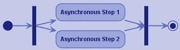
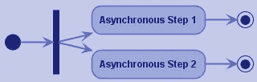
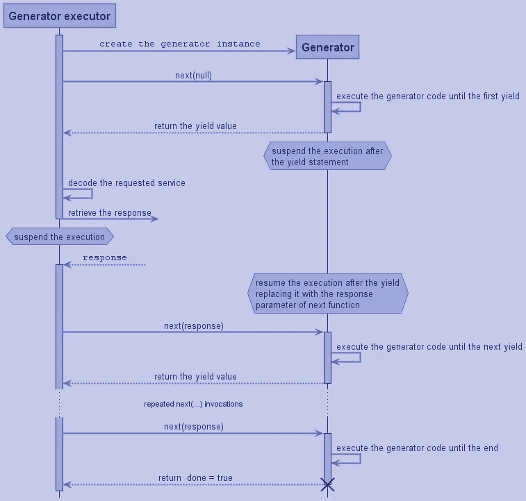
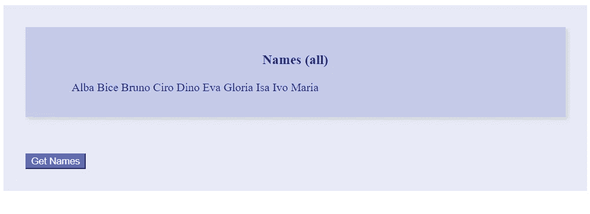

# 异步钩子的 JavaScript 技术

> 原文：<https://javascript.plainenglish.io/javascript-technologies-for-asynchronous-hooks-e603fce414de?source=collection_archive---------17----------------------->


承诺、async/await 语句、生成器是实现改变 React 组件内部状态的异步挂钩的可能技术。

将使用一个简单的应用程序来说明这三种不同的方法，突出每种方法的优点/缺点。

应用程序 UI 的组件层次结构将使用样式组件库来构建。它优雅地解决了将 CSS 集成到 JavaScript 源文件中的问题，同时保留了 CSS 规则的全部潜力。

# 用例

我们正在构建的应用程序将显示一组从字典中随机抽取的个人姓名。

因为目的是描述异步活动的同步，所以名称将通过模拟 rest 调用的*来检索。姓名将根据性别进行过滤。所需的性别也是通过模拟 get 检索的。*

# 异步模式

当 app 模型是一组简单的状态变量时，我们可以说该模型是通过可以预见异步步骤的活动所产生的副作用来更新的。

一些模式描述了组织异步步骤的不同方式。在下文中，我们将只考虑其中的两个:

*   异步步骤序列


*   具有最终同步点的异步步骤的并行开始



可以向每个图案添加额外的步骤。它们也可以通过用模式替换步骤来组成。

其他异步模式也是可能的，比如分叉两个不同的异步步骤。



# 休息得到简单的模拟

现代 JavaScript 中的 rest get 是使用 fetch API 的 Fetch 函数执行的。它返回一个承诺，所以为了模拟它，我们只需要返回一个承诺。

我们感兴趣的是一个简单的模拟，它总是以解码后的 JSON 格式检索正确的结果(没有出错的可能),所以我们可以简单地计算结果并将其作为 promise result 返回。

*承诺执行者*(承诺构造者的函数参数)在解决*承诺*之前暂停执行一秒钟。

在 getNames 函数中，我使用了我在另一个故事中描述过的 shuffle 函数。

根据要求的性别选择的这组名字被随机打乱并切片。因此，检索到的名称集随着每个请求而变化。
由于结果变化很大，因此可以直观地验证代码是否正常工作(见下文)。

具有 fetch 但没有错误处理和取消 management⁴的简单实现如下:

```
const doGet = (url) =>
  fetch(url).then((response) => response.json())const server = 'http://localhost:4000'export const getGender = () => doGet(`${server}/gender`)
export const getNames = 
  (gender) => doGet(`${server}/names?${gender}`)
```

# 检索应用程序模型的方法

应用程序模型的检索，就像烹饪食谱一样，是一系列的步骤。

```
Set the app status in loading modality
Retrieve the gender of names
Set the gender inside the app model
Retrieve the set of names
Set the names inside the app model
Set the app status back to normal
```

像烹饪食谱一样，我们可以用异步步骤和同步的指示来注释这个过程

```
Asynchronous procedure:
  Set the app status in loading modality
  wait 'Retrieve the gender of names'
  Set the gender inside the app model
  wait 'Retrieve the set of names'
  Set the names inside the app model
  Set the app status back to normal
```

声明配方是一个异步过程(带注释的配方的第一行)是很重要的:这样调用者就知道它必须等待响应，如果它对响应感兴趣的话。如果它只对副作用感兴趣，这一声明似乎是无用的。然而，trans piler/interpreter 仍然需要理解他们必须处理内部等待语句。

# 应用模型

app 模型由三个状态变量组成

# 模型检索—异步版本，等待注释

由于使用了 async 和 await 语句，前面配方的 JavaScript 实现是每一步的一对一翻译。
这消除了在它们被引入之前就存在的在普通同步过程和具有异步步骤的过程之间的差异。

从技术上来说， *await* 等待承诺的解析，而 *async* 只是将函数体嵌入到一个承诺中，该承诺通过函数的结果进行解析。

请注意，性别状态变量是在检索姓名之前设置的(第 5、6 行)，因此在等待姓名时，UI 会使用检索到的性别进行更新。

# 模型检索—有承诺的版本

有承诺的版本更难理解，很容易迷失在曲折的过程中。

注意，这个版本并不等同于前一个版本:它应该返回一个承诺(然而在这种情况下应该解析为 null，因为 *retrieveModel* 函数只提供副作用)。

# 异步的优势，等待

除了可读性方面的改进，async/await 符号允许我们关注过程的细节。

例如，很容易为错误处理插入一个清晰的边界。

此外，现在更清楚的是，如果我们已经在运行这个过程，我们必须避免重新运行它(第 3 行)。

# 模型检索-带生成器的版本

带有生成器的版本与带有 async/await 的版本非常相似:注释`async function`被替换为`function*`，注释`await`被替换为`yield`。其余的代码完全相同。

但是这一次，生成器应该明确地运行(第 11 行)。

这似乎是不必要的复杂化。相反，它是对 async/await 解决方案的真正改进。

*发生器*和*发生器执行器*可以**相互通信**。通信可以是**异步的。****通信协议**可由开发者自行设计。

当异步场景变得更加复杂时，这些特性使这个选项成为最佳选择。

通常一个*生成器执行器*提供一组通用服务，可以被*生成器*请求。服务实现的所有复杂性都在*生成器执行器*内部，而*生成器*仍然是简单的顺序过程。

## 生成器和执行器之间的交互

下面的顺序图描述了*发生器*和*发生器执行器*之间的交互。

异步性仅取决于执行者:

*   如果请求的服务需要异步活动，那么生成器和执行器的执行将被挂起，直到检索到响应。
*   如果服务是同步的，生成器和执行器之间的对话只是调用函数的一种复杂方式(这种情况下的优点是一切都在 executor)⁵.内部



## 发电机执行器

我们定义的执行器非常简单，只提供两种服务:

*   等待一个承诺的实现。
*   等待一组承诺的解决方案(在这种情况下，承诺被并行执行*。*

该函数是递归的。

*   第 2 行在第一个递归步骤创建生成器实例:第一次未定义 executorResult，而随后的递归调用总是指定一个结果(第 8 行)
*   第 3 行调用 generator *next* 函数，传递 executor 结果并检索新的生成器值
*   第 4 行是递归的 guard⁶
*   第 5、6、7 行解码所请求的服务
*   第 8 行实现了异步递归步骤

# UI 组件

UI hierarchy⁷由 REACT 元素组成，这些元素使用*样式组件*库进行样式化。这用几行代码就给了 UI 一个漂亮的外观。

第 2-6 行定义了一个 CSS 规则。

样式化组件只是从它们的非样式化(或者部分/不同样式化)版本中派生出来的。例如，第 26–28 行相当于

```
const Title = props =>
  <h1 {...{style: {alignSelf: 'center'}, ...props}}>
    {props.children}
  </h1>
```

第 41 行的 *div* 不能被*片段*替换:需要正确布局内部 *span* 元素。

第 44 行是*保护表达式* ⁶.的惯用用法

最终的用户界面如下所示:



# 异步并行步骤

生成器执行器能够执行并行 REST 请求。可以用下面的生成器测试这种能力。显然，两个查询之间的相关性被破坏了…

第 5 行调用执行程序的*并行承诺*服务。

**参考文献:**

[1]如果应用程序状态是单个复杂对象(或它们的集合)，我们不能简单地修改模型。在这种情况下，我们应该生成包含旧零件和新零件的模型的新版本(参见*使用状态*文档中的*功能更新*部分)。

[2]*resolve*函数可以被认为是一种对承诺的返回声明。

[3]:吉安卡洛·拉达利。2019 年 11 月 27 日。 *Vector shuffling —一个 JavaScript 函数实现* [https://medium . com/swlh/Vector-shuffling-A-JavaScript-functional-implementation-70e 973 C5 b58f](https://medium.com/swlh/vector-shuffling-a-javascript-functional-implementation-70e973c5b58f)

[4]:当一个 REACT 组件被卸载时，清理所有仍在进行的活动是很重要的。可以使用 *AbortController API* 取消待处理的获取请求。

[5]REDUX-saga 库是使用生成器来提供异步任务的过程化描述的最好例子。佐贺副作用创造了 REDUX 商店的新版本。该库还提供了许多同步服务，包括一个从存储中提取信息的服务和一个向存储发送动作的服务。

[6]: JavaScript 提供了定义守卫表达式
`<guard expression> && <guarded expression>` 的可能性，但是我们也可以考虑将*作为*守卫语句* `if (<guard expression>) <guarded statements>`*

[7]在任何语言中，用户界面本质上都是元素的层次结构。

*更多内容看* [***说白了***](https://plainenglish.io/)