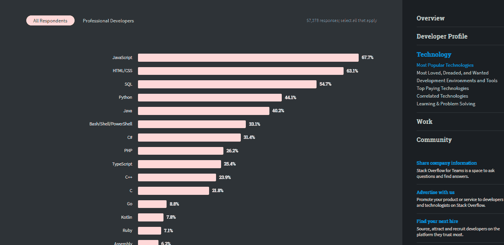
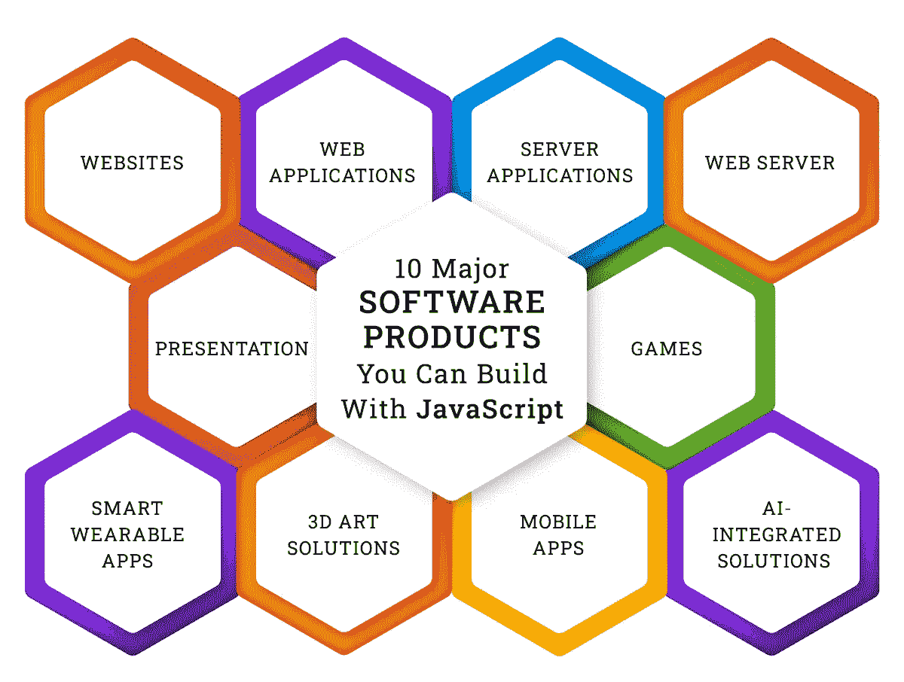

# JavaScript——2021 年商业软件开发的最佳选择

> 原文：<https://javascript.plainenglish.io/javascript-the-best-choice-for-business-software-development-in-2021-d7c1c2391a7e?source=collection_archive---------9----------------------->

## 在 IT 世界可用的编程语言、开发工具和技术栈的海洋中，**为什么企业应该将 JavaScript** 用于软件产品开发？

Image By: Author

> 你如何为任何 IT 项目选择一种编程语言？

像大多数开发人员/IT 顾问一样，您的答案可能会因项目复杂性、预算、时间、可伸缩性、安全性、资源等而异。一样是合理的！但是，我认为选择语言或技术时最关键的决定在于一个简单的问题:

> 哪一个让你做的最多？

我可以给你选择 JavaScript 作为构建软件产品的首选的主要理由(我会的)。但是，你可能会发现自己倾向于这种 26 岁的编程语言(是的！JavaScript 创建于 1995 年),因为它仍然是相关的、流行的，并且经常是开发人员最喜欢的选择。

> JavaScript 是目前交互式 web 开发背后最大的力量
> 
> [**JavaScript 是最受欢迎的技术**](https://insights.stackoverflow.com/survey/2020#technology) ，根据 Stack Overflow 开发者调查 2020
> 
> 截至 2021 年 4 月 [**，大约有 141，916，650 个**](https://trends.builtwith.com/docinfo/traffic/Entire-Internet#:~:text=top%20in%20docinfo%20usage%20distribution%20on%20the%20entire%20internet) 网站使用 JavaScript
> 
> 大多数受 JavaScript 支持的按需解决方案和网站包括谷歌、维基百科、脸书、YouTube、LinkedIn、Twitter、亚马逊和易贝
> 
> 全球近 70%的软件开发人员使用 JavaScript

然而，想一想为什么 JavaScript 在 web 开发中如此流行是明智的。此外，在开始任何项目之前——无论是大项目还是小项目— **,企业为什么要将 JavaScript 视为一个可行的、可靠的、值得信赖的工具呢？**

> 让我们来了解一下！

# JavaScript 将改进您的 Web 和应用解决方案的 10 大理由

> JavaScript 已经成熟了。

这种编程语言有一个成熟的生态系统，一个庞大的社区，出色的包系统，注册表，缓冲区，函数，以及一个容易进入的壁垒。广泛用于 [**web 和 app 开发**](https://www.suntecindia.com/mobile-web-development-services.html) 。它跨软件栈运行——前端和后端。从网站和应用程序到基于浏览器的游戏和服务器应用程序，JavaScript 在 web 开发中的使用各不相同。从 Medium、PayPal、网飞或 Airbnb 的一些流行产品中可以看出它的多功能性，这些产品都是使用全栈 JavaScript 构建的。

JavaScript 在 web 开发中的**重要性**被认为首屈一指。以下特征证明了这一点。

## 1.初学者友好的

JavaScript 最显著的**优势之一是其简单明了的语法。不需要单独的开发环境。您可以使用任何浏览器简单地开始编码和测试。它的概念很简单。此外，在解决问题或理解语言或框架的复杂部分时，广泛的社区支持非常有用。**

## 2.高速发展

JavaScript 开发、执行、测试、调试和整个流程管理是一个快速的循环。性能优化二十年来，解释器和 JIT 编译器支持代码执行、快速代码呈现等。，确保你的 JS 代码运行速度快。JS 还允许并发代码执行，这节省了开发人员的时间。

由于它的历史和社区支持，JavaScript sports 组织了文档和信息，可以在线访问。在许多情况下，它还加快了发展速度。

## 3.提高效率的通用语言

简单、可靠、有洞察力的全栈开发是 JavaScript 最好的原因。这种编程语言让你通过单一的语法编写每一段代码。

尽管 JS 的组件很多，但是使用这种语言是一个保留合适人才的问题。 [**雇佣节点。Js 开发者**](https://www.suntecindia.com/hire-nodejs-developers.html) 或者外包给一个 [**ReactJS 开发公司**](https://www.suntecindia.com/reactjs-development-services.html) 然后坐以待毙。JavaScript 的灵活性及其全栈功能将允许这些团队通过连接系统创建解决方案，同时减少任何额外的成本或工作投入。

## 4.可重用代码

JavaScript 允许大量的代码重用。您可以共享部分代码，构建可重用的组件库，以及将类似的代码片段用于常见的逻辑实现，等等。您可以将可能需要多次使用的代码保存到用户定义的函数中。必要时，您还可以创建和共享例程。

## 5.高性能

在 JavaScript 中，可以用多种方式编写一个函数。一旦掌握了这种编程语言，它就为创建高效的操作、优化性能和减少时间提供了无限的可能性。

还有，**为什么 JavaScript 在 web 开发中这么受欢迎**？因为它支持所有浏览器，并为每种浏览器创建了几乎相同的结果。

## 6.开源工具集

大多数 JavaScript 开发工具、库、组件、模块和文档都是免费的。它们中的大多数作为开源项目与语言一起发展，并且可以很容易地使用。

## 7.功能丰富的界面

> **JavaScript 是做什么用的？**

JS 的第一个用途是自动化网络交互。目前，它是用于编写交互式 web 流程的标准工具。虽然您可以使用 JavaScript 构建复杂的多层 web 解决方案，但是这个框架允许您设计迷人的界面，从而在很大程度上简化使用。

## 8.一个大社区

超过 26 年的历史赋予了 JavaScript 一个丰富而广泛的开发人员、设计人员、测试人员和用户社区。JavaScript 框架还与大多数最新的软件项目深度集成，这不仅保持了社区的活力，还确保了它在未来时代的相关性。

## 9.安全解决方案

**JavaScript 主要是一种嵌入式的高级解释语言。JavaScript 在 web 浏览器中的主要用途是创建动态网页、扩展功能和确保交互性。**

选择 JavaScript 作为构建软件产品的首选的**主要原因之一**是它对提高安全性、评估漏洞和调试的不懈关注。

## 10.难以置信的潜力

JavaScript 一直在发展。不仅仅是框架或库，语言也随着时间不断变化和改进。有一大批开发人员正在尝试使用 JavaScript 来提高效率和解决更多问题。巨大的贡献，加上兼容性更新和容量增强，已经将 JavaScript 变成了一个可能性的宝库。

但是，在这个博客的后面会有更多的内容！

# JavaScript 框架由什么组成

当构建软件产品时，选择 JavaScript 作为第一选择的一个主要原因是它的多功能生态系统。看看 JavaScript 中的主要框架及其最大优势。

## 1.反应堆

React 于 2003 年推出，目前被认为是最著名的 JavaScript 框架之一，主要是因为它的本机开发能力。除了脸书的支持，React 还提供了许多优势。

*   简单的组件编写
*   可重用的系统组件资产
*   更快的渲染
*   饱和环境
*   下行数据流
*   稳定码
*   对移动开发做出本地反应

像苹果、网飞和贝宝这样的领先组织使用反应。此外，这个 JavaScript 框架非常适合 SPA 开发、小型企业软件产品和跨平台解决方案。

## 2.AngularJS

AngularJS 是大规模 web 应用程序开发的一个好选择，它提供了实践、工具、模板和多功能性的独特组合。它结合了用户界面和业务逻辑，促进了有效的跨平台开发，并提供了快速渲染。

> 其显著特点包括:

*   双向数据绑定
*   角度 CLI 和工具集
*   谷歌支持
*   易于遵循的代码结构
*   依赖注入
*   惰性加载模块
*   材料设计库

尽管它的学习曲线有些陡峭，但 AngularJS 为许多 spa、pwa 和企业软件提供动力。

## 3.Vue。射流研究…

Vue。JS 是一个动态框架，用于为 SPAs 提供强大的 ui。它运动丰富的文档，并结合最好的角度 JS 和反应 JS，以建立一个功能性但重量轻的系统。

Vue。JS 对故障是通用的。它是灵活的，使用一个专用的反应性工具来缩短开发时间，并支持可重用性和代码清晰性。这个开发者友好的框架也很容易被采用，具有令人印象深刻的生态系统和集成能力。

## 4.NodeJS

NodeJS 被认为是 JavaScript 世界中最令人兴奋的部分。它用于各种各样的开发项目，包括实时网络应用程序、聊天程序、API、协作工具、虚拟仿真器、流应用程序、多人游戏应用程序等。

基于 V8 引擎，NodeJS 是 JavaScript 的主要框架之一。通过大量的在线教程和文档，学习起来相对容易。它促进了更快的上市时间(对于初创公司来说，这是一个无价的特性)，产生了可以大大减少开发时间的轻量级解决方案，并提供了出色的实时响应。

NodeJS 解决方案可以轻松扩展。这是一个成熟的工具集，被网飞和易贝使用，并且有一个活跃的社区来支持它的开发和开发者。

Image By: Author

# JavaScript 仍然相关吗？它未来会站在哪里？

现在，JavaScript 无处不在。它已经超越了前端和后端工具，发展成为桌面、跨平台和混合开发。

## 是什么让这成为可能？

> 尖端功能
> 
> 夏普 V8 JS 发动机
> 
> 高度优化的代码
> 
> 高可扩展性
> 
> 一个活跃的大社区
> 
> 国际监测的演变

如果 JavaScript 继续沿着当前缓慢但稳定且经过深思熟虑的发展道路前进，它将很好地保持其相关性和重要性。现在，这里是你和我在不久的将来对 JavaScript 的期望。(如果你打算 [**为 JS 项目雇佣 ReactJS 开发者**](https://www.suntecindia.com/hire-reactjs-developers.html)/[/**AngularJS 开发服务**](https://www.suntecindia.com/angularjs-development-services.html) ，请注意。)

## 1.JavaScript 语言

自从 ECMA(欧洲计算机制造商协会)规定 ECMAScript 的年度发布周期以来，我们已经看到越来越多的人采用 ES5 可编译语言，如 TypeScript。

WebAssembly 改变了这一点。

这个可移植的编译目标机器可以在浏览器中以其本地速度运行任何编程语言。而且，它很可能很快转向类型语言。

## 2.前端框架

现在，React 是 JavaScript 前端框架市场上最大的游戏规则改变者，这归功于它的虚拟 DOM。但是，我们可能正在寻找它的继任者-苗条。或者说，苗条 3.0。

这个编译器框架为创建高效的 JS 代码掀起了浪潮。现在，在其 3.0 版本中，它引入了真正的反应式编程。它将使用拓扑顺序执行代码。

这是 JavaScript 生态系统中值得期待的新事物。

## 3.原生 ES6 支持

在过去的几年里，web 开发人员相信 Babel.js 能够访问最新的 ECMAScript 特性。但是，现在 Babel.js 正慢慢被挤出舞台，为平台内语言支持腾出更多空间。

ES6 (ECMAScript6)正在寻求更好的支持，我们也在寻求更有趣的基于浏览器的 web 应用开发。

## 4.服务器端 JavaScript

Ryan Dahl——最初的 NodeJs、Deno 和 TypeScript 开发人员——正致力于改进 Deno，以促进更好的性能、更高的安全性和显式的基于权限的代码执行。

实施后，这一升级将增加开发者对平台的信任，并允许我们更确定地运行不安全的代码。

# 但是，JavaScript 的未来会怎样呢？

这种编程语言，全栈技术——随你怎么称呼它——已经存在了超过 25 年。它持续了。繁荣，甚至！

> 那么，**企业为什么要看 JavaScript？**

这是你的答案。在我们之前的几年里，这是相关的，在今后几年里，这种情况很可能会继续下去。

> 但是，下一个十年呢？二十年后的 JavaScript 会是什么样子？

目前没有足够的趋势、事实或数据来自信地预测任何事情。科技正在向未知的海洋全面爆发。但是，如果我们进行推测，在 JS 的遥远未来可能会有一些令人兴奋的事情值得期待。

> 机器学习支持
> 
> 混合功能性和反应性方法
> 
> 脑机接口(虽然这一个过于雄心勃勃)

然而，JavaScript 永不过时的能力使其成为商业软件开发的首选。

# JavaScript 支持业务开发&它会一直存在下去

我已经说得很清楚了——如果你还在问为什么企业应该关注 JavaScript，那你就错过了。

但是，如果你让我总结一下**为什么 JavaScript 在 web 开发中如此受欢迎**或者**为什么公司使用 JavaScript** ，这里我会提供。

*   这是未来的语言
*   提供卓越的用户体验
*   它提供了一个愉快的开发旅程
*   快速、可扩展且简单
*   漂亮的界面
*   更快上市
*   一直在进化

所以，如果你还没有开始学习 JavaScript，那就开始吧。 [**如果你自己缺乏资源，就雇佣印度软件开发商**](https://www.suntecindia.com/hire-dedicated-developers.html) 。外包给意思是，MERN，角形，或[或**节点。Js 开发公司**](https://www.suntecindia.com/nodejs-development-services.html) 如果你觉得框架很混乱。或者在网上查找资源，开始动手学习之旅。

**祝 JavaScript 好运。**

*更多内容请看*[*plain English . io*](http://plainenglish.io/)