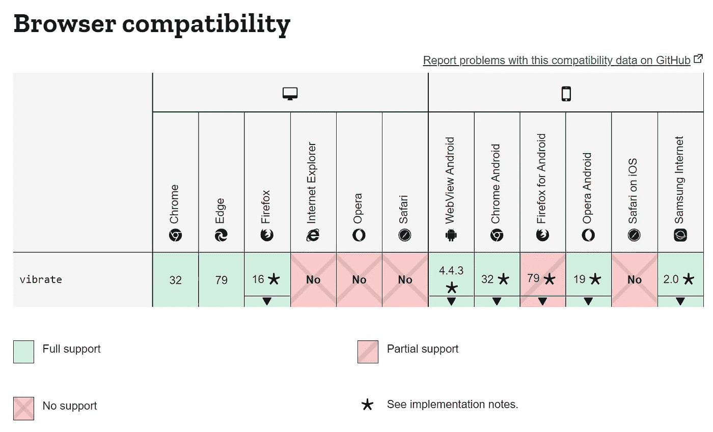

# 使用 vibrate() API 让用户注意移动设备上的关键动作

> 原文：<https://javascript.plainenglish.io/javascript-the-vibrate-api-28ecc224a70b?source=collection_archive---------21----------------------->

## 通过在 web 应用程序中振动移动设备来吸引用户的注意力

## 使用这个 API 来获得用户对移动设备上关键操作的注意。


如何让用户注意到移动设备上的关键动作？想象一下重置表单的取消按钮或删除按钮。当务之急是强调数据丢失继续采取行动。

轻轻振动设备会无意中抓住用户的注意力。确保窃听是故意的。

原生应用已经多次使用该功能。web 应用怎么样？navigator 对象有一个 API， *vibrate()，*，它发送单个脉冲或模式来振动设备。如果振动成功，该功能返回 *true* 。如果失败，它返回*假*。考虑下面的代码片段。

```
1\. if(navigator.vibrate){2\.  // vibrate duration is 300 milliseconds
3\.  navigator.vibrate(300);4\.  // Sends a series of pulses
5\.  // navigator.vibrate([300, 80, 100, 80, 500, 80, 1000]);
6\. }
```

注意第 3 行。它振动设备一次，持续 300 毫秒。另一方面，参见第 5 行，它发送一系列脉冲来振动设备。每一个替代值都会暂停振动几毫秒。在这个例子中，移动设备振动 300 毫秒，停止 80 毫秒，再振动 100 毫秒，停止 80 毫秒，等等。

# 浏览器支持

请参见下图中支持振动功能的浏览器。大多数现代浏览器都支持这一功能。但是，注意 iOS 上的 Safari 还不支持。考虑到大量用户可能使用 iPhones 和 iPads，这是个坏消息。(iPadOS 上的 Safari 也不支持)。



> 注意，震动需要浏览器和设备都支持。例如，用于计算机(台式机/笔记本电脑)的 google Chrome 支持 API。然而，硬件可能不存在。在这种情况下， *vibrate()* 函数返回 *false* 。

# 参考

Navigator.vibrate()上的 MDN Web Docs—[*https://developer . Mozilla . org/en-US/Docs/Web/API/Navigator/vibrate*](https://developer.mozilla.org/en-US/docs/Web/API/Navigator/vibrate)

*更多内容请看*[*plain English . io*](http://plainenglish.io/)*。报名参加我们的* [*免费每周简讯*](http://newsletter.plainenglish.io/) *。在我们的* [*社区不和谐*](https://discord.gg/GtDtUAvyhW) *获得独家获得写作机会和建议。*