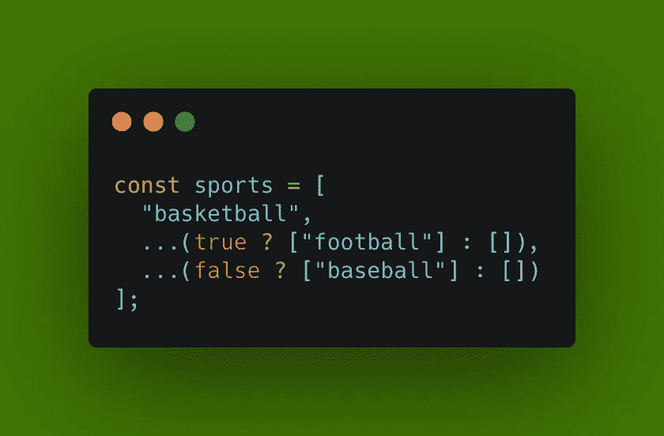
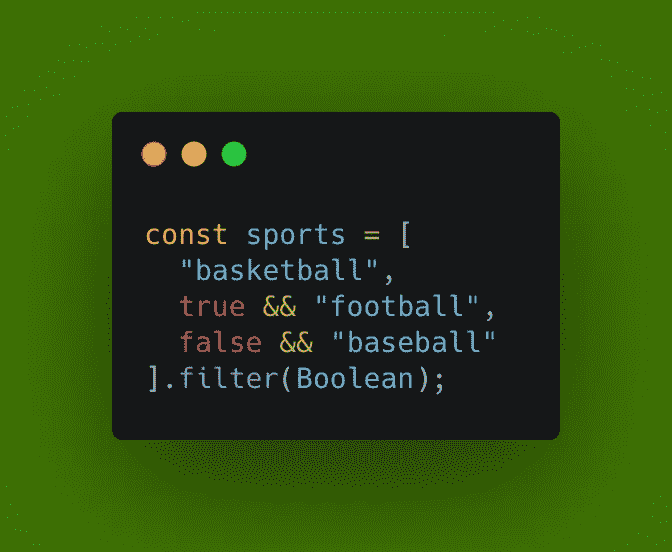

# JavaScript 提示:有条件地向数组中添加一个项目

> 原文：<https://javascript.plainenglish.io/javascript-tip-conditionally-add-an-item-to-an-array-5877a9d7c88b?source=collection_archive---------0----------------------->

## 使用扩展语法和条件三元运算符


Photo by [Neetu Laddha](https://unsplash.com/@neetuladdha83?utm_source=medium&utm_medium=referral) on [Unsplash](https://unsplash.com?utm_source=medium&utm_medium=referral)

在我的编程生涯中，我学到了一件事，那就是凡事都有解决方案。

在编码的时候，我经常遇到新的问题，我需要多动动脑筋，使用谷歌搜索的力量。

在这一系列文章中，我将介绍用 JavaScript 编码时遇到的一些问题的解决方案。

我们要研究的第一个问题是如何有条件地向数组中添加一个元素。

# 问题

在下面的例子中，我有一系列的运动。有一个条件是 truthy，意思是我要把“*足球”*加入数组；还有一个条件是 falsy，这意味着我不想将*【棒球】*添加到数组中。

```
const sports = [
  "basketball", 
  trueCondition && "football", 
  falseCondition && "baseball"
];
```

我最初的想法是像上面一样使用逻辑 AND (&&)操作符。这是可行的，但问题是*“baseball”*项会变成 false，而不是被删除。这将产生下面的数组。

```
*["basketball", "football", false]*
```

# 解决办法

有几种方法可以解决这个问题，但我找到的最好的方法是下面的解决方案。



[Link to GitHub Gist](https://gist.github.com/chadmuro/16409d7b556013f974aae2f463307902)

该解决方案将产生以下数组。

```
*["basketball", "football"]*
```

## 为什么会这样

为了理解为什么这样做，我们需要首先理解 JavaScript 中的两个概念:条件三元运算符和 spread 语法。

**条件(三元)运算符**

条件三元运算符的用法类似于 if-else 语句。它需要三个操作数:

后跟`?`的条件。如果条件为 the，后跟一个`:`时要执行的表达式。以及条件为 falsy 时要执行的表达式。

```
condition ? expressionIfTrue : expressionIfFalse
```

回到我们的例子，我们可以看到三元操作符的作用。因为第一个条件是 truthy，所以这个项会执行第一个表达式， *["football"]* 。因为第二个条件是 falsy，所以这个条目会执行第二个表达式， *[]* ，一个空数组。

```
trueCondition ? ["football"] : [] *// will become ["football"]*falseCondition ? ["baseball"] : [] *// will become []*
```

**展开语法(…)**

spread 语法允许扩展可迭代表达式。如果我们在一个数组上使用 spread 语法，数组中的项将被展开。

```
...[1, 2, 3] *// will become 1, 2, 3*
```

回到我们的例子，我们可以看到 spread 语法在起作用。第一项被展开，所以它不是一个包含字符串的数组，而只是一个字符串。在第二个项目中，我们扩展了一个空数组，结果什么也没有。

```
...["football"] // will become *"football"*...[] // *will become nothing*
```

现在我们可以看到这个解决方案是如何工作的，以及为什么将*【football】*添加到数组中，而不添加*【baseball】*。

# 可选择的解决方案

这个问题还有另外一个解决方法。



[Link to GitHub Gist](https://gist.github.com/chadmuro/6b5416d3557429837677df648616d155)

我们可以使用我们第一次尝试的逻辑 AND (&&)操作符，并在数组末尾调用 filter 方法传入*布尔值*。

这种解决方案的一个缺点是，如果要添加到数组中的项是虚假项，即使条件为真，它也将从数组中删除。

# 结论

感谢阅读！当我遇到其他问题时，我计划写更多像这样的 JavaScript 快速技巧。敬请关注更多即将到来的！

**更多阅读**

[](/doubly-linked-lists-with-javascript-9c20a9dc4fb3) [## 使用 JavaScript 的双向链表

### JavaScript 数据结构系列的第 4 部分

javascript.plainenglish.io](/doubly-linked-lists-with-javascript-9c20a9dc4fb3) 

*更多内容尽在*[***plain English . io***](http://plainenglish.io/)