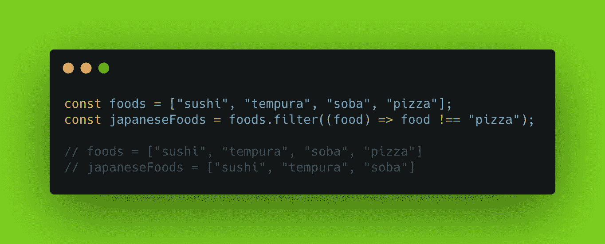

# JavaScript 提示:使用 Filter 方法从数组中移除一个项

> 原文：<https://javascript.plainenglish.io/javascript-tip-remove-an-item-from-an-array-using-the-filter-method-249b2c720e02?source=collection_archive---------11----------------------->

## 探索过滤方法和拼接方法之间的差异


Photo by [Tyler Nix](https://unsplash.com/@jtylernix?utm_source=medium&utm_medium=referral) on [Unsplash](https://unsplash.com?utm_source=medium&utm_medium=referral)

在过去的一周里，我发现自己多次犯同样的错误。这不是一个大错误，我很快就意识到了错误。但是，为了继续我作为开发人员的进步，我决定写这篇文章。

我总是发现，如果我写一个主题，它会帮助我真正理解它是如何工作的。

在本文中，我们将了解如何在 JavaScript 中使用`**filter()**`方法从数组中移除一个项目。

# 我的错误

我有一个项目数组，我想从数组中移除一个项目。然后我想使用数组中剩余的项目。但是，我也不想改变原来的数组。我采用的方法是使用`**indexOf()**`和`**splice()**`方法。

结合使用这两种方法是找到一个项并将其从数组中移除的一种方法。

`**indexOf()**`方法返回给定元素在数组中的第一个索引，如果不存在，则返回-1。

`**splice()**`方法通过移除或替换现有元素和/或添加新元素来改变数组的内容。

我的第一个想法是做一些类似下面的代码示例的事情。这里我有一个`foods`的数组。我想创建一个没有*“pizza”*的新的`japaneseFoods`数组。

```
const foods = ["sushi", "tempura", "soba", "pizza"];const index = foods.indexOf("pizza");
const japaneseFoods = foods.splice(index);
```

问题是拼接方法修改了原始数组。此外，它返回已删除的项目，而不是剩余的项目。

```
*// foods = ["sushi", "tempura", "soba"]
// japaneseFoods = ["pizza"]*
```

相反，我不希望原始数组被改变。我还希望新数组是剩余项目的数组。我想让数组看起来像这样。

```
*// foods = ["sushi", "tempura", "soba", "pizza]
// japaneseFoods = ["sushi", "tempura", "soba"]*
```

# 解决方案

我没有使用`**indexOf()**`和`**splice()**`方法，而是使用了`**filter()**`方法。

`**filter()**`方法创建一个新数组，其中所有元素都通过了由提供的函数实现的测试。



使用`**filter()**`方法，`foods`数组不会发生变异。同样，新的`japaneseFoods`数组将包含不等于*“pizza”*的所有项目。

## 它是如何工作的

`**filter()**`方法接受回调函数的一个必需参数。它还接受一个可选参数来设置回调函数中的`this`值。但是，我还没有找到这方面的实际使用案例。

回调函数参数针对数组中的每一项运行。如果该项通过测试，它将被保存在新数组中。否则，将不会添加该项目。如果没有项目通过测试，将返回一个空数组。

回调函数接受三个参数:

*   **元素** —数组中当前正在处理的项目。
*   **index(可选)** —数组中正在处理的当前项目的索引。
*   **数组(可选)** —数组`filter`被调用。

在我们的示例中，我们创建了一个函数来检查每一项是否都不等于字符串*“pizza”*。这将返回一个 true 或 false 值，该值将决定该项是否被添加到新数组中。

```
(food) => food !== "pizza"
```

因为*【寿司】**【天妇罗】**【荞麦面】*不等于*【披萨】*，所以会返回 true，加入新数组。因为*【披萨】*等于*【披萨】*，所以会返回 false，而不会被添加到新数组中。

# 结论

感谢阅读！`**filter()**`方法是数组对象上最简便的方法之一。正如我们在本文中看到的，它对于从数组中移除项目非常有用。我在这里展示了一个基本的例子，但是`**filter()**`方法也可以处理更复杂的用例。你可以在这里阅读更多关于它的信息。

查看下面的文章，了解另一个 JavaScript 技巧。

[](/javascript-tip-conditionally-add-an-item-to-an-array-5877a9d7c88b) [## JavaScript 提示:有条件地向数组中添加一个项目

### 使用扩展语法和条件三元运算符

javascript.plainenglish.io](/javascript-tip-conditionally-add-an-item-to-an-array-5877a9d7c88b) 

资源

*   [MDN Web Docs — indexOf()](https://developer.mozilla.org/en-US/docs/Web/JavaScript/Reference/Global_Objects/Array/indexOf)
*   [MDN Web Docs — splice()](https://developer.mozilla.org/en-US/docs/Web/JavaScript/Reference/Global_Objects/Array/splice)
*   [MDN Web Docs — filter()](https://developer.mozilla.org/en-US/docs/Web/JavaScript/Reference/Global_Objects/Array/filter)

*更多内容看*[***plain English . io***](http://plainenglish.io/)