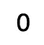

# JavaScript 提示:为什么对 Array.length 使用逻辑 AND (&&)运算符时会呈现“0”

> 原文：<https://javascript.plainenglish.io/javascript-tip-why-0-is-rendered-when-using-the-logical-and-operator-with-array-length-aae24d05c9d7?source=collection_archive---------0----------------------->

## 了解短路评估的工作原理。


Photo by [TJ Arnold](https://unsplash.com/@missinformed?utm_source=medium&utm_medium=referral) on [Unsplash](https://unsplash.com?utm_source=medium&utm_medium=referral)

前几天，我在用 JavaScript 和 React 编码时遇到了一个有趣的问题。

我有一系列物品。如果数组中有条目，我想呈现一个字符串通知用户有条目。如果数组中没有项目，我不想渲染任何东西。

因此，我在 React 中使用了逻辑 AND (&&)操作符。在我看来，如果数组是空的，那么屏幕上不会显示任何内容，因为数组的长度是 0，这是一个假值。

```
{items.length && "There are items"}
```

然而，当项目列表为空时，我看到一个`0`呈现在屏幕上。

在本文中，我们将通过理解逻辑 AND (&&)操作符在 JavaScript 中如何工作，以及如何使用它在 React 中有条件地呈现组件，来了解为什么会发生这种情况。

# 问题

为了重现这个问题，我在下面创建了一个简单的例子。我有一个基本的反应功能组件。在这个组件中，我创建了一个项目数组。如果数组中有条目，我将把字符串`There are items`呈现到屏幕上。

```
export default function App() {
  const items = ["item1", "item2", "item3"];
  return (
    <div className="App">
      <div>{items.length && "There are items"}</div>
    </div>
  );
}
```

因为数组中有条目，字符串，`There are items`被呈现到屏幕上。


但是，如果我从数组中移除项目，我将看到数字，`0`呈现在屏幕上。预期的行为是不呈现任何内容。



## 为什么会这样

在本例中，我们使用 JavaScript 中的逻辑 AND (&&)运算符有条件地呈现字符串。为了理解为什么我们会看到一个`0`，让我们来看看这个操作符是如何工作的。

## 逻辑与(&&)

如果您熟悉 JavaScript，我相信您以前可能见过或使用过逻辑 AND (&&)运算符。根据 MDN 网络文档，

> 一组操作数的逻辑 AND ( `&&`)运算符(逻辑合取)当且仅当其所有操作数为真时为真。它通常与`Boolean`(逻辑)值一起使用。当它为时，它返回一个布尔值。然而，`&&`操作符实际上是返回一个指定操作数的值，所以如果这个操作符与非布尔值一起使用，它将返回一个非布尔值。

基本上，它的工作原理是，如果第一个表达式被转换成`true`，它将返回第二个表达式。例如，如果`items.length`等于 3，将返回字符串，`There are items`。这是因为 3 是一个真值。

```
// items.length === 3
{items.length && "There are items"}
// will return "There are items"
```

## 短路评估

逻辑 AND (&&)运算符从左到右计算。使用以下规则测试可能的“短路”评估:

`(some falsy expression) && expr`是对 falsy 表达式的短路评估。

这意味着如果第一个表达式被转换成一个 falsy 值，它将返回 falsy 值。例如，如果`items.length`等于 0(一个假值)，将返回数字`0`。

```
// items.length === 0
{items.length && "There are items"}
// will return 0
```

这就是为什么我们在例子中看到一个`0`渲染到屏幕上的原因。

# 解决办法

要解决这个问题，您可以简单地让第一个表达式总是返回一个布尔值。通过使用`>`操作符可以实现这一点。

```
{items.length > 0 && "There are items"}
```

## 为什么会这样

通过使用`items.length > 0`，当条目数组为空时，我们返回 false。

将第一个表达式转换为布尔值的另一种方法是使用(！！)运算符。

```
{!!items.length && "There are items"}
```

您可能知道，逻辑 NOT(！)运算符将返回`false`如果一个表达式可以转换为`true`；否则将返回`true`。通过使用两个(！！)如果一个表达式可以转换成`true`，它将返回`true`；否则将返回`false`。

例如，如果`items.length === 0`，`!items.length`将被评估为`true`，因此`!!items.length`将被评估为`false`。

因为第一个表达式现在是一个布尔值，我们将得到我们想要的预期行为。

# 结论

感谢阅读！我希望这篇文章有助于您理解逻辑 AND (&&)操作符在 JavaScript 中的工作方式。

找到解决问题的方法总是一种很棒的感觉。但是首先理解问题发生的原因可以帮助您成长为一名开发人员，并防止它在将来再次发生。

查看下面更多的 JavaScript 技巧。

[](/javascript-tip-conditionally-add-an-item-to-an-array-5877a9d7c88b) [## JavaScript 提示:有条件地向数组中添加一个项目

### 使用扩展语法和条件三元运算符

javascript.plainenglish.io](/javascript-tip-conditionally-add-an-item-to-an-array-5877a9d7c88b) [](/javascript-tip-remove-an-item-from-an-array-using-the-filter-method-249b2c720e02) [## JavaScript 提示:使用 Filter 方法从数组中移除一个项

### 探究 JavaScript 中过滤方法和拼接方法的区别。

javascript.plainenglish.io](/javascript-tip-remove-an-item-from-an-array-using-the-filter-method-249b2c720e02) 

*更多内容请看*[***plain English . io***](http://plainenglish.io/)