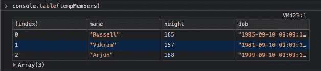
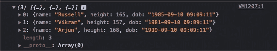
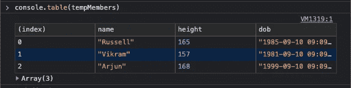
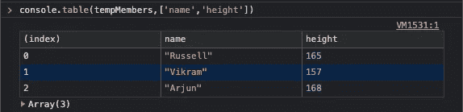
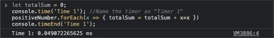
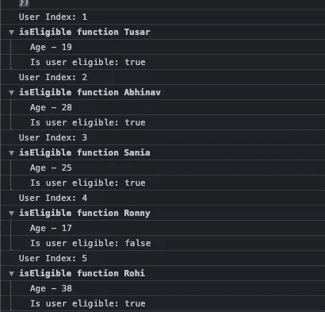

# 更好地利用 JavaScript 控制台的 3 种方法

> 原文：<https://javascript.plainenglish.io/javascript-tips-3-ways-to-use-the-console-in-a-better-way-49c95d008080?source=collection_archive---------9----------------------->


Photo by [Arnold Francisca](https://unsplash.com/@clark_fransa?utm_source=medium&utm_medium=referral) on [Unsplash](https://unsplash.com?utm_source=medium&utm_medium=referral)

我们将看到使用控制台的不同方式，这将有助于我们轻松地调试代码。

我们将介绍以下功能的使用:

1.  console.table()
2.  console.time()和 console.timeEnd()
3.  console.group()

让我们开始吧。

# 控制台.表格

在制作 web 应用程序时，我们必须处理各种类型的数据结构，其中我们最喜欢的是数组。在调试时，我们经常使用 console.log()在控制台面板上打印数组，这样做是可行的，但是很难找到任何特定的行和正确的对象。

```
// Consider an Array tempMembers
var tempMembers = [
  {
    "name": "Russell",
    "height": 165,
    "dob": "1985-09-10 09:09:11"
  },
  {
    "name": "Vikram",
    "height": 157,
    "dob": "1981-09-10 09:09:11"
  },
  {
    "name": "Arjun",
    "height": 168,
    "dob": "1999-09-10 09:09:11"
  }
]
```

使用`console.log(tempMembers)`的结果:



带`console.table(tempMembers)`:



我们可以通过传递第二个参数来控制希望在控制台上打印的列，第二个参数是列名的数组。



# 控制台.时间和控制台.时间结束

随着变量大小的增加，应用程序也变得缓慢。我们经常希望找出代码执行的时间，这里有一个方法可以帮助我们。

假设我们想计算 50 年前所有正数的平方和。

```
// Consider a array positiveNumber = [1,2,3,4,5,.......50]let totalSum = 0;
console.time('Time 1'); //Name the timer as "Timer 1"
positiveNumber.forEach(x => { totalSum = totalSum + x*x })
console.timeEnd('Time 1');
```



请注意，时间可能不会每次都相同，因为这取决于您的浏览器正在进行的其他后台进程

# 控制台.组

有太多的控制台会激怒我们，在调试代码时，我们总是希望把所有彼此相关的控制台日志放在一起。

就像我们想把一个功能的控制台组合在一起。

```
// Consider a array of usersusers = [
  {
    "name": "Tusar",
    "age": 19,
    "city": "Varanasi"
  },
  {
    "name": "Abhinav",
    "age": 28,
    "city": "Delhi"
  },
  {
    "name": "Sania",
    "age": 25,
    "city": "Mumbai"
  },
  {
    "name": "Ronny",
    "age": 17,
    "city": "Bhopal"
  },
  {
    "name": "Rohi",
    "age": 38,
    "city": "Bhopal"
  }
]function isEligible(user) {
    console.group("isEligible function "+ user['name'])
    console.log("Age - " + user['age'])
    console.log("Is user eligible: " + (user['age'] > 18))
    console.groupEnd("isEligible function "+ user['name'])
}
users.forEach((user,index) => {
    console.log("User Index: "+ (index + 1));
    isEligible(user)
})
```



# 结论

我希望你已经发现这是有用的。感谢您的阅读。

*如果你想了解更多关于游戏机的信息，你可以参考这个* [*链接*](https://developer.mozilla.org/en-US/docs/Web/API/console) *。*

*更多内容请看*[*plain English . io*](http://plainenglish.io/)