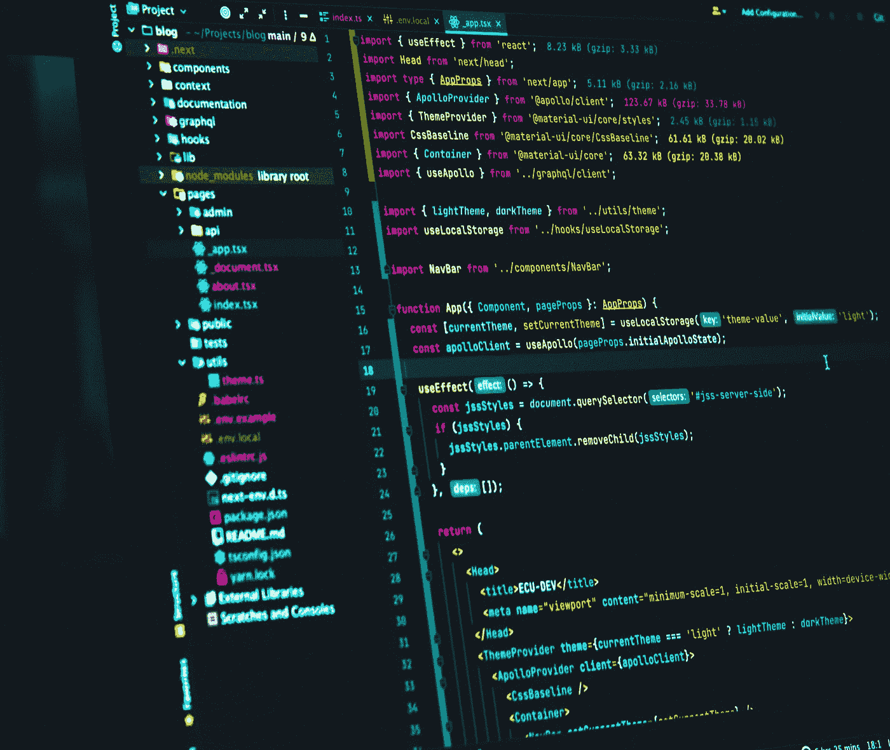
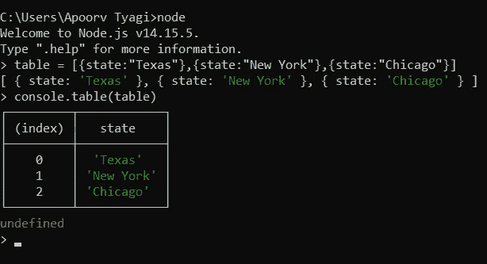

# 我受益匪浅的 10 个 JavaScript 技巧、诀窍和最佳实践

> 原文：<https://javascript.plainenglish.io/javascript-tips-and-best-practices-928b2987ccfa?source=collection_archive---------11----------------------->



在本文中，我将分享 10 个 JavaScript 技巧、诀窍和最佳实践，它们是我遵循并发现有用的。

# 1.使用数字分隔符

当我必须处理大量数字时，这是最常用的运算符之一。当在数字中使用分隔符(只有一个 _)时，它看起来比没有分隔符的数字更好。

例如:

```
let number = 98234567
```

去⬇

```
let number = 98_234_567
```

它也适用于任何其他数字基数:

```
const binary = 0b1000_0101;
const hex = 0x12_34_56_78;
```

**少数警告**:

*   不允许一行中有多个下划线`let num= 100__00`
*   前导 0 `let num= 0_1`后不能使用
*   不允许出现在数字文字的末尾`let num= 100_`

# 2.总是使用分号

使用分号作为行终止符是一个很好的做法。如果您忘记了它，不会得到警告，因为在大多数情况下，它将由 JavaScript 解析器插入，但是不鼓励依赖自动分号插入(ASI)。

这甚至包括在谷歌的、 [Airbnb 的](https://github.com/airbnb/javascript#semicolons)和 [jQuery 的](https://contribute.jquery.org/style-guide/js/#semicolons) Javascript 风格指南中。

想知道如果我们过度依赖 ASI 会发生什么，看看几个月前我分享的第 4 期时事通讯。在上一节中，我已经用一个例子解释过了。

# 3.不要忘记“var”

当你第一次给一个变量赋值时，一定要确保你没有给一个未声明的变量赋值。

对未声明的变量赋值会自动导致创建全局变量。**避免全局变量** ❌

全局变量很容易被其他脚本覆盖。例如，如果一个应用程序的两个独立部分用相同的名称但不同的目的定义了全局变量，它可能导致不可预测的错误，调试这样的问题将是一种可怕的体验。

一般来说，您应该尝试限定代码的范围，以使您在全局范围内需要的东西尽可能少。您在脚本中使用的全局变量越多，您在另一个脚本中使用它的机会就越少。

正常情况下，函数中的变量应该是局部变量，这样当你退出函数时，它们就会消失。

> *“通过将你的全球足迹减少到一个名字，你大大减少了与其他应用程序、小工具或库的不良交互的机会。”—道格拉斯·克洛克福特*

# 4.删除 vs 拼接

使用 splice 而不是 delete 从数组中移除项目。使用 delete 将删除 object 属性，但不会重新索引数组或更新其长度。这使得它看起来好像是未定义的。

# 删除

```
> myArray = ['a', 'b', 'c', 'd']
  ["a", "b", "c", "d"]
> delete myArray[0]
  true
> myArray[0]
  undefined
```

*注意，它实际上并没有设置为 undefined 值，而是从数组中删除了属性，使其看起来没有定义。Chrome dev 工具通过在记录数组时打印空来明确这种区别。*

# 接合

实际上删除元素，重新索引数组，并改变它的长度。

```
> myArray = ['a', 'b', 'c', 'd']
  ["a", "b", "c", "d"]
> myArray.splice(0, 2)
  ["a", "b"]
> myArray
  ["c", "d"]
```

*应该使用 delete 方法来删除对象属性。*

# 5.映射 vs for 循环

使用 map()函数方法遍历数组中的项

```
var squares = [1,2,3,4].map(function (val) {  
    return val * val;  
});// squares will be equal to [1, 4, 9, 16]
```

**不变性** —原始数组将不受影响。在其他地方仍然需要原始阵列的情况下，这有潜在的好处。For 循环也可以写成不更新原来的数组，但是它需要更多的代码，并且在循环操作中更新我们的新数组。另一方面，map()保持了这种简洁，因为您只需在一个范围内工作，就能保持不变性

**更简洁的代码** —在做同样的事情时，map 几乎总是可以用比 for 更少的代码编写。有时它可以清楚地写在一行中，而 for 需要至少两行或一般三行，包括大括号。此外，作用域隔离和所需变量数量的减少以及规模的减小都使得代码客观上更加整洁。

# 6.舍入数字

toFixed()方法将一个数字舍入到指定的小数位数。

```
var pi =3.1415;
pi = pi.toFixed(2);  // pi will be equal to 3.14
```

*注意:* `*toFixed()*` *返回一个字符串而不是一个数字。*

# 7.使用控制台.表格

您可以使用`console.table`以表格格式显示对象:

```
table=[{state: "Texas"},{state: "New York"},{state: "Chicago"}]
console.table(table)
```



# 8.避免在循环中使用 try-catch

每次执行 catch 子句时，try-catch 构造都会在运行时在当前范围内创建一个新变量，其中捕获的异常对象被分配给一个变量。

```
var object = ['foo', 'bar'], i;  
for (i = 0, len = object.length; i <len; i++) {  
    try {  
        // do something that throws an exception 
    }  
    catch (e) {   
        // handle exception  
    } 
}
```

去⬇

```
var object = ['foo', 'bar'], i;  
try { 
    for (i = 0, len = object.length; i <len; i++) {  
        // do something that throws an exception 
    } 
} 
catch (e) {   
    // handle exception  
}
```

当一个错误发生时，第一个让你继续循环，而第二个退出循环。**如果你的代码抛出的异常没有严重到足以暂停你的整个程序，那么第一种方法是合适的**。

# 9.多重条件检查

对于多值匹配，我们可以将所有值放在一个数组中，并使用`indexOf()`或`includes()`方法。

```
if (value === 1 || value === 'one' || value === 2 || value === 'two') {}
```

去⬇

# indexOf():

```
if ([1, 'one', 2, 'two'].indexOf(value) >= 0) {}
```

# 包括():

```
if ([1, 'one', 2, 'two'].includes(value)) {}
```

# 10.双非按位运算符(~~)

double NOT 位运算符是 Math.floor()方法的替代。

```
const floor = Math.floor(6.8); // 6
```

去⬇

```
const floor = ~~6.8; // 6
```

*双非按位运算符方法仅适用于 32 位整数。所以对于任何高于这个数的数，建议使用 Math.floor()*

# 结论

我知道还有许多其他的技巧、诀窍和最佳实践，所以如果你有任何要补充的，或者如果你对我分享的有任何反馈或纠正，请在下面的评论中随意添加。

此外，你永远无法从一篇文章中学到什么。尝试 Google concepts，阅读多篇文章，通过做项目来玩代码，这是你学习的唯一途径。

这是我的最后一条建议——不要使用随意的编码风格。执行标准

当阅读具有随机编码风格的代码时，你永远不知道会发生什么。整个团队和应用程序代码库需要相同的编码风格。这有助于提高代码的可读性。

感谢阅读。:))

# 参考

*   modernweb.com/45-javascript-tips-tricks-pra..
*   【stackoverflow.com/questions/2485423/is-usin.. 
*   [stackoverflow.com/questions/32844818/why-i-..](https://stackoverflow.com/questions/32844818/why-i-need-to-avoid-using-try-catch-finally-inside-a-loop)
*   [rocha.la/JavaScript-bitwise-operators-in-pr..](http://rocha.la/JavaScript-bitwise-operators-in-practice)
*   由[胡安乔·哈拉米略](https://unsplash.com/@juanjodev02)在 Unsplash 上拍摄的封面照片

*更多内容请看*[***plain English . io***](http://plainenglish.io/)