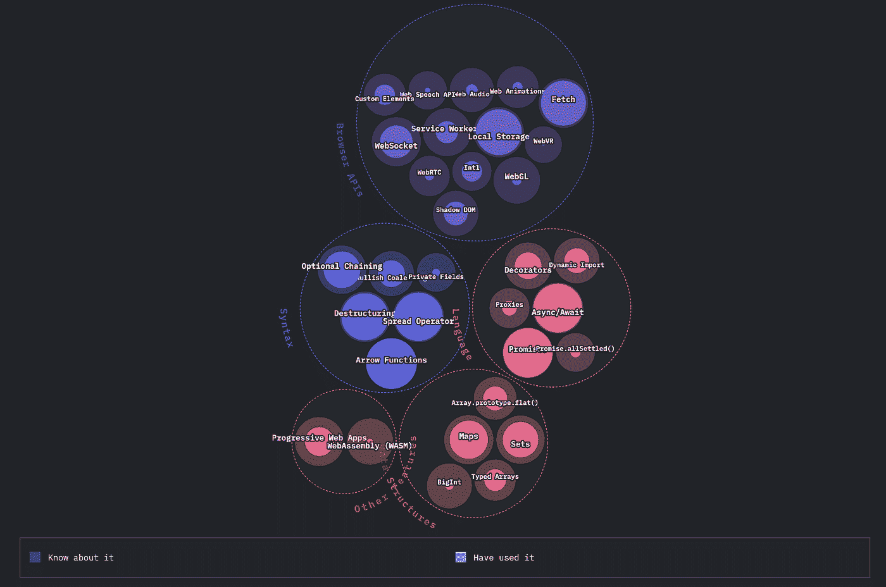
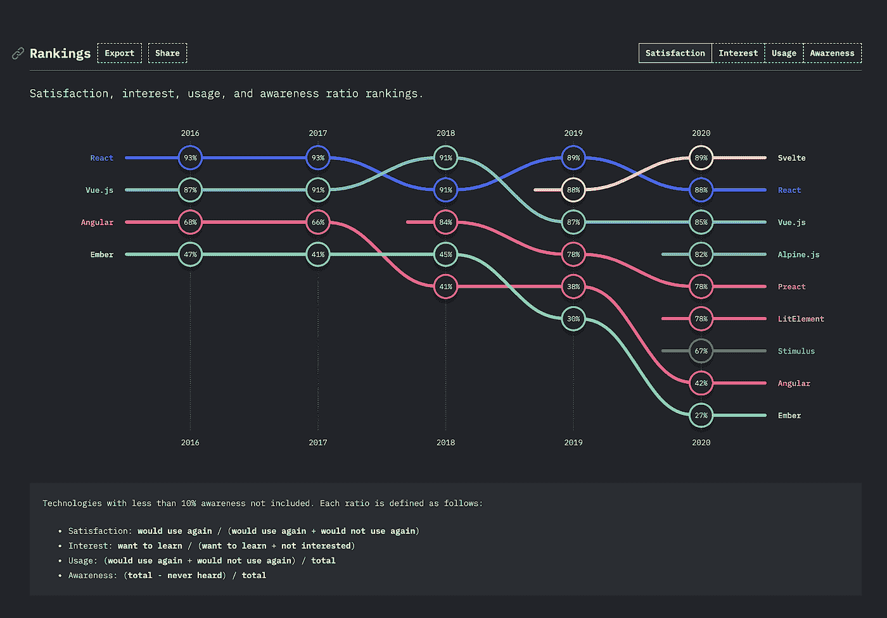
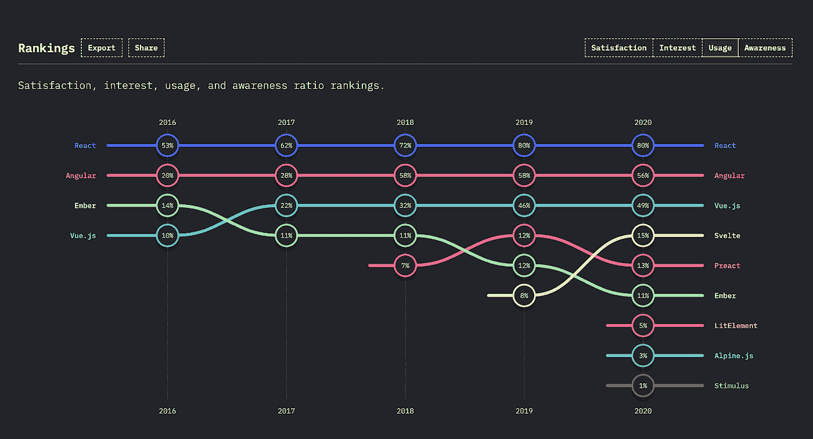
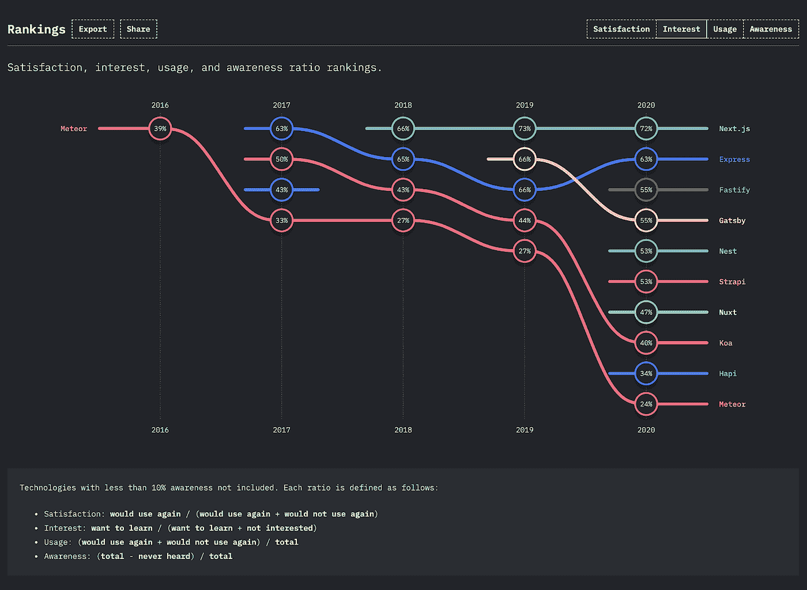
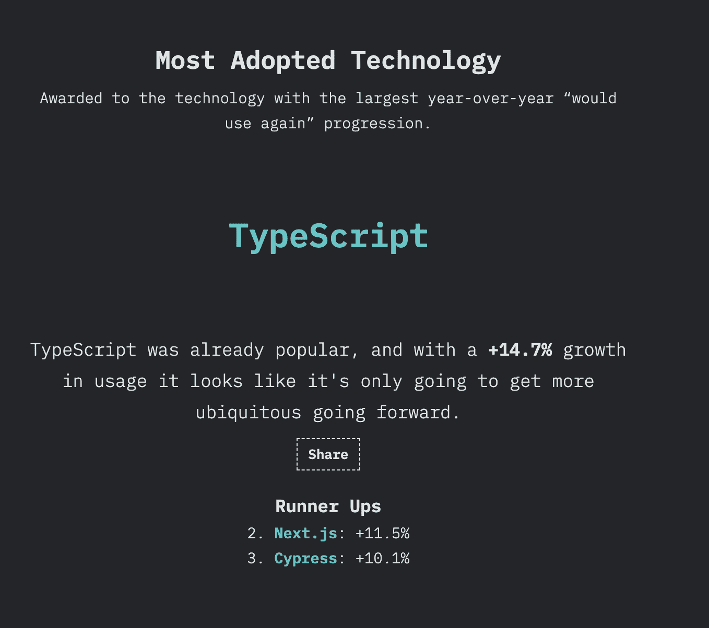
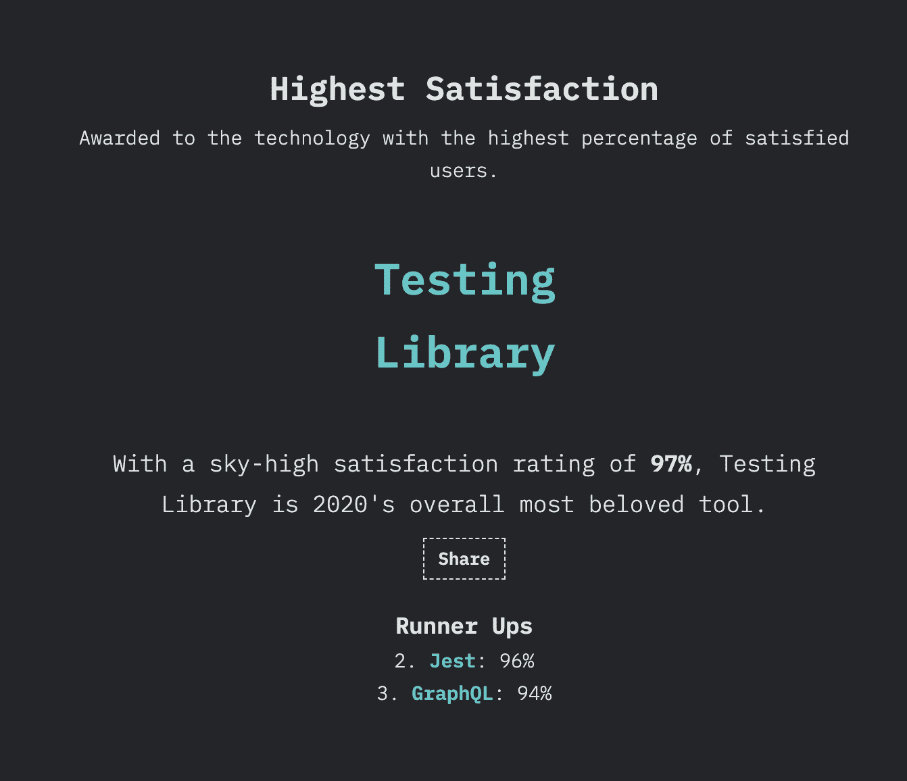
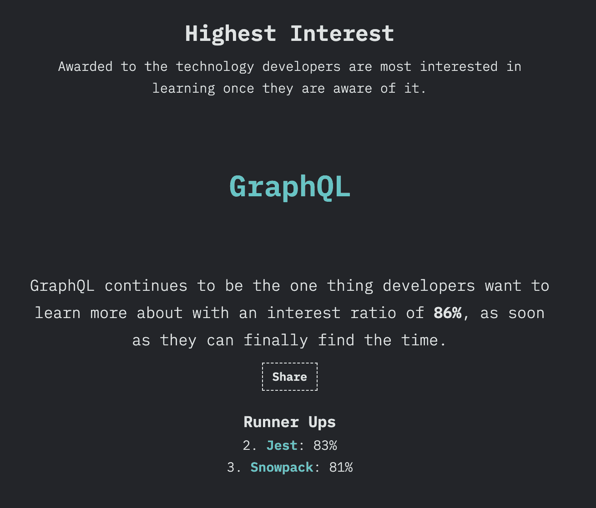
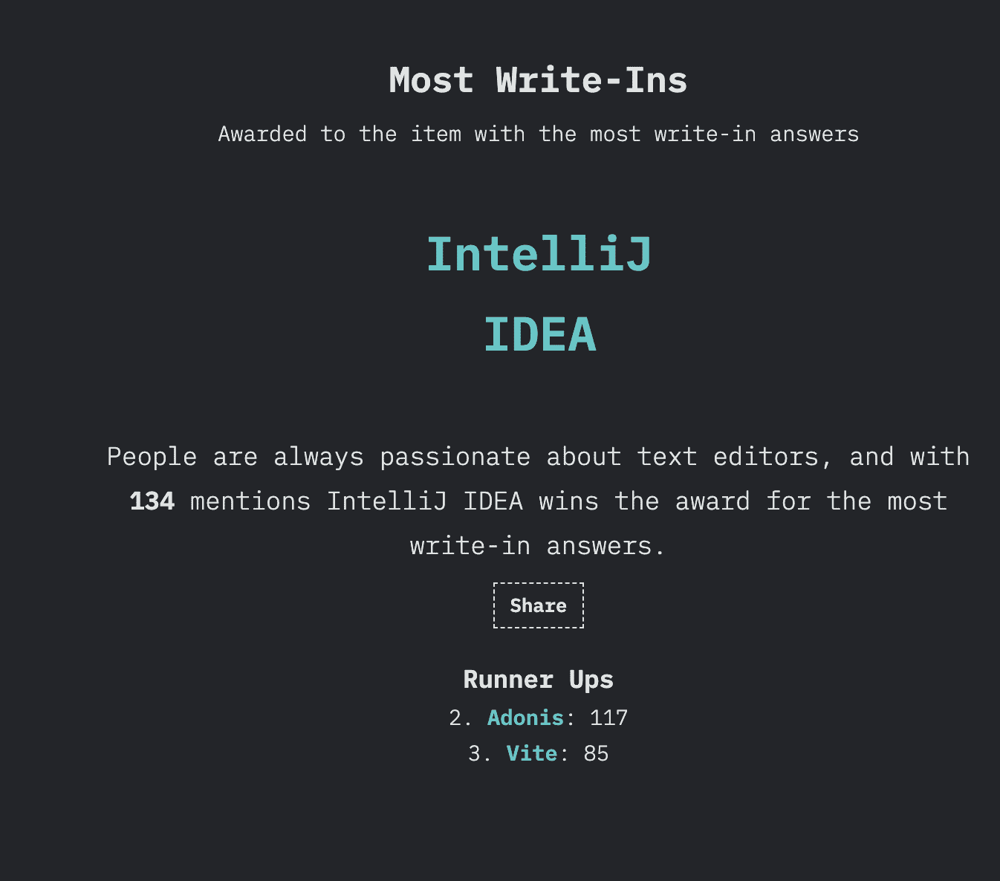

# 2021 年我们可以期待的 JavaScript 趋势

> 原文：<https://javascript.plainenglish.io/javascript-trends-we-can-expect-in-2021-9dfeefe02ef4?source=collection_archive---------7----------------------->

## JavaScript 中有哪些著名的，哪些不著名？

Photo by [Ariel](https://unsplash.com/@arielbesagar?utm_source=medium&utm_medium=referral) on [Unsplash](https://unsplash.com?utm_source=medium&utm_medium=referral)

JavaScript 2020 的**状态最期待的结果于 2021 年 1 月 14 日公布。这项调查在 137 个国家的 23，765 名开发人员中进行。该调查包括人们对 JavaScript 特性、技术、工具等的使用和看法。让我们讨论一下本次调查结果中引起我注意的几个话题。**

# **使用概述**

## 1.浏览器 API

当你考虑最常用的浏览器 API 时，它们是“获取”和“本地存储”。人们最熟悉但从未使用过的功能是“网络语音”、“网络 GL”和“网络动画”

## 2.句法

许多功能似乎在这一类别中很有名。几乎每个人都知道以下是什么，他们也经常使用它们——“可选链接”、“析构”、“扩展运算符”和“箭头函数”。这些是引入的一些新奇的新特性，看起来这已经在许多开发者的心中占据了一席之地。

## 3.语言

从 JavaScript 词汇表来看，async/await 和 promises 是最常用的功能，也是广为人知的功能。我是说，没有承诺我们该怎么办？

## 4.数据结构

JavaScript 中最常用的数据结构是映射和集合。我确信这也适用于其他语言。其中，尽管知道 BigInt 是什么，但使用最少的数据结构是 BigInt。因为我们的需要，我们很少使用它。

## 5.其他功能

进步的网络应用似乎也获得了很多关注。渐进式 Web 应用程序是一种有用的设计模式，尽管它们不是正式的标准。

# **前端框架排名**

## 基于满意度

## 基于使用

在过去的一年里，苗条的人似乎对很多事情感兴趣。虽然对这个新的 JavaScript 框架的认识似乎有点低，但许多人认为 Svele 非常有趣。在满意度和兴趣方面，它在 JS 框架列表中名列前茅。

**React** 以最大认知度和最大使用率高居榜首。就满意度而言，它做得还不错，在兴趣方面排名第三。它肯定是一个稳定的 JavaScript 框架，不会很快离开排行榜。

另一方面，Ember 在“兴趣”、“使用情况”和“满意度”方面的得分似乎在下降。尽管许多人似乎意识到了这个框架，但这个框架在图表上肯定是衰落了。

# **后端框架排名**

## 基于兴趣

在满意度和兴趣方面，Next.js 似乎是最高的。这是一个相当新的框架，似乎正在获得动力。在使用和认知方面，它位居第二。肯定是一个有趣的框架，你必须知道。

位于这个图表之上的下一个后端框架是 **Express** 。ExpressJS 是一个稳定的框架，在认知度和使用率方面都名列前茅。就满意度和兴趣而言，它占据了第二位。

# **奖项**

以下是调查中突出的功能列表

## 最常采用的技术

## 最高满意度

## 最高利息

## 大多数非推荐者

# **结论**

JavaScript 2020 的现状让我们意识到，我们也渴望新的东西，但我们也坚持旧的强大而稳定的功能。注定要持续的才会持续。如果你想了解更多这方面的内容，可以查看他们的官方页面。我确信 2021 年将会同样具有挑战性和令人兴奋，让我们尽情享受 JavaScript 吧。:)

# 参考

 [## JS 2020 的状态

### 尽管 2020 年很糟糕，JavaScript 作为一个整体仍然设法向前发展。正如语言本身所保持的…

2020.stateofjs.com](https://2020.stateofjs.com/en-US/) 

*查看更多内容请点击*[***plain English . io***](https://plainenglish.io/)