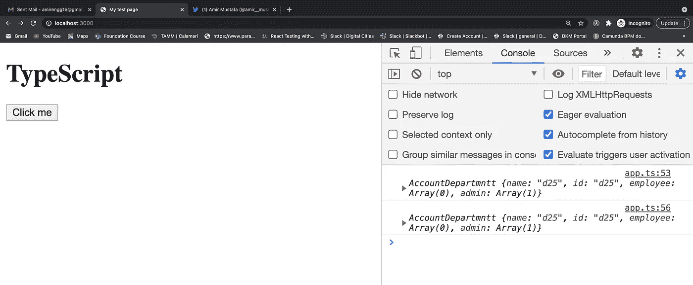

# JavaScript-Typescript 设计模式:单例和私有构造函数

> 原文：<https://javascript.plainenglish.io/javascript-typescript-design-patterns-singleton-and-private-constructors-1da7e268be95?source=collection_archive---------11----------------------->

# **什么是独生子女？**


Singleton 的核心是一个**设计模式**，它**将**一个类的实例化限制为**一个对象**。通常，**目标是管理全局应用程序状态。**一些示例使用单例作为 web 应用程序的配置设置源，在客户端使用 API 键启动任何东西(例如，您通常**不想冒险发送多个分析跟踪调用)，并在客户端 web 应用程序的内存中存储数据(例如，在 Flux 中存储)。**

对于消费代码来说，单例应该是**不可变的**，并且应该不会有实例化多个单例的危险。

*注意:有些情况下，单例可能是不好的，而事实上，它们总是不好的。关于这方面的讨论，你可以看看这篇关于这个主题的文章* *。*

让我们看看不同场景的例子:

a .类型脚本和私有构造函数

→因为 singleton 的目的是**只创建一个实例。Typescript 具有访问修饰符概念(即私有、公共和受保护)。**

→因此，我们可以创建一个私有构造函数并在类内部创建一个实例，而不是在外部创建实例

**注意:**在 JavaScript 中，我们只有一个 **public** 修饰符。因此，我们将在类型脚本方法之后看到一种不同的方法

例如。

```
// BASE CLASS
class **Department** { protected employee: string[] = []; constructor(public name: string, protected id: string) { this.name = name; } **describe**() { console.**log**(` DEPARTMENT: ${this.name} ID: ${this.id} `); }}// CHILD CLASS:
class **AccountDepartment** extends **Department** { admin: string []; **private static instance: AccountDepartment**; // initialize a static variable // Cannot be accessed from outside the class
  **private constructor**(id: string, admin: string[]) { super(id, 'Account'); this.admin = admin; this.id = id; } // Always return the same instance
   static **getInstance** () { if(**AccountDepartment**.instance) { // i.e. classname.variable return this.instance; } return this.instance = new **AccountDepartmntt**('d25', ['Max']); }}*// So here only once instance is used - despite calling multiple times*const account = **AccountDepartmntt**.**getInstance**();console.**log**(account);const account2 = **AccountDepartmntt**.**getInstance**();console.**log**(account2);*// const accountingDepartmenttAC = new AccountDepartmntt('d12', ['Rana']);*
```



Getting same o/p for different instance

**b. JavaScript:用 JS 创建单例的老方法**

用 JavaScript 编写 singleton 的老方法包括利用闭包和 IIFE。下面是我们如何用老方法为一个假设的 Flux 实现编写一个(非常简单的)存储:

```
var UserStore = (function(){
  var _data = [];

  function add(item){
    _data.push(item);
  }

  function get(id){
    return _data.find((d) => {
      return d.id === id;
    });
  }

  return {
    add: add,
    get: get
  };
}());
```

当解释该代码时，`UserStore`将被设置为该**life(立即调用的函数)** — **的结果，该对象公开两个函数，但不授权对数据集合的直接访问。**

然而，这段代码比它需要的更冗长，并且也没有给我们提供我们在使用单例时所希望的不变性。稍后执行的代码可以修改任何一个公开的函数，甚至可以一起重新定义`UserStore`。此外，修改/违规代码可能在任何地方！如果我们由于对`UsersStore`的意外修改而发现了 bug，那么在一个更大的项目中追踪它们可能会非常令人沮丧。

正如本·切里在[的这篇文章](http://www.adequatelygood.com/JavaScript-Module-Pattern-In-Depth.html)中所指出的，你可以采取更高级的措施来减轻这些负面影响。(他的目标是创建模块，这些模块恰好是单例的，但模式是相同的。)但是这些给代码增加了不必要的复杂性，同时仍然不能得到我们想要的东西。

**c. ES6 现代 JavaScript 方式:**

→通过利用 ES6 的特性，主要是模块和新的`const`变量声明，我们不仅可以用更简洁的方式编写单例，还可以更好地满足我们的需求。

让我们从最基本的实现开始。下面是对上述例子的(更清晰、更强大的)现代解释:

```
const _data = [];

const UserStore = {
  add: item => _data.push(item),
  get: id => _data.find(d => d.id === id)
}

Object.freeze(UserStore);
export default UserStore;
```

→由于我们使用了 [**Object.freeze**](https://developer.mozilla.org/en-US/docs/Web/JavaScript/Reference/Global_Objects/Object/freeze) ()，它的方法不能改变，也不能给它添加新的方法或属性。

→我们把`UserStore`变成了一个对象文字。大多数时候，使用对象文字是最易读、最简洁的选择。然而，有时候你可能想利用传统课程的优势。例如，不断变化的商店都有许多相同的基本功能。利用传统的面向对象继承是在保持代码干燥的同时获得重复功能的一种方式。

如果我们想利用 ES6 类，实现看起来会是这样的:

```
class UserStore {
  constructor(){
    this._data = [];
  }

  add(item){
    this._data.push(item);
  }

  get(id){
    return this._data.find(d => d.id === id);
  }
}

const instance = new UserStore();
Object.freeze(instance);

export default instance;
```

Eg2:变得更加冗长:

```
class UserStore {
  constructor(){
   if(! UserStore.instance){
     this._data = [];
     UserStore.instance = this;
   }

   return UserStore.instance;
  }

 //rest is the same code as preceding example

}

const instance = new UserStore();
Object.freeze(instance);

export default instance;
```

# 结束语:

毫无疑问，许多开发人员已经在 JavaScript 中使用旧的单例/模块模式很多年了，他们发现这种模式非常适合他们。尽管如此，因为寻找更好的做事方法对开发人员来说是如此重要，希望我们能看到像这样更干净、更容易理解的模式获得越来越多的关注。尤其是当利用 ES6+功能变得越来越容易和普遍的时候。

这种模式是我在使用 Typescript 实现类时实现的。主要目标是创建单个实例。

> 谢谢你一直坚持到最后🙌。如果你喜欢这篇文章，或者学到了新的东西，请点击下面的分享按钮来支持我，与更多的人联系，和/或在 [*Twitter*](https://twitter.com/amir__mustafa) *上关注我，看看我在那里学到和分享的其他技巧、文章和东西。*

*更多内容看* [***说白了。报名参加我们的***](http://plainenglish.io/) **[***免费周报***](http://newsletter.plainenglish.io/) *。在我们的* [***社区不和谐***](https://discord.gg/GtDtUAvyhW) *获得独家获取写作机会和建议。***