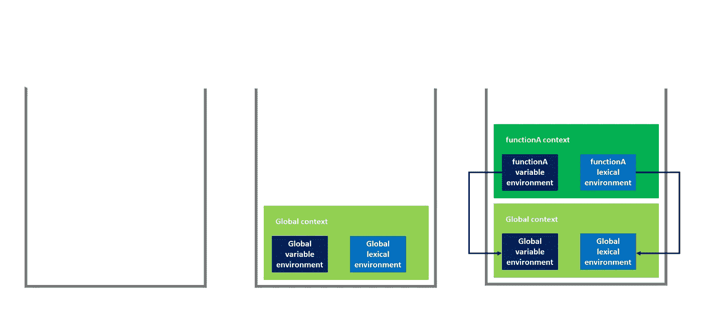

# 引擎盖下的 JavaScript:对作用域和闭包的全面审视

> 原文：<https://javascript.plainenglish.io/javascript-under-the-hood-a-comprehensive-look-at-scope-and-closure-9ccfb1bfbfb7?source=collection_archive---------10----------------------->

## 理解 JavaScript 如何执行代码，以掌握语言的细微差别，比如作用域和闭包。

Photo by [Mark Duffel](https://unsplash.com/@2mduffel?utm_source=medium&utm_medium=referral) on [Unsplash](https://unsplash.com?utm_source=medium&utm_medium=referral)

随着我更多地使用 JavaScript，我意识到我经常查找和记忆一些东西，比如哪些变量在我当前的范围内可用，以及适用于`var`、`let`和`const`关键词的不同规则。

然后我对*感到好奇，为什么*的事情会以这样的方式运行，以及将所有这些规则结合在一起的潜在机制是什么。

所以我决定深入兔子洞，学习更多关于 JavaScript 如何在幕后工作的知识。本文总结了我所学到的概念，比如执行上下文、执行堆栈和词法环境，它们帮助我理解了变量和函数声明存储在哪里，以及在运行时如何访问它们。

除了觉得这很有趣之外，它还帮助我更好地理解了我的 JavaScript 代码是如何执行的。我发现记住用于运行代码的底层机制比记住变量作用域的显式规则要容易得多。

# JavaScript 是什么？

当我们说 JavaScript 时，我们通常指的是编程语言。编程语言是由其规范定义的。我们通常简单说“JavaScript”所指的具体规范是 ECMAScript 2015，简称 ES6。如果你好奇，你可以在这里找到这个具体的规格:[https://262.ecma-international.org/6.0/](https://262.ecma-international.org/6.0/)

该规范定义了一种语言应该如何表现，但是它没有规定如何实现。

所以规范会告诉你这种语言的语法是什么样的，当你执行用这种语法写的代码时会发生什么。但是规范只是一个书面文档，它并不执行代码。它只指定执行的预期结果。

实际获取并运行代码的东西叫做 JavaScript 引擎。这是一个执行 JavaScript 代码的计算机程序。现在有许多不同的 JavaScript 引擎在使用。他们可以选择以不同的方式实现规范中期望的行为(例如，使用不同的数据结构)，但是他们都应该生成规范中定义的相同的期望输出。

今天最流行的 JavaScript 引擎是 V8，它被用于 Chromium 浏览器和 node . js:[https://v8.dev/](https://v8.dev/)

但是本文的目标不是探索执行引擎的具体实现。相反，它将指导您了解规范如何定义数据应该存储在内存中，以及一些简单的方法来实现这一点。

# 执行上下文

执行上下文是一种结构，JavaScript 在其中存储运行代码所需的一切。它包括变量名和值、函数定义和需要执行的实际指令。它是你的执行引擎寻找变量值和函数定义的地方。

通常有两种类型的执行上下文:全局执行上下文和函数执行上下文。

全局执行上下文是在每个 JavaScript 程序开始执行时创建的。当一个程序被执行时，只有一个全局执行上下文，它包含所有的全局变量和函数。

另一方面，你可以有多个函数上下文。每次执行一个函数时，都会创建一个新的执行上下文。它包含运行该函数所需的所有信息，如源代码、参数和局部变量。

当程序执行时，执行上下文被放在执行堆栈上。

# 执行堆栈

执行堆栈跟踪程序中的执行上下文。

当一个程序开始运行时，一个全局执行上下文被创建并放在堆栈上。所有代码都在这个全局执行上下文中执行，直到第一个函数调用发生。

每当调用一个函数时，就会创建一个新的执行上下文，并放在堆栈的顶部。从那时起，代码在这个执行上下文中执行。当一个函数完成执行时，它的执行上下文从堆栈中移除(弹出),我们返回到先前的上下文。

虽然在执行堆栈上可以有多个执行上下文，但是当前只能有一个上下文在执行代码。这是栈顶的执行上下文(你最近添加的那个)。这个执行上下文被称为运行执行上下文

让我们看一个简单的例子。在下面的代码片段中，有两个函数:`functionA`和`functionB`。它们都是在全局上下文中声明的，并且都是从全局中一个接一个地调用的。

当我们执行代码时，全局执行上下文被推送到执行堆栈，它是初始运行的执行上下文。

当调用`functionA`时，它的执行上下文被添加到堆栈中，并成为调用期间的运行执行上下文。当`functionA`完成执行时，它从堆栈中弹出，全局上下文再次成为运行的执行上下文。

同样的事情也发生在`functionA`之后的`functionB`身上。

States of the execution stack when calling functions from the global context.

如果从另一个函数调用另一个函数呢？在下面的例子中，`functionB`被声明并从`functionA`中调用。

在这种情况下，`functionB`的执行上下文将被添加到执行堆栈上`functionA`的执行上下文之上。一旦`functionB`完成执行，执行引擎将返回执行`functionA`的剩余部分。

States of the execution stack when calling one frunction from within the other.

注意，执行堆栈不受声明`functionB`的位置的影响。如果我们在全局上下文中声明`functionB`并从`functionA`内部调用它，那么将函数放入执行堆栈的顺序将是相同的。

但是街区呢？如果新的执行上下文只是为函数创建的，那么有些变量和函数怎么可能只在一个块中可见而在整个上下文中不可见呢？用`var`关键字创建的变量与用`const`或`let`定义的变量的行为有什么不同呢？

理解这一点需要我们仔细看看标识符是如何存储在执行上下文中的。

# 词汇环境和可变环境

标识符只是我们在代码中给变量、函数或函数参数取的名字。执行上下文中有一些特殊的结构，用于存储上下文中声明的标识符(以及对它们的值的引用)。它们被称为词汇环境和变量环境。

变量环境存储所有使用`var`关键字创建的标识符。每个执行上下文都有一个可变的环境，当代码进入一个新的块时，它不会改变。只为新的执行上下文创建新的变量环境。

词法环境存储所有其他标识符定义，比如使用`let`或`const`关键字创建的变量或在执行上下文中声明的函数。然而，除了进入新的执行上下文之外，每当当前运行时上下文中的代码进入新的块时，还会创建新的词法环境。新创建的词汇环境用于确定标识符的值，直到块执行结束。

因此，在一个执行上下文中可以有多个词法环境(例如，如果一个函数中有多个代码块)。

您可以想象一个执行上下文中的词法环境也形成了一个堆栈。每当我们遇到一个块时，一个新的词法环境就会被添加到堆栈中，并且一旦该块执行完毕，它就会被从堆栈中移除(连同它的所有标识符和它们的引用)。

# 外部词汇环境

每当一个词法环境被创建时，它也获得一个对声明它的“外部”或“父”词法环境*的引用。*

例如，如果我们在一个函数中声明一个 if 块，那么该函数的词法环境将是 if 块的词法环境的父环境。如果我们在一个函数中声明一个函数，外部函数的词法环境将是内部函数的父词法环境。

Variable environment 的行为方式相同，唯一的区别是它没有块范围。当我们进入一个新的区块时，新的可变环境不会被创建。但是当我们声明一个新的函数时，它们就会被创建。内部函数的变量环境将有一个父链接指向声明它的外部函数(或者全局变量环境，如果没有外部函数的话)。

让我们看一个在函数中嵌套代码块的例子。`functionA`包含`code block 1`，T1 又包含`code block 2`。

当我们执行程序时，一个新的全局执行上下文被压入堆栈。它有自己的变量环境和词汇环境。

当我们调用`functionA`时，它被压入堆栈，并获得自己的变量和词法环境。这两者的外部环境都被设置为全局执行上下文的词法和变量环境。

States of the execution stack when calling a function from the global context.

当我们在`functionA`内输入`code block 1`时，不会创建新的执行上下文。相反，我们只是创造了一个新的词汇环境。这个词法环境将其父词法环境设置为`functionA`的词法环境。

当调用`code block 2`时，会发生类似的事情。我们创建一个新的词法环境，它的父环境指向`code block 1`的词法环境。

States of the execution stack while executing nested code blocks.

一旦`code block 2`执行完毕，我们切换回`code block 1`的词法环境。当该代码块执行完毕时，我们返回到`functionA`的词法环境。

可变环境不受代码块的影响。在`functionA`的整个执行过程中，我们继续使用相同的环境。在 functionA 中使用 var 关键字创建的任何变量都将被添加到同一个变量环境中。

# 执行引擎如何找到它正在寻找的标识符

当执行引擎遇到一个标识符时，它会试图判断它是否被声明过，以及(在某些情况下)它的值是多少。它将在哪里寻找标识符？它将在运行的执行上下文中启动。

在执行上下文中，它将在变量环境和词汇环境中搜索标识符。

首先搜索哪一个并不重要，因为它们不能包含相同的名称。如果在当前运行时上下文中用`var`关键字创建了一个变量，那么不能用`let`或`const`声明另一个同名的变量，也不能声明同名的函数。

如果在当前词法环境中没有找到标识符的值，执行引擎将尝试访问它的外部词法环境并在那里进行搜索。如果仍然没有找到标识符，它将再次到达外部词法环境…直到它用完了要搜索的词法环境。同样的事情也会发生在多变的环境中。

注意，这个搜索并不局限于单个执行上下文。词法环境和变量环境都可以有属于另一个执行上下文的外部环境。

在闭包的情况下，一些变量的执行上下文甚至可能不存在于执行堆栈中。但是它仍然存在于内存中的某个地方，它可以成为当前运行的代码的父词法/变量环境，并被搜索标识符。

全局执行上下文的词法和变量环境没有外部环境。这是搜索标识符的终点。如果在这些环境中都找不到标识符，执行引擎将抛出一个异常。

> 至少在使用严格模式时是这样。如果你不是在严格模式下，在某些情况下，如果在其他地方找不到一个新变量，引擎会把它添加到全局对象中。这也是为什么建议总是使用严格模式的原因之一。

# 关闭

理解词法环境如何工作经常会令人困惑的一个例子是，一个函数在一个外部函数中声明，但在运行时被另一个外部函数调用。

在这种情况下，需要注意的重要一点是，外部/父词法环境是基于函数在代码中被*声明*的位置来确定的。从哪里调用函数并不重要。一个函数总是有相同的外部词法环境，不管它在哪里被调用。

这种情况称为闭包，在这种情况下，内部函数可以访问声明它的函数而不是调用它的函数的词法环境。

注意，访问词法环境实际上意味着访问标识符(变量和函数)及其值。

在下面的例子中，`functionB`是在`functionA`中声明的。然而，`functionA`并不执行`functionB`。相反，它返回它。

在全局上下文中，我们调用`functionA`来检索`functionB`的值，并将其作为参数传递给`functionC`。`functionC`会接着执行`functionB`。

这意味着`functionB`将在`functionC`的执行上下文中执行，但并不意味着`functionB`将访问`functionC`的变量。相反，由于`functionB`是在`functionA`中声明的，其父词法上下文将是`functionA`的词法上下文。因此，它可以访问`functionA`中定义的变量，但不能访问`functionC`中定义的变量。

因此，`functionB`会将`functionA`的`outer`变量记录到控制台。

# 范围

那么什么是范围呢？它是执行的当前(运行)上下文。我们说标识符(变量或函数)在运行执行上下文的范围内，如果它们可以在运行上下文中被访问的话。

执行引擎如何判断一个变量在代码的某个部分是否是可访问的？它搜索该部分代码可用的词法和变量环境。如果一个变量在该部分代码可用的词法或变量环境中，那么它就在该代码的范围内。

闭包只是一个特例，如果没有 JavaScript 如何存储变量的更深入的知识，就无法直观地确定范围。

我希望这对你有所帮助！如果你想更多地了解 JavaScript 是如何工作的，你可以看看下面我用来了解这个话题的参考资料。

感谢您的阅读！

# 资源

*   ECMAScript 2015 规范:[https://262.ecma-international.org/6.0/](https://262.ecma-international.org/6.0/)
*   ECMAScript 是什么:【https://en.wikipedia.org/wiki/ECMAScript】T2
*   JS 发动机是什么:【https://en.wikipedia.org/wiki/JavaScript_engine】T4
*   JS 引擎列表:[https://en.wikipedia.org/wiki/List_of_ECMAScript_engines](https://en.wikipedia.org/wiki/List_of_ECMAScript_engines)
*   V8 执行引擎:[https://v8.dev/](https://v8.dev/)
*   标识符:[https://en . Wikipedia . org/wiki/Identifier _(computer _ languages)](https://en.wikipedia.org/wiki/Identifier_(computer_languages))
*   Closures:[https://developer . Mozilla . org/en-US/docs/Web/JavaScript/Closures](https://developer.mozilla.org/en-US/docs/Web/JavaScript/Closures)
*   范围:[https://developer.mozilla.org/en-US/docs/Glossary/Scope](https://developer.mozilla.org/en-US/docs/Glossary/Scope)
*   Kyle Simpson 的高级 JavaScript Pluralsight 课程:[https://www.pluralsight.com/courses/advanced-javascript](https://www.pluralsight.com/courses/advanced-javascript)

*更多内容请看*[***plain English . io***](http://plainenglish.io/)