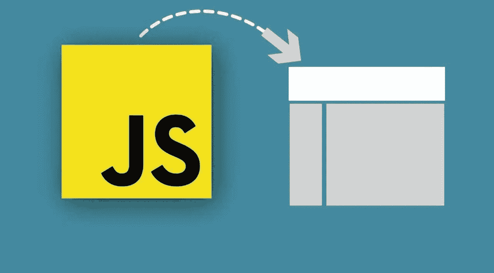
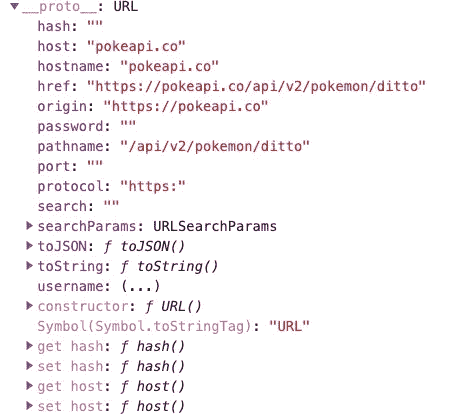

# JavaScript URL 对象入门

> 原文：<https://javascript.plainenglish.io/javascript-url-object-be2ea51c4a13?source=collection_archive---------7----------------------->

## 停止编写容易出错的 URL 字符串，使用 JavaScript 对象在代码中操作 URL。



你最近写过这行代码吗？

```
const url = 'http://example.com/movies'; 
fetch(url)
  .then(response => response.json())
  .then(data => console.log(data));
```

如果你在职业生涯的任何阶段都是一名专业的 web 开发人员，那么是的，你一直都在编写这样的 API 调用。对于上面这样一个简单的例子，URL 是 100%静态的，您可以使用一个简单的字符串来定义您的 URL。但是这在现实生活中什么时候发生过呢😄？但是，当您需要对 URL 字符串进行更复杂的调整时，比如下面的例子，会发生什么呢？

在上面的例子中，事情开始变得有点复杂，上面代码的手工性质将开始变得容易出错。
在我写的代码中，空格没有在 queryparam 中编码，
特殊字符也没有编码。如果有人传入一个包含空格的参数，或者更糟糕的是，一个特殊字符，那么这个方法就会中断。上面的代码会很脆。

# URL 对象

输入 URL 对象。像许多浏览器 API 一样，为了理解如何使用这个对象，您需要做一些前期的学习，但是使用它将对您的代码质量有长期的好处。



example of the URL object prototype methods printed in console

您可以使用完全限定的 URL 字符串生成 URL 对象，如下所示:

`let url = new URL(‘http://example.com/movies’);`

然后就可以使用许多不同的方法来帮助你以一种可靠的方式操作它。如果您需要使用 URL 来发出一个获取请求，您可以简单地像这样调用它`fetch(url)`，它将在被访问时返回它的`href`属性(在上面的例子中，它只是“`http://example.com/movies`”。

让我们用 URL 对象重写上面的代码。

代码要简单得多，需要的人工工作也少得多。除了可读性和代码大小方面的明显改进，让我们看看使用 URL 对象的好处。

## 环境

在上面的例子中，参数的排列由对象为我们处理。我们不需要任何逻辑来重新排列 URL 的组成部分以进行匹配(添加“？”和' & '字符串)。这不是很多工作，而是增加代码可靠性的另一种方法。

## 编码

在对 URL 进行编码时，URL 对象将根据 [RFC3986](https://tools.ietf.org/html/rfc3986) 中的规则自动应用 URL 编码。这种编码应用于 URL 以及在它之后应用的任何 queryparams。

## 访问者

在读取 URL 时，我们在前面的例子中没有这样做，这个对象也使事情变得更加清晰。考虑以下情况:

这段代码可以用 URL 对象的以下方法写成一行

`WindowUrl.searchParams.get(“ director”); //`

如果您在应用程序中使用[散列或散列路由](https://developer.mozilla.org/en-US/docs/Web/API/Window/hashchange_event)，不要害怕。该对象也有处理这种情况的方法，如果出于某种原因需要将浏览信息发送回服务器(特别是为了广告跟踪)，您可以使用`toJSON()`方法将 URL 对象的全部内容作为 JSON 打印出来。

感谢您的阅读，祝您编码愉快。

~ [亚历克斯·济托-沃尔夫](https://medium.com/u/ee1620854db4?source=post_page-----be2ea51c4a13--------------------------------)

**来源**:

[](https://developer.mozilla.org/en-US/docs/Web/API/URL) [## URL-Web API | MDN

### 该接口用于解析、构造、规范化和编码 URL。它的工作原理是提供允许您…

developer.mozilla.org](https://developer.mozilla.org/en-US/docs/Web/API/URL) 

*更多内容请看*[***plain English . io***](http://plainenglish.io/)