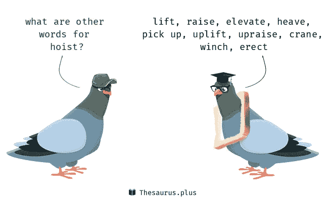
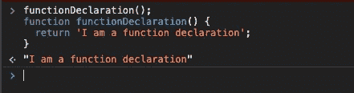
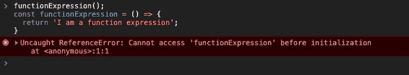
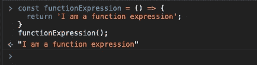

# 在 JavaScript 中使用函数表达式代替函数声明

> 原文：<https://javascript.plainenglish.io/javascript-use-function-expressions-instead-of-function-declarations-b5dd0572c3a6?source=collection_archive---------1----------------------->

在工作中，我观察到了在代码库中创建函数的不同方式——这引导我寻找何时使用哪个函数的答案(声明还是表达式)。本文旨在分享为什么使用函数表达式通常比使用函数声明更好。


Just some random code-related image to add a splash of colour haha (image from [Unsplash](https://unsplash.com/))

JavaScript 有两种不同的方法来创建函数。函数声明已经被使用了很长时间，但是函数表达式的使用已经逐渐被取代。

```
**Declaration**function functionDeclaration() {
  return 'I am a function declaration';
}const functionExpression = function() {
  return 'I am a function expression';
}
________________**Expression****ES5 form:**const functionExpression = function() {
  return 'I am a function expression';
}**ES6 form (with fat arrows):**const functionDeclaration = () => {
  return 'I am a function declaration';
}
```

函数表达式以关键字`var`、`let`或`const`开始创建一个命名变量。

然后，该函数根据所使用的关键字确定范围。**作用域**是保护全局作用域不受污染的好方法。使用`var`、`let`还是`const`取决于你希望如何应用作用域，以及你是否希望变量得到保护。

我通常大部分时间使用`const`,因为我通常不希望以后改变函数。它告诉其他开发人员这个变量是常数，并且只有一个值。如果您确实希望能够在某个时候更改该值，那么使用`let`作为块作用域，或者使用`var`作为函数作用域。

# **主要区别:吊装**



Hoisting is JavaScript’s default behaviour of moving declarations to the top.

最重要的是，函数声明是提升的，而函数表达式是**而不是**提升的。

简单地说，提升意味着当一个函数声明出现在代码中的任何地方时，解析器会让它立即可用，就像它出现在第一行代码之前一样。

另一方面，函数表达式根据您使用的变量关键字遵循更细微的提升规则。

在 chrome 控制台中运行:

```
functionDeclaration();function functionDeclaration() {
  return 'I am a function declaration';
}
```

…不会返回任何错误:



但是运行这个:

```
functionExpression();const functionExpression = () => {
  return 'I am a function expression';
}
```

…返回一个错误:



…因为该功能未被提升，且在使用前尚未初始化。

我们必须这样做:

```
const functionExpression = () => {
  return 'I am a function expression';
}functionExpression();
```



Function expression: initialise the function before using it. No errors observed.

这可能看起来不太方便，但是这意味着代码从上到下可读性更好，而不是依赖于 Javascript 解析器来移动内容，并且使用的任何函数在引用之前都已经定义好了。

提升听起来似乎是一件很方便的事情，但普遍的共识是，它鼓励编写其他开发人员难以理解的代码，尤其是在包含大量代码的文件中。

因此，函数表达式被广泛认为是创建函数的最佳实践。

# **结论**

正如我们所看到的，函数表达式并没有提供太多函数声明所不能提供的东西，但是使用它们通常可以产生更干净、更易读的代码。