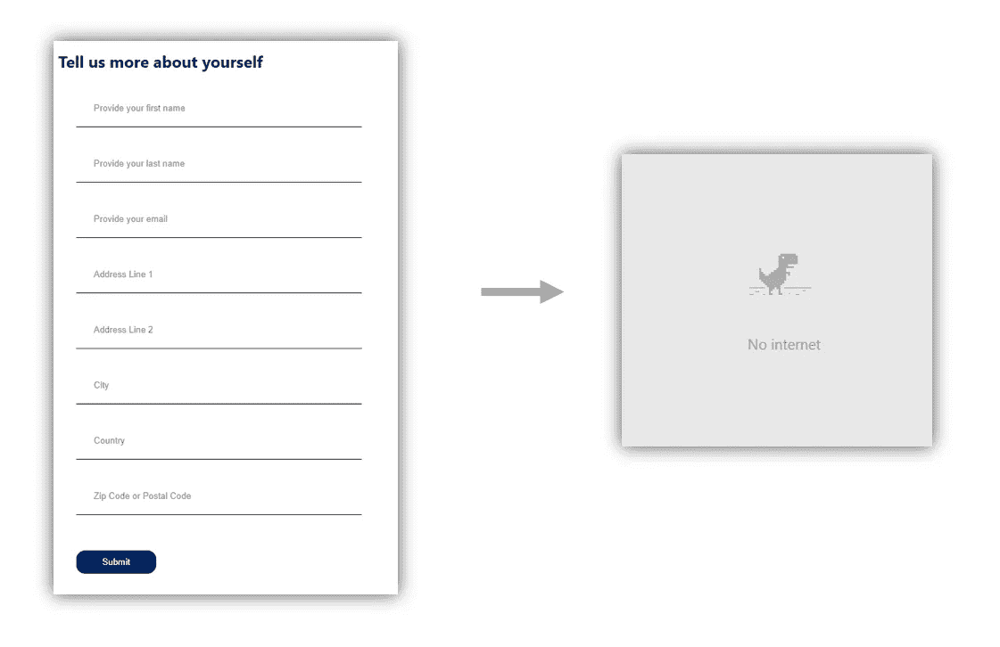
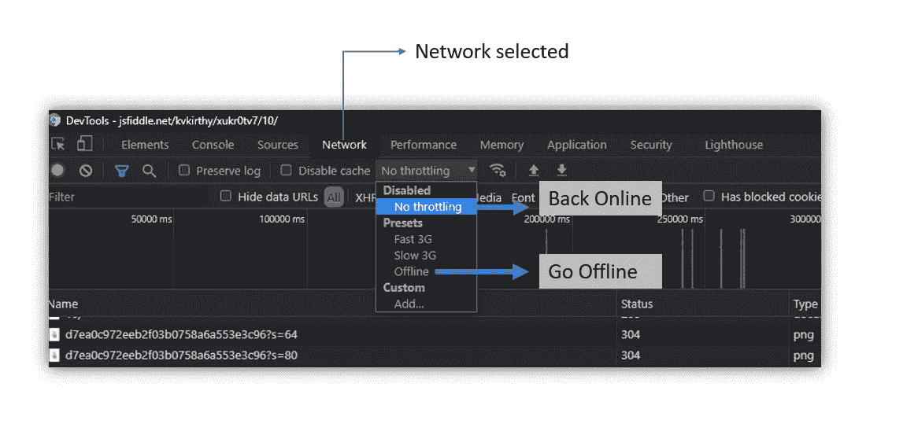
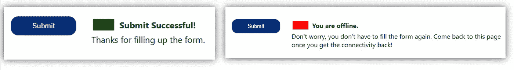
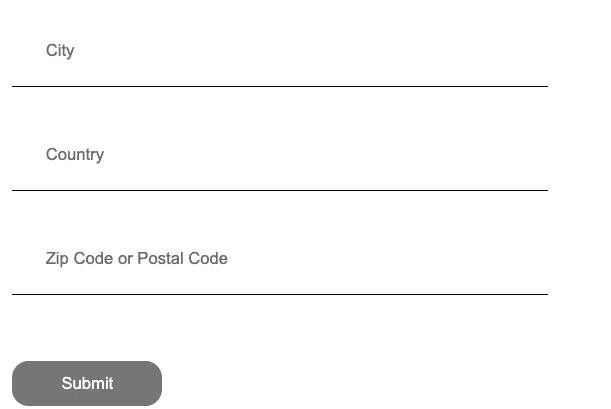

# JavaScript —验证在线状态

> 原文：<https://javascript.plainenglish.io/javascript-validate-online-status-7e195b6a89a8?source=collection_archive---------6----------------------->

## 现代 web 应用程序需要适应网络连接的变化。大量的应用程序在移动设备上使用。当用户在移动时，有可能会出现短暂的连接中断。不要丢失数据和用户体验！

## 了解 *window.navigator.onLine* 和在线事件&离线


假设您的应用程序中有一个大约有 8 到 10 个字段的大型表单。用户在移动设备上访问该表单。当她填写表单并提交时，网络连接出现了短暂的中断。提交操作导致“未找到页面”消息。您可能认为这不是应用程序的错，但最终结果会让用户非常沮丧。实际上，数据丢失了。如果是电子商务应用程序，你会失去一个购买机会。



Did it happen to you? Type in a large form to see an error!

应用程序需要适应网络连接的变化。传统的网络技术认为网络连接是理所当然的。这主要是因为台式电脑通过可靠的网线连接。今天，大量的 web 应用程序运行在移动设备上。用户在使用您的应用程序时可能正在移动。现代 web 应用程序需要考虑网络速度的变化或连接的丢失，并确保数据不会丢失。

在这个 [JS 提琴](https://jsfiddle.net/kvkirthy/xukr0tv7/)处检查代码样本。运行下面的示例应用程序。使用位于表单末尾的提交按钮。

在桌面上，使用谷歌浏览器，你可以通过“节流”选项切换在线/离线状态。见下图。打开开发工具(在*更多工具*菜单下的*开发工具*，导航到网络选项卡并切换节流选项。



# 使用 window.navigator.onLine

浏览器本身支持验证应用程序是否在线。当应用程序在线时, *window.navigator* 上的属性 *onLine* 返回 *true* (反之亦然)。考虑下面的代码片段。

```
// when the application is online
 ***if (window.navigator.onLine) {***    // Submit the data from and show a message
    /*
     code to submit the form and complete the purchase process
    */// The following statement shows a success message.
    setTextValue(document.getElementById("statusTitle"), "Submit Successful! ");
    setTextValue(document.getElementById("statusDescription"), "Thanks for filling up the form.")// Set green color on a block for visual indication of success.
    statusBlock.style.background = 'green';
 ***} else {***// The following statement shows loss of connectivity, hopefully help users feel better about not filling the form again.
    setTextValue(document.getElementById("statusTitle"), "You are offline.");
    setTextValue(document.getElementById("statusDescription"), "Don't worry, you don't have to fill the form again. Come back to this page once you get the connectivity back!");// Set red color on a block for visual indication of a problem.
    statusBlock.style.background = 'red';
  }
```

请注意，您检查在线状态并允许或阻止表单提交操作。您可以将数据保存在 cookie、会话存储或本地存储中。当用户返回到该页面时，查找未提交的草稿数据并预填表单。这些场景可以因应用而异。这只是一个演示在线状态检查的示例。在代码示例中，状态消息如下所示:



# 线上和线下活动

想象一下，动态检测在线/离线状态；提供视觉反馈。

例如，禁用提交按钮并更改其颜色。

```
// triggered when the application loses connectivity
window.addEventListener("**offline**", function(p) {
 // House keeping - clear old status messages
 clearMessages();

 // disable the button
 document.getElementById("submit").disabled = true;

 // turn the color gray indicating a disabled button
 document.getElementById("submit").style.backgroundColor = 'gray';
});// triggered when the application gains connectivity
window.addEventListener("**online**", function(p) {
 // House keeping - clear old status messages
  clearMessages();

    // enable the button
  document.getElementById("submit").disabled = false;

  // turn the color blue indicating an enabled button
  document.getElementById("submit").style.backgroundColor = "rgb(0, 46, 119)";
});
```

当应用程序失去连接时，在表单的末尾看到一个禁用的按钮，



## 参考

*   Navigator.onLine 的 MDN Web Docs 文档—[https://developer . Mozilla . org/en-US/Docs/Web/API/Navigator/onLine](https://developer.mozilla.org/en-US/docs/Web/API/Navigator/onLine)
*   “在线”和“离线”事件。要了解更多信息，请使用以下 MDN Web 文档—[https://developer . Mozilla . org/en-US/Docs/Web/API/Navigator/Online _ and _ offline _ events](https://developer.mozilla.org/en-US/docs/Web/API/Navigator/Online_and_offline_events)

*更多内容尽在*[***plain English . io***](http://plainenglish.io)