# JavaScript vs Lodash 一行程序

> 原文：<https://javascript.plainenglish.io/javascript-vs-lodash-one-liners-579e1b138e74?source=collection_archive---------5----------------------->

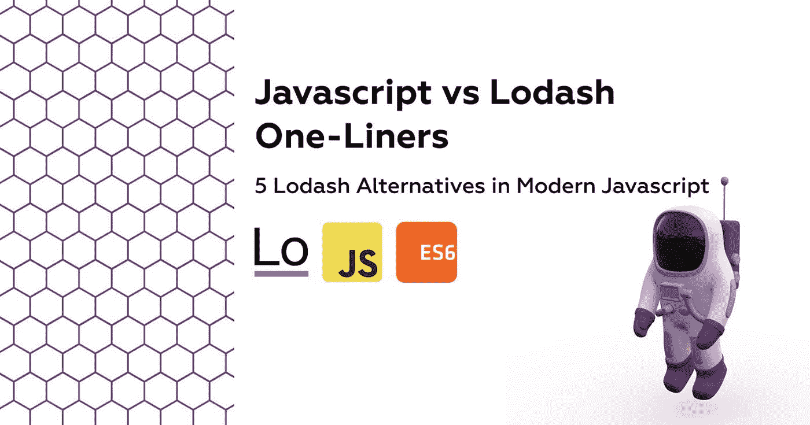

## 现代 JavaScript 中的 5 种 Lodash 替代方法

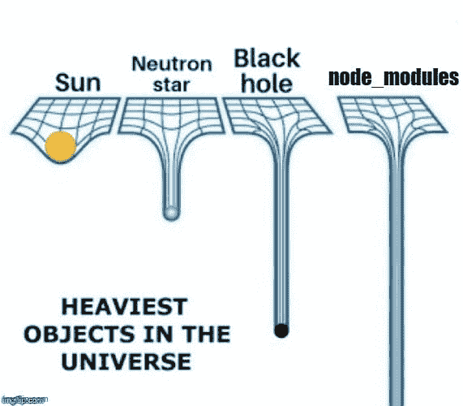

[Lodash](https://lodash.com/) 长期以来一直是 NPM 最受欢迎的图书馆之一，每周下载量超过 3000 万次，因为它为每个项目的需求带来了巨大的实用功能。尽管随着 ES6 &数组方法的引入，这种情况不再存在，但它被认为是每个项目的必备依赖项。

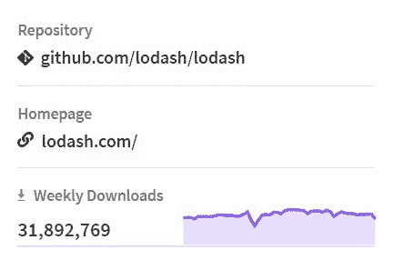

向已经流过的 node_modules 添加另一个库会影响加载速度并降低性能，这就是为什么我选择在新项目中不再包含 lodash。

在添加新包之前，我经常使用 [bundlephobia](https://bundlephobia.com/) ，因为它既显示了包的大小，也显示了更小的包。

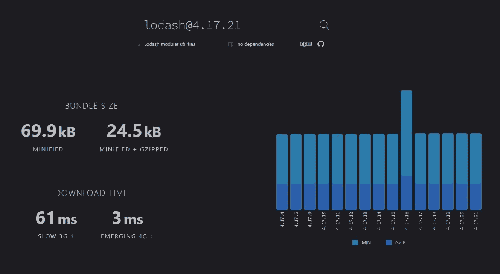

我们可以看到 lodash 并没有对 3G 的下载时间产生巨大的影响，只有大约 61 毫秒，但是一个更好的网络仍然是由更少的 JS 有效载荷组成的🤓。

以下所有示例都将在此阵列上:

# 1.删除重复项

在 Lodash 中，使用`uniqWith`和`isEqual`作为比较器非常简单，对于 ES6，我们需要在每次过滤器迭代中检查重复的对象。

# 2.计算平均值

我们需要计算所有宠物的平均价格。

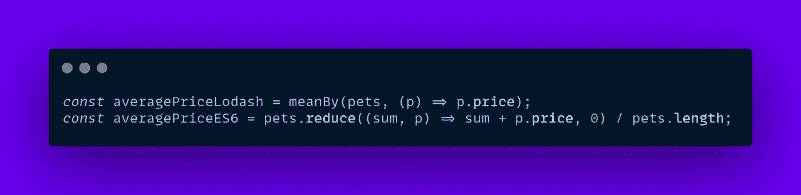

# 3.随机 Id

为数组中的每只宠物添加一个随机 id。

> 我不推荐使用`Math.random`来生成密钥或密码，因为它不是完全随机的。

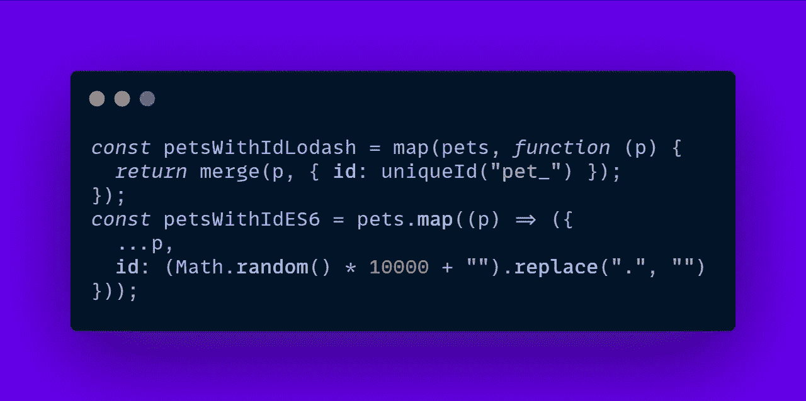

# 4.大写字符串

对于每只宠物，我们需要将第一个字母大写。

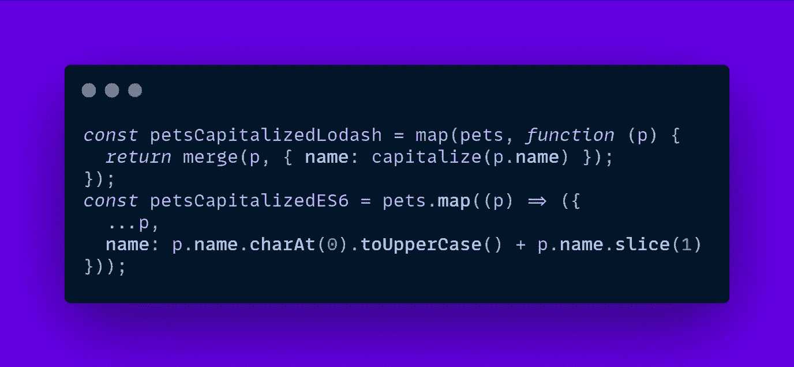

# 5.移除字段

众所周知，我们将删除价格属性🐶是无价的。

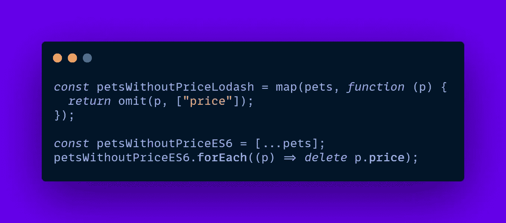

# 额外小费

如果您使用 Lodash 或 date-fns 导入实用程序函数，如下所示:

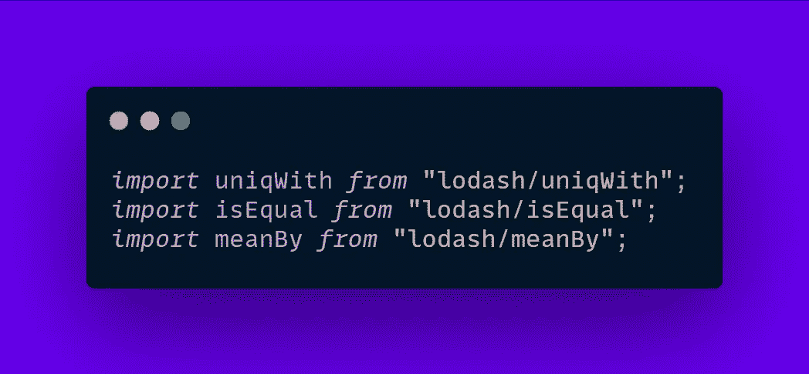

这样，与导入整个模块不同，导入的大小会大大减少:

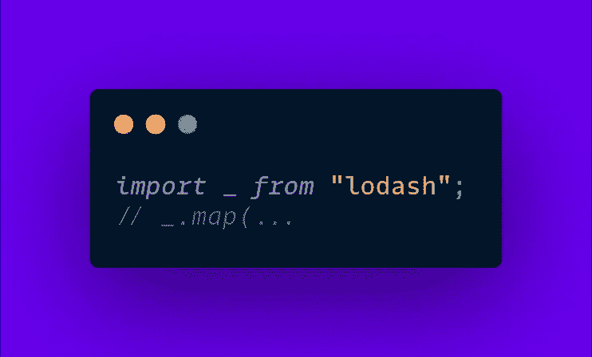

如果你想检查这里的代码是 [CodeSandbox](https://codesandbox.io/s/lodash-vs-es6-6g8h4?file=/src/index.js) 。

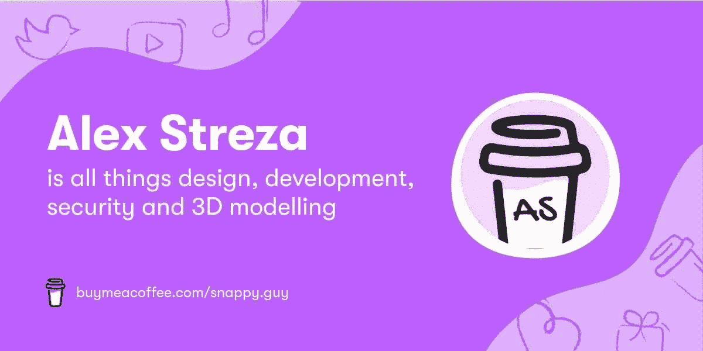

buymeacoffee.com/snappy.guy

*更多内容请看*[***plain English . io***](http://plainenglish.io)