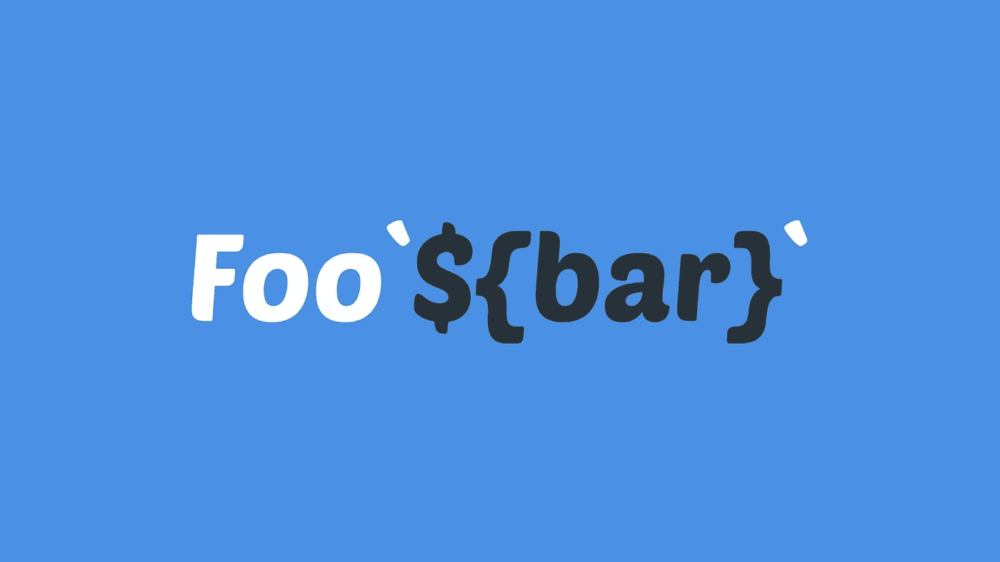
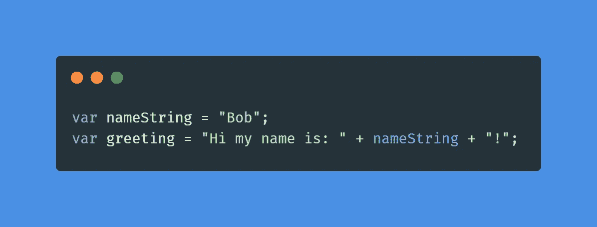
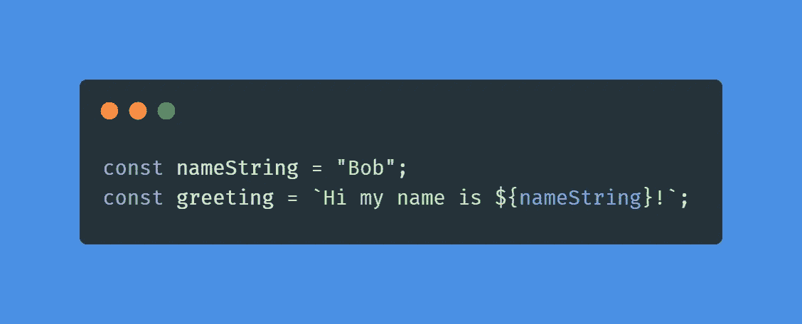
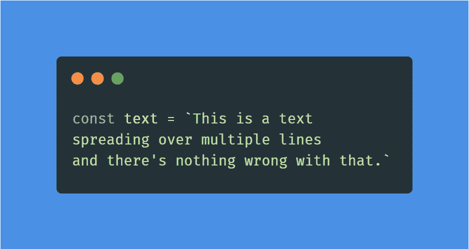
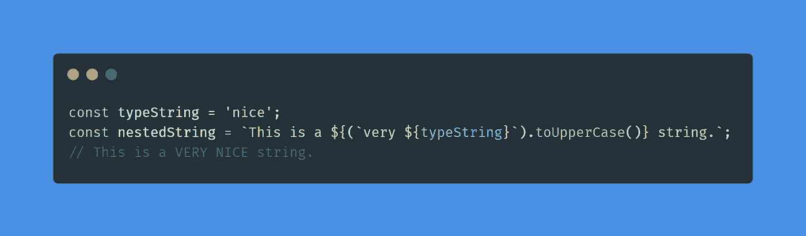
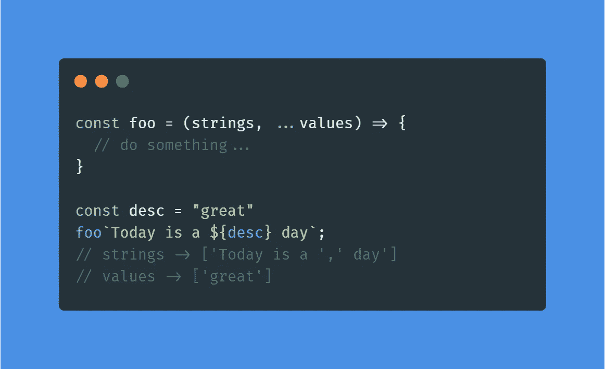
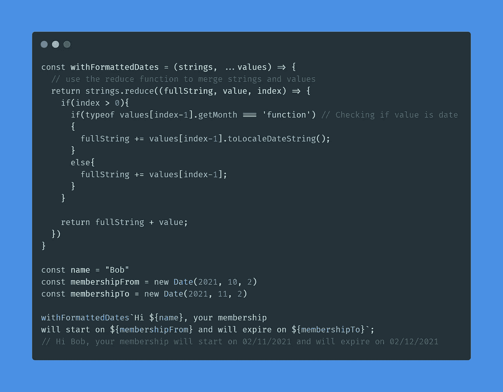

# 4 分钟解释 JavaScript 标记模板文字

> 原文：<https://javascript.plainenglish.io/javascripts-tagged-template-literals-explained-in-4-minutes-80e397a87729?source=collection_archive---------10----------------------->

# 介绍

ES6 中增加了一些你可能已经使用了一段时间的东西，那就是模板文字。在这篇博文中，我将向您展示如何使用*标记的*模板文字来加快您编写格式化文本的方式。

如果您对模板文字有所了解，可以直接跳到最新的“带标签的模板文字”一节来理解本文的精髓。

# 模板文字，也称为字符串插值

当我们想到模板时，我们的大脑很快就会想到某种可重用的数据/代码，我们可以根据自己的喜好对其进行定制。

模板字面量被称为*模板字面量*有点奇怪，因为它们并不是真正的*“模板”*。相反，我将把它们命名为它们应该被命名的名称:**字符串插值**。

在 ES6 之前，我们需要做这样的事情:

有了 ES6，我们迎来了一种新的方式:

`${nameString}`被解析为表达式，而不是字符串。这种解析的别称叫做 ***插值。这种新语法允许我们动态地创建字符串，而不必将单独的字符串加在一起。***

因为字符串插值是智能字符串，这意味着您也可以将它们拆分成多行:

另一件很棒的事情是，因为模板文字是作为表达式来解析和计算的，所以我们可以毫无问题地使用嵌套:

这很好，现在你知道了如何使用字符串插值(模板文字)，让我们看看如何使用带标签的模板文字。

# 标记的模板文字

带标签的模板文字实际上是添加到 ES6 的一个很好的特性。它们允许像样式组件这样的库以一种漂亮而简单的方式工作。

考虑下面的例子:

在上面的代码片段中，我们在模板文本前面添加了函数 foo 的名称。这个函数被称为模板文字的**标记(**标记的模板文字)。

此函数接收一个普通子字符串列表，这些子字符串是通过划分模板文本(其中写入了插值)而创建的。之后，该函数接收我们使用 spread/gather 操作符收集的单独表达式。

在这个函数中，您将能够遍历字符串和值，并重新创建字符串文字的结果。

那么，带标签的模板文字的真实用例是什么呢？考虑下面的例子:

在上面的例子中，我们创建了一个名为`withFormattedDates`的新函数，该函数将使用 *reduce* 数组方法来重新创建字符串，并将检查所使用的表达式是否为日期。如果是，我们使用`.toLocaleDateString()` date 函数对它们进行格式化。

我们使用函数`withFormattedDates`作为我们标记的模板文字的标记，结果是我们得到一个字符串，其中包含日期的表达式将产生格式化的日期字符串。

多棒啊！？如果没有带标签的模板文字，您将需要编写单独的函数，并通过函数逐个运行日期，这可能会降低可读性。

这只是一个例子，说明了如何使用标记模板文字来提高游戏的速度。

# 结论

在这篇博文中，我们讨论了模板文字和标记模板文字。我们已经了解了如何使用标记来改善智能“标记模板文字”字符串的呈现。

我希望你学到了新东西。如果你想了解更多关于 JavaScript 中的析构，一定要看看我以前的一篇文章:[掌握 Javascript 中的析构|作者 Diederik Mathijs | Jun，2021 |更好的编程](https://betterprogramming.pub/master-destructuring-in-javascript-6871d1fe5f6c)

*更多内容请看*[***plain English . io***](http://plainenglish.io/)