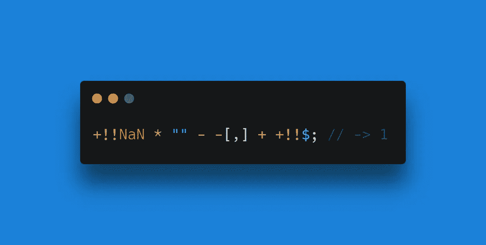

# JavaScript 的野生型强制

> 原文：<https://javascript.plainenglish.io/javascripts-wild-type-coercion-3f5e4084e228?source=collection_archive---------14----------------------->


Photo by [Aryan Dhiman](https://unsplash.com/@mylifeasaryan_?utm_source=unsplash&utm_medium=referral&utm_content=creditCopyText).

## 介绍将意外的数据类型添加到一起时会发生什么

JavaScript (JS)以很多东西而闻名——其中之一就是大量使用[类型强制](https://developer.mozilla.org/en-US/docs/Glossary/Type_coercion)。类型强制是将值从一种数据类型自动或隐式转换为另一种数据类型的行为。对这种现象的入门介绍在许多不同的编程语言中都有，即当一个数字与一个字符串相加时。

```
1 + "1"; // -> "11"
```

在许多编程语言中，这正是大多数类型强制结束的地方。然而，在 JavaScript 中，类型强制无处不在。我有点痴迷于此。

当两个值相加、相减、相乘、比较或者你有什么的时候，JS 永远不会抛出异常。

这意味着像下面这条荒谬的线不会抛出错误。



Image by the author.

```
+!!NaN * "" - -[,] + +!!$; // -> 1
```

奇怪而迷人的部分是相等的。

我会回到这段文字末尾的那一行，详细解释它是如何工作的，但是让我们从基础开始，看看加法运算符，或者加号，如果你愿意的话。

```
5 + 5; // -> 10
```

五加五等于十。每个人都知道这一点，不管你是不是开发者。加法运算符的这种数学用法是最常见的。

如果您是开发人员，您肯定也熟悉使用加号将两个字符串加在一起。

```
"hello, " + "world"; // -> "hello, world"
```

这被称为字符串连接，在所有编程语言中都很常见。

但是接下来呢？您还可以添加哪些其他值？好吧，JS 将允许你添加任何东西，通常会有有趣的结果。

您有没有想过如果将两个布尔值加在一起会发生什么？

```
true + false;
```

你认为产量会是多少？也许 JS 会返回 NaN(不是一个数字)，因为它试图将这些值加在一起，就好像它们是数字一样，但没有成功？或者它会将这些值转换成字符串并连接起来？

嗯，JavaScript 对每一种可能的场景都有规则，这些规则在 [ECMAScript 语言规范](https://262.ecma-international.org/5.1/) ( [第 11.6 节【本例中为 )中有所规定。](https://262.ecma-international.org/5.1/#sec-11.6)

答案是 JS 将成功地将这些布尔值转换为数字，并将它们相加。

```
true + false; // -> 1
+true; // -> 1
+false; // -> 0
```

在本文中，您将看到我使用的一种语法是在操作数中添加前面的加号。这被称为[一元加运算符](https://developer.mozilla.org/en-US/docs/Web/JavaScript/Reference/Operators/Unary_plus)，是一种将操作数转换为数字的方法。它相当于数字函数。

```
+true; // -> 1
Number(true); // -> 1
```

顺便提一下，下面的代码行将在这个场景中产生相同的结果，但是性能应该快 97%。

```
true ? 1 : 0; // -> 1
```

当与数字相加或相减时，布尔值也被强制转换为数字。

```
true + 0; // -> 1
false - 0; // -> 0
```

两个布尔值[与它们的数字对应值](https://developer.mozilla.org/en-US/docs/Web/JavaScript/Equality_comparisons_and_sameness)相等。顺便说一句，比起抽象的相等比较和严格的相等比较这两个专业术语，我更喜欢双倍和三倍相等这两个术语。

```
true == 1; // -> true
false == 0; // -> true
```

但是，它们并不双等于它们的等效字符串。

```
true == "true"; // -> false
false == "false"; // -> false
```

这是因为当将布尔值与字符串进行比较时，这两个值会转换为数字，而这些字符串会转换为 NaN。

```
+"true"; // -> NaN
```

字符串串联总是优先于数字运算。

```
1 + 1; // -> 2
1 + "1"; -> "11"
true + "1"; -> "true1"
```

但是，减法运算符没有附加字符串运算，因此 JavaScript 将假设这是一个数字运算，并将字符串强制转换为数字。

```
1 - "1"; // -> 0
true - "1"; // -> 0
```

你可以从一个数中减去一个空字符串，而不会得到 NaN。

```
1 - ""; // -> 1
```

这是因为空字符串实际上会转换为 0。

```
+""; // -> 0
```

因此，您可以通过加上或减去一个空字符串来将值转换为字符串或数字。

```
true + ""; // -> "true"
true - ""; // -> 1
"" + 1; // -> "1"
"" - 1; // -> -1
```

空字符串等于 0 和 false。

```
"" == false; // -> true
"" == 0; // -> true
```

我们可以写出这样奇怪的语法。

```
"" - ""; // -> 0
```

JS 从左到右读取表达式，因此下面…

```
1 + 2 + "3"; // -> "33"
1 + 2; // -> 3
3 + "3";  // -> "33"
```

…将产生与这些表达式不同的结果。

```
"1" + 2 + 3; // -> "123"
1 + "2" + 3; // -> "123"
```

Null 也可以转换成 0，但 undefined 不能。

```
+null; // -> 0
+undefined; // -> NaN
```

然而，多亏了[双非运算符](https://developer.mozilla.org/en-US/docs/Web/JavaScript/Reference/Operators/Logical_NOT)，你可以将任何值转换成 1 或 0(是的，真的是这么叫的，波拉特会喜欢的)。运算符将根据值是[真](https://developer.mozilla.org/en-US/docs/Glossary/Truthy)还是[假](https://developer.mozilla.org/en-US/docs/Glossary/Falsy)将任何值转换为真或假。

```
!!undefined; // -> false
```

然后我们可以加上加号把它转换成 0。

```
+!!undefined; // -> 0
```

当两个数组相加时，它们被转换为字符串，然后被连接起来。空数组转换为空字符串。

```
[] + []; // -> ""
```

因为 JavaScript 使用[结尾逗号](https://developer.mozilla.org/en-US/docs/Web/JavaScript/Reference/Trailing_commas)，所以即使数组中有逗号，我们也会得到相同的结果。

```
[,] + [,]; // -> ""
```

如果数组中有值，它们也会被转换成字符串。

```
[1, 2, 3] + [4, 5, 6]; // -> "1,2,34,5,6"
```

空数组与 false、0 和空字符串等 falsy 值双等。

```
[] == 0; // -> true
[] == ""; // -> true
[] == false; // -> true
```

因此，您可以使用空数组将布尔值转换为字符串或数字。

```
true + []; // -> "true"
true - []; // -> 1
```

您可能从未考虑过这一点，据我所知，这并没有实际应用，但 JS 甚至允许您一起添加函数。

```
console.log + console.log; // -> "function log() {     [native code] }function log() {     [native code] }"
```

请注意，上述表达式的输出可能会因编译器而异。

让我们回到这段文字开头我分享的精彩台词，试着去领悟。

```
+!!NaN * "" - -[,] + +!!$; // -> 1
```

首先，NaN 是 falsy，所以用双 NOT 运算符将其转换为 false，然后通过一元加号运算符将其转换为 0。

```
+!!NaN; // -> 0
```

接下来，乘法运算符将像减法运算符一样，假设我们正在处理数字。如你所知，空字符串被转换成 0。因此，它会将字符串转换为 0。

```
+!!NaN * ""; // -> 0
```

带逗号的数组可以转换成 0。在本例中，为-0。

```
-[,]; // -> -0
```

美元符号是一个函数，这是真的。它被转换成 true，然后转换成 1。

```
+!!$; // -> 1
```

该表达式的解释如下。

```
0 * 0 - -0 + 1; // -> 1
```

这是对 JavaScript 的野生类型强制的一个简要的了解。如果你认为这很有趣，你可能会喜欢我的古怪的 [*JavaScript 测验*](https://jsisweird.com/) *，它使用了类型强制和其他有趣的 JS 语法。*

*你可能也会喜欢这些文字:*

[](https://blog.devgenius.io/are-14-people-currently-looking-at-this-product-e7fe8412f16b) [## 一个网上商店的源代码中揭露的无耻谎言

### 14 个人真的在看这个产品吗？

blog.devgenius.io](https://blog.devgenius.io/are-14-people-currently-looking-at-this-product-e7fe8412f16b) [](https://medium.com/geekculture/will-ai-replace-programmers-fb6fcfd70b37) [## AI 会取代程序员吗？

### OpenAI 的算法打开了代码生成人工智能的闸门，但它将如何影响软件开发人员？

medium.com](https://medium.com/geekculture/will-ai-replace-programmers-fb6fcfd70b37) 

*更多内容请看*[***plain English . io***](http://plainenglish.io/)