# Jest 模拟单元测试 MERN 后端

> 原文：<https://javascript.plainenglish.io/jest-mock-for-unit-testing-mern-backend-983c1e3fef83?source=collection_archive---------0----------------------->


Mocking bird

最近，我不得不为一个 Node.js 后端编写一些单元测试，该后端使用多个外部服务，如 Redis(数据库)和 Kafka(消息队列)。尽管我有使用 Jest 进行 Node.js 单元测试的经验，但我不知道当函数调用外部进程时该做什么，比如进行数据库查找。这就是`mock`发挥作用的地方，它允许我们“模仿”一个函数的实现，这样我们就可以测试代码的准确性，而不用担心其他任何事情。

为了解释这个概念，我将使用一个简单的关于餐馆的 Node.js -backend🌮！我们的应用程序可以创建具有唯一名称的餐厅，并使用 mongoose 将其存储在 MongoDB 中。

这假设你已经熟悉 Jest 和 Node.js，如果不熟悉，请阅读我的[其他教程](/unit-testing-node-js-mongoose-using-jest-106a39b8393d)关于如何开始 Jest 节点单元测试。

# 第 1 部分:应用程序设置

一旦我们初始化`npm`，我们只需要安装 express 和 mongoose。这是我将在本教程中使用的最低限度，但请随意使用更多的☕️

```
// set up node
npm init
// install dependencies
npm i express mongoose
```

## 模型

我们的模型非常简单。我们只有一家餐馆的名称、菜系和地址。

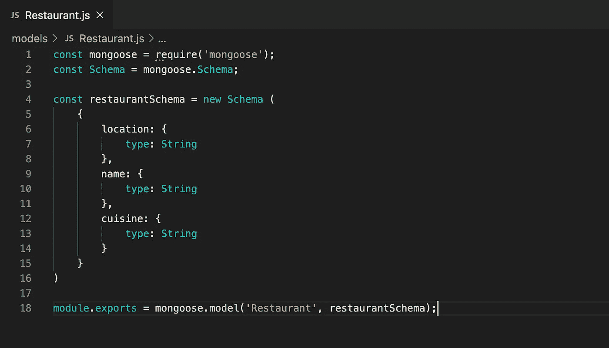

Restaurant Model

## 控制器

我们将尝试为创建新餐馆的函数编写测试。该函数只接受一个名称、位置和菜肴类型，如果该名称尚未被使用，它将创建一个新餐馆。

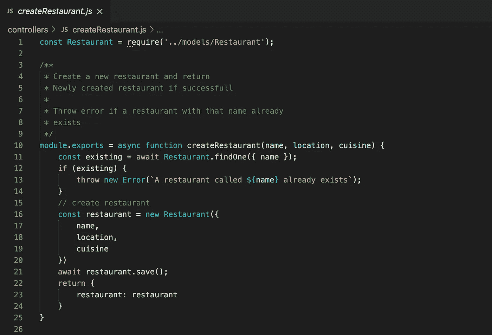

Function to create a new restaurant: controllers/createRestaurant.js

这个功能将被纳入我们的应用程序，就像这样

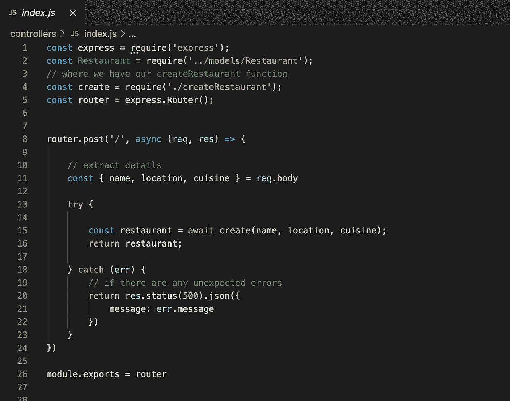

Controller: controllers/index.js

通过分解功能，我们可以很容易地在以后进行单元测试。最后，应用程序的入口点将看起来像:


Entry point: index.js

# 第 2 部分:安装 Jest

我们可以使用`npm`为我们的测试安装 Jest 框架。

```
npm install jest
```

# 第 3 部分:测试

我发现一种简单易懂的方法是将单元测试放在与测试文件相同的文件夹中。因此，我们将在`controllers`文件夹中创建一个新文件。一个关键的事情是我们的测试文件的命名。他们不得不在`.test.js`结束。Jest 就是这样识别它们并运行我们的测试的！

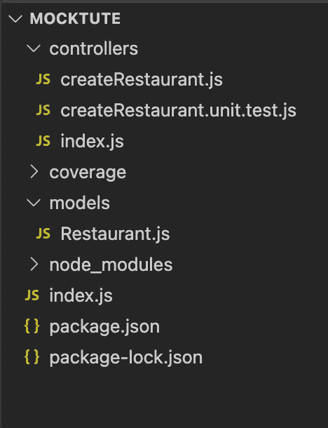

Folder structure for tests

## 第一个笑话——哎呀，测试😎

最后，我们可以开始编写我们的第一个测试了！对于我们使用`mock`的第一个测试，我们将测试一个案例，我们试图用一个已经被使用的名字创建一个餐馆。这应该会抛出一个错误，我们希望确保这种情况发生。

要嘲笑这种行为，我们只需要说:

```
Restaurant.findOne = jest.fn().mockReturnValueOnce({
     name: "Amy's"
});
```

`mock`的解剖是这样的。

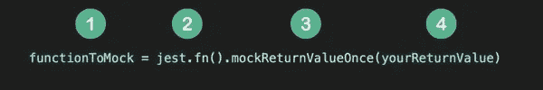

Mock anatomy

1.  `functionToMock`:这是您想在测试中改变其行为的函数。例如，对于我们的测试，我们需要模拟`Restaurant.findOne`来返回值，而不是实际搜索数据库。
2.  这是所有模仿中常见的
3.  `mockReturnValueOnce`:这指定了我们想要模仿的内容。如果你只关心函数的返回值，你可以使用`mockReturnValueOnce`。换句话说，你想测试`functionToMock`何时抛出错误。在这种情况下，你可以使用`mockImplementation`。Jest 为此提供了很多选择:[https://jestjs.io/docs/mock-function-api](https://jestjs.io/docs/mock-function-api)。
4.  `yourReturnValue`:这是你放置你想要的行为/回报值的地方。

现在应该很清楚了，我们只是告诉`jest`，“嘿 Jest，忘记函数的实际实现是什么，而是按照我告诉你的去做😎".厉害吧！我们不必担心创建一个在每个测试中都按照我们想要的方式运行的假数据库，相反，我们可以告诉`jest`从数据库调用中返回我们期望的值。

这是一个完整的例子，说明我们如何使用 jest 的模拟。首先，我们模仿`Model.findOne`，然后我们需要模仿`Model.prototype.save`函数。我们向`Restaurant.prototype.save`传递一个什么都不做的函数，这意味着当`jest`遇到我们在`controllers/createRestaurant.js`中调用`restaurant.save()`的代码时，它什么都不做。

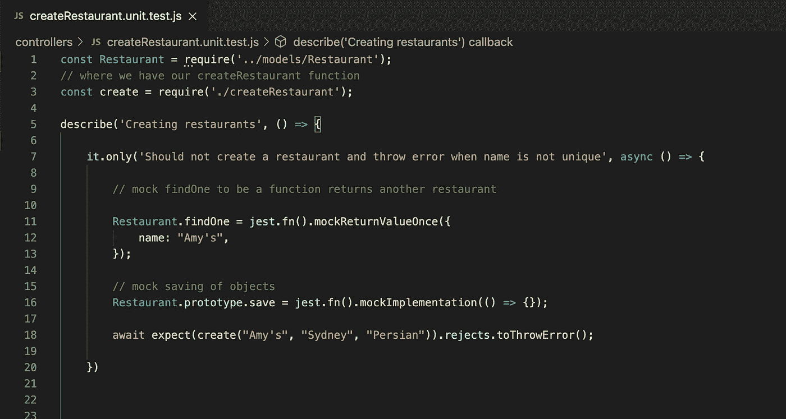

First unit test: controllers/createRestaurant.unit.test.js

值得注意的是，我们可以使用`mockImplementation`而不是`mockReturnValue.`，例如，对于`Restaurant.findOne`，我们可以说:

```
Restaurant.findOne = jest.fn().mockImplementation(() => {
    return {
        name: "Amy's"
    }
})
```

这将以同样的方式运行，因为我们传递给它一个函数，它只返回一个名字。不信你试试看！

## 运行覆盖测试

现在是时候检查一切是否还在工作，我总是喜欢给我的测试增加覆盖率，这样我就知道我做得怎么样了。用玩笑话来说，这很简单。在`package.json`中，您需要添加这个脚本:

```
"test": "jest --coverage --verbose"
```

现在，当您运行`npm run test`时，您将会看到您的覆盖结果以及🥳

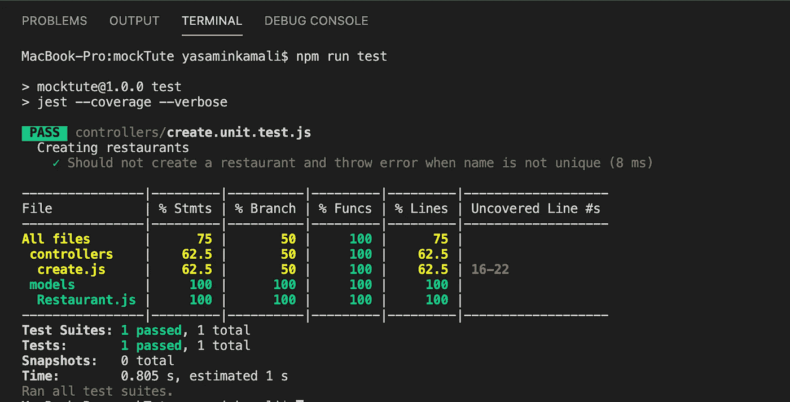

Running tests

# 额外:模仿日志

大多数应用程序都有某种日志记录，测试我们是否记录了正确的信息是值得的。在您的函数中，您将记录信息、警告和错误，很可能使用第三方包。类似于当我们测试涉及数据库的函数时，我们可以在测试中模拟日志记录器的行为。

因为本教程不是关于日志记录的，所以我将只创建一个虚拟函数，它只返回一个空对象，作为我们的日志记录器:

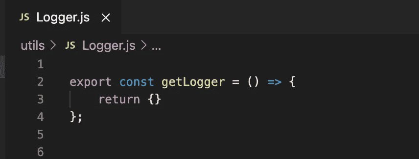

utils/logger

在您的应用程序中，这将是日志系统(如`winston` logger)的合适助手。假设我们希望记录所有错误(第 19 行)以及成功创建餐馆时的信息日志(第 29 行)。

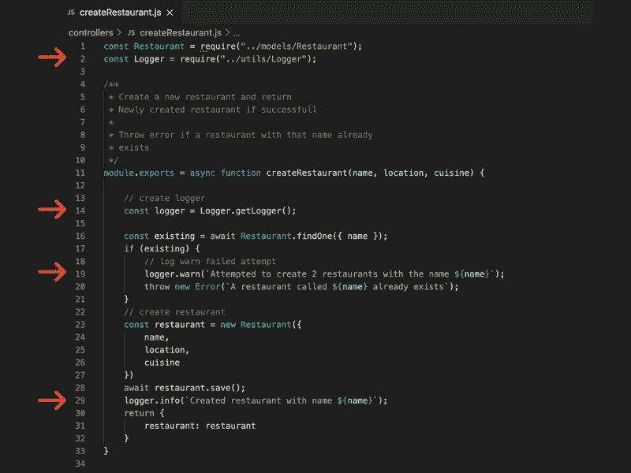

Adding logging: controllers/createRestaurant.js

在运行任何测试之前，我们需要在测试文件的顶部添加以下内容。这是一个具有两个级别的记录器示例:info 和 warn。如果你的记录器有更多的级别，你可以随意添加。

```
const mockInfo = jest.fn();
const mockWarn = jest.fn();// mocking Logging
jest.mock("../utils/Logger", () => {
    return {
        getLogger: () => ({
            info: mockInfo,
            warn: mockWarn
        })
    }
})
```

这意味着当`createRestaurant`调用`"../utils/Logger"`文件中的`getLogger`函数时，不是创建并提供真正的 logger 函数，而是返回我们已经做好的空函数:`mockInfo`和`mockWarn`分别对应`info`和`warn`。

我们如何检查我们在测试中调用了日志函数？🤔

Jest 提供了一个`toHaveBeenCalledWith`函数，它检查一个函数是否被某些参数调用。让我们为一个案例编写一个测试，在这个案例中，我们成功地创建了一个餐馆，并检查记录器是否正常工作。

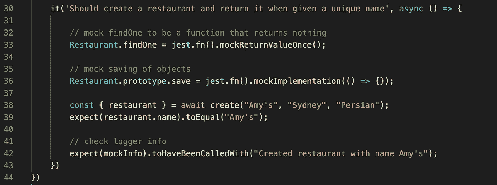

最后，检查我们的测试是否全部通过…看看这个覆盖率！😯

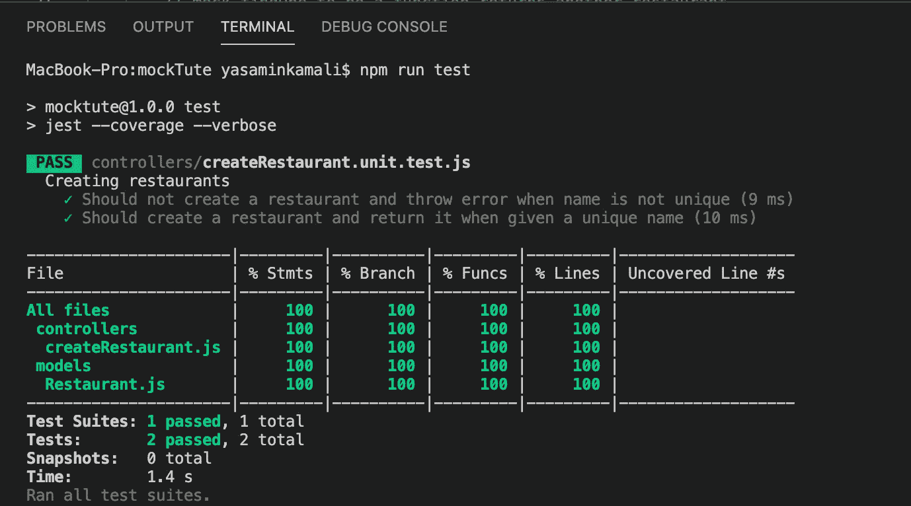

# 我们完成了🥳

使用`mock`就是这样。当你编写单元测试时，它可以使生活变得简单得多，因为它消除了担心你正在使用的外部函数的行为的需要。给定特定的输入，你可以确保**你的**函数正常工作，这就是单元测试的意义所在！

如果有任何问题，或者在某一点上需要更多的指导，请联系我们。😊

*更多内容请看*[***plain English . io***](http://plainenglish.io/)