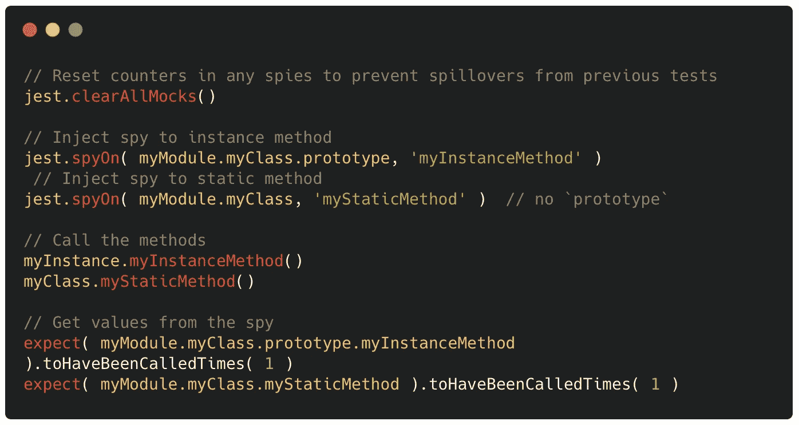
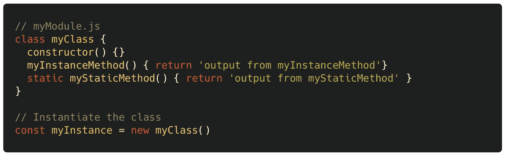
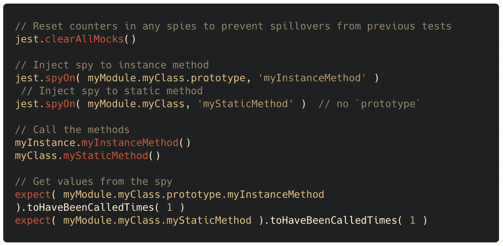
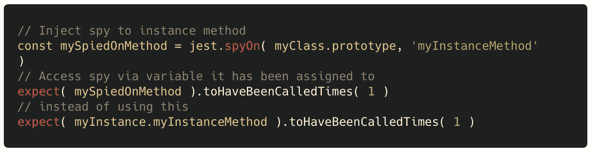
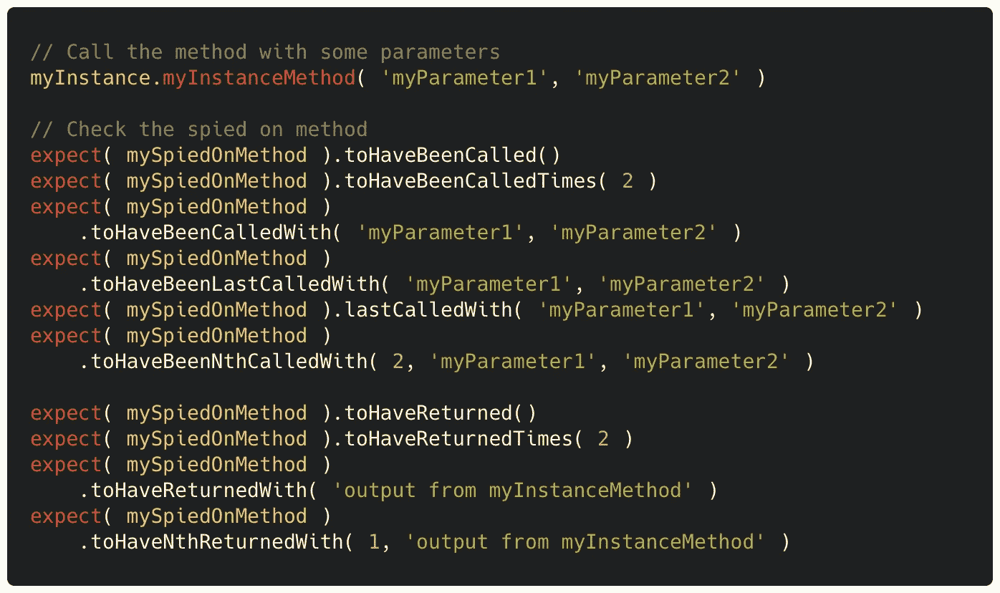
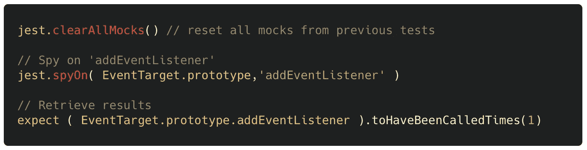
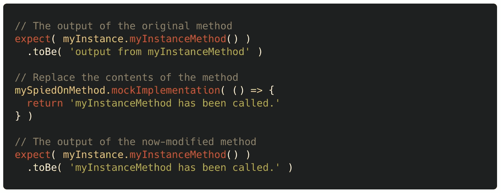
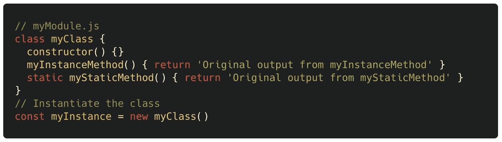
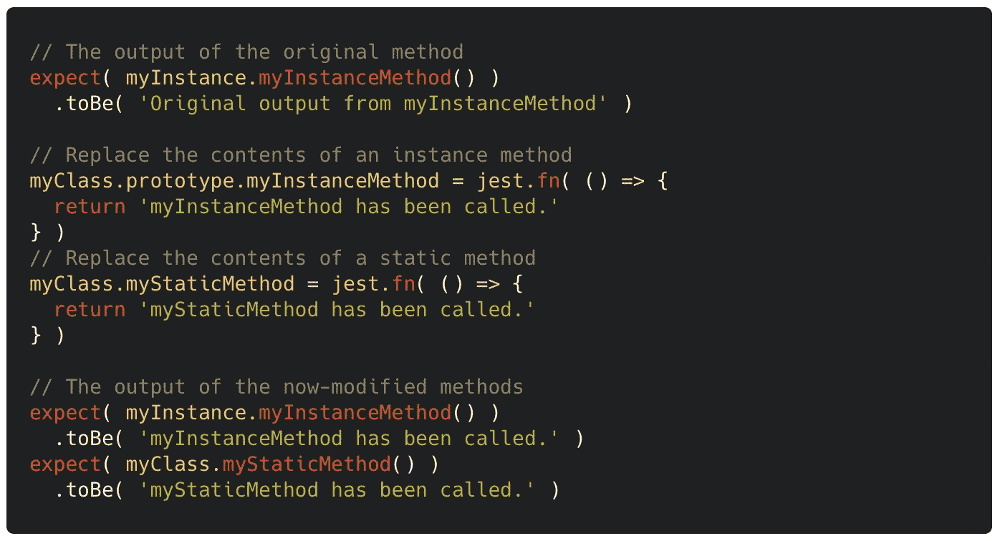
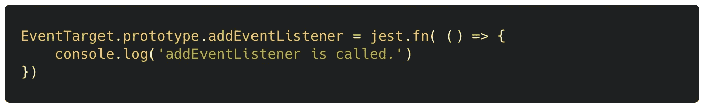

# 笑话间谍和嘲笑通过例子解释

> 原文：<https://javascript.plainenglish.io/jest-spies-and-mocks-in-explained-via-examples-71229077277f?source=collection_archive---------0----------------------->

## 测试

## 用这两个 Jest 方法让您的 JavaScript 测试更深入、更精简、更快速

Photo by [Petri Heiskanen](https://unsplash.com/@pheiskan?utm_source=unsplash&utm_medium=referral&utm_content=creditCopyText) on [Unsplash](https://unsplash.com/s/photos/eye?utm_source=unsplash&utm_medium=referral&utm_content=creditCopyText)

TL;DR

# 👁发现

`jest.spyOn( PROTOTYPE_OR_CLASS, METHOD_NAME )`

监视是在不改变方法本身的情况下观察对方法的调用。

## 窥探一种方法

假设您在一个模块中有一个类:

这就是你如何窥探**实例**和**静态**方法:

如果 **spy 被分配给一个变量**，你也可以通过一个变量访问它(而不是通过被监视的方法):

以下是一些可以和 spyOn 一起使用的**Jest matcher**:

## 窥探内置方法

内置方法对于间谍来说也不安全。你可以这样监视他们:

## 更改被监视的方法的实现

这被称为“模仿”，因为我们可以用这种方式模仿一个方法的行为，从而“模仿”这个方法。

您也可以使用`jest.fn()`替换方法的内容

# 👻嘲弄的

`METHOD = fn( () => {...} )`

你可以用 Jest mocks 临时替换一个方法的内容。

## 模仿一种方法

假设您在一个模块中有一个类:

您可以这样替换其方法的内容:

## 模仿内置方法

替换。带有模拟方法的 addEventListener 方法:

# 最后

我们已经看到了两种在代码中监视方法的方法。您可以使用`**jest.spyOn**`以一种非侵入式的方式来记录通话。或者，你可以使用`**jest.fn**`用一个方法的假版本来完全替换它，这叫做‘模仿’。

编码快乐！

*更多内容请看*[***plain English . io***](http://plainenglish.io/)