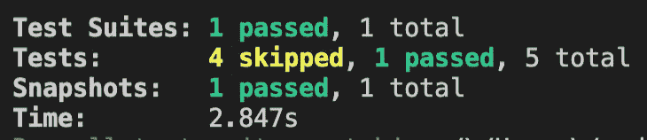
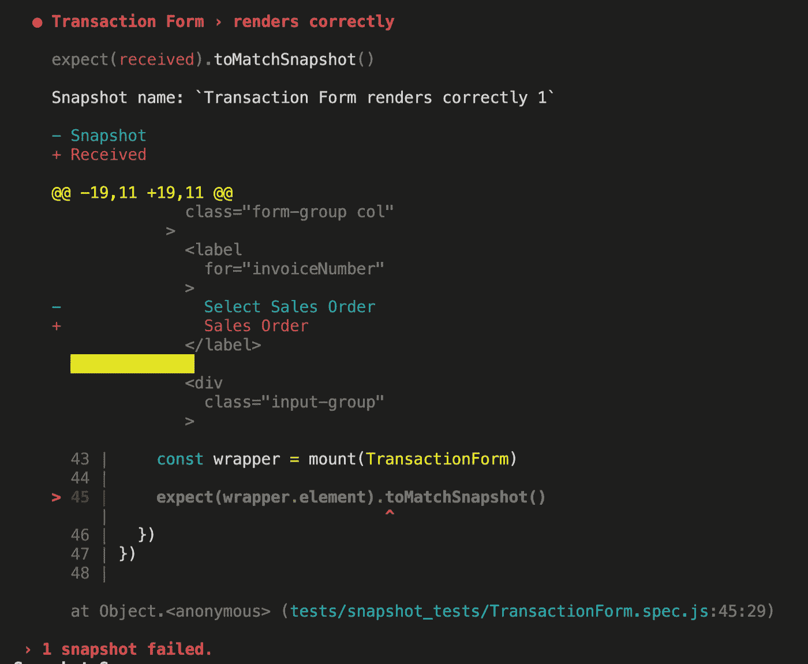
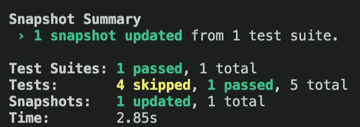
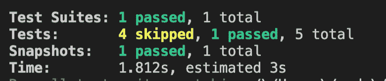
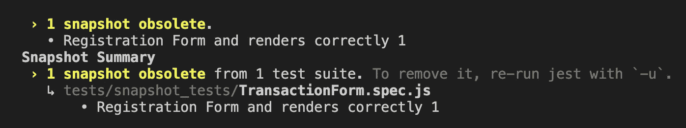
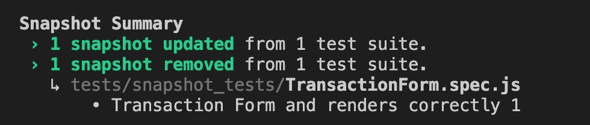

# Jest:如何更新快照测试

> 原文：<https://javascript.plainenglish.io/jest-updating-snapshot-tests-ef6c731cb68b?source=collection_archive---------3----------------------->


Photo by [Nubelson Fernandes](https://unsplash.com/@nublson?utm_source=medium&utm_medium=referral) on [Unsplash](https://unsplash.com?utm_source=medium&utm_medium=referral)

快照测试是测试 UI 的一个很好的方法，不需要手动检查每个元素是否可见，样式是否正确，位置是否正确。每个快照测试都有一个快照、JSON、JS 或 HTML 文件，它们通常位于这个目录`/__snapshots__`中。这些快照在您选择的时间序列化 UI，并将其保存到这个目录中，以供将来比较使用。每次快照测试运行时，都会生成一个新的快照，并与`__snapshots__`中保存的快照进行比较。这就是快照测试检测用户界面变化的方式，但是如果您想要改变呢？您将如何更新保存的快照以反映预期的更改？

这是我用来确保快照测试根据预期的变更进行更新的工作流程:

*   *运行快照测试，确保它通过—如果没有通过，找到问题并修复它，在测试通过之前不要更改 UI。
*   更改用户界面。
*   重新运行快照测试，它应该会失败，并且在失败时，它应该会检测到您所做的 UI 更改——如果它因为其他原因而失败，那么您可能在代码中引入了一个需要修复的 bug。
*   更新快照文件。
*   重新运行快照测试；它应该通过，如果失败，您可能更新了错误的快照文件。
*   提交对 UI 和快照文件的更改。

*这破坏了测试驱动的开发，因为我们不能提前编写测试。快照测试并不意味着驱动开发；因此 TDD 不适用于他们。此外，预测快照的外观并手动编辑快照也是浪费时间。

# 运行快照测试

我使用`yarn`，但是您也可以使用`npm`来运行快照测试:

```
yarn jest tests/snapshot_tests
```

我使用的是 Vue，所以测试命令使用 Vue CLI，它确保重要的 Vue 环境变量被加载并在 NodeJS 中工作。Vue CLI [最终](https://cli.vuejs.org/core-plugins/unit-jest.html#debugging-tests)会调用`jest`:

```
yarn vue-cli-service test:unit tests/snapshot_tests
```

输出应该是:



# 更改用户界面

我在标签的措辞上做了一点小小的改动。

之前:

```
<label for="invoiceNumber">Select {{ reference_label }}</label>
```

之后:

```
<label for="invoiceNumber">{{ reference_label }}</label>
```

# 重新运行快照测试—确认更改失败

标签从`Select {{ reference_label }}`更改为`{{ reference_label }}`。我希望快照测试能够捕捉到这种变化，所以重新运行测试，您应该会得到:



这里需要注意两件事:

*   快照名称`Transaction Form renders correctly 1`取自测试套件名称`Transaction From`加上测试用例名称`renders correctly`，Jest 附加了一个`1`——我猜是为了避免重复？
*   快照指出了在呈现的 HTML 中失败发生的地方**，而不是在 Vue 代码中。您需要转到故障输出下面提供的行号(屏幕截图底部以蓝色突出显示的链接)来查找错误的原因。尽管如此，这是一个很好的方法来查看 UI 的变化，并确定这种变化是错误还是有意的。**

# 更新快照文件

这将使用您所做的 UI 更改用新快照覆盖现有快照。

使用笑话:

```
yarn jest tests/snapshot_tests/TransactionForm.spec.js -u
```

使用 Vue CLI:

```
yarn run vue-cli-service test:unit 'tests/snapshot_tests/TransactionForm.spec.js' -u
```

`-u`是`--updateSnapshot`的简称。



# 重新运行快照测试—应该会通过

使用笑话:

```
yarn jest tests/snapshot_tests/TransactionForm.spec.js
```

使用 Vue CLI:

```
yarn run vue-cli-service test:unit 'tests/snapshot_tests/TransactionForm.spec.js'
```



# 提交更改

既然 UI 已经更新了，快照也更新了，测试也通过了，那么您需要提交所有的更改:

*   当然，用户界面会发生变化。
*   更新的快照文件。

只有当您存储快照并与您的队友共享时，快照测试才有效。因此，您需要提交快照。也就是说，它们是大文件，可能会扰乱您的拉取请求。我通常会跳过整个快照。相反，我依赖于 UI 更改的截图，并在快照中找到 UI 更改。

# 过时的快照

运行快照测试时，有时您会遇到过时的快照:



这意味着在你的某个地方，tests you [重命名为](https://stackoverflow.com/questions/57793527/what-are-obsolete-snapshots-and-snapshot-files)一个测试套件或用例，Jest 不能将快照测试映射到快照文件，因为名称不匹配。记住快照文件是由测试套件名称加上测试用例名称来识别的。

通过更新快照文件来解决此问题。这将用具有正确名称的新快照覆盖旧快照。每当您更改测试的套件或案例名称时，您都需要这样做。



# 来源

*   [Jest](https://jestjs.io/docs/snapshot-testing) 中的快照测试概述
*   Vue CLI 单元测试[文档](https://cli.vuejs.org/core-plugins/unit-jest.html#debugging-tests)
*   过时快照[测试](https://stackoverflow.com/questions/57793527/what-are-obsolete-snapshots-and-snapshot-files)

*更多内容请看*[***plain English . io***](http://plainenglish.io/)