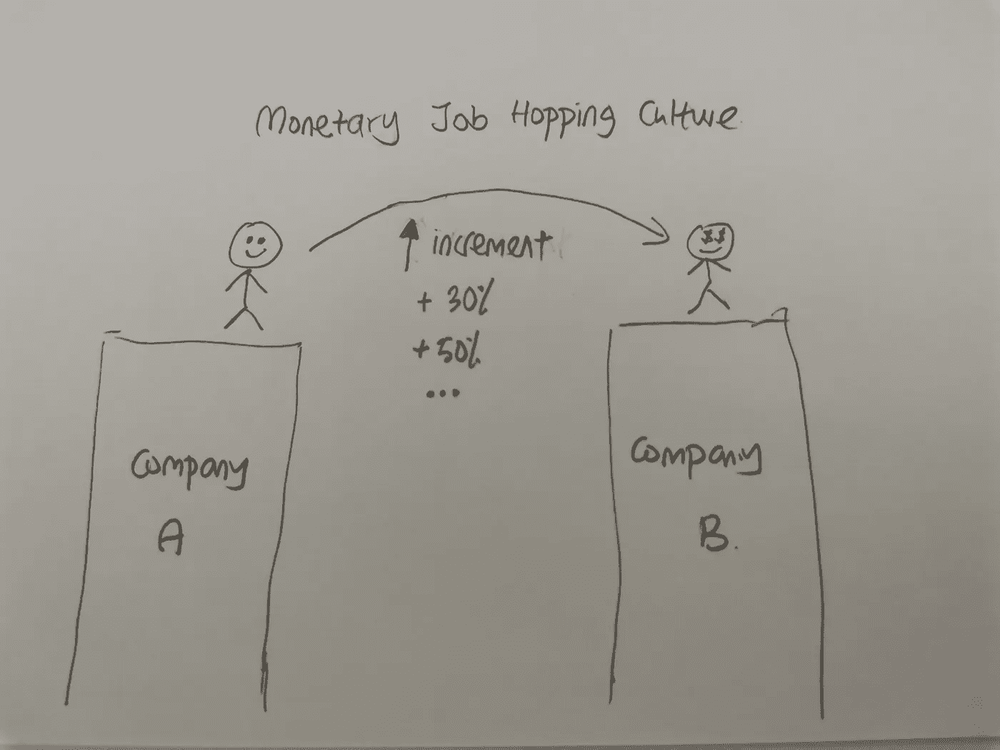

# 在科技领域，为了钱而跳槽是不好的

> 原文：<https://javascript.plainenglish.io/job-hopping-for-money-in-the-tech-field-is-bad-d58f2af59bca?source=collection_archive---------4----------------------->

Photo by [Jason Strull](https://unsplash.com/@jasonstrull?utm_source=medium&utm_medium=referral) on [Unsplash](https://unsplash.com?utm_source=medium&utm_medium=referral)

在这个故事中，我尽力从不同的视角去探究*金钱跳槽*的文化。

所有给出的观点都是真正基于个人判断和我自己的观点。

The Illustration of the Monetary Job Hopping Culture by [Hue Sook Yan](https://medium.com/u/afacfa67d61e?source=post_page-----d58f2af59bca--------------------------------)

## 定义

首先，让我来定义什么是*货币跳槽文化。*

> 一种人人都知道跳槽是获得更大增量的途径的文化。这确实是真的。

换句话说:

> 一个人换工作的频率成为他/她获得的增量的主要贡献。

## 为什么是不好的文化？

换句话说，当员工获得更大的加薪时，为什么是不好的呢？

从雇主的角度来看，重复的招聘过程对雇主来说可能是一场噩梦。做所有的筛选和面试候选人需要时间和精力。

从员工的角度来看，一个人的薪酬与他的跳槽次数成正比，这可能会“很奇怪”。

你跳得越频繁，薪水就越高。这种文化可能会导致员工仅仅因为追逐金钱而换工作。

看起来最终双方都是输家。

你同意我的观点，这是一种不好的文化吗？下面评论。开放讨论。

Photo by [Visual Stories || Micheile](https://unsplash.com/@micheile?utm_source=medium&utm_medium=referral) on [Unsplash](https://unsplash.com?utm_source=medium&utm_medium=referral)

## 是谁导致了这种文化？

我认为，雇主和雇员双方都有责任引入这种文化。

雇主如何促成这种文化:
1)预算不足。
2)看不到当前员工的价值。
3)不要频繁调整员工工资。

员工如何促成这种文化:
1)过高的期望薪资(然而技能差，态度差却能在面试中表现出色？).
2)太专注于“我得到了什么”而不是“我付出了什么”。

一些一般因素:
需求>供给。其他招聘者愿意出更高的薪水来得到一个有技能的学长。

## “理想的”文化应该是什么？

雇主的角色:
1)不时将员工的工资与当前市场工资保持一致，并做出调整。

员工的角色:
1)讨论并协调雇主的价值观*看*你和你*如何看*你自己和你的雇主。(认为这是*降低*员工对现实的期望和*提高*雇主对当前市场价格的了解的最佳方式)
2)在做决定时不要将加薪作为主要因素。不时反思一下你对当前公司的贡献，弄清楚你的贡献是被高估了还是被低估了。

最后，我希望你喜欢阅读这个故事，我希望它有助于培养你从不同的角度思考这个文化。

PS。我是一名超级应届毕业生，九个月前刚刚开始我的技术生涯(web 开发)。因此，我的观点可能不够高。我真的希望你们能在下面评论你们的想法。

让我们互相提高，培养更多不同的思维方式。❤

既然你一直读到这里，那么为什么要做一个陌生人呢？通过 [LinkedIn](https://linkedin.com/in/syhue) 联系我。

祝你愉快。

*更多内容尽在*[***plain English . io***](http://plainenglish.io)