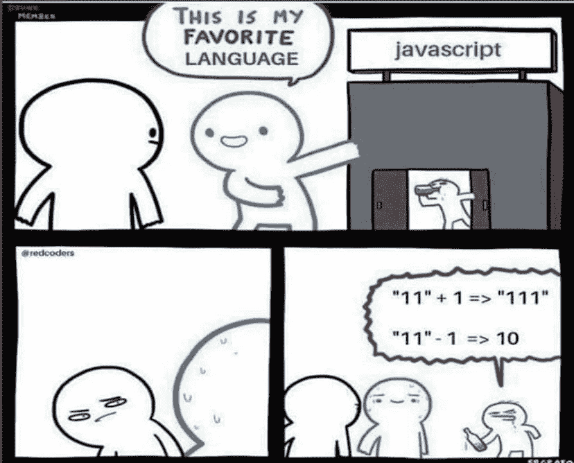
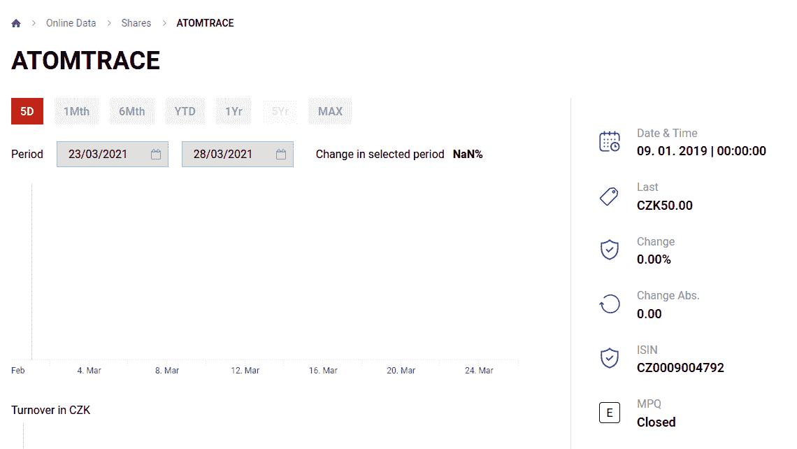
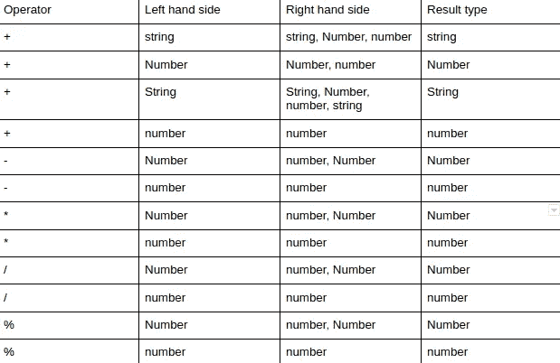

# JonScript:更好的 JavaScript

> 原文：<https://javascript.plainenglish.io/jonscript-a-better-javascript-a7ebe55707b9?source=collection_archive---------1----------------------->

## 我创造了自己的 JavaScript 替代语言。

# 介绍

你好！你喜欢 JavaScript 吗？如果没有，请不要点击离开。作为一名 JS 开发人员，当你不得不使用它时，我理解你的痛苦，我想我可能有一个解决方案:一种编译成 JavaScript 的新语言！我知道这种说法本身已经成为一种迷因，经常被开发者模仿。但是，听我说完:这一次，可能会有所不同。

我想你可能听说过 JS 开发出错的恐怖故事。这些恐怖故事已经遍布整个编程世界，并催生了许多让我们 JS 开发人员笑而不哭的模因:



*来源:*[*https://dev . to/damxipo/JavaScript-vs-memes-explaining-variable-滑稽-memes-2o8c*](https://dev.to/damxipo/javascript-versus-memes-explaining-various-funny-memes-2o8c)

另一方面，JavaScript 是世界上最流行的语言，而且已经流行了一段时间。它是 web 开发的主干，有许多令人惊叹的特性，以及各种各样的框架和扩展。这种流行的最重要的原因是 JS 与网络浏览器的紧密联系。在无处不在的网络应用时代，运行在网络浏览器中的语言必然会流行起来。当然，JS 持续流行的另一个重要原因是它已经存在的用户群:人们使用 JS 是因为它受欢迎。

而且有些人气甚至是赚来的！例如，JS 是一种很好的原型语言。如果你想坐下来写一个快速的应用程序来测试一个想法，JS 将为你工作。它还增加了许多简洁的函数式编程特性，使许多常见类型的样板模式消失了。还有一个由有用的包和框架组成的完整生态系统，使 web 开发变得更加容易。

所以有理由不讨厌它。

但是有很多理由讨厌它。让我们一个一个地检查大的。

一个。做同一件事有太多的方法。我能说出两三种创建对象的方法，三种定义变量的方法，三四种定义函数的方法。种类繁多可能会让人不知所措，但是一个有经验的开发人员可能会说:*“但是这些只是细节！我们应该关注代码做了什么，而不是语法“*”。然而，事情并没有那么简单。

不仅仅是语法上的差异，在运行时还有实际的、微妙的和危险的差异。对我来说，它们基本上是一种引入微妙但重要的错误的机制。但不要相信我的话，互联网上到处都是试图帮助人们应对这些变化的帖子。 *⁰*

两个。标准库不一致。有很多例子，但是考虑一下如何使用 JavaScript 的 Date 类来表示 2021 年 4 月 1 日。大概是这样的，对吧:

```
new Date(2021, 4, 1)
```

不，当然不是。这显然是 5 月 1 日，因为月份(只有月份)是零索引的。甚至写它的人也洗手不干了。*“嗯，其实”**我已经听你说过了，“这是有原因的。程序员用这样的方式来表示月份是一个由来已久的传统。毕竟，月份实际上不是一个数字，它只是一个枚举类型的数字表示。这里，看看 POSIX localtime。”也许这是我们应该摒弃的有害传统之一。*

三个。不是数字就是数字。当您执行与数字相关的无效操作时，结果可能是 *NaN* 。如果您尝试对这样的值进行类型检查，它的行为就好像它是一个常规数字一样。

```
typeof NaN === “number” // is true
```

它像数字一样相加，像数字一样相除，更重要的是，它像数字一样打印和连接(有时)。但是你不想让“ *NaN%* ”出现在你的网站上。



*来源:*[*https://www.pse.cz/en/detail/CZ0009004792*](https://www.pse.cz/en/detail/CZ0009004792)*，布拉格证券交易所网站*

没有它，JS 开发人员会过得更好。

四个。有很多很多奇怪的语义。例如，与所有数学定律相反，一个 JS 对象既不同于另一个相同的对象，同时又大于等于和小于等于它。*“但是！”*你可能会说*“数学是一回事，但是这些符号在 JavaScript 中并不意味着它们在数学中的相同操作。如果你读过标准中对这些操作的描述，就会明白了。”*但是⁴有很多这样的陷阱，我们不能指望每个人都能马上发现它们，尤其是对 JavaScript 新手来说。

五个。课程并不像它们看起来的那样。ES6 给语言增加了几个关键词。其中一个是*级*。这是因为这种语言需要更受新开发人员的欢迎。

但这是一把双刃剑⁷.当开发人员看到单词 class 时，他们会做出几个隐含的假设。其中最重要的是:方法不能重定义，对象不能在运行时改变类，类没有动态生成的属性。这就是 Java、C++、Python 和其他他们可能熟悉的语言中类的工作方式。

但是在 JS 中，这些假设是不正确的。JavaScript 没有基于类的继承系统。JavaScript 使用它自己版本的原型继承，⁸，这允许更多的灵活性，但是很容易被误解。

```
*class Bitcoin {
 constructor(value) {
    this.value = value;
 }
 valueOf = () => this.value;
}**// Define another public function
Bitcoin.prototype.next = function() { return this.value * 2; }*
```

这看起来像一个带有公共函数的类定义，对吗？

假设这是一个类，你会认为这个定义是不可变的，对吗？

这些假设最终可能会破坏一个新的 JS devs 应用程序——因此导致许多令人头疼的问题。

# 我和其他人

好吧，但也许只是我。也许成为一名 JavaScript 专家意味着毫不费力地在这些危险的浅滩中航行，所有真正高级的 JavaScript 开发人员都会觉得我的反对很奇怪。幸运的是，我碰巧和一些专业的 JavaScript 开发人员一起工作，他们的简历很长，令人印象深刻，所以我问了他们。

我用 12 个问题做了一个测试，检查对语义的理解，每个问题都是为开发人员设置的一个狡猾的陷阱。这是一个选择题，每个问题有三个可能的答案，其中一个是正确的。这些问题给出了代码示例，并要求受害者参与者解释 JavaScript 及其标准库的语义。参与者有无限的时间来回答每个问题。这里有一个问题示例:

```
If `window` has 222 properties, what is the value of variable `c` after executing:

 console.log(t); const c = Object.keys(window).length; var t = 1;
```

1.  *未定义*
2.  *第 222 章*
3.  *223*

你可以在这里看到所有的问题——[https://ivlv.me/kNgHW](https://ivlv.me/kNgHW)以及它们背后的推理。你也可以试着回答这些问题。(但不准作弊！)当然，这不是最科学的研究，但我认为结果很能说明问题。

最高分是 12 分中的 7 分，其他都低于 4 分。来自我的小型焦点小组的结果表明，即使是有经验的 JavaScript 开发人员也很难区分语言原语、它们的类副本、执行上下文相关的函数、日期和对象类的行为、*类型的* ⁵和*实例的* ⁶操作符等等。

因此，即使是经验丰富的 JavaScript 猴子也总是出错。这重要吗？也许这些奇怪的情况不会经常出现，这只是一些琐事，但这些微妙之处似乎会导致现实世界的错误(我可以再次指出布拉格证券交易所)。

链接:[http://www.ece.ubc.ca/~frolino/docs/js_bugs_study_paper.pdf](http://www.ece.ubc.ca/~frolino/docs/js_bugs_study_paper.pdf)

# 这是怎么回事？

好吧，所以语言不好。但更重要的是，在无休止地列举我的不满时，一个问题出现了。JavaScript 为什么会这样？它并不是不在一些非常有能力的人的管理之下。鉴于互联网的现状，他们并不是不知道这些问题的存在。

JavaScript 是一种通用语言，对其实现没有太多的控制，但对向后兼容性负有巨大的责任，因为如果 JavaScript 突然停止支持某个特性或改变语义，我们可能会发现这是一个半个互联网都依赖的死角。换句话说，这比让一些开发者高兴要高得多。⁹

ES5 人员提出的一个解决方案是在 JavaScript 中引入一种可选模式，这种模式会限制您的操作，但在其他方面会向后兼容。我认为这是朝着正确的方向前进。例如，严格模式⁰不允许您分配只读变量或删除类的原型。好东西。另一方面，严格模式不会解决我上面列出的任何问题。

那么，除了遵守纪律，希望生产你的产品所依赖的那个模块的公司没有雇用任何轻率的开发人员，还剩下什么呢？解决方案可以通过语言扩展或者编译成 JavaScript 的语言的形式找到。像打字稿、咖啡稿、琥珀等项目。

Typescript 引入了编译时键入来防止错误，咖啡脚本从 JS 中删除了类似 Java 的语法，以使其更像 FP，Amber 是 SmallTalk 的一种方言，它会将文件传输到 JS 中(因此完全避免了 JS 语法)。

虽然这些项目是朝着正确方向迈出的一步，但我认为这些语言没有解决一些问题。让我们复习一下。

**打字稿**。虽然它有着惊人的用户群，而且许多 JS 项目现在都有了打字功能，使它们与 ts 兼容，但它不会阻止您遇到许多运行时问题。这是由于 TS 的理念:从不影响运行时，只给出编译时信息。这方面的一个例子可能还是你网站上显示的可怕的 *NaN%* 。

**咖啡脚本**。虽然它可以随心所欲——从 JavaScript 中删除 Java 语法，但它也增加了一些令人惊讶的特性。例如，有中缀条件，如 *doSomething()(如果条件== true* )，以及字符 *@* 而不是访问器 this。这是有问题的，因为大多数主流开发人员不习惯这种陌生的语法。更糟糕的是，咖啡脚本也无法保护您免受网站上显示的可怕的 *NaN%* 😃

**琥珀色**。虽然 SmallTalk 在某些圈子里是一种非常流行的语言(想到的是大学)，但它是一个小社区。Amber 是这种神秘语言的一种方言，它受到这种情况的困扰，因为它几乎没有得到社区的支持。因此，很难了解或专业使用它。

不过，琥珀实际上会保护您免受可怕的 *NaN%* 问题的困扰！而是崩溃并显示错误信息。这是不合适的，因为它可能会阻止用户看到您网站上的任何内容。

# 我对此做了什么？

所以，我决定发展我自己的语言。我把它命名为 **JonScript** ，因为我的名字是 Jon，它会编译成 JavaScript。JonScript 做了一些不同的事情。它结合了 Typescript 中的类型、Coffeescript 中的函数式编程，并致力于解决 JavaScript 操作符和标准 API 长期存在的问题。

需要考虑的重要一点是，JonScript 使用类型化不仅仅是作为编译类型的帮助，而是影响语言在运行时的行为。由于这种类型依赖性，JonScript 只需要 TS 包。由于 Typescript 在⁴非常流行，而且许多家用 JS 包都与 TS 兼容，这应该不是问题。

以下是 JonScript 的指导原则:

1.  **一致性**:做事只有一种方式；
2.  **兼容性**:使用类型脚本库，使用类型脚本代码；和
3.  可用性:当前的 JavaScript 开发者应该能够快速理解这门语言。

接下来，让我们讨论一下 JonScript 的主要特性，以及为什么我认为熟悉它是个好主意。请记住，JonScript **还处于 alpha 阶段——还没准备好全面生产。尽管如此，它仍然有效，你已经可以在上面写字了。如果您想亲自试用 JonScript，请下载 npm 包 **jonscript** ( [链接](https://npmjs.com/package/jonscript) ) ，然后像这样建立一个基本的 webpack ⁰构建:**

```
const path = require(“path”);
module.exports = {
   entry: {
      **“jons”: “./src/index.jons”,**
      “index”: “./src/index.ts”,
   },
   mode: “development”,
   module: {
      rules: [
          **{
             test: /\.jons$/,
             use: “jonscript”,
             exclude: /node_modules/,
          },** {
             test: /\.tsx?$/,
             use: “ts-loader”,
             exclude: /node_modules/,
          },
      ],
   },
   resolve: {
      extensions: [ “.tsx”, “.ts”, “.js”, **“.jons”** ],
   },
   output: {
      filename: “[name].js”,
      path: path.resolve(__dirname, “dist”),
   },
};
```

这将把 JonScript 编译成 TS 文件。接下来你需要做的就是从 jons-temp 文件夹中导入它们并运行应用程序。如果第一次构建失败，再试一次——web pack 可能没有注意到正在解析的 JonScript 文件。我会尽快解决这个问题。

接下来，让我们看看 JonScripts 最重要的特性:

# 只是一种功能

在 JonScript 中创建或执行的所有函数的行为都类似于箭头函数。这是通过在编译期间检测函数并自动绑定它们的执行上下文来实现的。这包括标准 API 函数和从任何模块导入的所有函数。

```
Module {
    TestClass() {
        privateProperty: [1, 2, 3, 4],
        // .map function will be bound to privateVariable
        privateMethod: privateProperty.map,
        {
           publicMethod: () => privateMethod(i => i + 1),
        }
    }
}
```

虽然这可能会破坏依赖于这种行为的遗留包，但是有一个解决方案。JonScript 允许从 ts 文件导入。这意味着 JonScript 不会限制您使用标准的 JavaScript 特性——它只是试图引导您走上一条更安全、更好的道路。

# 只是一种空

所有的 nulls 和 nan 都转换成一种类型:undefined。未定义的值将在连接过程中转换为空字符串。从对象中删除所有空值键。此外，由于下面进一步讨论的操作符中的修复，您永远不需要担心未定义的属性会出现在您的网站上。未定义的值作为“nil”原语存在。类似地，TS 开发人员知道的“空”类型也简单地变成了“零”。

以下是实际情况:

```
Module {
   TestClass() {
      {
          // Converts NaN into undefined
          publicMethod: () => (0 / 0), 
          // Returns simply “%”
          otherPublicMethod: () => publicMethod() + “%”,
      }
   }
}
```

# 模式匹配算子

JonScript 引入了一个新的二元运算符*是*。is 操作符有效地充当了 typeof 和 instanceof 的替换，但不仅仅如此。它也是一种类型强制的方式，类似于 Typescript 中的 is 谓词。

首先，我们来谈谈 JS 中的*实例和*的*类型的区别以及我为什么删除它们:*

*   *typeof* 是一元前缀运算符，返回变量的类型。
    可以返回“未定义”、“字符串”、“数字”、“bigint”、“对象”、“函数”或“符号”。您可能会注意到列表中缺少了 array 和 null 它们都是对象。数字类和字符串类呢？它们也是物品。为了找出一个对象实际上代表什么，你必须做进一步的检查。

```
typeof null === “object”
/* and */
typeof [] === “object” /* is true */
```

这也导致了不直观的区别:

```
typeof 2 === “number”
/* is true */
typeof new Number(2) === “number” /* is false */
```

*   instanceof 是一个二元中缀运算符，它试图访问一个对象的 *__proto* 属性。JS 就是这样决定一个对象属于哪个类的。

```
[1, 2, 3] instanceof Array
/* is true */
2 instanceof Number /* is false */
```

*   这很奇怪。为什么 number 不是 Number 的实例？！这就更奇怪了，因为你可以在原语上调用方法！原来 instanceof 只对函数和对象类型有效。

既然你知道 JS 是如何做类型检查的，现在让我们来谈谈 TS 中的 is 谓词。

TS 中的 is 谓词充当类型保护。你用它代替函数的返回类型。该函数必须返回一个布尔值。当在条件中执行此函数时，Typescript 会将传递给函数的参数视为强制参数。

```
const isFish(
   pet: Fish | Bird
): pet is Fish => (pet as Fish).swim !== undefined;let pet = getSmallPet();// Both calls to ‘swim’ and ‘fly’ are now okay.
if (isFish(pet)) {
   pet.swim();
} else {
   pet.fly();
}
```

*来源:*[*https://www . typescriptlang . org/docs/handbook/advanced-types . html*](https://www.typescriptlang.org/docs/handbook/advanced-types.html)*。*

JonScript 将的*类型、*的*实例的功能结合到一个操作符中。它既进行类型强制，又在同一级别上处理原语和类。但是它变得更好了——一种模式匹配算法被用来使 JonScript 比以上的组合更强大。我不想在这里讨论这个算法的细节，因为它有点复杂。因此，为了展示 JonScript 可以匹配什么，下面是它的模式匹配的一个小例子:*

```
Module {
   TestClass() {{
      value1: 2,
      value2: “Hello”,
      value3: {{ value1, value2 }},
      pattern1: Number,
      pattern2: String,
      pattern3: {{ value1: Number }},
      pattern4: {{ value2: String }},
      pattern5: {{ value2: Number }},
      results: [
         value1 is pattern1, // true
         value2 is pattern2, // true
         value3 is pattern3, // true
         value3 is pattern5, // false
         value2 is pattern1, // false
      ],
   }}
}
```

使用名为 matchto 的库来实现。⁹ NPM 使用版本控制系统来确保对这个库的随机更新不会改变 JonScript 的行为。

# 自动插入新关键字

Typescript 可以确定对函数的调用是否具有类签名。我们用这个来简化语言语法，以便插入新的关键字，这样 JonScript 开发人员就不需要这么做了。

这对运行时也有实际好处:根据测试，大多数 JS 开发人员认为 *new* 关键字是简单的语法糖。这是不对的。

例如，调用 *Date()* 和 *new Date* 会产生不同的结果。如果您想知道为什么在调用 *new Date* 时没有括号，您可能会同意从语言中删除 new 关键字是有益的。

# 自动异步关键字插入

我们使用 Typescript 来检查表达式是否返回承诺。我们用它来简化语言语法，以便在需要的地方插入 async 关键字。JonScript 的语法中甚至不需要那个关键字。

Async 确保函数返回的任何值都采用承诺的形式。这使得在 JonScript 中使用 promise 更加安全:

在这里，您可以看到一个函数示例，如果您尝试使用 promise 回调，该函数可能会在 JS 中崩溃:

```
const funct = (i) => i > 5 ? 5 : new Promise(then => then(5));
```

# 一类

JonScript 有一种类和一种继承——原型继承。它没有利用 JS 中使用的原型对象。相反，它分析表达式的类型，类或对象从这些表达式中继承并定义适当的局部变量，然后将这些变量的值作为类的公共属性添加。这里有一个简单的例子:

```
// imports a class with single public property of “a”
import { parentClass } from ”./parentClass”
Module {
   TestClass() {
      privatePropertyOfClass: 5,
      …parentClass(), // TestClass inherits from parentClass
      {
         publicMethod: () => {
             privatePropertyOfObject: ”Hello”,
             {
                // 1, 2 property “a” from parentClass
                publicPropertyOfObject: [1, 2, a],
             }
         },
         // You can also access “a” from instance of TestClass
      }
   }
}
```

# 简单递归

这个特性对于有经验的 Typescript 开发人员来说是一个额外的好处。JonScript 允许所有 JonScript 对象和类的递归类型定义。

```
Module {
   TestClass() {{
      publicObject: {{
         publicObjectProperty: 5,
      }},
      publicMethod: (parameter: Class<TestClass>) => parameter,
      anotherPublicMethod: (
         parameter: Object<publicObject>
      ) => parameter,
   }}
}
```

# 宽恕是正确的

与 JavaScript 类似，JonScript 是一种宽容的语言，但更好。访问、调用、做加法等。在 nil 值上产生一个简单的 nil 值(除了串联——nil+“Hello”产生“Hello”字符串)。所有不兼容的操作，例如，比较字符串和数字，从数字中减去字符串等。结果也是零。

**操作员超载和合理强制**

我们知道 JS 运算符很奇怪。在实现 JonScript 时，我想到的一个目标是:如果在类上使用操作符(如 string 或 Number ),应该得到一个类——在 JavaScript 中，包含 String 类对象的字符串连接会产生一个 String 原语。这样比较一致和直观。

未定义的操作，如字符串相减、对象相乘或对数组取模，应该返回 Undefined(在 JonScript 中为 nil)。与 JS 类似，JonScript 使用 *+* 操作符作为连接和加法。

JonScript 支持运算符重载。重载是通过在对象或类上定义这些方法之一来完成的:加、减、除、乘、模或比较(对于比较操作，如果对象相等，则返回 0，如果左大于右，则大于 0，如果相反，则小于 0)。所有重载方法都必须用单个参数定义。

操作员重载在左侧和右侧都起作用:

```
overloaded + “hello” /* same as */ “hello” + overloaded
```

有一个例外。当使用两个重载对象时，应用左侧。下面是算术运算和结果类型的表格。切换左手边和右手边不会影响结果的类型。表中的字符串/字符串和数字/数字术语表示字符串和数字原语及其类对应物之间的差异。



Table of arithmetic operations

接下来，我们来谈谈比较运算符。他们有相似的常识性规则。强制是有限度的:可以比较 string/String 和 number/Number，得到的结果就像比较两个原语一样。字符串和数字之间的交叉比较总是会导致错误。任何对象比较，除了预期的相等之外，也总是导致 false。

用于比较的运算符重载的工作方式与算术运算相同。对象的相等和不相等的决定方式与 JavaScript 中的相同(指针比较)。

# 还需要做什么？

这就是 JonScript。

我希望我有无限的时间和资源来完善 JonScript。可悲的现实是，JonScript 的 alpha 版本还有很长的路要走。以下是它的问题:

# 将修复

由于时间限制，这些问题/特性没有添加到 JonScript 中。我将把它们和该语言的未来版本一起发布，或者将它们放在一个实用程序包中发布。

**插值字符串转义不足**

为了对插值字符串中的字符“$”、“{”或“}”进行转义，需要使用“\”。在普通 JS 中，只需要转义“$”。这将在未来版本中通过更好的解析得到解决。

**没有 JSX 的支持**

JonScript 的未来版本将包含完整的 JSX ⁶支持和默认的 React 导入。

**标准 api 修复不足**

虽然在 *Object.keys* 、values 和 entries 以及 *Array.push* 方法的类型和执行方面存在修复，但这绝不是对 std 的完全修复。API。未来的版本将包含更全面的修复。这些修复保证只会直接影响 JonScript 中代码的执行，而不会破坏与 TS 库的兼容性。

**地图文件**

映射文件允许程序员通过将 transpiled 代码映射回原始代码来调试它。未来版本的 JonScript 将包含一个与 webpack 兼容的地图文件生成器。

**Visual Studio 代码扩展**

Visual studio code 是微软开发的一款开源、可扩展的 IDE。未来将推出一个 JonScript 扩展。最重要的功能是:语法高亮，调试和代码参考。

# 可能修复

这些问题需要更多的研究时间，而我目前没有时间。它们可能会在未来的版本中修复，这取决于大众的需求以及是否有可能修复它们。该列表还包括具有多个可能解决方案的问题。

**可空类型有时会导致类型问题**

由于语言中存在空值宽恕，TS 有时会错误地将这种宽恕解释为可能的空值，并抛出一个错误。这些错误可以通过使用可空类型或空检查来避免。这将在未来的版本中得到解决，要么只允许显式可空类型，要么将 JonScript 中的所有类型都设为可空⁵.

**操作员是否无法将对象与原型类进行匹配**

如前所述，JonScript 只使用原型继承。这产生了一个有趣的问题:想象一下试图在原型继承系统上使用像 instanceof 这样的操作符。每个类可以有多个父类，每个父类可以重写其他父类的属性和方法。每个类也可以移除/覆盖父类的方法。因此，您可以构建一个没有其父方法的类。

因此，判断一个对象是否属于某个类没有什么价值。虽然 is 操作符支持 instanceof 操作，但同样的支持并没有扩展到 JonScript 类。相反，您可以简单地使用一个类的属性作为在模式匹配过程中使用的指示器。这在未来可能会改变。

```
// Can't do this yet
testClassInstance is TestClass
// But CAN do this - and Typescript will take care of rest
testClassInstance is {{ testProperty: "correctValue" }}
```

**构建流程需要优化**

构建过程需要多长时间还有很大的改进空间。当使用类继承时，编译速度会大大降低，我将在以后讨论这个问题。

# 不会修复

这些问题与 JS 引擎、兼容性或执行速度有关。我不太可能修好这些。

**无深度对象清理**

当在 JonScript 中创建对象时，您有几个保证—递归类型，没有空值键。⁷当从 JonScript 外部导入一个对象时，既没有递归类型，也没有直接清理。这样做是出于兼容性和性能的原因。但是，如果使用对象的属性，该属性将被自动清理。

**原始人和他们的同类⁸之间的细微差别**

虽然从 JonScript 中完全删除了 Boolean 类，但是有一个很好的理由:

```
new Boolean(false) == false
/* is true, but: */
!new Boolean(false) /* is false!!! */
```

字符串和数字类获得了额外的用途——运算符重载和模式匹配。但是你需要小心:空字符串的字符串类和零的数字类不是假的，而它们的原始对应物是假的。也不可能重载原始值的属性，比如 boolean、string 或 number(或者在继承中使用它们)。

# 结论

有许多工作要做。已经做了很多工作。JonScript 允许我探索 JavaScript 的深度。我希望这篇文章对任何寻求更好地理解 JS 和 JS 替代品的开发人员有所帮助。我希望我让您相信了 JonScript 是一个有趣的项目，并且它具有未来的潜力。也许你会试一试！

JonScript 是我硕士论文的一部分。当我完成工作后，我会在这里添加一个链接来获得更多信息。

辛西娅·李。什么时候(以及为什么)应该使用 ES6 箭头功能，什么时候不应该使用。[https://www . freecodecamp . org/news/when-and-why-you-should-use-es6-arrow-functions-and-when-you-should nt-3d 851 D7 f0b 26/](https://www.freecodecamp.org/news/when-and-why-you-should-use-es6-arrow-functions-and-when-you-shouldnt-3d851d7f0b26/)

脚注 2:
胡安克鲁兹马丁内斯。何时不使用 JavaScript 函数。[https://livecodestream . dev/post/when-not-to-use-JavaScript-arrow-functions/](https://livecodestream.dev/post/when-not-to-use-javascript-arrow-functions/)

脚注 3:
安德鲁·克尼格-包蒂斯塔。3 个何时不使用 JavaScript 箭头函数的示例
[https://better programming . pub/3-示例-何时不使用-JavaScript-Arrow-Functions-90 eeb BF 7 bb 0](https://betterprogramming.pub/3-examples-of-when-not-to-use-javascript-arrow-functions-90eebfbf7bb0)

脚注 4:
德米特里·帕夫卢丁。何时‘不’使用箭头功能。
[https://dmitripavlutin . com/when-not-to-use-arrow-functions-in-JavaScript/](https://dmitripavlutin.com/when-not-to-use-arrow-functions-in-javascript/)

脚注 5:
德米特里·帕夫卢丁。Arrow 函数和常规函数的区别。
[https://dmitripavlutin . com/differences-between-arrow-and-regular-functions/](https://dmitripavlutin.com/differences-between-arrow-and-regular-functions/)

脚注 6:
德米特里·帕夫卢丁。编写高质量 JavaScript 变量的 5 个最佳实践。[https://dmitripavlutin . com/JavaScript-variables-best-practices/](https://dmitripavlutin.com/javascript-variables-best-practices/)

脚注 7:
亚什·阿格拉瓦尔。在 ES6+ JavaScript 中声明变量。[https://code burst . io/declaring-variables-in-es6-JavaScript-60ea 37 e 38765](https://codeburst.io/declaring-variables-in-es6-javascript-60ea37e38765)

克里斯·恩万巴。声明 JavaScript 变量:var，let 和 const
[https://scotch . io/courses/10-need-to-know-JavaScript-concepts/declaring-JavaScript-Variables-var-let-and-const](https://scotch.io/courses/10-need-to-know-javascript-concepts/declaring-javascript-variables-var-let-and-const)

脚注 9:
达南杰·库马尔。用 JavaScript 创建对象(4 种不同的方式)。
[https://www . geeks forgeeks . org/creating-objects-in-JavaScript-4-different-ways/](https://www.geeksforgeeks.org/creating-objects-in-javascript-4-different-ways/)

脚注 10:
Ashutosh K Singh。用 JavaScript 创建对象的三种不同方式。
[https://better programming . pub/three-different-way-to-create-objects-in-JavaScript-d 3595d 693296](https://betterprogramming.pub/three-different-ways-to-create-objects-in-javascript-d3595d693296)

脚注 11:
[https://twitter.com/BrendanEich/status/771006397886533632](https://twitter.com/BrendanEich/status/771006397886533632)

脚注 12:
当地时间(3)
[https://linux.die.net/man/3/localtime](https://linux.die.net/man/3/localtime)

脚注 13:
明科·格切夫。JavaScript，奇怪的部分。
[https://blog . mge chev . com/2013/02/22/JavaScript-the-verged-parts/](https://blog.mgechev.com/2013/02/22/javascript-the-weird-parts/)

脚注 14:
标准 ECMA-262。5.1 版/2011 年 6 月。ECMAScript 语言规范。第 11.8 节:关系运算符。
[https://262.ecma-international.org/5.1/#sec-11.8](https://262.ecma-international.org/5.1/#sec-11.8.3)

脚注 15:
操作员文档类型
[https://developer . Mozilla . org/en-US/docs/Web/Javascript/Reference/Operators/type of](https://developer.mozilla.org/en-US/docs/Web/JavaScript/Reference/Operators/typeof)

脚注 16:
操作员文档实例
[https://developer . Mozilla . org/en-US/docs/Web/Javascript/Reference/Operators/instance of](https://developer.mozilla.org/en-US/docs/Web/JavaScript/Reference/Operators/instanceof)

脚注 17:
为什么不使用类
[https://daily . codes/JavaScript/please-stop-using-classes-in-JavaScript/](https://everyday.codes/javascript/please-stop-using-classes-in-javascript/)

脚注 18:
JavaScript 中的原型继承
[https://www . educative . io/blog/understanding-and-use-Prototypal-inheritage-in-JavaScript](https://www.educative.io/blog/understanding-and-using-prototypal-inheritance-in-javascript)

脚注 19:
。JavaScript 无法修复！
[https://medium . com/JavaScript-non-grata/as-others-noted-the-fundamental-problem-with-web-development-is-the-JavaScript-is-a-broken-7f 9675048 c77](https://medium.com/javascript-non-grata/as-others-have-noted-the-fundamental-problem-with-web-development-is-that-javascript-is-a-broken-7f9675048c77)

脚注 20:
AP hinya Dechalert
[https://dottedsquirrel . com/JavaScript/how-JavaScript-still-has nt-has nt-broken-the-internet-just-yet/](https://dottedsquirrel.com/javascript/how-javascript-still-hasnt-broken-the-internet-just-yet/)

脚注 21:
打字稿
[https://www.typescriptlang.org/](https://www.typescriptlang.org/)，

脚注 22:
coffee script
[https://coffeescript.org/](https://coffeescript.org/)

脚注 23:
琥珀
https://www.npmjs.com/package/amber

脚注 24:
Typescript popularity
[https://venturebeat . com/2020/12/02/github-python-and-Typescript-gain-popularity-in-programming-languages/](https://venturebeat.com/2020/12/02/github-python-and-typescript-gain-popularity-among-programming-languages/)

脚注 25:
高级类型脚本类型
[https://www . typescriptlang . org/docs/handbook/Advanced-types . html](https://www.typescriptlang.org/docs/handbook/advanced-types.html)

脚注 26:
反应
[https://reactjs.org/docs/introducing-jsx.html](https://reactjs.org/docs/introducing-jsx.html)

脚注 27:
JS 对象结构内的问题示例
[https://dmitripavlutin . com/check-if-object-has-property-JavaScript/](https://dmitripavlutin.com/check-if-object-has-property-javascript/)

脚注 28:
字符串与字符串的区别
[https://developer . Mozilla . org/en-US/docs/Web/Javascript/Reference/Global _ Objects/String](https://developer.mozilla.org/en-US/docs/Web/JavaScript/Reference/Global_Objects/String)

脚注 29:
马契托库
https://www.npmjs.com/package/matchto T2

脚注 30:【https://www.npmjs.com/package/webpack】网络包
T6