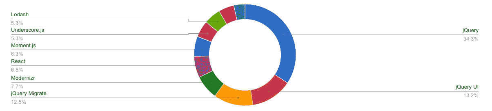
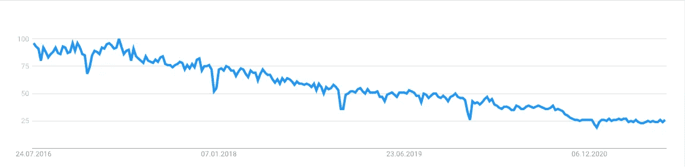

# 2021 年 jQuery 的状态如何？

> 原文：<https://javascript.plainenglish.io/jquery-7be2b63d720e?source=collection_archive---------4----------------------->

## Java Script 语言

## jQuery 还值得学习吗？


Source: [pixabay.com](https://pixabay.com/de/photos/technologie-computer-code-1283624/)

正常人认为怀旧是老照片、音乐或地方。
另一方面，我现在一直在使用 jQuery 毕竟这些年&有很多项目。这个库出现在 2006 年，比 reactor、Vue，甚至 Angular.js 都早了很多年。

jQuery 曾经是 JavaScript 领域的关键。它让我们开发动态网络应用变得更加容易。尤其是在 DOM 操作和网络请求方面，jQuery 更为直接。

但现在呢，有了经典的图书馆？发生了什么变化，谁还在使用它，它的受欢迎程度如何？答案如下。

# 那么，jQuery 有什么新功能呢？

我做了一个努力:我回到了 2016 年，在官方的 jQuery 博客页面上看了看有没有注意到什么变化。

答案是:老实说，发生的事情并不多。没错，jQuery 3 有很多变化，但没有一个真正值得注意。在过去几年中，还没有像在 React.js 中引入挂钩这样的更新。

次要的变更是支援 for-of 回圈，因此现在可以与 jQuery 物件一起使用。在引擎盖下，jQuery 现在也使用`requestAnimationFrame()`来执行动画。

然而，没有更显著的变化。原因很简单:jQuery 已经在充分地执行它应该执行的操作。

# 公司还在使用它吗？

在选择技术时，市场中的大玩家扮演着重要角色。当有能力的开发人员团队选择一项技术时，它会带来很大的影响。尽管 jQuery 正在失去普及性，但它仍然在 web 上发挥着巨大的作用。

据 [Wappalyzer](https://www.wappalyzer.com/technologies/javascript-libraries) 介绍，在所有使用 JavaScript 库的网站中，jQuery 仍然占据着超过 34%的巨大份额。



Source: [Wappalyzer](https://www.wappalyzer.com/technologies/javascript-libraries)

当然，人们对待这些数据应该持保留态度:仅仅因为有成千上万的网站仍然在使用这项技术，并不意味着这是一个好的决定。jQuery 对于其他库也变得非常重要。

Bootstrap 是一个很好的用途。直到最近，CSS 框架还在所有 DOM 操作中使用 jQuery。只有通过 Bootstrap 5 才废除了包含 jQuery。

但现在我要谈谈使用 jQuery 的公司:在互联网上，我发现很多公司都应该使用 jQuery。不过，技术堆栈在不断变化，问题始终是 jQuery 究竟在哪里使用。

实际上，Stack Overflow 仍然使用 jQuery。使用 jQuery 的其他公司包括:

*   Wellsfargo.com
*   Microsoft.com
*   Salesforce.com

没错，即使是微软。不过，我不会把科技公司的数量当成唯一的真理。甚至他们的网站都是由犯错误或没有时间优化的人组成的。

# 如果它死了，那么不是因为我们认为是原因

我不喜欢宣布技术“死亡”毕竟，科技行业不是医院。尽管如此，你不得不承认 jQuery 已经不再受欢迎了，尤其是在最近五年:



source: [trends.google.com](https://trends.google.de/trends/explore?date=today%205-y&q=jquery)

但这是为什么呢？很多人认为，因为像 React、Vue 和 Angular 这样的框架和库变得越来越流行。但这肯定不是原因。流行的框架和 jQuery 有完全不同的方法。是的，两者的重点都是让构建 web 应用程序更容易。尽管如此，还是有很大的不同。

这些框架都是关于可重用组件、数据绑定、状态和单页应用的。另一方面，jQuery 应该总是像纯 JavaScript 的重音，正如你在下面的例子中所看到的:

```
let el = document.getElementById('contents'); // the jQuery way: 
let el = $('#contents');
```

你不应该对所有东西都使用 React、Vue 或 Angular。对于没有 jQuery 也能勉强度日的网站来说，jQuery 仍然是一个很大的帮助。

框架没有杀死 jQuery。

香草 JavaScript 杀死了 jQuery。

尤其是许多 jQuery 粉丝引用的功能`document.querySelector()`作为他们转换的原因。(我也经常用 jQuery，只是因为实用的`$()`-语法)。

JavaScript 的发展使得我们访问 DOM 变得更加容易和容易。即使是 jQuery 处理得很好的网络请求，在 JavaScript 中也变得简单多了。

# 我们可能会错误地评估 jQuery 对性能的影响

当然，图书馆对你的网站性能并没有那么好。尤其是当它们很大时，装载时间会增加。但是有了 30 kb，jQuery 就没那么大了。为了比较，看一下 Vue、React.js 和 Angular 的压缩和缩小的 NPM 包:

*   `vue` : 22 kb
*   `react-dom` + `react` : 41 千字节
*   `angular` : 62 kb

重要提示:这只是包装的大小。一个 app 的生产捆绑包的大小要大得多！所以说到加载时间，jQuery 做得相当不错。

## 但是渲染性能呢？

大型框架喜欢争夺谁的性能最好。基准测试通常是渲染巨大的表或同时更新数千个状态。你已经可以在这样的实验中看到不同之处——当然，vanilla JS 打败了它们。

但是说实话，基准通常没有那么有意义。特别是对于只显示内容而不显示“应用”的网站，库的渲染性能几乎无关紧要。用户不会注意到下拉菜单使用了“慢”库。

# 最后的想法

我觉得用 jQuery 还是没那么错的。这个库在很多情况下仍然很有用，尤其是如果你已经掌握了它。然而，尝试一下现代 JavaScript 是值得的。

如果您想优化 web 应用程序的性能，甚至细节，jQuery 没有任何用处。通过用普通 JS 编写所有内容，您可以节省 30 kb 的代码——并且您不会丢失任何“哲学”,如可重用组件或 MVVM。

jQuery 过去是，现在也是，更适合那些关注内容而不是功能的网站。在更复杂的 web 应用程序中，React 和 co .的组件哲学是一个很好的切入点。

感谢您的阅读！

*更多内容看*[***plain English . io***](http://plainenglish.io)