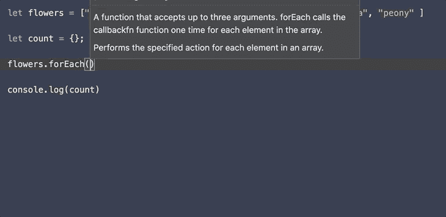

# JavaScript 算法:Array.forEach()

> 原文：<https://javascript.plainenglish.io/js-algo-array-foreach-602c090de326?source=collection_archive---------5----------------------->

[](https://developer.mozilla.org/en-US/docs/Web/JavaScript/Reference/Global_Objects/Array/forEach) [## array . prototype . foreach()-JavaScript | MDN

### forEach()方法为每个数组元素执行一次提供的函数。forEach()调用提供的回调 Fn…

developer.mozilla.org](https://developer.mozilla.org/en-US/docs/Web/JavaScript/Reference/Global_Objects/Array/forEach) 

`forEach()`方法为数组中的每个元素执行一个回调函数。那是什么意思？“forEach”方法调用 forEach 外部的函数，该函数处理它正在检查的数组的迭代。让我们仔细看看它到底是如何工作的。

forEach: callback function

我们正在处理一个名为`flowers`的数组。数组中的每个元素都是花名字符串。让我们写一个回调函数，默认参数是(`each element`、`index`、`original array`)，你可以通过控制台记录这个函数或任何东西，但是在这节课中，我们将通过控制台记录。然后`forEach`方法将执行回调函数。

```
ArrayName.forEach((eachEle, index, array) => console.log(eachEle))
```

forEach: inline callback function

这与上面相同 forEach 方法在一行中执行回调函数。

forEach: arrow function

这是使用最常用的匿名箭头函数。所有这三个 forEach 方法将在下面输出这些内容。请记住 `.forEach`的返回值是`undefined`。

```
peony 0 [ 'peony', 'rose', 'sunflower', 'linaria' ]
rose 1 [ 'peony', 'rose', 'sunflower', 'linaria' ]
sunflower 2 [ 'peony', 'rose', 'sunflower', 'linaria' ]
linaria 3 [ 'peony', 'rose', 'sunflower', 'linaria' ]
```

让我们练习一些稍微复杂一点的算法。

```
There are multiple flowers in the garden. Which flowers are there only two of in the garden?
```

我们有一个花名字符串的数组结构，然后我们使用`forEach`方法迭代数组。对于每一朵花的名字，如果它存在于`count`对象的键值对中，我们将添加 count。如果它还不存在，那么我们将设置为 1。然后在迭代之外，我们将迭代我们创建的对象，并找到哪朵花有两个。

让我们注意一下这个物体，`count`。它是在 `.forEach`迭代之外声明的。

```
{ 
  peony: 2, 
  rose: 3, 
  sunflower: 1, 
  linaria: 1 
}.forEach method only returns `undefined`
```

`forEach`不允许在循环内部声明变量。您也不能在`forEach`方法中使用 if 语句并返回值。使用它的方法是在 forEach 迭代之外声明变量，然后在外部返回或操作该数据。

[](https://stackoverflow.com/questions/38274001/if-condition-inside-foreachs-anonymous-function-does-not-work/38274350) [## 如果 forEach 匿名函数中的条件不起作用

### 所以返回 true 并不是为函数 isUniform 返回值，而是为你…

stackoverflow.com](https://stackoverflow.com/questions/38274001/if-condition-inside-foreachs-anonymous-function-does-not-work/38274350) 

请看一下这个 StackOverflow 问答。

```
//THIS DOES NOT WORK 
function isUniform(myArray) {
    myArray.forEach(function(element) {
        if (element !== myArray[0]) {
            return false;
        }
    });

    return true;
}//THIS WORKSfunction isUniform(myArray) {
    var passing = true;
    myArray.forEach(function(element) {
        if (element !== myArray[0]) {
            passing = false;
        }
    });

    return passing;
}// 'for - of' loop works toofunction isUniform(myArray) {
    for (element of myArray) {
        if (element !== myArray[0]) {
            return false
        }
    }
    return true
}
```

您也可以使用`for loop`或`for of`循环。

*更多内容尽在*[*plain English . io*](http://plainenglish.io/)