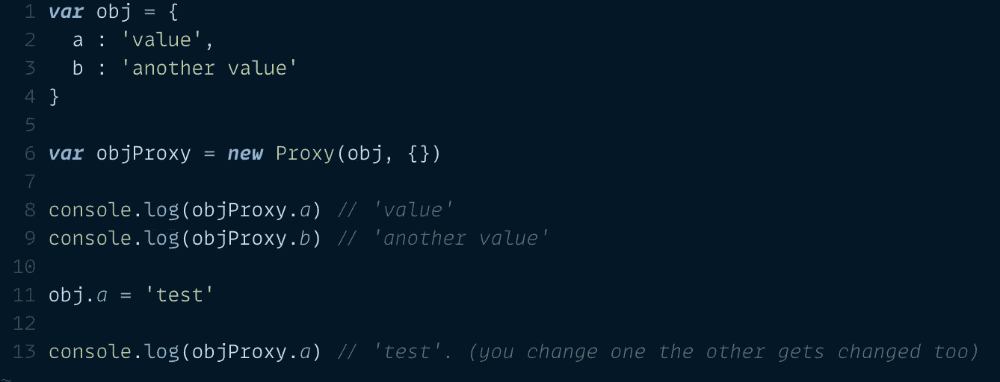
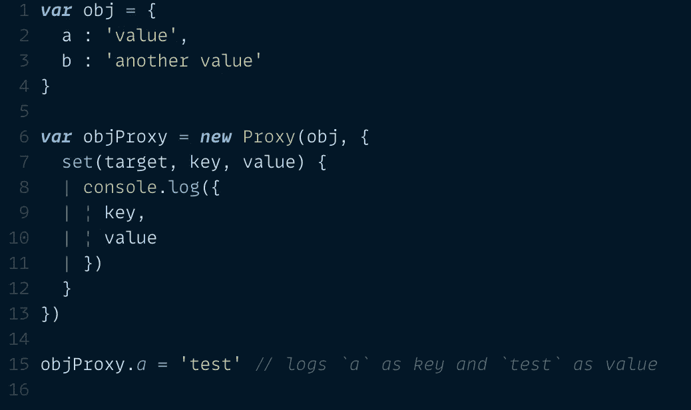
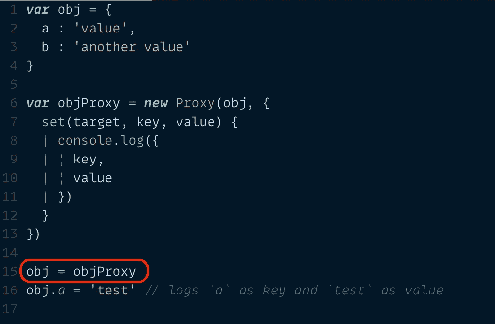
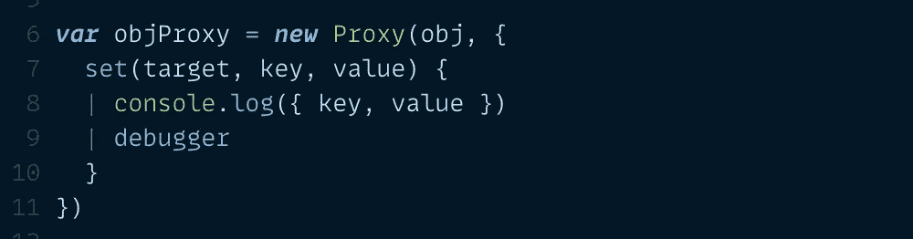
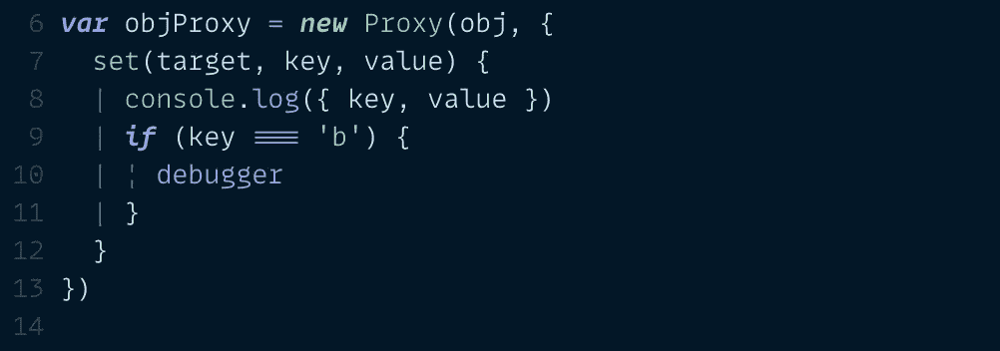

# 这种 JavaScript 调试技术可以节省您数小时的精力

> 原文：<https://javascript.plainenglish.io/js-debugging-technique-proxy-17c707518b7a?source=collection_archive---------14----------------------->

## 使用代理用 JavaScript 监视对象值的变化。

## 使用 JavaScript 代理对象观察代码中的对象变化。

Photo by [Techie](https://unsplash.com/@heylagostechie?utm_source=unsplash&utm_medium=referral&utm_content=creditCopyText) on [Unsplash](https://unsplash.com/s/photos/code?utm_source=unsplash&utm_medium=referral&utm_content=creditCopyText)

JavaScript 开发人员职业生涯中最令人麻木的任务之一就是调试全局变量的变化。当你调试别人的代码时，这变得更加困难。

在我们进入正题之前，让我给你描述一下:假设你正在使用一个非常老的代码库。随着时间的推移，许多开发人员为此做出了贡献。因为每个人都有不同的编码风格，所以不再遵循特定的编码模式/风格。因为这是古老的代码，所有的关键变量都暴露在窗口对象中。不同的模块可以访问和操作变量，您无法知道全局变量是如何或何时被更改的。

不久前，我也遇到过同样的情况——旧代码，大量的全局变量，无法知道谁在改变一个全局对象的值。在调试过程中花了几个小时后，我在 MDN 上的 JavaScript 代理对象上发现了这一点。根据 MDN:

> `Proxy`对象使您能够为另一个对象创建一个代理，它可以截取并重新定义该对象的基本操作。

基本上，您可以用定制的对象方法创建目标对象的副本。让我们快速看一下如何创建代理对象:

## 如何使用代理:

您需要创建一个`Proxy`类的新实例来制作一个对象的代理。`Proxy`有两个参数:一个`target`和一个`handler`。让我们看一个例子:

假设您有一个对象`obj`，并且您想要创建一个代理:

creating proxy of obj

这里，`objProxy`是对象`obj`的代理。我们向代理传递了两个参数，第一个是`target`对象(您想要为其创建代理的对象)，第二个对象传递定制的处理程序。在这个例子中，我将它保持为空。我将在下一个例子中解释如何使用这个对象。从这个例子中得到的主要信息是`proxyObj`已经得到了`obj`的所有条目。

## 如何向代理添加定制的处理程序:

现在我们知道了如何创建代理，让我们看看如何向代理对象添加定制的处理程序:

setting custom handler `set` to proxyObj.

现在我们将自定义的`set`作为键传递给`handler`参数。您也可以将其他对象方法传递给该对象。我用`set`是因为它与这篇文章更相关。`set`函数接受三个参数:`target`(同一个目标对象)、`key`(要更新的键)、`value`(键的新值)。在函数内部，我只是安慰所有三个参数。现在，当您修改或添加一个新键到`objProxy`对象时，自定义的`set`函数将被触发。您将在浏览器中看到一个控制台值。

## 如何使用代理对象观察对象变化？

到目前为止，我们已经向 proxyObj 添加了一个自定义的 set 函数。这将控制浏览器中的新值。但是这如何帮助我们监控目标对象的变化呢？现在是时候让我们来看看最棘手的部分了:

assigning proxy object to the target object.

注意截图中的第 15 行。我们将`proxyObj`分配给实际的`obj`。现在`obj`有了和以前一样的值(因为`proxyObj`是`obj`的克隆版),另外，它还有一个自定义的`set`函数，当我们改变 obj 中的值时，它会控制这些值。这样，我们可以监听`obj`中的任何变化。如果我们用一个`debugger`替换`console`，我们就可以停止执行，并回溯到发生变化的确切位置。以下是相同的截图:

add a debugger to stop the execution.

现在，如果对象太大并且频繁更改，那么您也可以有条件地添加调试器:

add conditional debugger.

这样，您就不必多次切换脚本执行。

以下是要点的链接:

copy the code from this gist.

## 参考链接:

 [## ECMAScript 2022 语言规范

### 编辑描述

tc39.es](https://tc39.es/ecma262/multipage/reflection.html#sec-proxy-objects)  [## 代理- JavaScript | MDN

### 代理对象使您能够为另一个对象创建代理，它可以截取和重新定义基本的…

developer.mozilla.org](https://developer.mozilla.org/en-US/docs/Web/JavaScript/Reference/Global_Objects/Proxy) 

# 关于作者

Bharat 自 2011 年以来一直是前端开发人员。他对“前端开发经验”情有独钟。他喜欢学习和教授技术。他和最可爱的女人以及珍贵的双胞胎孩子一起享受生活。

总的来说是个好人。在 [Twitter](https://twitter.com/iiisoni) 、 [Github](https://github.com/iiison) 、 [Linkedin](https://www.linkedin.com/in/iiison/) 上找到他。

*更多内容看*[***plain English . io***](http://plainenglish.io/)