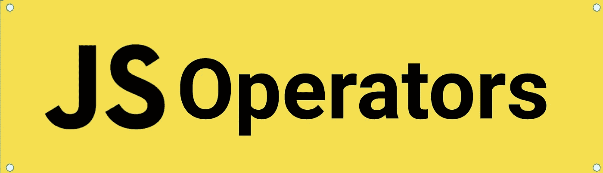

# 您需要开始使用的 JavaScript 运算符

> 原文：<https://javascript.plainenglish.io/js-operators-you-need-to-start-using-7ebdfd4d2698?source=collection_archive---------10----------------------->



Write better and clean code

## 写出更好更干净的代码

当我们开始学习一门新的语言时，运算符是一种标准的语法，比如 and( &&)，or (||)，less(=

There are some useful operators, which can help you write better and clean code and just make a lot of sense. I will try to cover the operators, which make more sense in everyday coding.

# The most used

> ***)严格等于(= = = =)***

像其他语言中“ ***==*** ”是比较值的标准，在 JavaScript 中，就有点不一样了。使用“==”，它尝试转换和比较不同类型的操作数。

```
*(1==true)* will return **true** 
```

这就是为什么即使 linters 也建议我们使用严格相等，因为它比较值和类型。

```
*(1===true)* will return **false**
```

> ***三元运算符(条件？if true:if falsy)***

当赋值需要一个条件时，这可以用于赋值和返回值。另外，它使代码看起来更整洁。

```
let val;
if(true) val = 100;
else val = 50// using the ternary operator to get the same result
const val = condition ? 100 : 50; 
```

**注意:如果有嵌套条件，该操作会损害可读性，所以最好使用 if/else 语句以获得更好的可读性*

# 新的

> ***无效合并算子(？？)***

这是一个逻辑运算符，当其左侧操作数为空或未定义时，返回其右侧操作数；否则，它返回左侧值。

```
const assign= null;
const fallback = 'use if assign is null/undefined'const val = assign ?? fallback
// val will be fallback
```

当您知道某个值或参数有可能为空或不被赋值时，这很有帮助，有时甚至可以替换三元运算符。

> ***可选链接(。？*)**

这是我最喜欢的操作符之一，是在处理大型对象模型时引入的。这个操作符检查被访问的属性，如果不是，它返回 *undefined* 而不抛出错误。

```
const obj = {foo:1,moo:{val:10}};
console.log(obj?.foo) => 1
//typo moo => noo 
console.log(obj.noo?.val) => undefined
```

注意:如果从 *obj.noo.val，*中删除可选链接，您将得到:

```
Cannot read properties of undefined (reading 'val')
```

> ***逻辑无效赋值(？？=)***

考虑一个用例，其中变量只能被赋值一次或者将被赋值为空，所以标准是将变量声明为空，然后检查

```
let a= null;
a ??= 1;
a ??= 2;
// a will retain 1
```

> ***逻辑 AND 和 OR 赋值(& & =，||=)***

当左侧操作数为真时，使用逻辑“与”赋值；当左侧操作数为假时，使用逻辑“或”赋值。

```
//logical AND assignment:
const obj = { val1 : 2, val2 : 0 }
// when falsy 
obj.val2 &&= 10; 
// when truthy 
obj.val1 &&= 10
console.log(obj) => {val1: 10, val2: 0}//logical OR assigmen
const obj2 = { val1 : 2, val2 : 0 }
// when falsy 
obj2.val2 ||= 10; 
// when truthy 
obj2.val1 ||= 10
console.log(obj2) => {val1: 2, val2: 10}
```

JavaScript 作为一种语言自 ES6 以来一直在发展，但是作为开发人员，我们也需要跟踪这些变化。我希望这能帮助你增加你的武器库，帮助你写出更好更干净的代码。

*更多内容看* [*说白了. io*](http://plainenglish.io/) *。报名参加我们的* [*免费每周简讯*](http://newsletter.plainenglish.io/) *。在我们的* [*社区*](https://discord.gg/GtDtUAvyhW) *获得独家写作机会和建议。*