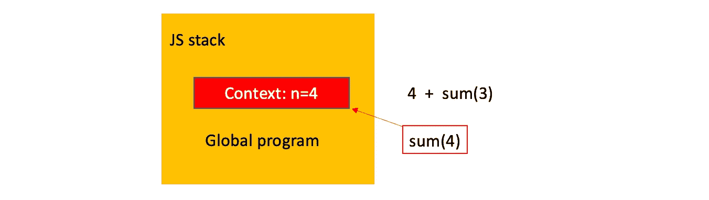

# JavaScript:递归、尾调用优化和图片蹦床

> 原文：<https://javascript.plainenglish.io/js-recursion-and-tail-call-optimization-with-pictures-cbf8f766a31?source=collection_archive---------9----------------------->


递归允许通过将问题分解成小问题来解决问题。递归函数总是包含两个部分:

*   **基本情况** —递归函数计算特定值而不调用递归函数本身的终止条件
*   **递归情况** —调用自身的函数的一部分

这里最重要的部分是带有终止条件的**基础案例**。如果你错过了它——递归无限期地运行，直到程序崩溃，因此作为一个经验法则——当你开始递归实现时——首先定义一个终止条件。

让我们实现一个返回从 1 到 N 的数字之和的函数:

```
sum(N) = N + sum(N-1) = 
       = N + (N-1) + sum(N-2) = 
       = N + (N-1) + (N-2) + sum(N-3) = 
         .... until N !== 1 ....
       = N + (N-1) + (N-2) + ... + 1
```

实现如下所示:


Figure 1 — Recursion implementation

# 递归限制，调用堆栈

递归有一个限制，它是由调用堆栈的可能最大大小定义的。这是什么意思？当我们调用一个函数时，JS 引擎创建一个*函数执行上下文*，它保存函数处理所需的一切——局部变量、`this`的值等等。并将它放在调用堆栈的顶部。让我们想象一下，我们调用一个函数`sum(4)`。JS 引擎将这个函数推到调用堆栈的顶部，并为带有局部变量的函数创建执行上下文，我们的函数只有一个局部变量`n=4`:



Figure 2

由于`n!==1`，我们需要调用另一个函数`sum(3)`，JS 引擎用一个新的执行上下文将这个新函数推到调用堆栈的顶部，这个新的执行上下文只包含一个局部变量`n=3`:


Figure 3

调用堆栈继续增长，直到下一个函数达到终止条件，此时`n==1`:


Figure 4

一旦我们到达终止条件，调用栈就停止增长，JS 引擎开始从调用栈中推出函数:


Figure 5

下一步是用执行上下文从调用堆栈中推出函数，其中`n=2`:


Figure 6

它一直持续到调用堆栈为空，并且我们到达全局程序的上下文:


Figure 7

嵌套函数调用的常见数量称为**一个递归深度**，在我们的例子中，它等于`N`。

递归深度的最大值受调用堆栈的最大大小限制。您肯定可以依赖 10 000 次调用，但是 JS 引擎是否允许您推送 100 000 次以上的嵌套函数调用(框架)值得怀疑。我已经在 Chrome v. 92.0.4515.131 中测试了实现的函数`sum`，它允许我在`n=10_428`时得到结果，在`n=10_429`时崩溃


Figure 8

# **如果我达到了最大调用堆栈大小该怎么办**

如果你看一下图 1 中的框图，我相信你能认出它，它看起来类似于任何循环的框图(*，而对于*):


Figure 9 — Comparison block diagram for recursion and loop

让我们以不同的方式使用循环重写`sum`函数:


Figure 10

> 这里的主要思想是:**任何递归都可以写成一个循环。此外，从性能角度来看，使用循环实现更加有效**

嗯，在这个句子之后，可能会有一个问题——使用递归而不是循环有什么好处？

首先，使用循环是一种强制性的方法，在函数式编程中，我们需要遵循递归所遵循的声明性方法。

另一个好处是递归实现更短更简洁，更容易掌握和维护。

# **尾部调用优化(TCO)**

ES6 提供了*尾部调用优化*，我们可以在不增加调用栈的情况下进行一些函数调用。当一个函数调用另一个函数作为最后一步(尾部位置)时，编译器知道当前函数上下文中没有编译器需要保留的内容来处理下一个函数调用，在这种情况下，JS 引擎可能会丢弃当前堆栈帧，因为它没有更多工作要做。

> 在大多数情况下，您可以通过将所有必要的状态作为函数目标的一部分从一个函数上下文转移到下一个函数上下文来实现这一点。

让我们遵循这条规则，按照编译器应用*尾调用优化*的方式重写图 1 中的递归。同样，主要思想是，我们应该将递归调用作为函数的最后一步，并将当前函数上下文中所有需要的变量作为参数放到下一个函数调用中:


Figure 11— Recursion with TCO

让我们比较一下，在不使用/使用尾部调用优化的情况下实现递归时，调用堆栈是什么样子的:

**—无 TCO(图 1 中提供的实现):**

```
sum(4)
   4 + sum(3)
      4 + 3 + sum(2)
         4 + 3 + 2 + sum(1)
            4 + 3 + 2 + 1
         4 + 3 + 3
      4 + 6
   10
return 10
```

**—具有 TCO(图 11 中提供的实现):**

```
sum(4)
   sum(3, 4)
   sum(2, 7)
   sum(1, 9)
   return 10
return 10
```

TCO 递归的调用堆栈只包含全局上下文顶部的一个帧(图 12)，而不是一个接一个堆叠的一堆帧(图 4)。


Figure 12

**TCO 警告**

不幸的是，在撰写本文时，Safari 是唯一一款附带 TCO 的浏览器。Node 在 6.5 版本中实现了 tail 调用，但是它被隐藏在一个标志后面(后来他们在 Node 8 中完全移除了对 TCO 的支持)。

而且 V8 引擎(Chrome 浏览器、NodeJS)的 TCO 在未来实现上还有不确定性(更多详情[此处](https://stackoverflow.com/questions/42788139/es6-tail-recursion-optimisation-stack-overflow))。


Most browsers do not have support for TCO. Source: [https://kangax.github.io/compat-table/es6/](https://kangax.github.io/compat-table/es6/).

我将向您展示一个方法`console`,您可以用它来跟踪调用堆栈，并找出浏览器是否真正支持这个功能。现在是`console.trace`


Figure 13 — console.trace for Chrome browser

# 蹦床

蹦床是一种以迭代的方式模拟 TCO 的方法，对于控制函数栈增长非常理想。

它是一个函数，将另一个函数作为输入，并反复调用它，直到某个条件出现。这个函数可能看起来像这样:

```
const trampoline = fn => (...args) => {
  let result = fn(...args)
  while (typeof result === 'function') {
    result = result()
  }
  return result
}
```

我们还需要重写我们的`sum`函数，而不是调用函数本身，让我们封装另一个函数，让这个调用变得懒惰:

```
function sum(n, acc = 0) {
   return n === 0
      ? acc
      : () => sum(n - 1, acc + n)
}
```

最后一步——用`trampoline`包装`sum`函数并调用它:

```
const optimizedRecirsionFn = trampoline(sum);
optimizedRecirsionFn(100_000)
```


# 使用 setTimeout 模拟 TCO

**它根本不应该用来优化递归**，它只是一种帮助初学者更深入理解 JS 方法的技巧。

调用栈通常用于处理同步代码，但是如果我们使用 JS 的异步特性会怎么样呢？

当我们调用递归的下一步时，让我们通过零超时的`setTimeout`函数调用它，这允许 JS 引擎将这个函数放在*任务队列*中，而不是在调用栈顶推一个新的帧。一旦全局程序完成了所有同步操作，事件循环就将此函数推入空堆栈:

看起来是这样的:

```
function *sum*(n, cb, acc = 0) {
    if (n === 1) {
        return cb(acc + n);
    }
    *setTimeout*(() => *sum*(n - 1, cb, acc + n), 0)
}
sum(50_000, res => console.log(res))
```

这需要几个小时才能完成，但至少我们没有超过调用堆栈的最大大小:)。

同样，这个实现只是为了好玩，不应该使用。

*更多内容请看*[***plain English . io***](http://plainenglish.io/)