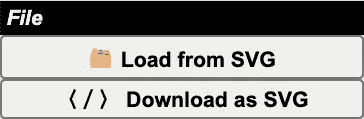
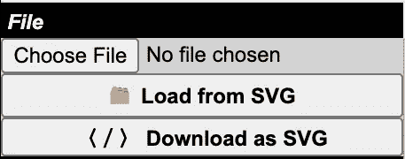

# 在 React 中触发文件上传/下载而无需后端

> 原文：<https://javascript.plainenglish.io/july-7-triggering-file-uploads-downloads-without-a-back-end-in-react-6438cb77859?source=collection_archive---------10----------------------->


Photo credit: NBC Universal

“宽恕我吧，神父，因为我犯了罪…”

今天我们将尝试一些有点淘气的事情:**完全从前端触发浏览器下载。在 React(我经常在博客上谈论的一个主题)中，有几个流行的包可以做到这一点，但是今天，我将分享一种简单、实用的前端下载方法，它不需要任何包。这个概念足够通用，可以适应任何框架，但是在 React-land 中，我们只需要`FileReader()`，React 的`useRef()`钩子和一点黑魔法...**

# **背景**

以前从前端触发下载是不被允许的，原因有几个:

*   **不可靠:**在某些浏览器中，文件可能会在新的标签页/窗口中打开，或者根本无法打开
*   **存在安全风险:**强制下载可能会导致恶意软件的入侵
*   **有味道:**严格来说，这是应该由后端处理的事情

但是，如今单页应用程序比以往任何时候都更加普遍和丰富，浏览器也赶上来了，所以安全风险不那么严重。在一些有限的情况下，当后端仍在构建中时，它可能有助于启动并运行概念验证。

# 用`useRef()`和`hidden`在 DOM 上实现

我已经做了一段时间的矢量图形应用。我最终希望将它与连接到处理保存和下载文件的 SQL 数据库的后端集成在一起，但在此之前，我希望测试我正在生成的 SVG 文件，以确保它们确实可以工作。所以我设置了一个组件，看起来像这样:



你可以亲眼看到点击“加载”按钮会出现一个文件上传窗口，每点击一次“保存”按钮，就会出现一次疯狂下载。让我们看看从[中得到的`return`是什么，以及它的源代码](https://github.com/josh-frank/gieves-edit/blob/master/src/components/menus/FilePanel.js)中的相关组件，看看它是如何完成的:

```
export default function FilePanel() {... return <div className="menu-panel">
  <div className="menu-header">File</div>
 **<input
      type="file"
      hidden
    />**
    <button onClick={ () => {
      alert( "This will erase your artboard!" );
    } }>
      🗂 <b>Load from SVG</b>
    </button>
    <button>
      〈／〉 <b>Download as SVG</b>
    </button>
</div>;}
```

我们这两个按钮的目的很明显——但是`<input type="file">`有什么用呢？这是一个非常熟悉的普通标签，通常显示如下，这并不理想…



…所以我添加了`hidden`属性，这当然隐藏了它，但是这样做使得`input`在没有进一步魔法的情况下不可用。**进入** `**useRef**` **阶段左:**

```
**import { useRef } from "react";**export default function FilePanel() { **const uploadRef = useRef( null );** return <div className="menu-panel">
     <div className="menu-header">File</div>
       <input
         type="file"
 **ref={ uploadRef }**         hidden
       />
       <button onClick={ () => {
         alert( "This will erase your artboard!" );
 **uploadRef.current.click();**
       } }>
         🗂 <b>Load from SVG</b>
       </button>
       <button>
         〈／〉 <b>Download as SVG</b>
       </button>
   </div>;}
```

`**useRef()**` **是一个非常有用的小技巧，每个 React 开发人员都应该保持警惕。它基本上是一个整洁的小存储盒，保存一个 DOM 元素作为它的引用；工程师(你)可以使用它的属性`.current`调用引用`current` ly 指向的任何东西。在这种情况下，我们用它来模拟被引用元素上的一个`click()`，即使它是`hidden`。引用以`null`开始，但是由于 React 的`ref={}`属性，一旦 DOM 被渲染，引用就被设置为我们的文件输入。**

# 用`FileReader()`响应上传

现在我们的文件输入如预期的那样工作了，由一个按钮点击触发，而不是由那个丑陋的“选择文件”按钮触发。但是一旦我们的用户上传了本地文件，我们实际上如何使用本地文件呢？让我们写一个方法给`handleUpload()`:

```
import { useRef } from "react";export default function FilePanel() { **const handleUpload = uploadEvent => {
      const uploadedFile = uploadEvent.target.files[ 0 ];
      if ( uploadedFile && uploadedFile.type === "image/svg+xml" ) {
         const fileReader = new FileReader();
         fileReader.onload = async loadEvent => {
            <do stuff with loadEvent here>;
         }
         fileReader.readAsText( uploadedFile );
      }
   };** const uploadRef = useRef( null );return <div className="menu-panel">
     <div className="menu-header">File</div>
        <input
          type="file"
          ref={ uploadRef }
 **onChange={ handleUpload }**          hidden
        />
        <button onClick={ () => {
          alert( "This will erase your artboard!" );
          uploadRef.current.click();
        } }>
          🗂 <b>Load from SVG</b>
        </button>
        <button>
          〈／〉 <b>Download as SVG</b>
        </button>
   </div>;}
```

对于一个`<input type="file">`标签，一个`onChange`事件将包括一个特殊的属性`files`，一个 JavaScript `File`对象数组，可以通过一个名为`FileReader()`的底层库读取。`File`和`FileReader()`现在基本上是每个广泛使用的浏览器 API 的一部分。

在检查了上传的`file`的`type`是正确的之后(我们在这里编辑 SVG)，我们创建了一个`FileReader()`的新实例，并为它提供了一个特殊的回调函数`onload`，来定义一旦我们读取了数据，我们将对它做什么:设置状态、更新 DOM、更新 Redux 存储…任何事情！**注意** `**onload**` **是一个** `**async**` **函数，因为它必须等待用户上传文件——**这可能很棘手，所以要小心！

# 使用`href`和`document.createElement`强制下载

我将在这里强调最后一个小技巧，用于下载在一个应用程序中创建/生成的数据，我将它放在一个不同的文件中，我称之为`fileUtilities.js`:

```
export const downloadArtboardAsSvg = ( paths, dimensions ) => {
  const element = document.createElement( "a" );
  element.setAttribute( "href", "data:image/svg+xml;utf8," + encodeURIComponent( [
    `<?xml version="1.0" encoding="utf-8"?>`,
    `<!DOCTYPE svg PUBLIC "-//W3C//DTD SVG 1.1//EN" "http://www.w3.org/Graphics/SVG/1.1/DTD/svg11.dtd">`,
    `<svg version="1.1" id="Layer_1"  xmlns:xlink="http://www.w3.org/1999/xlink" x="0px" y="0px" width="${ dimensions[ 0 ] }px" height="${ dimensions[ 1 ] }px" viewBox="0 0 ${ dimensions[ 0 ] } ${ dimensions[ 1 ] }" enable-background="new 0 0 ${ dimensions[ 0 ] } ${ dimensions[ 1 ] }" xml:space="preserve">`,
    ...paths.map( path => `<path d="${ path }" stroke="black" stroke-width="1" fill="white" />` ),
    `</svg>`
  ].join( "" ) ) );
  element.setAttribute( "download", `GievesEdit-${ Date.now() }` );
  element.style.display = "none";
  document.body.appendChild( element );
  element.click();
  document.body.removeChild( element );
}
```

这是怎么回事？为了在点击下载按钮时触发浏览器下载一个 SVG 文件，我实际上是**进入浏览器并创建一个带有`document.createElement`的** `**<a>**` **标签**。这里有一个细目分类:

*   首先，我用一个名为`encodeURIComponent()`的方法设置锚的`href`属性，该方法将您希望下载的文件主体包含的任何内容(在本例中，是一个表示 SVG 文档的字符串)作为参数。
*   然后我设置了主播的`download`属性。这做了两件事:它告诉我们的 DOM 这是一个文件下载的链接(不是 URL)，它还设置下载文件的文件名。在这种情况下，我使用带有`Date.now()`时间戳的应用程序名称。
*   我通过用`display = "none"`隐藏它来确保锚不会在我们的 DOM 上造成混乱。
*   最后，我用`appendChild()`将我们的临时文件锚附加到 DOM，模拟一个`click()`来触发下载，并通过将其从 DOM 中移除来进行清理。

现在，我们所要做的就是将`onClick`添加到我们之前使用的 React 组件中的下载按钮:

```
export default function FilePanel() {**const handleDownload = () => {
   downloadArtboardAsSvg( <...an array of SVG paths held in state> );
};**return <div className="menu-panel">
     <div className="menu-header">File</div>
        <input
          type="file"
          ref={ uploadRef }
          onChange={ handleUpload }          hidden
        />
        <button onClick={ () => {
          alert( "This will erase your artboard!" );
          uploadRef.current.click();
        } }>
          🗂 <b>Load from SVG</b>
        </button>
        <button **onClick={ handleDownload }**>
          〈／〉 <b>Download as SVG</b>
        </button>
   </div>;}
```

# **结论**

正如我上面提到的，以及之前在这个博客上提到的，**像这样深入** `**document**` **并不是什么了不起的反应，但它完成了任务。一场关于以这种方式触发下载是否可接受的激烈辩论仍在继续。许多人坚持认为创建一个端点总是更好；标签不应该以这种方式使用，即使它不会带来安全风险；这种方法既不可靠又笨重。您的里程可能会有所不同。**

不管怎样，我想我们都同意`useRef()`被犯罪性地利用和邪恶的强大。对于 React 应用程序来说，这是利用熟悉、可靠的普通 HTML 标签的最佳方式——同时对用户隐藏它们，以支持更灵活、更现代的方式。

*更多内容看*[***plain English . io***](http://plainenglish.io/)