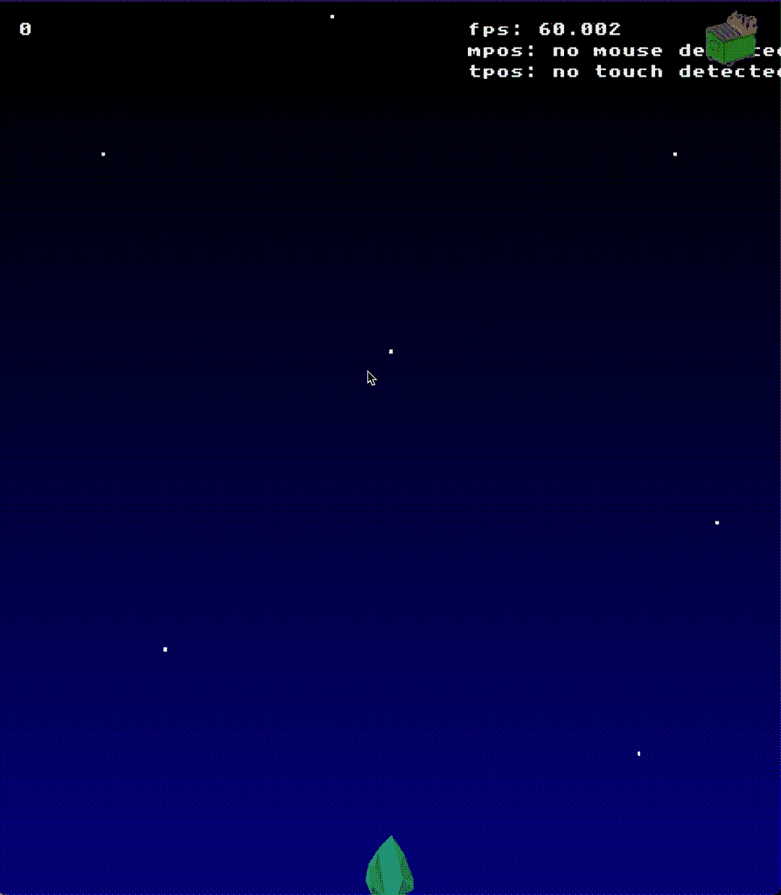
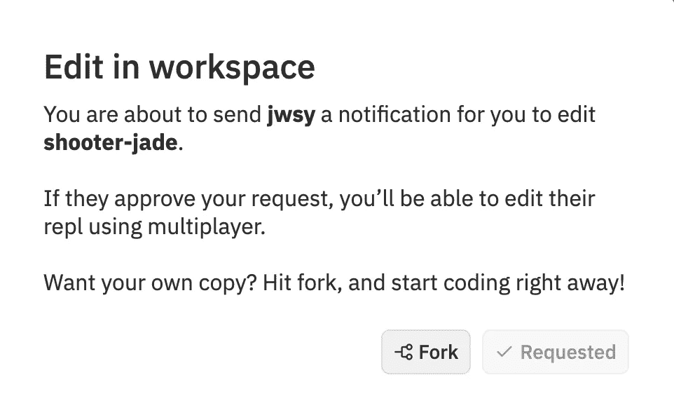
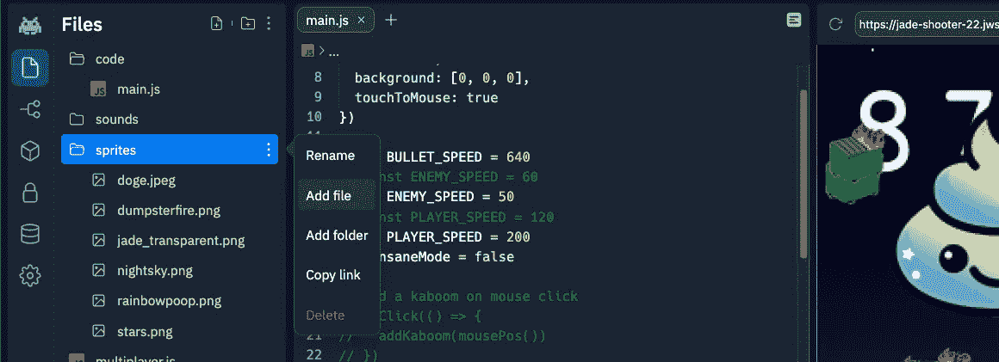
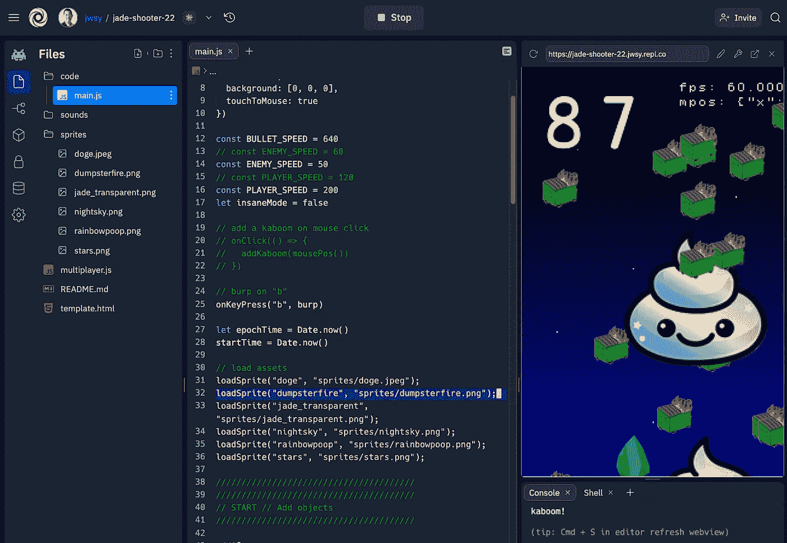
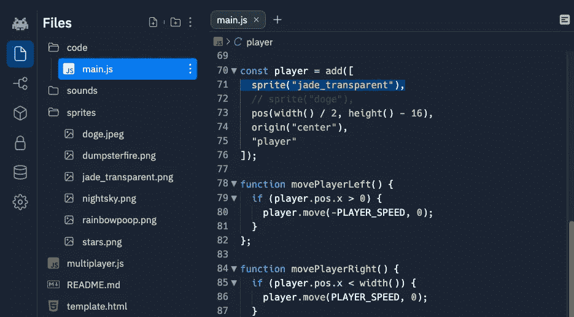
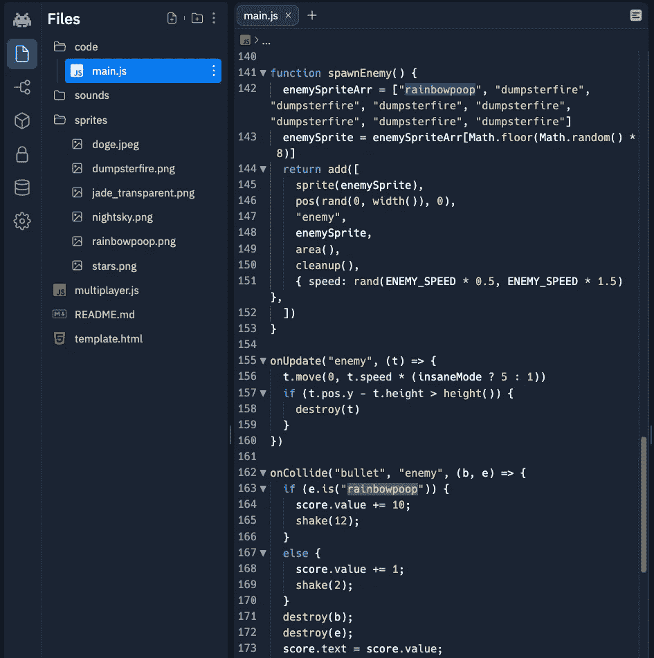
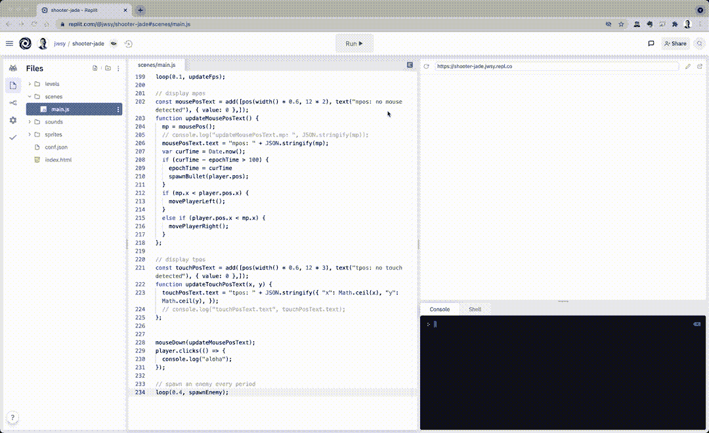

# 使用 kaboom.js 和 repl.it 在 5 分钟内创建一个自定义的自上而下的射手

> 原文：<https://javascript.plainenglish.io/kaboom-js-repl-it-custom-top-down-shooter-in-5-min-ebad8157073a?source=collection_archive---------8----------------------->

> **Tl；dr:** 你所需要的只是一个浏览器和回复！【https://replit.com/@jwsy/jade-shooter-22】[查看代码](https://replit.com/@jwsy/jade-shooter-22)
> 
> 2022 年 10 月更新

我小时候喜欢玩自上而下的射击游戏，比如《银河战士》和《太空入侵者》,并且希望我可以用自定义的英雄和敌人构建自己的游戏🚀。

嗯，多亏了了不起的 tga 领导的好人，我童年的梦想才得以实现🙌([https://github.com/slmjkdbtl](https://github.com/slmjkdbtl))at[repl . it](https://replit.com)谁给了我们**一个 env 与无依赖 JavaScript 游戏库**[**kaboom . js**](https://kaboomjs.com/)！

我读了这篇 [kaboom.js 文章](https://doc.gameenv.repl.co/guide)，它让我大吃一惊，你可以多么快速简单地构建一个游戏，然后这个梦想变得更加美好，因为你可以轻松地在 repl.it **上创建和托管自己的游戏，唯一的依赖是一个浏览器**，通过:

1.  克隆我在 https://replit.com/@jwsy/jade-shooter-22[创造的那个](https://replit.com/@jwsy/jade-shooter-22)
2.  为英雄和敌人替换“精灵”。
3.  更新逻辑。

## 1.通过在工作区中选择编辑来克隆 repl.it env/repo

浏览到[https://replit.com/@jwsy/jade-shooter-22](https://replit.com/@jwsy/jade-shooter-22)，点击按钮在工作区编辑。您可能需要创建自己的帐户，但这是值得的！您将需要在工作区对话框的*编辑中分叉回购，如下所示。*

Fork this repo!

## 2.添加/更新图形

1.上传你想要的图片。通过拖放或使用方便的 repl.it 对话框将 png 文件放入`sprites`文件夹。你可以看到我在`jade_transparent.png`中使用了一个很酷的装饰矿物碎片作为我的英雄。

Add graphics to the sprites folder

2.Change/update 左上角的`code`目录中的`main.js`中的代码行(第 14+行),以按照其他精灵的示例提供精灵名称。

## 3.更新应用程序逻辑

根据需要更新场景以产生敌人

点击`code/main.js`,并遵循这三个步骤

1.如果你为英雄创建了一个新的精灵，修改第 115 行来反映你在`loadSprite`方法中使用的第一个参数。在这种情况下,`jade_transparent`是男主角雪碧的名字。

2.更新特定敌人在这里出现的频率——如图所示，我已经构建了一个数组(第 86 行),它有 1 个`rainbowpoop`到 7 个`dumpsterfires`,并有一个随机数来选择一个随机 int 来选择 8 个项目中的一个(第 187 行)。用概率来做这件事肯定有更好的方法，但这是 10 岁的我想要的😀

3.更新当你击中一个特定类型的敌人时发生的逻辑。在上面的图中，我为一个`rainbowpoop`增加了 10 点，并且有一个更强的相机抖动(第 207-209 行)

## 就是这样！

你的射手已经准备好了，而且**甚至有一个由 repl.it** 托管的公共 URL。在我的案例中，回购名称是[https://jade-shooter-22.jwsy.repl.co](https://jade-shooter-22.jwsy.repl.co)

如果你愿意，你也可以深入研究`main.js`的前几行，看看我是如何捕捉鼠标和点击动作的——否则就享受在几分钟内构建你自己的定制射击游戏的快感吧！

感谢阅读！

 [## 通过我的推荐链接加入 Medium-Jason Yee

### 看别人的媒介文章我学到了很多，你也可以！你的会员资格直接支持我和其他…

jyeee.medium.com](https://jyeee.medium.com/membership) 

*更多内容请看*[*plain English . io*](http://plainenglish.io/)