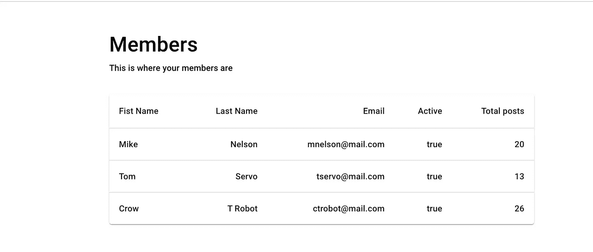
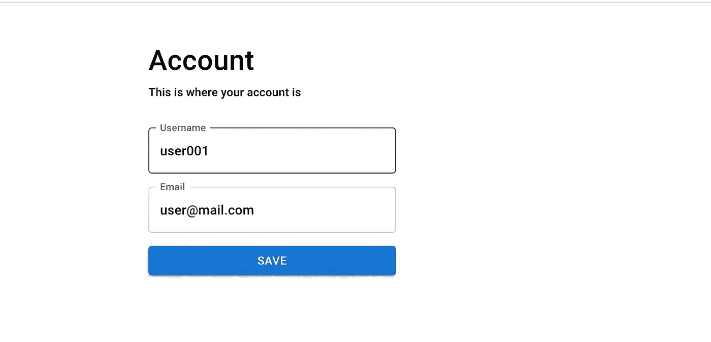

# 用高阶组件保持 React 结构的整洁

> 原文：<https://javascript.plainenglish.io/keep-your-react-structure-clean-with-higher-order-components-2c687593e47d?source=collection_archive---------11----------------------->

高阶组件是在 React 中重用结构组件的好方法。

当用 React 构建 UI 元素时，我想分享一个简单但强大的高阶组件用例。

高阶组件是 React 中重用组件逻辑的高级技术。

假设您的应用程序中有两个如下所示的页面:

**成员**

**账号**

**成员组件**

**账户组成**

两页有相同的标题和副标题。让我们假设会有其他页面具有相同的布局。

我们可以用更高阶的元件来实现更好的布局标准化。

功能组件有一个名为 children 的内置属性。如果你使用 Typescript，你将可以访问 children 属性，如果你使用`React.FunctionalComponent`类型作为你的函数声明。

一个更高阶的组件将包装包含在其声明中的`children`。实际上，它们是这样实现的:

即使像上面这样简单的实现也会对代码库产生巨大的影响。它们通过将重要的结构组件放在一个地方来增加您的可维护性，同时还允许灵活地使用它们所采用的子组件。

*更多内容看* [***说白了。*** *报名参加我们的*](http://plainenglish.io/) [***免费每周简讯这里***](http://newsletter.plainenglish.io/) ***。***