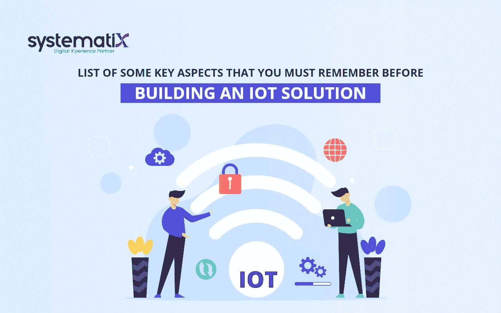

# 在构建物联网解决方案之前，您必须记住的关键方面

> 原文：<https://javascript.plainenglish.io/key-aspects-that-you-must-remember-before-building-an-iot-solution-1d4e7be5f186?source=collection_archive---------27----------------------->

## 你能想出一个在没有互联网的情况下使用智能手机的场景吗？在被联系到互联网之前，它是极其愚蠢的。

它现在可以播放任何音乐。你不仅仅局限于通过联系号码与人交流。现在，您可以访问不会填充存储设备 TB 的数据。这就是互联网的力量。物联网就是将互联网的功能从智能手机和平板电脑扩展到各种各样的其他对象、流程和环境。

这是通过在物理环境中嵌入与它交互并检测它的组件，并将所有这些都链接到互联网来实现的。这些组件由传感器和设备组合而成。

## **构建物联网设备前需要牢记的关键方面**

毫不奇怪，物联网和移动应用程序开发服务变得如此受欢迎。到 2021 年，行业分析师预计全球将安装超过 350 亿台物联网设备。做出关于物联网设备的战略判断很困难；然而，这份清单提供了一个很好的起点。开发物联网设备有几种方法。让我们一步一步地看看它们。

## **从适当的问题开始**

在开始之前，请考虑您试图通过物联网连接解决的问题。许多组织仅仅为了连接而连接，在错误的解决方案上浪费了关键的时间和金钱。虽然企业可以通过多种方式利用物联网创造价值，但我们已经确定了企业从互联设备中获利的一些主要方式:

**预防性维护** —企业可以将传感器集成到关键设备中，以获得关于其健康和状态的主动通知。

**车队管理** —借助基于物联网的车队管理系统，企业可以提高服务盈利能力，确保合规性，并最大限度地降低燃料费用。

**资产跟踪** —物联网技术使企业能够实时监控其持续移动的资产(如机器或汽车)。他们可以通过提高可见性来防止问题发生。

**合规报告** —物联网设备通过远程监控关键资产，帮助企业大幅削减合规支出。

一个专注的物联网解决方案可以解决与这些活动中的任何一项相关的问题，从而显著改善您的业务方式。

**建造原型**

虽然原型制作的过程可能很耗时，但却是非常有效的。当改进变得更简单、更经济时，您将了解在启动前完成物联网项目所需的最少参数。此外，开发一个原型可以让你发现任何技能或技术的不足，同时给你更多的时间进行全面的人员搜索。

这是一个比当场雇佣某人并祈求最好的结果更谨慎的做法。如果你的目标是扩展，原型可以让你洞察到最大化你的扩展努力所需要采取的步骤。如果你是产品开发新手，这个过程可能会很难，但你可以获得物联网应用开发公司的帮助。

## **确定合适的开发人员**

一家综合性的人工智能开发公司包括交互式设计、云服务、数据科学、安全机制和后端支持等功能。在构建物联网解决方案之前，找到能够开发利用这些内置特性的解决方案的合格程序员非常重要。

## **必须考虑消费者体验**

在生产过程中，淡化最终客户的重要性太简单了。请记住，在所有的硬件、编程和连接开发之后，您的产品必须由真正的人来使用。AIoT 开发服务必须考虑您的典型消费者会如何使用该解决方案。与您的团队协作，提出客户体验相关主题的解决方案，例如:

*   消费者有必要通过应用程序获得服务吗？
*   你的小玩意能简单地向顾客传递重要信息吗？
*   您的设备是否足够“坚固”以承受恶劣的天气条件？
*   小工具或应用程序对目标终端用户来说直观吗？

当你设身处地为客户着想时，你一定会获得有价值的知识。这种方法是专注于提供知识丰富、以客户为中心的解决方案的战略的关键。

## **占主导地位的司机一定是保安**

没有将安全性作为你的**移动应用开发服务**或物联网系统的一个重要方面，可能是你最大的错误。在初始设计阶段简化物联网平台套件的安全性和弹性可能会导致整个产品失败。据估计，超过 70%的物联网设备包含几个与软件相关的安全漏洞，因此很容易被黑客攻击。

因此，在开发物联网平台之前，全球数据和安全技术必须是您的首要任务。你可以雇佣有道德的黑客来识别和修复你网络中的安全漏洞。此外，确保您遵循安全最佳实践，例如利用强大的防火墙和强大的身份验证程序来保护您的系统安全。

## **物联网解决方案的实施非常耗时**

目前，很少有商业可用的 AIoT 开发服务来开发物联网解决方案。即使是经验最丰富的物联网开发公司也需要大约六到九个月的时间来生产一站式物联网解决方案。在某些情况下，从商业案例创建完成到商业推广，这段时间可能会长达 18-20 个月。

因此，确保你在找到一家好的**人工智能开发公司**并将物联网系统整合到你的业务设计中之前，已经投入了足够的时间和精力。

**结论**

在安装您的物联网解决方案之前，请确保您遵守以下原则。其次，为终端设备传输的信息找到合适的存储系统。云存储是一种可行的解决方案，因为它适应物联网设备的灵活性，并与几乎任何企业架构集成。

*更多内容看* [***说白了就是 io***](https://plainenglish.io/) *。报名参加我们的* [***免费周报***](http://newsletter.plainenglish.io/) *。关注我们关于*[***Twitter***](https://twitter.com/inPlainEngHQ)*和*[***LinkedIn***](https://www.linkedin.com/company/inplainenglish/)*。加入我们的* [***社区***](https://discord.gg/GtDtUAvyhW) *。*