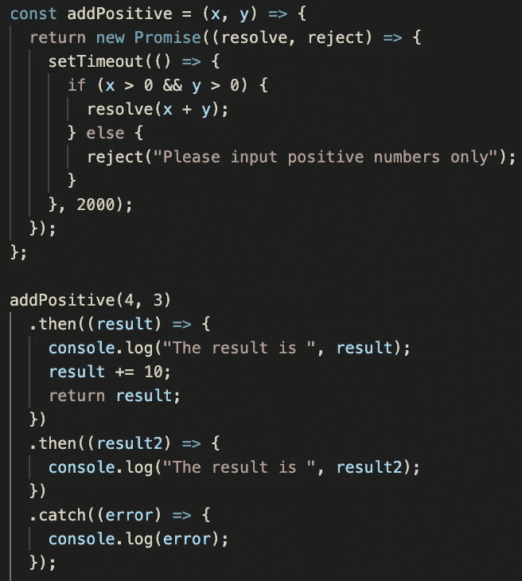

# 如何用可爱的 JavaScript 承诺解决回调问题

> 原文：<https://javascript.plainenglish.io/kinda-lovely-js-promises-6818f784633c?source=collection_archive---------14----------------------->

*许下你的诺言……*

在我的上一篇文章中，我们已经看到了带有 Node.js 的 JavaScript 如何执行异步操作。还记得 ***回调*** 吗？

回调是 Javascript 中异步编程的基础。我们在编程中使用回调时面临两个主要问题:

**1。回调地狱**

有些情况下，我们在回调函数内部进行回调(称为嵌套回调函数)。它会导致代码可读性和理解方面的问题。

**2。处理错误的难度**

当异步函数或异步调用的回调抛出异常时，该异常无法传播回异步操作的发起者。它破坏了异常处理。

> 所以，最简单的解决办法就是使用我们可爱的承诺**。**

承诺是建立在回调上的对象，它代表异步计算的结果。结果可能准备好了，也可能没有准备好。Promise 只能异步工作。没有办法通过同步调用来获取值。你只能要求承诺在值准备好的时候调用一个回调函数。

承诺通过以承诺链的形式重新表达嵌套回调，为嵌套回调提供解决方案。通过承诺，我们可以在承诺链中以适当的方式处理错误。

> 承诺可以“遵守”也可以“违背”。

使用同样的逻辑，在 JavaScript 中，承诺可以被“履行”或“拒绝”。

还有另一种状态，即“待定”。当一个承诺处于既没有实现也没有被拒绝的状态时，它就是待定的。一旦承诺被实现或拒绝，它就成立了。

Promise 只有一个自变量，它是两个参数的函数: **resolve** 和 **reject** 。如果一个承诺被实现或解决，我们承诺的异步代码的结果将是 resolve 参数中的值。否则，如果它被拒绝，错误对象将是 reject 参数中的值。当承诺被返回时，resolve 或 reject 将具有值，而另一个将是未定义的。

> Promise 对象有实例方法。我们经常使用 then()和 catch()。

## 如何创造一个承诺？

通过承诺构造器，我们可以创建一个承诺。

How function works through callback

How function works through promise

这里，在第一张图中，我拿一个简单的函数，让你明白一个功能需求是如何通过回调和承诺来完成的。

在第二张图中，我们可以看到 addPositive()正在返回一个承诺，而不是接受一个回调参数。

两秒钟后，这个函数将返回一个 Promise 对象。我们没有将回调函数直接传递给 addPositive()，而是将其传递给 **then()** 作为**的第一个参数**。因此，返回值将被传递给我们在 then()中传递的回调函数。

如果出现错误，它将被传递给在 **catch()** 中传递的回调函数。或者错误也可以传递给回调函数，我们在 **then()** 中将其作为**第二个参数**传递。当承诺被拒绝时，就会调用这个函数。通常，我们使用 catch()方法调用，而不是向 then()方法传递两个回调。

## 连锁承诺

承诺是可以连锁的。怎么会？。

我们可以将一系列异步操作表示为一个线性的 then()调用链。这是针对上述回调地狱的解决方案。

Example for Promise chaining

在 Promise 链中，正如我所说的，可以看到不止一个方法调用，它们被顺序调用。

*   addPositive()函数返回 Promise1 对象。
*   之后，我们调用 Promise1 的 then()方法，并传递‘result’回调函数，该函数将在 Promise1 兑现时被调用。
*   then()方法将我们的“结果”回调存储在某个地方，并返回一个新的 Promise2。
*   之后，下一个任务将在调用“结果”回调时开始(意味着 Promise1 现在已履行)，我们调用 Promise2 的 then()方法并传递“结果 2”回调，该回调将在 Promise2 履行且此时不再调用进一步的 promises 时调用。
*   所以现在，我们的承诺结束了，我们的计算也结束了。

> 在 ES2018 中，Promise 对象还定义了一个**。finally()** 方法，它在功能上相当于异常处理机制中的 finally 子句。

## 更多关于承诺的信息

## Promise.all()

我们可以并行运行多个承诺。Promise.all()函数就是这样做的。它接受一组 Promise 对象作为输入，并返回一个承诺。如果任何输入承诺被拒绝，返回的承诺将被拒绝。否则，它将通过每个输入承诺的已实现值的数组来实现。

## Promise.allSettled()

这个函数接受一个承诺数组作为输入，并像 Promise.all()函数一样返回一个承诺。但是有很大的不同:

1.  这个函数永远不会拒绝返回的承诺。
2.  直到所有输入承诺都已结算，这才履行返回的承诺。

承诺解析为一个对象数组，其中每个对象都是每个输入承诺的一个结果(如果输入承诺得到解析，则该结果可能具有实现值，否则，如果输入承诺被拒绝，则该结果可能具有错误值或拒绝值)。

## 承诺.竞赛()

如果我们想要运行多个承诺，但是我们只关心第一个承诺的结果，那么我们可以使用这个函数。当输入数组中的第一个承诺被履行或拒绝时，返回一个履行或拒绝的承诺。

我希望您现在对 JavaScript 中的承诺有了更好的理解。

我的下一篇文章再见！

*更多内容尽在*[*plain English . io*](http://plainenglish.io/)