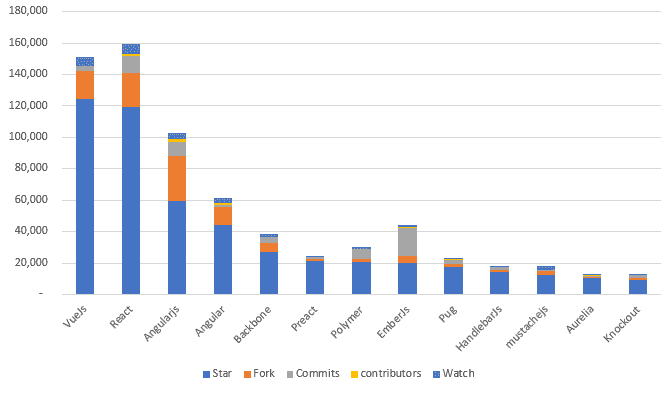

# 最新的 JavaScript 框架:你应该知道的一切

> 原文：<https://javascript.plainenglish.io/latest-javascript-frameworks-everything-you-should-know-3bda77b3f669?source=collection_archive---------1----------------------->

[Image source](https://www.startuprocket.com/articles/a-quick-introduction-to-javascript)

对于 web 和移动应用程序开发来说，JavaScript 是一项广受好评的技术。作为一种动态编程语言，它的主要应用是网站开发。虽然，它使移动应用程序开发高效而迅速。

它是一种灵活的编程语言，可以亲自动手进行前端和后端开发。此外，你可以在游戏开发、金融科技应用开发和其他方面使用它。以前，它主要用于客户端开发，尽管现在它的用途已经扩展到服务器端和本机。

[**Image source**](https://www.c-sharpcorner.com/article/most-popular-front-end-javascript-framework-in-the-world/)

**(最常用的 JavaScript 框架)**

JavaScript 使用的增加推动了许多库和框架的开发，以支持开发过程并简化 JavaScript 开发。React 就是这样一个框架，用于无缝地进行本机和单页面应用程序开发。

总之，有许多其他 JavaScript 框架可以用来创建不同类型的应用程序解决方案。在这篇博客中，我们将收集 React 和其他最新 JavaScript 框架如 Aurelia、hyperHTML、Svelte 之间的差异。因此，请继续关注我，了解这些 JavaScript 框架是如何脱颖而出的。

**React——一个不可思议的本地应用开发库**

作为一个开源的 JavaScript 库，React 的主要建立在于它只专注于用户界面设计，支持应用的前端开发。简而言之，它负责处理 web 和移动应用程序的视图层。

此外，它是基于组件的，这意味着 React 应用程序的不同部分通常被分割成更小的组件，然后在更高级别的组件中进行组织。还有！其中确定应用程序的最终结构的是应用程序的更高级组件。

[Image source](https://www.c-sharpcorner.com/article/what-and-why-reactjs/)

此外，您可以使用 React 构建可重用的组件，从而在不同的应用程序中多次使用应用程序的一部分。总之，它也为最小编码提供了基础。这意味着你不必花费在编写代码上，ReactJS 开发人员可以遵循“不重复自己”的原则。

要用这个令人难以置信的框架创建一个应用程序，你可以很容易地 [**雇佣 React 开发者**](https://www.valuecoders.com/hire-developers/hire-reactjs-developers) 并且不会面临任何困难。

**区分反应的特征**

*   **虚拟 DOM:** 它扩展了内存协调算法，在 React 的虚拟内存中复制一个网页，并作为一个原始 DOM 工作。此外，虚拟 DOM 重新呈现了整个用户界面，这使得更新代码更容易，并导致更快的过程。
*   **JSX:** JavaScript XML 提供了定义应用程序用户界面外观的标记语法。创建的反应组件将与 HTML 完全相同，更容易在网页中输入。
*   **React Native:** 这是 React JavaScript 的自定义渲染器，支持使用本机组件。它包括 JSX、国家、道具和组件。此外，它将反应代码转换成与安卓和 iOS 平台兼容的基本代码。
*   **基于组件的体系结构:**基于组件的体系结构是 React 的关键，它根据特定的逻辑将移动和基于网络的 UI 组件划分为多个组件。

简而言之，React 是一个非常重要的框架，它可以让 web 和移动应用程序开发的压力更小。现在让我们来看看新的 JavaScript 框架。

[**奥瑞丽亚**](https://aurelia.io/)**——下一代架构**

[Image source](https://www.tutorialandexample.com/aurelia-tutorial/)

Aurelia 是用 ES6 和 ES7 构建的，这使得它成为最有用的版本之一。由于是用现代 JavaScript 编写的，它使您能够使用各种模块、类等等。Aurelia 有一个基于 HTML 的模板系统和 API，使开发人员能够更快地学习。这个平台发布后，成千上万的网站已经建成，因为它允许开发者用简单的 JavaScript 和 TypeScript 创建组件。

**区分金色的特征**

*   **基于模块的框架**:它被分解成一组面向特征的模块。它包括组成完整框架的较小的重点模块。此外，您还可以选择实际的模块并导入它们来创建所需的解决方案。
*   **灵活的语言支持:**用户可以通过 JavaScript 和 TypeScript 使用 Aurelia 的 API，这增强了解决方案的灵活性。
*   **优秀的文档:**框架的文档非常详细，任何人都可以理解。良好的维护和极具描述性的文档，它帮助初学者、语言发烧友和有经验的用户。
*   **Web 标准**:这是一个意义重大且最简洁的现代 JavaScript，它只关注 Web 标准而不抽象。

为了利用这个框架，你可以雇佣对编程语言有很强基础知识的 JavaScript 开发人员。

[**HyperHTML**](https://viperhtml.js.org/hyper.html) **—最简单的 JavaScript 框架**

[Image source](https://github.com/WebReflection/hyperHTML)

对于从事轻量级和极简主义工作的开发人员来说，HyperHTML 是一个重要的库。此外，它符合 DOM & ECMAScript 标准，完全跨平台，对声明式和反应式 web 应用程序零依赖性。

**区分超 HTML 的特征**

*   **难以置信的轻量级:**这是一个简单而优秀的轻量级 JavaScript 库，几乎不到 5Kb。纯 JavaScript 制作，内核极简。
*   **快速渲染:【hyperHTML 最让人欣赏的就是渲染能力和效率。此外，它还呈现了被更改的部分。它提高了性能，并提供了优于库和其他框架的主要优势。**
*   **得心应手:**要使用和运行 hyperHTML，你只需要知道 HTML、CSS 和普通 JavaScript。

在这个框架中，当 JS 代码用美元符号和花括号包装时，可以很容易地判断模板文字。

****:基于组件的 JavaScript 框架****

****

**[Image source](https://github.com/WebReflection/hyperHTML)**

**它于 2016 年推出，是一个用 TypeScript 编写的基于组件的框架。由于创建的组件没有样板文件或虚拟 DOM，自发布以来，它的受欢迎程度迅速增长。其中创建的代码首先编译成小型的普通 JavaScript 模块，然后 DOM 随着状态的变化而更新。**

**创建没有样板文件的组件使您能够减少整个编写代码的长度。**

****区分苗条身材的特征****

**Handy:由于使用了 HTML、CSS 和 JavaScript，它的学习曲线比较平缓。你不需要额外的 JSX 知识或打字稿。**

*   ****小束尺寸:**与许多其他框架相比，Svelte 是由具有较小尺寸束的机制诱导的。此外，svelte 没有任何客户端依赖性。**
*   **更少的代码:svelte 的主要成就是它减少了开发人员需要编写的代码量。因为你会写更少的代码，所以出现错误的机会很少，你可以更专注于做其他事情。**
*   ****没有虚拟 DOM:** 很多 JavaScript 框架都有虚拟 DOM，但是 Svelte 没有。在这个框架中，代码首先被编译成普通的 JavaScript 模块，然后在状态改变时更新 DOM。由于这一点，该框架不需要高浏览器处理，应用程序是快速可靠的。**

****包装完毕****

**你已经了解了 React，Svelte，hyperHTML，Aurelia 的主要特性和多功能性。创建新的框架是为了改善开发人员的体验并减少应用程序开发的麻烦。**

**如果你想创建一个 web 或移动应用程序，上面提到的框架是最好的尝试。**

**尝试最新最炫的框架可能很有诱惑力，但是无论您选择哪个框架，都要确保它是您正在构建的应用程序的最佳解决方案，并且您使用它来最大化它的优势。而且，还可以选择 angular、React、VueJs 开发。**

**目前 Angular 和 VueJs 也很流行，是最首选的框架，你也可以[**雇佣 Node.js 开发者**](https://www.valuecoders.com/hire-developers/hire-nodejs-developers) 为你的 Js 应用构建一个安全且更高质量的应用后端。**

***更多内容请看*[*plain English . io*](http://plainenglish.io/)**