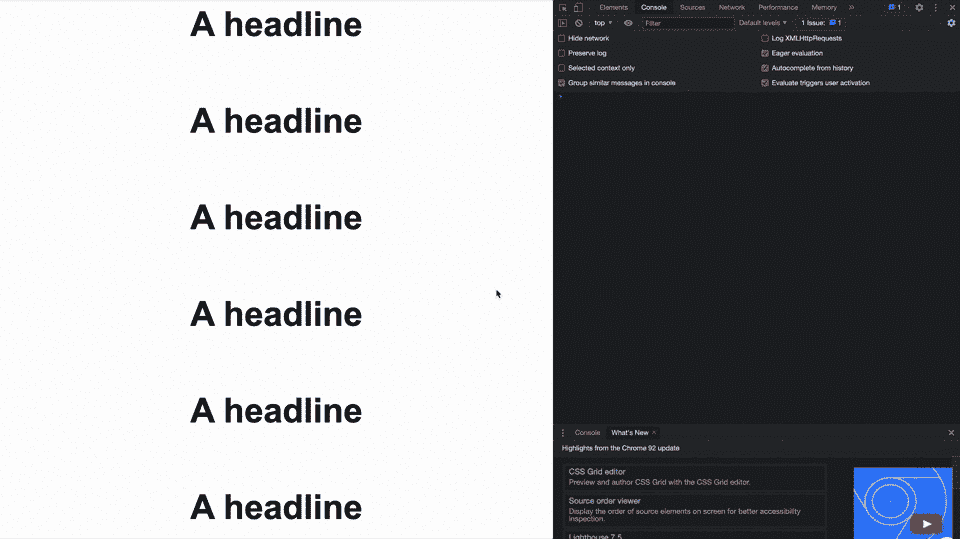

# 使用新的交叉点观察器 API 延迟加载 JavaScript

> 原文：<https://javascript.plainenglish.io/lazy-load-javascript-5d63cbfb83fb?source=collection_archive---------7----------------------->

## 需要时加载，就像 React 和 co 中一样。


Source: the author

延迟加载的想法并不新鲜——但是 JavaScript 世界中的实现却很新鲜。React.js 的懒加载 API 是 2018 年底才正式发布的。

当你看 React-lazy 或其他工具的代码时，你会意识到它有多复杂。我们希望在真正需要的时候将 JavaScript 代码加载到浏览器中。

幸运的是，现在有一个新的 API 使这变得更加容易:交叉点观察器 API。创新的静态站点生成器 [Astro](/astro-cec429f049d) 也使用它。

乍一看，这个新 API 与延迟加载无关:它帮助我们检测 DOM 元素何时在浏览器中可见。下面是我们如何使用它以一种有意义的方式延迟加载 JavaScript。

## 基本项目结构

我知道这很难，但是我们不会使用任何框架或库。
我们从以下文件开始:

```
.
├── app.js
├── index.html
└── lazy.js
```

`app.js`包含延迟加载的代码，`lazy.js`是我们想要延迟加载的文件。在`index.html`中，我创建了一个 H1 标签列表，当打开页面时，最后一个标签是不可见的。(如果它在你的屏幕上可见，只需添加更多的 H1 标签，这样最后一个`<h1 id="hiddenH1">`在默认情况下是不可见的。目标是通过 JavaScript 改变最后一个 H1 的样式，但是只有当用户看到元素时。

我知道这对于延迟加载来说并不现实，但是它可以作为一个例子。

你可以在我的 GitHub 上找到完整的[代码，但是我现在将浏览每个文件。](https://github.com/LouisPetrik/lazy-loading-from-scratch)

index.html:

我认为这里没什么特别的，所以让我们转到最有趣的部分:包含惰性加载代码的`app.js`:

让我们一步一步来:

1.  就在第一行，引用了 H1，打开页面时看不到它。这里没什么特别的。
2.  lazyLoad()函数创建一个新的脚本标签，并将其插入 DOM。src-attribute 指的是我们想要延迟加载的`lazy.js`文件。像这样插入脚本标签会导致浏览器加载脚本，即使页面已经加载了。
3.  交叉点观察器 API 是作为一个类编写的——我们创建了一个观察器的新实例，将其称为“观察器”我们提供了一个函数作为回调函数，每当一个被观察的元素**进入或退出或者 viewport** (在我们的例子中)时都会被执行。

在提供 options 对象时，我们还可以指定一个环绕元素，而不是整个视口——但是在我们的例子中，默认的监视视口就可以了。

回调函数接收一个条目数组，在我们的代码中称为`entries`——它是 DOM 元素的列表，其交集状态发生了变化。在我们的代码中，只有一个受监控的元素，所以数组中只有一个条目——我们用`entries[0]`访问它。

通过检查`entries[0].isIntersecting`是否为真，我们检查我们被监控的元素是否进入了视口——因此对用户是可见的。注意:默认情况下，*is intersection*可以多次切换到 true。例如，当它进入视口时，离开它并再次进入它。因此，`observer.unobserve(hiddenH1)`一旦我们的 H1 可见，就关闭它的观察器，并且需要所需的 JavaScript 代码。

为了让延迟加载的效果可见，我编写了一个 setTimeout，它延迟了延迟加载。最后，这里是 lazy.js:

```
// since we already loaded app.js, defining hiddenH1,
// we can access it, an change it’s styles: hiddenH1.style.color = "red"
```

它所做的只是将最后一个 H1 的字体颜色设置为红色。

下面是完整的代码:



source: the author

感谢您的阅读！

关于加载 JavaScript 的更多信息:

[](/async-and-defer-the-complete-guide-to-loading-javascript-properly-ce6edce1e6b5) [## 异步和延迟——如何正确加载 JavaScript

### 解决错误并提高性能

javascript.plainenglish.io](/async-and-defer-the-complete-guide-to-loading-javascript-properly-ce6edce1e6b5) 

[**加入我的时事通讯保持最新**](http://eepurl.com/hacY0v)

*更多内容请看*[***plain English . io***](http://plainenglish.io/)